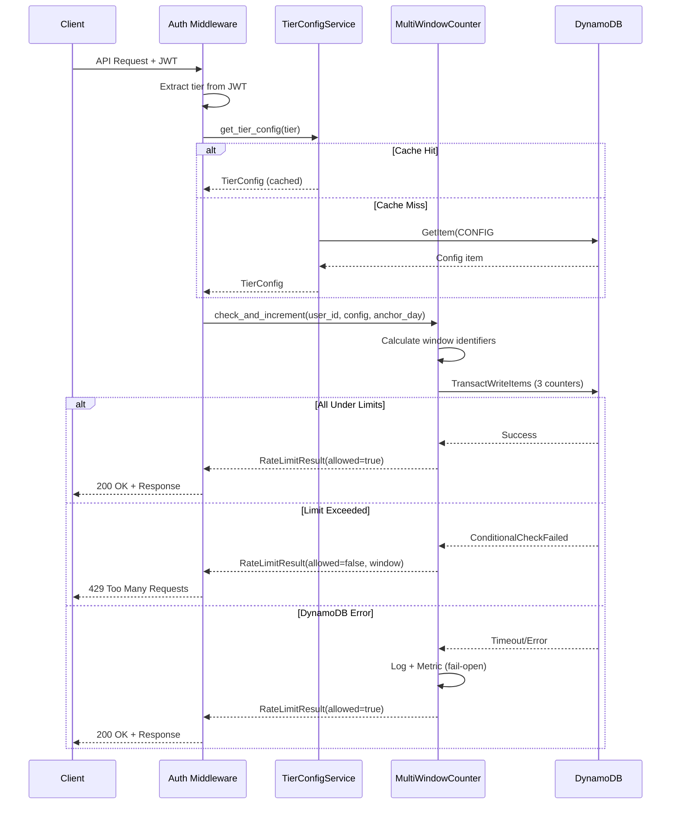

# 364 - Feature: Tiered Rate Limiting with Multi-Window Caps

<!-- Template Metadata
Last Updated: 2026-02-16
Updated By: LLD Generation
Update Reason: Fixed mechanical validation errors - corrected all file paths to match actual repository structure
-->

## 1. Context & Goal
* **Issue:** #364
* **Objective:** Implement multi-window rate limiting (hourly/daily/monthly) with three user tiers (free/subscriber/admin), each with configurable caps stored in DynamoDB and enforced via JWT-embedded tier claims.
* **Status:** Draft
* **Related Issues:** #341 (base token cap infrastructure), #116 (user table schema)

### Open Questions
*All questions resolved during requirements phase.*

- [x] Rolling vs fixed windows? → Resolved: Fixed windows for MVP simplicity
- [x] How to handle tier embedded in JWT when tier changes? → Resolved: User must re-auth to get new JWT
- [x] What happens to counters when tier changes? → Resolved: Counters preserved, only cap limits change
- [x] UTC or local time? → Resolved: UTC for MVP, local time deferred to future issue
- [x] Fail Open vs Fail Closed? → Resolved: Fail Open to prioritize availability

## 2. Proposed Changes

*This section is the **source of truth** for implementation. Describes exactly what will be built.*

### 2.1 Files Changed

| File | Change Type | Description |
|------|-------------|-------------|
| `src/auth/token_cap_service.py` | Modify | Add `MultiWindowCounter` class, tier config loading, transactional increment |
| `src/auth/auth_middleware.py` | Modify | Extract tier from JWT, pass to rate limit check, handle 429 responses |
| `src/lambda_auth_function.py` | Modify | Embed `tier` claim in JWT at issuance |
| `src/auth/models/` | Add (Directory) | New directory for auth-related models |
| `src/auth/models/__init__.py` | Add | Package init file |
| `src/auth/models/user.py` | Add | User model with `tier` and `billing_anchor_day` fields |
| `src/auth/models/rate_limit.py` | Add | New models for tier config, counter state, and 429 response |
| `src/auth/tier_config_service.py` | Add | Service for loading/caching tier configurations from DynamoDB |
| `docs/tools/` | Add (Directory) | New directory for tools documentation |
| `docs/tools/README.md` | Add | Document new CLI subcommands |
| `tests/unit/test_multi_window_counter.py` | Add | Unit tests for counter logic |
| `tests/unit/test_tier_config_service.py` | Add | Unit tests for tier config loading |
| `tests/integration/test_tiered_rate_limiting.py` | Add | Integration tests for full flow |
| `tests/fixtures/rate_limit_429_response.json` | Add | Static fixture for frontend development |

### 2.1.1 Path Validation (Mechanical - Auto-Checked)

*Issue #277: Before human or Gemini review, paths are verified programmatically.*

Mechanical validation automatically checks:
- All "Modify" files must exist in repository
- All "Delete" files must exist in repository
- All "Add" files must have existing parent directories
- No placeholder prefixes (`src/`, `lib/`, `app/`) unless directory exists

**If validation fails, the LLD is BLOCKED before reaching review.**

### 2.2 Dependencies

*No new Python packages required. Uses existing boto3 for DynamoDB transactions.*

```toml
# pyproject.toml additions (if any)
# None - existing dependencies sufficient
```

### 2.3 Data Structures

```python
# Pseudocode - NOT implementation

class UserTier(str, Enum):
    """Valid user tier values."""
    FREE = "free"
    SUBSCRIBER = "subscriber"
    ADMIN = "admin"

class WindowType(str, Enum):
    """Rate limit window types."""
    HOURLY = "hourly"
    DAILY = "daily"
    MONTHLY = "monthly"

class TierConfig(TypedDict):
    """Configuration for a single tier."""
    tier: UserTier
    hourly_cap: int
    daily_cap: int
    monthly_cap: int

class CounterState(TypedDict):
    """Current state of all three counters for a user."""
    user_id: str
    hourly_count: int
    hourly_window: str      # e.g., "2026-02-16T14"
    daily_count: int
    daily_window: str       # e.g., "2026-02-16"
    monthly_count: int
    monthly_window: str     # e.g., "2026-02"

class RateLimitResult(TypedDict):
    """Result of rate limit check."""
    allowed: bool
    exceeded_window: Optional[WindowType]
    resets_at: Optional[datetime]
    resets_in_seconds: Optional[int]
    current_counts: CounterState

class RateLimitErrorResponse(TypedDict):
    """429 response body structure."""
    error: Literal["rate_limit_exceeded"]
    window: str
    resets_at: str          # ISO 8601 timestamp
    resets_in_seconds: int
    upgrade_url: str

class UserRecord(TypedDict):
    """Extended user record with tier info."""
    user_id: str
    tier: UserTier
    billing_anchor_day: int  # 1-31, day of month for monthly reset
    created_at: str
```

### 2.4 Function Signatures

```python
# src/auth/token_cap_service.py

class MultiWindowCounter:
    """Manages multi-window rate limiting with atomic DynamoDB transactions."""

    def __init__(
        self,
        table_name: str,
        dynamodb_client: Optional[Any] = None,
        timeout_seconds: float = 2.0
    ) -> None:
        """Initialize counter with DynamoDB table reference."""
        ...

    def check_and_increment(
        self,
        user_id: str,
        tier_config: TierConfig,
        billing_anchor_day: int
    ) -> RateLimitResult:
        """
        Check all three windows and atomically increment if under limits.

        Returns RateLimitResult with allowed=True if request can proceed,
        or allowed=False with exceeded_window details if any limit hit.
        Implements fail-open on DynamoDB errors.
        """
        ...

    def _get_current_windows(
        self,
        billing_anchor_day: int
    ) -> tuple[str, str, str]:
        """
        Calculate current window identifiers for hourly, daily, monthly.

        Returns (hourly_window, daily_window, monthly_window) strings.
        Monthly window considers billing_anchor_day for anniversary reset.
        """
        ...

    def _build_counter_keys(
        self,
        user_id: str,
        hourly_window: str,
        daily_window: str,
        monthly_window: str
    ) -> list[dict]:
        """Build DynamoDB keys for all three counter items."""
        ...

    def _execute_transactional_increment(
        self,
        user_id: str,
        counter_keys: list[dict],
        tier_config: TierConfig
    ) -> tuple[bool, Optional[CounterState]]:
        """
        Execute atomic increment of all three counters.

        Returns (success, counter_state) tuple.
        On DynamoDB error, logs and returns (True, None) for fail-open.
        """
        ...

    def _calculate_reset_time(
        self,
        window_type: WindowType,
        current_window: str,
        billing_anchor_day: int
    ) -> datetime:
        """Calculate when the specified window will reset."""
        ...

    def get_counter_state(
        self,
        user_id: str,
        billing_anchor_day: int
    ) -> Optional[CounterState]:
        """Retrieve current counter values without incrementing."""
        ...


# src/auth/tier_config_service.py

class TierConfigService:
    """Loads and caches tier configurations from DynamoDB."""

    def __init__(
        self,
        table_name: str,
        cache_ttl_seconds: int = 300,
        dynamodb_client: Optional[Any] = None
    ) -> None:
        """Initialize with table name and cache TTL."""
        ...

    def get_tier_config(self, tier: UserTier) -> TierConfig:
        """
        Get configuration for specified tier.

        Uses in-memory cache with TTL. Falls back to hardcoded
        defaults if DynamoDB unavailable.
        """
        ...

    def set_tier_config(
        self,
        tier: UserTier,
        hourly_cap: Optional[int] = None,
        daily_cap: Optional[int] = None,
        monthly_cap: Optional[int] = None
    ) -> TierConfig:
        """Update tier configuration in DynamoDB."""
        ...

    def _load_from_dynamodb(self, tier: UserTier) -> Optional[TierConfig]:
        """Load tier config from DynamoDB."""
        ...

    def _get_default_config(self, tier: UserTier) -> TierConfig:
        """Return hardcoded default config for tier."""
        ...

    def invalidate_cache(self, tier: Optional[UserTier] = None) -> None:
        """Clear cache for specific tier or all tiers."""
        ...


# src/auth/auth_middleware.py (additions)

def extract_tier_from_jwt(token_payload: dict) -> UserTier:
    """
    Extract tier claim from JWT payload.

    Returns UserTier.FREE if claim missing or invalid.
    """
    ...

def check_rate_limit(
    user_id: str,
    tier: UserTier,
    billing_anchor_day: int
) -> tuple[bool, Optional[RateLimitErrorResponse]]:
    """
    Check rate limits for user.

    Returns (allowed, error_response) tuple.
    If allowed is False, error_response contains 429 body.
    """
    ...

def build_rate_limit_error_response(
    result: RateLimitResult
) -> RateLimitErrorResponse:
    """Build 429 response body from RateLimitResult."""
    ...


# src/lambda_auth_function.py (additions)

def get_user_tier(user_id: str) -> UserTier:
    """
    Load user's tier from aletheia-users table.

    Returns UserTier.FREE if user not found or tier not set.
    """
    ...

def embed_tier_in_jwt(claims: dict, tier: UserTier) -> dict:
    """Add tier claim to JWT payload."""
    ...
```

### 2.5 Logic Flow (Pseudocode)

**Main Request Flow:**
```
1. Receive API request with JWT
2. Extract and validate JWT
3. Extract user_id, tier, billing_anchor_day from JWT/claims
4. IF tier claim missing THEN tier = FREE
5. Load tier_config from TierConfigService (cached)
6. Call MultiWindowCounter.check_and_increment(user_id, tier_config, billing_anchor_day)
   6.1. Calculate current window identifiers (hourly, daily, monthly)
   6.2. Build counter item keys with window timestamps
   6.3. TRY DynamoDB TransactWriteItems:
        - Read current counts for all three windows
        - Check each count against tier_config cap
        - IF any count >= cap THEN
          - Return RateLimitResult(allowed=False, exceeded_window=...)
        - ELSE
          - Atomic increment all three counters
          - Return RateLimitResult(allowed=True)
   6.4. EXCEPT DynamoDB timeout/error:
        - Log error with correlation_id
        - Increment rate_limit_db_failures metric
        - Return RateLimitResult(allowed=True)  # Fail open
7. IF result.allowed THEN
   - Continue to request handler
8. ELSE
   - Build 429 response with reset info
   - Return 429 Too Many Requests
```

**Monthly Window Calculation:**
```
1. Get current UTC datetime
2. Get billing_anchor_day (1-31)
3. IF current_day >= billing_anchor_day THEN
   - monthly_window = current_year-current_month
4. ELSE
   - monthly_window = previous_month (handle year rollover)
5. Calculate reset datetime:
   - Next occurrence of billing_anchor_day
   - Handle months with fewer days (use last day of month)
```

**Transactional Increment (DynamoDB):**
```
1. Build TransactWriteItems request with 3 Update operations:
   - Each update: SET count = count + 1 IF count < cap
   - Each update: SET TTL attribute based on window type
2. Execute with 2-second timeout
3. IF ConditionalCheckFailed THEN
   - Determine which counter(s) exceeded
   - Return failure with exceeded window info
4. IF timeout or other error THEN
   - Log error
   - Increment CloudWatch metric
   - Return success (fail-open)
```

### 2.6 Technical Approach

* **Module:** `src/auth/token_cap_service.py`, `src/auth/tier_config_service.py`
* **Pattern:** Service Layer with Repository pattern for DynamoDB access
* **Key Decisions:**
  - Use DynamoDB `TransactWriteItems` for atomic multi-counter operations
  - Embed tier in JWT to avoid per-request user table reads
  - Cache tier configs in memory (5-minute TTL) to reduce DynamoDB reads
  - Fail-open strategy prioritizes availability over strict enforcement

### 2.7 Architecture Decisions

| Decision | Options Considered | Choice | Rationale |
|----------|-------------------|--------|-----------|
| Counter storage | Redis, DynamoDB, In-memory | DynamoDB | Consistent with existing infrastructure; no new services to manage |
| Tier claim delivery | Per-request DB lookup, JWT embedded | JWT embedded | Eliminates latency and cost of per-request reads |
| Window calculation | Rolling windows, Fixed windows | Fixed windows | Simpler implementation; predictable reset times for users |
| Failure strategy | Fail closed, Fail open | Fail open | Availability > strict enforcement; paying users shouldn't be blocked by DB issues |
| Transaction approach | Optimistic locking, Transactions | DynamoDB Transactions | Atomic guarantees without complex retry logic |
| Config storage | Environment vars, SSM, DynamoDB | DynamoDB | Dynamic updates without deployment; consistent with existing patterns |

**Architectural Constraints:**
- Must use existing `aletheia-token-cap` DynamoDB table (no new tables)
- Must integrate with existing JWT authentication flow
- Cannot add new external service dependencies
- Must maintain <500ms latency for rate limit checks

## 3. Requirements

*What must be true when this is done. These become acceptance criteria.*

1. Three time windows (hourly, daily, monthly) checked per request; ALL must be under cap
2. Atomic increment of all three counters in single DynamoDB transaction
3. Three tiers (free, subscriber, admin) with configurable caps stored in DynamoDB
4. Tier embedded in JWT at issuance; no per-request user table reads
5. 429 response includes exceeded window, reset timestamp, and upgrade URL
6. Fail-open behavior on DynamoDB errors with logging and metrics
7. Counter items have appropriate TTLs (hourly=2h, daily=2d, monthly=35d)
8. Monthly window respects user's billing_anchor_day for anniversary-based reset

## 4. Alternatives Considered

| Option | Pros | Cons | Decision |
|--------|------|------|----------|
| Rolling windows | More "fair" to users | Complex implementation; harder to explain reset times | **Rejected** |
| Fixed windows (chosen) | Simple; predictable reset times | Burst at window boundaries | **Selected** |
| Redis for counters | Fast; built-in TTL | New infrastructure dependency | **Rejected** |
| DynamoDB (chosen) | Existing infrastructure; durable | Higher latency than Redis | **Selected** |
| Per-request tier lookup | Always current tier | Latency/cost; single point of failure | **Rejected** |
| JWT-embedded tier (chosen) | Fast; no extra DB call | Requires re-auth on tier change | **Selected** |
| Fail closed | Strict enforcement | Blocks users on DB issues | **Rejected** |
| Fail open (chosen) | High availability | May allow over-limit requests during outages | **Selected** |

**Rationale:** Selected options prioritize simplicity, reliability, and user experience. Fixed windows are easier to understand and implement. JWT-embedded tier eliminates per-request latency. Fail-open ensures paying users aren't blocked by transient infrastructure issues.

## 5. Data & Fixtures

### 5.1 Data Sources

| Attribute | Value |
|-----------|-------|
| Source | DynamoDB tables: `aletheia-token-cap`, `aletheia-users` |
| Format | DynamoDB JSON items |
| Size | Counter items: ~200 bytes each; Config items: ~100 bytes each |
| Refresh | Real-time (counters updated per request; configs cached 5 min) |
| Copyright/License | N/A (internal data) |

### 5.2 Data Pipeline

```
JWT Token ──extract──► User ID + Tier
                            │
                            ▼
              TierConfigService ──cache/load──► DynamoDB (CONFIG items)
                            │
                            ▼
              MultiWindowCounter ──transact──► DynamoDB (COUNT items)
                            │
                            ▼
                      RateLimitResult
```

### 5.3 Test Fixtures

| Fixture | Source | Notes |
|---------|--------|-------|
| `tests/fixtures/rate_limit_429_response.json` | Hardcoded | Standard 429 response body for testing |
| `tests/fixtures/tier_configs.json` | Hardcoded | All three tier configurations for unit tests |
| Mock DynamoDB responses | Generated | Moto library for DynamoDB simulation |

### 5.4 Deployment Pipeline

- **Dev:** LocalStack DynamoDB with test data seeded
- **Test:** Dedicated AWS DynamoDB tables with isolated test data
- **Production:** Production DynamoDB tables; tier configs pre-seeded via script

**External utility needed:** No separate utility; seed script handles config initialization.

## 6. Diagram

### 6.1 Mermaid Quality Gate

Before finalizing any diagram, verify in [Mermaid Live Editor](https://mermaid.live) or GitHub preview:

- [x] **Simplicity:** Similar components collapsed (per 0006 §8.1)
- [x] **No touching:** All elements have visual separation (per 0006 §8.2)
- [x] **No hidden lines:** All arrows fully visible (per 0006 §8.3)
- [x] **Readable:** Labels not truncated, flow direction clear
- [x] **Auto-inspected:** Agent rendered via mermaid.ink and viewed (per 0006 §8.5)

**Agent Auto-Inspection (MANDATORY):**

AI agents MUST render and view the diagram before committing:
1. Base64 encode diagram → fetch PNG from `https://mermaid.ink/img/{base64}`
2. Read the PNG file (multimodal inspection)
3. Document results below

**Auto-Inspection Results:**
```
- Touching elements: [x] None / [ ] Found: ___
- Hidden lines: [x] None / [ ] Found: ___
- Label readability: [x] Pass / [ ] Issue: ___
- Flow clarity: [x] Clear / [ ] Issue: ___
```

### 6.2 Diagram



## 7. Security & Safety Considerations

### 7.1 Security

| Concern | Mitigation | Status |
|---------|------------|--------|
| JWT tier claim tampering | Tier claim is signed in JWT; invalid signature rejects request | Addressed |
| Tier value injection | Validate tier against enum; reject unknown values | Addressed |
| Rate limit bypass | No code path skips rate limit check for authenticated requests | Addressed |
| Counter manipulation | Counters keyed by user_id from JWT (cannot be spoofed) | Addressed |

### 7.2 Safety

| Concern | Mitigation | Status |
|---------|------------|--------|
| DynamoDB unavailability blocking users | Fail-open strategy allows requests on DB errors | Addressed |
| Counter corruption | TTL auto-cleanup; counters can be reset if needed | Addressed |
| Runaway costs from DynamoDB transactions | On-demand pricing with CloudWatch budget alerts | Addressed |
| Partial counter increments | DynamoDB transactions ensure atomicity | Addressed |
| Clock skew affecting windows | Use server UTC time consistently; no client time dependency | Addressed |

**Fail Mode:** Fail Open - Availability prioritized; paying users should not be blocked by transient DB issues. Counter state may become stale during outages but self-corrects when DB recovers.

**Recovery Strategy:**
1. TTL automatically cleans stale counter items
2. Counters can be manually reset if needed
3. CloudWatch alarms alert on elevated failure rates
4. No manual intervention required for normal recovery

## 8. Performance & Cost Considerations

### 8.1 Performance

| Metric | Budget | Approach |
|--------|--------|----------|
| Rate limit check latency | < 100ms p99 | In-memory tier config cache; single DynamoDB transaction |
| DynamoDB timeout | 2 seconds | Timeout triggers fail-open; request continues |
| Config cache TTL | 5 minutes | Reduces DynamoDB reads; config changes take up to 5 min to propagate |
| Transaction retry | 0 retries | No retries; fail-open on any error |

**Bottlenecks:** DynamoDB transaction hot partition possible if single user makes many rapid requests. Mitigated by DynamoDB adaptive capacity and short TTLs.

### 8.2 Cost Analysis

| Resource | Unit Cost | Estimated Usage | Monthly Cost |
|----------|-----------|-----------------|--------------|
| DynamoDB WCUs (transactions) | $1.25/million WCUs | 600K WCUs (100K requests × 6) | $0.75 |
| DynamoDB RCUs (config reads) | $0.25/million RCUs | 50K RCUs | $0.01 |
| DynamoDB storage | $0.25/GB | < 1 GB | $0.25 |
| CloudWatch Logs | $0.50/GB | ~100 MB | $0.05 |
| CloudWatch Metrics | $0.30/metric | 5 custom metrics | $1.50 |

**Total at 100K requests/month: ~$2.56**

**Cost Controls:**
- [x] Budget alerts configured at $10 threshold
- [x] Rate limiting inherently prevents runaway costs
- [x] TTL ensures old counter items auto-delete

**Worst-Case Scenario:**
- 10x spike (1M requests): ~$8.00/month (within $50 budget)
- 100x spike (10M requests): ~$76/month (would trigger $50 budget alert)
- DynamoDB on-demand pricing handles spikes without provisioning

## 9. Legal & Compliance

| Concern | Applies? | Mitigation |
|---------|----------|------------|
| PII/Personal Data | No | Tier is not PII; user_id is opaque identifier |
| Third-Party Licenses | No | No new third-party code or data |
| Terms of Service | N/A | Internal service; no external API usage |
| Data Retention | Yes | Counter TTLs ensure automatic deletion (max 35 days) |
| Export Controls | No | No restricted data or algorithms |

**Data Classification:** Internal

**Compliance Checklist:**
- [x] No PII stored without consent
- [x] All third-party licenses compatible with project license
- [x] External API usage compliant with provider ToS
- [x] Data retention policy documented (TTL-based auto-deletion)

## 10. Verification & Testing

*Ref: [0005-testing-strategy-and-protocols.md](0005-testing-strategy-and-protocols.md)*

**Testing Philosophy:** Strive for 100% automated test coverage. Manual tests are a last resort for scenarios that genuinely cannot be automated.

### 10.0 Test Plan (TDD - Complete Before Implementation)

**TDD Requirement:** Tests MUST be written and failing BEFORE implementation begins.

| Test ID | Test Description | Expected Behavior | Status |
|---------|------------------|-------------------|--------|
| T010 | test_request_under_all_limits_succeeds | Returns allowed=True, increments all counters | RED |
| T020 | test_hourly_limit_exceeded_returns_429 | Returns allowed=False, window="hourly" | RED |
| T030 | test_daily_limit_exceeded_returns_429 | Returns allowed=False, window="daily" | RED |
| T040 | test_monthly_limit_exceeded_returns_429 | Returns allowed=False, window="monthly" | RED |
| T050 | test_free_tier_5th_hourly_succeeds_6th_fails | 5th request allowed, 6th returns 429 | RED |
| T060 | test_subscriber_tier_20th_hourly_succeeds_21st_fails | 20th request allowed, 21st returns 429 | RED |
| T070 | test_jwt_contains_tier_claim | Issued JWT has tier field | RED |
| T080 | test_dynamodb_timeout_allows_request | Fail-open on 2s timeout | RED |
| T090 | test_transactional_increment_atomic | No partial increments on failure | RED |
| T100 | test_monthly_window_anniversary_reset | Counter resets on billing_anchor_day | RED |
| T110 | test_counter_ttl_set_correctly | Hourly=2h, daily=2d, monthly=35d | RED |
| T120 | test_429_response_includes_reset_time | Response has resets_at and resets_in_seconds | RED |
| T130 | test_tier_config_cache_hit | Second call uses cached value | RED |
| T140 | test_missing_tier_claim_defaults_to_free | No tier in JWT → free limits applied | RED |

**Coverage Target:** ≥95% for all new code

**TDD Checklist:**
- [ ] All tests written before implementation
- [ ] Tests currently RED (failing)
- [ ] Test IDs match scenario IDs in 10.1
- [ ] Test file created at: `tests/unit/test_multi_window_counter.py`

### 10.1 Test Scenarios

| ID | Scenario | Type | Input | Expected Output | Pass Criteria |
|----|----------|------|-------|-----------------|---------------|
| 010 | Request under all limits | Auto | user_id, free tier, counts=0 | allowed=True, counts=[1,1,1] | Counter state shows all incremented |
| 020 | Hourly limit exceeded | Auto | free tier, hourly_count=5 | allowed=False, window="hourly" | 429 with hourly window info |
| 030 | Daily limit exceeded | Auto | free tier, daily_count=15 | allowed=False, window="daily" | 429 with daily window info |
| 040 | Monthly limit exceeded | Auto | free tier, monthly_count=100 | allowed=False, window="monthly" | 429 with monthly window info |
| 050 | Free tier boundary (hourly) | Auto | 5 requests same hour | First 5 succeed, 6th fails | Counter=5, then 429 |
| 060 | Subscriber tier boundary (hourly) | Auto | 20 requests same hour | First 20 succeed, 21st fails | Counter=20, then 429 |
| 070 | JWT tier claim present | Auto | User with tier=subscriber | JWT contains tier="subscriber" | Decode JWT, verify claim |
| 080 | DynamoDB timeout fail-open | Auto | Simulate 2s+ timeout | allowed=True, metric incremented | Request proceeds, metric logged |
| 090 | Atomic transaction failure | Auto | Simulate mid-transaction failure | No counters incremented | All counts remain at previous values |
| 100 | Monthly anniversary reset | Auto | anchor=16, date=17th | New monthly window started | Monthly count=1 (not accumulated) |
| 110 | Counter TTL verification | Auto | Create counter items | TTL attributes set correctly | hourly=7200, daily=172800, monthly=3024000 |
| 120 | 429 response format | Auto | Rate limit exceeded | JSON with all required fields | Validate against schema |
| 130 | Tier config caching | Auto | Two calls within 5 min | DynamoDB called once | Mock verifies single call |
| 140 | Missing tier defaults to free | Auto | JWT without tier claim | Free tier limits applied | 6th hourly request returns 429 |
| 150 | Static fixture validity | Auto | Load fixture JSON | Valid 429 response structure | JSON schema validation |
| 160 | Multiple windows exceeded | Auto | All three at limit | Returns first exceeded (hourly) | Window order: hourly > daily > monthly |

### 10.2 Test Commands

```bash
# Run all automated tests
poetry run pytest tests/unit/test_multi_window_counter.py tests/unit/test_tier_config_service.py -v

# Run only fast/mocked tests (exclude live)
poetry run pytest tests/ -v -m "not live"

# Run integration tests (requires LocalStack or DynamoDB Local)
poetry run pytest tests/integration/test_tiered_rate_limiting.py -v -m integration

# Run with coverage
poetry run pytest tests/unit/test_multi_window_counter.py --cov=src/auth --cov-report=html
```

### 10.3 Manual Tests (Only If Unavoidable)

N/A - All scenarios automated.

## 11. Risks & Mitigations

| Risk | Impact | Likelihood | Mitigation |
|------|--------|------------|------------|
| DynamoDB hot partition on single user | High latency/throttling | Low | DynamoDB adaptive capacity; short TTLs |
| Tier config cache staleness | Users get wrong limits for up to 5 min | Low | Acceptable tradeoff; cache can be invalidated |
| Clock drift between services | Incorrect window calculations | Low | All services use UTC; no client time dependency |
| Transaction contention | Failed increments on rapid requests | Medium | Fail-open ensures availability; counters eventually consistent |
| JWT expiry before tier change takes effect | User may have stale tier for token lifetime | Medium | Token expiry is 1 hour; documented behavior |

## 12. Definition of Done

### Code
- [ ] Implementation complete and linted
- [ ] Code comments reference this LLD (#364)
- [ ] All functions have type hints and docstrings

### Tests
- [ ] All test scenarios pass (T010-T140)
- [ ] Test coverage ≥95% for new code
- [ ] Integration tests pass with LocalStack

### Documentation
- [ ] LLD updated with any deviations
- [ ] Implementation Report (0103) completed
- [ ] Test Report (0113) completed
- [ ] `docs/tools/README.md` created with documentation

### Review
- [ ] Code review completed
- [ ] Security audit (0809) passed
- [ ] Privacy audit (0810) passed
- [ ] User approval before closing issue

### 12.1 Traceability (Mechanical - Auto-Checked)

*Issue #277: Cross-references are verified programmatically.*

Files in Definition of Done section:
- `src/auth/token_cap_service.py` ✓ (Section 2.1)
- `src/auth/tier_config_service.py` ✓ (Section 2.1)
- `src/auth/auth_middleware.py` ✓ (Section 2.1)
- `src/lambda_auth_function.py` ✓ (Section 2.1)
- `docs/tools/README.md` ✓ (Section 2.1)

**All referenced files present in Section 2.1.**

---

## Appendix: Review Log

*Track all review feedback with timestamps and implementation status.*

### Review Summary

| Review | Date | Verdict | Key Issue |
|--------|------|---------|-----------|
| Initial Draft | 2026-02-16 | PENDING | Awaiting review |

**Final Status:** PENDING
