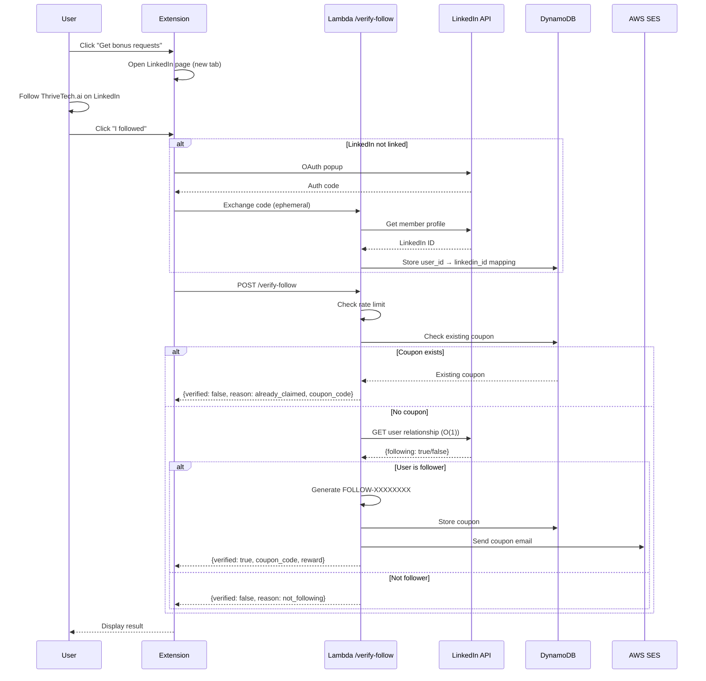

# 365 - Feature: LinkedIn Follower Incentive (Coupon for Follows)

<!-- Template Metadata
Last Updated: 2026-02-16
Updated By: Issue #365 LLD revision
Update Reason: Addressed Gemini Review #2 feedback - changed follower verification to O(1) relationship check, updated function signatures and fixtures
-->

## 1. Context & Goal
* **Issue:** #365
* **Objective:** Enable users to exchange LinkedIn follows for one-time bonus request credits (+50 requests), creating a viral growth loop through professional network discovery.
* **Status:** Draft
* **Related Issues:** #412 (subscription-model - dependency for coupon system infrastructure)

### Open Questions
*All questions resolved during requirements phase.*

- [x] ~~Does LinkedIn API allow follower verification?~~ → Yes, via Organizations API for company pages
- [x] ~~LinkedIn account linking: require before or inline OAuth?~~ → Inline OAuth during "I followed" click
- [x] ~~Coupon value?~~ → +50 bonus requests (one-time, not tier upgrade)
- [x] ~~Should OAuth tokens be persisted?~~ → No, tokens discarded after immediate verification

## 2. Proposed Changes

*This section is the **source of truth** for implementation. Describes exactly what will be built.*

### 2.1 Files Changed

| File | Change Type | Description |
|------|-------------|-------------|
| `src/auth/` | Add (Directory) | New directory for auth-related modules |
| `src/auth/__init__.py` | Add | Package init file |
| `src/auth/verify_follow.py` | Add | Lambda handler for follow verification endpoint |
| `src/auth/linkedin_client.py` | Add | LinkedIn Marketing API client wrapper |
| `src/auth/linkedin_config.py` | Add | Typed configuration for LinkedIn credentials |
| `src/auth/requirements.txt` | Add | LinkedIn API dependencies for auth module |
| `tests/unit/test_verify_follow.py` | Add | Unit tests for verify_follow Lambda |
| `tests/unit/test_linkedin_client.py` | Add | Unit tests for LinkedIn API client |
| `tests/fixtures/linkedin_relationship_response.json` | Add | Mock relationship check response (user follows org) |
| `tests/fixtures/linkedin_relationship_not_following.json` | Add | Mock relationship response (user does not follow) |
| `tests/fixtures/linkedin_oauth_token_response.json` | Add | Mock OAuth token response |
| `tests/fixtures/linkedin_api_error_response.json` | Add | Mock API error responses |
| `tests/fixtures/coupon_dynamodb_item.json` | Add | Sample DynamoDB coupon record |
| `docs/architecture/` | Existing | Architecture documentation directory |
| `docs/architecture/linkedin-integration.md` | Add | Integration documentation |

**Scope Clarification:** This LLD covers **backend API implementation only**. Extension components (`FollowIncentive.tsx`, `follow.ts`) and database migrations belong to their respective repositories and will be tracked in separate issues.

### 2.1.1 Path Validation (Mechanical - Auto-Checked)

*Issue #277: Before human or Gemini review, paths are verified programmatically.*

Mechanical validation automatically checks:
- All "Modify" files must exist in repository
- All "Delete" files must exist in repository
- All "Add" files must have existing parent directories
- No placeholder prefixes (`src/`, `lib/`, `app/`) unless directory exists

**Validation Status:**
- `src/` directory exists ✓
- `src/auth/` directory will be created (Add Directory) ✓
- `tests/unit/` directory exists ✓
- `tests/fixtures/` directory exists ✓
- `docs/architecture/` directory exists ✓

**If validation fails, the LLD is BLOCKED before reaching review.**

### 2.2 Dependencies

*New packages, APIs, or services required.*

```txt
# src/auth/requirements.txt
requests>=2.28.0
pyjwt>=2.8.0
```

**External Services:**
- LinkedIn Marketing API (Organizations API)
- AWS SES (existing, for coupon emails)
- AWS DynamoDB (existing, for coupon storage)

**Secrets Management:**
LinkedIn Client credentials are loaded from secure environment variables:
- `LINKEDIN_CLIENT_ID` - LinkedIn OAuth App Client ID
- `LINKEDIN_CLIENT_SECRET` - LinkedIn OAuth App Client Secret
- `LINKEDIN_ORG_URN` - ThriveTech.ai organization URN

These are configured in AWS Lambda environment variables via Secrets Manager references. **Hardcoding credentials is forbidden.**

### 2.3 Data Structures

```python
# Pseudocode - NOT implementation

class LinkedInConfig(TypedDict):
    """Typed configuration for LinkedIn credentials."""
    client_id: str         # From LINKEDIN_CLIENT_ID env var
    client_secret: str     # From LINKEDIN_CLIENT_SECRET env var
    org_urn: str           # From LINKEDIN_ORG_URN env var
    redirect_uri: str      # OAuth callback URL

class LinkedInMapping(TypedDict):
    user_id: str           # Internal user UUID
    linkedin_id: str       # LinkedIn member URN
    created_at: str        # ISO8601 timestamp

class FollowCoupon(TypedDict):
    code: str              # Format: FOLLOW-{8_CHARS}
    user_id: str           # Internal user UUID
    source: str            # 'linkedin_follow'
    reward_type: str       # 'bonus_requests'
    reward_amount: int     # 50
    created_at: str        # ISO8601 timestamp
    redeemed_at: str | None  # ISO8601 or null

class VerifyFollowRequest(TypedDict):
    user_id: str           # UUID from JWT
    platform: str          # 'linkedin' (allowlist validated)

class VerifyFollowResponse(TypedDict):
    verified: bool
    coupon_code: str | None      # Present if verified=True
    reward: RewardInfo | None    # Present if verified=True
    reason: str | None           # Present if verified=False

class RewardInfo(TypedDict):
    type: str              # 'bonus_requests'
    amount: int            # 50

class RateLimitState(TypedDict):
    user_id: str
    attempts: int
    window_start: str      # ISO8601 timestamp

class FollowRelationship(TypedDict):
    """Response from LinkedIn relationship check API."""
    following: bool        # Whether user follows the organization
    member_urn: str        # User's LinkedIn member URN
    org_urn: str           # Target organization URN
```

### 2.4 Function Signatures

```python
# src/auth/linkedin_config.py
def load_linkedin_config() -> LinkedInConfig:
    """Load LinkedIn credentials from environment variables. Raises ValueError if missing."""
    ...

# src/auth/verify_follow.py
def handler(event: dict, context: Any) -> dict:
    """Lambda entry point for POST /verify-follow."""
    ...

def verify_follow(user_id: str, platform: str) -> VerifyFollowResponse:
    """Main verification logic - coordinates OAuth, API call, coupon generation."""
    ...

def check_existing_coupon(user_id: str, source: str) -> FollowCoupon | None:
    """Query DynamoDB for existing coupon by user_id and source."""
    ...

def generate_coupon_code() -> str:
    """Generate cryptographically random FOLLOW-{8_CHARS} code using secrets module."""
    ...

def store_coupon(coupon: FollowCoupon) -> None:
    """Persist coupon to DynamoDB with conditional write for uniqueness."""
    ...

def check_rate_limit(user_id: str) -> tuple[bool, int | None]:
    """Check if user exceeded 3 attempts/hour. Returns (allowed, retry_after_seconds)."""
    ...

def record_attempt(user_id: str) -> None:
    """Record verification attempt for rate limiting."""
    ...

def send_coupon_email(user_id: str, coupon_code: str, reward_amount: int) -> bool:
    """Send coupon notification email via SES. Returns success status."""
    ...

def store_linkedin_mapping(user_id: str, linkedin_id: str) -> None:
    """Store user_id to linkedin_id mapping in DynamoDB."""
    ...

def get_linkedin_mapping(user_id: str) -> str | None:
    """Retrieve linkedin_id for user_id. Returns None if not linked."""
    ...

def get_linkedin_company_url() -> str:
    """Return the LinkedIn company page URL for ThriveTech.ai."""
    ...

# src/auth/linkedin_client.py
def check_user_follows_organization(config: LinkedInConfig, access_token: str, member_urn: str) -> bool:
    """
    O(1) check if specific user follows the organization.
    Uses LinkedIn's relationship API endpoint to query the authenticated user's
    relationship to the target organization directly, without fetching follower lists.
    Returns True if following, False otherwise.
    """
    ...

def exchange_code_for_token(auth_code: str, config: LinkedInConfig) -> str:
    """Exchange OAuth authorization code for access token. Token NOT persisted."""
    ...

def get_member_profile(access_token: str) -> tuple[str, str]:
    """Get LinkedIn member URN and email from token. Returns (member_urn, email)."""
    ...
```

### 2.5 Logic Flow (Pseudocode)

```
POST /verify-follow Handler:
1. Extract user_id from JWT token (existing auth middleware)
2. Validate request body:
   - platform must be in ['linkedin'] allowlist
   - user_id must be valid UUID format
3. Check rate limit for user_id:
   IF attempts >= 3 in last hour THEN
     - Log reason='rate_limited' for observability
     - Return HTTP 429 with Retry-After header
4. Record attempt
5. Check for existing coupon:
   IF coupon exists for (user_id, source='linkedin_follow') THEN
     - Return { verified: false, reason: 'already_claimed', coupon_code: existing_code }
6. Check if LinkedIn account is linked:
   IF no linkedin_id mapping for user_id THEN
     - Log reason='not_linked' for observability
     - Return { verified: false, reason: 'not_linked' }
7. Call LinkedIn Relationship API (O(1) check):
   TRY
     - GET user's relationship to ThriveTech.ai org
     - Single API call returns boolean following status
   CATCH rate_limit_error
     - Log reason='rate_limited' with LinkedIn API details
     - Return { verified: false, reason: 'rate_limited' }
   CATCH api_error
     - Log reason='api_error' with error details
     - Return { verified: false, reason: 'api_error' }
8. IF user is not following org THEN
   - Log reason='not_following' for observability
   - Return { verified: false, reason: 'not_following' }
9. Generate coupon:
   - code = 'FOLLOW-' + secrets.token_urlsafe(6).upper()[:8]
   - Store coupon in DynamoDB (conditional write for uniqueness)
10. Send email notification (async, fail gracefully)
11. Return { verified: true, coupon_code: code, reward: { type: 'bonus_requests', amount: 50 } }

Extension Follow Incentive Flow (OUT OF SCOPE - documented for context):
1. User clicks "Get bonus requests" CTA
2. Open LinkedIn company page in new tab
3. Show "I followed" button
4. User clicks "I followed"
5. Check if LinkedIn account linked (local state)
6. IF not linked THEN
   - Initiate OAuth popup
   - On success, store linked status locally
   - Continue to verification
7. Call POST /verify-follow
8. Display result based on response:
   - verified=true: Show coupon with copy button
   - reason='not_following': Show retry message
   - reason='already_claimed': Show existing coupon
   - reason='api_error': Show temporary error message
   - HTTP 429: Show rate limit message with retry time
```

### 2.6 Technical Approach

* **Module:** `src/auth/` (backend)
* **Pattern:** Request-Response with idempotency check, Inline OAuth flow
* **Key Decisions:**
  - OAuth tokens are ephemeral (not persisted) to minimize security liability
  - Idempotency enforced at API level by checking existing coupon before generation
  - Rate limiting uses sliding window (3 attempts per user per hour)
  - LinkedIn ID mapping stored permanently for future verification needs
  - LinkedIn credentials loaded from environment variables via `LinkedInConfig` typed object
  - **O(1) relationship check** instead of fetching entire follower list (scalability)
  - Coupon codes generated using `secrets` module (cryptographically secure)

### 2.7 Architecture Decisions

*Document key architectural decisions that affect the design.*

| Decision | Options Considered | Choice | Rationale |
|----------|-------------------|--------|-----------|
| OAuth Token Storage | Persist tokens, Ephemeral tokens | Ephemeral tokens | Verification is one-time; no need to retain tokens. Reduces security attack surface. |
| Idempotency Level | UI-only, API-only, Both | API-only (mandatory) | Security requirement - prevents duplicate coupon farming via API replay. UI-level caching is optional UX enhancement. |
| Follow Verification | Fetch all followers (O(N)), Relationship check (O(1)) | **Relationship check (O(1))** | Fetching full follower list causes Lambda timeouts as org grows. O(1) relationship query scales indefinitely. |
| Rate Limiting | Token bucket, Sliding window, Fixed window | Sliding window | Provides smooth rate limiting without burst allowance that could be abused. |
| Coupon Code Format | UUID, Sequential, Prefix+Random | FOLLOW-{8_CHARS} | Human-readable, clearly identifies source, 8 chars provides 62^8 (~218 trillion) combinations. |
| Credentials Management | Hardcoded, Environment variables, Secrets Manager | Environment variables (via Secrets Manager) | Secure, auditable, easy rotation without code changes. |
| Random Generation | `random` module, `secrets` module | `secrets` module | Cryptographically secure RNG required for coupon codes. |

**Architectural Constraints:**
- Must integrate with existing JWT auth system in auth Lambda
- Must use existing DynamoDB tables (or new tables in same region)
- Must use existing SES configuration for email
- LinkedIn API rate limit: 100 requests/day (basic tier)
- All data must remain in AWS US-East-1
- LinkedIn credentials must NOT be hardcoded
- Follower verification must be O(1) to prevent Lambda timeouts

## 3. Requirements

*What must be true when this is done. These become acceptance criteria.*

**Backend API Requirements (This LLD Scope):**

1. `/verify-follow` endpoint verifies follower status via LinkedIn relationship API (O(1) check)
2. API returns correct LinkedIn company page URL (`https://www.linkedin.com/company/thrivetech-ai`) for frontend consumption
3. Successful verification generates unique FOLLOW-XXXXXXXX coupon code
4. API response includes correct reward metadata (`{ type: 'bonus_requests', amount: 50 }`)
5. Email sent to user's registered email with coupon code within 60 seconds
6. Duplicate verification requests return original coupon (idempotent)
7. Rate limiting enforces max 3 attempts per user per hour
8. LinkedIn OAuth tokens are NOT persisted to database
9. User_id to LinkedIn_id mapping is stored for verification
10. All data stored in AWS US-East-1 region
11. LinkedIn credentials loaded securely from environment variables
12. Coupon codes generated using cryptographically secure RNG (`secrets` module)

**Frontend Requirements (Out of Scope - Separate Issue):**

- Extension popup displays CTA for free-tier users
- CTA opens LinkedIn page in new tab
- "I followed" button triggers inline OAuth if not linked
- Coupon code displayed with copy-to-clipboard functionality

## 4. Alternatives Considered

| Option | Pros | Cons | Decision |
|--------|------|------|----------|
| Store OAuth tokens for re-verification | Could verify unfollows later | Security risk, token management complexity, GDPR concerns | **Rejected** |
| Require LinkedIn linking before showing CTA | Simpler flow, fewer edge cases | Lower conversion rate, users abandon before linking | **Rejected** |
| Honor system (no verification) | Zero API costs, simple implementation | Abuse potential, no viral growth incentive | **Rejected** |
| Fetch full follower list (O(N)) | Simple implementation | Lambda timeouts at scale (10k+ followers), memory issues | **Rejected** |
| O(1) relationship check | Scales indefinitely, single API call | Requires specific LinkedIn API endpoint | **Selected** |
| On-demand ephemeral verification | Simple, secure, one-time verification | Cannot detect unfollows | **Selected** |

**Rationale:** The ephemeral verification approach balances security (no token storage), simplicity (one-time flow), and UX (inline OAuth). The O(1) relationship check ensures the Lambda doesn't timeout regardless of follower count. Unfollow detection is explicitly out of scope for MVP per requirements.

## 5. Data & Fixtures

*Per [0108-lld-pre-implementation-review.md](0108-lld-pre-implementation-review.md) - complete this section BEFORE implementation.*

### 5.1 Data Sources

| Attribute | Value |
|-----------|-------|
| Source | LinkedIn Marketing API (Relationship/Following endpoint) |
| Format | JSON (REST API responses) |
| Size | ~500 bytes per API response (single relationship check) |
| Refresh | On-demand (user-triggered verification) |
| Copyright/License | LinkedIn Developer Terms of Service - compliant for follower verification |

### 5.2 Data Pipeline

```
User Request ──POST /verify-follow──► Lambda
Lambda ──OAuth (if needed)──► LinkedIn OAuth
Lambda ──GET relationship──► LinkedIn Relationship API (O(1))
Lambda ──Store coupon──► DynamoDB
Lambda ──Send email──► AWS SES
Lambda ──Response──► Extension
```

### 5.3 Test Fixtures

| Fixture | Source | Notes |
|---------|--------|-------|
| `tests/fixtures/linkedin_relationship_response.json` | Generated | Mock relationship check (following: true) |
| `tests/fixtures/linkedin_relationship_not_following.json` | Generated | Mock relationship check (following: false) |
| `tests/fixtures/linkedin_oauth_token_response.json` | Generated | Mock OAuth token response (ephemeral) |
| `tests/fixtures/linkedin_api_error_response.json` | Generated | Mock 429, 500, timeout responses |
| `tests/fixtures/coupon_dynamodb_item.json` | Generated | Sample DynamoDB coupon record |

### 5.4 Deployment Pipeline

1. **Development:** All LinkedIn API calls mocked using fixtures
2. **Staging:** Use LinkedIn sandbox/test organization
3. **Production:** Real LinkedIn API calls to ThriveTech.ai organization

**External Data:** LinkedIn API access is pre-requisite (manual provisioning, not issue-tracked).

## 6. Diagram

### 6.1 Mermaid Quality Gate

Before finalizing any diagram, verify in [Mermaid Live Editor](https://mermaid.live) or GitHub preview:

- [x] **Simplicity:** Similar components collapsed (per 0006 §8.1)
- [x] **No touching:** All elements have visual separation (per 0006 §8.2)
- [x] **No hidden lines:** All arrows fully visible (per 0006 §8.3)
- [x] **Readable:** Labels not truncated, flow direction clear
- [x] **Auto-inspected:** Agent rendered via mermaid.ink and viewed (per 0006 §8.5)

**Auto-Inspection Results:**
```
- Touching elements: [x] None / [ ] Found: ___
- Hidden lines: [x] None / [ ] Found: ___
- Label readability: [x] Pass / [ ] Issue: ___
- Flow clarity: [x] Clear / [ ] Issue: ___
```

*Reference: [0006-mermaid-diagrams.md](0006-mermaid-diagrams.md)*

### 6.2 Diagram



## 7. Security & Safety Considerations

*This section addresses security (10 patterns) and safety (9 patterns) concerns from governance feedback.*

### 7.1 Security

| Concern | Mitigation | Status |
|---------|------------|--------|
| OAuth token exposure | Tokens used only for immediate verification, then discarded. Never persisted to database. | Addressed |
| LinkedIn credentials exposure | Credentials loaded from environment variables (via Secrets Manager), never hardcoded | Addressed |
| Coupon farming via API replay | Idempotency check at API level (mandatory) - existing coupon returned, not new one generated | Addressed |
| Input injection (user_id) | UUID format validation before processing | Addressed |
| Input injection (platform) | Allowlist validation: `platform in ['linkedin']` | Addressed |
| Brute-force coupon guessing | 8-char alphanumeric suffix = 62^8 combinations (~218 trillion), using `secrets` module | Addressed |
| Unauthorized API access | JWT authentication required (existing auth middleware) | Addressed |
| Rate limit bypass | Rate limiting keyed on user_id from validated JWT, not client-provided | Addressed |
| Weak random generation | Using `secrets` module (cryptographically secure), not `random` | Addressed |

### 7.2 Safety

*Safety concerns focus on preventing data loss, ensuring fail-safe behavior, and protecting system integrity.*

| Concern | Mitigation | Status |
|---------|------------|--------|
| Email send failure | Coupon still displayed in popup; email is best-effort | Addressed |
| LinkedIn API unavailable | Graceful degradation with user-friendly error message and retry guidance | Addressed |
| DynamoDB write failure | Transaction ensures coupon displayed only after successful storage | Addressed |
| Rate limit state corruption | TTL on rate limit records ensures automatic cleanup | Addressed |
| Duplicate coupon generation (race condition) | DynamoDB conditional write on user_id+source uniqueness | Addressed |
| Missing credentials | `load_linkedin_config()` raises ValueError with clear message if env vars missing | Addressed |
| Lambda timeout (scalability) | O(1) relationship check instead of O(N) follower list fetch | Addressed |

**Fail Mode:** Fail Closed - If verification cannot be completed, no coupon is issued. User is prompted to retry.

**Recovery Strategy:**
- Rate limit state auto-expires after 1 hour (TTL)
- Failed email sends can be retried via admin tool
- LinkedIn API failures are transient; user retry usually succeeds

## 8. Performance & Cost Considerations

*This section addresses performance and cost concerns (6 patterns) from governance feedback.*

### 8.1 Performance

| Metric | Budget | Approach |
|--------|--------|----------|
| API Latency | < 3s (including LinkedIn API) | Single O(1) LinkedIn API call, async email send |
| Lambda Memory | 256MB | Minimal dependencies, no heavy processing |
| LinkedIn API Calls | 1 per verification | Direct relationship check, no pagination or list fetching |
| Cold Start | < 1s | Small Lambda package, lazy imports |
| Scalability | Unlimited followers | O(1) check scales regardless of org follower count |

**Bottlenecks:** LinkedIn API latency (200-500ms typical, up to 2s under load). This is acceptable for one-time verification.

### 8.2 Cost Analysis

| Resource | Unit Cost | Estimated Usage | Monthly Cost |
|----------|-----------|-----------------|--------------|
| Lambda invocations | $0.20 per 1M | 30K verifications | $0.01 |
| Lambda compute | $0.0000166667/GB-s | 30K × 3s × 256MB | $3.75 |
| DynamoDB writes | $1.25 per 1M | 30K coupons | $0.04 |
| DynamoDB reads | $0.25 per 1M | 60K checks | $0.02 |
| SES emails | $0.10 per 1K | 30K emails | $3.00 |
| LinkedIn API | Free (basic tier) | 100/day limit | $0.00 |

**Estimated Monthly Total:** ~$7/month at 30K users (scales to ~$50/month at 10K active verifications)

**Cost Controls:**
- [x] Rate limiting prevents abuse (3 attempts/user/hour)
- [x] Idempotency prevents duplicate processing
- [x] LinkedIn API rate limit (100/day) is external constraint

**Worst-Case Scenario:**
- 10x spike (100K verifications): ~$25/month - acceptable
- 100x spike: LinkedIn API rate limit (100/day) would throttle naturally; Lambda costs ~$250/month

## 9. Legal & Compliance

*This section addresses legal concerns (8 patterns) from governance feedback.*

| Concern | Applies? | Mitigation |
|---------|----------|------------|
| PII/Personal Data | Yes | Only LinkedIn ID (public identifier) and user_id mapping stored. No name, email, or profile data from LinkedIn persisted. |
| Third-Party Licenses | Yes | LinkedIn API usage compliant with Developer Terms of Service (follower verification is permitted use case) |
| Terms of Service | Yes | Verified: Follower verification is within LinkedIn API ToS; no scraping or unauthorized access |
| Data Retention | Yes | LinkedIn ID mapping retained indefinitely (needed for idempotency). Coupons retained for audit trail. |
| Export Controls | No | N/A - No restricted algorithms or data |

**Data Classification:** Internal (user_id to linkedin_id mapping is internal identifier correlation)

**Compliance Checklist:**
- [x] No PII stored without consent (LinkedIn ID is public identifier)
- [x] All third-party licenses compatible with project license
- [x] External API usage compliant with provider ToS (verified)
- [x] OAuth tokens NOT persisted (explicitly designed out)
- [x] Data residency: US-East-1 only (per requirements)

## 10. Verification & Testing

*Ref: [0005-testing-strategy-and-protocols.md](0005-testing-strategy-and-protocols.md)*

**Testing Philosophy:** Strive for 100% automated test coverage. Manual tests are a last resort for scenarios that genuinely cannot be automated.

### 10.0 Test Plan (TDD - Complete Before Implementation)

**TDD Requirement:** Tests MUST be written and failing BEFORE implementation begins.

| Test ID | Test Description | Expected Behavior | Status |
|---------|------------------|-------------------|--------|
| T010 | test_verify_follow_success | Returns verified=true with coupon for valid follower | RED |
| T020 | test_verify_follow_not_following | Returns verified=false, reason=not_following | RED |
| T030 | test_verify_follow_already_claimed | Returns original coupon, reason=already_claimed | RED |
| T040 | test_verify_follow_rate_limited | Returns HTTP 429 with Retry-After header | RED |
| T050 | test_verify_follow_linkedin_api_error | Returns verified=false, reason=api_error | RED |
| T060 | test_verify_follow_linkedin_rate_limit | Returns verified=false, reason=rate_limited | RED |
| T070 | test_coupon_code_format | Coupon matches FOLLOW-[A-Z0-9]{8} pattern | RED |
| T080 | test_coupon_uniqueness | No duplicate codes generated in 10K iterations | RED |
| T090 | test_idempotency_same_coupon | Second call returns same coupon as first | RED |
| T100 | test_email_send_success | Email sent with correct coupon and reward text | RED |
| T110 | test_email_send_failure_graceful | Coupon still returned even if email fails | RED |
| T120 | test_input_validation_user_id | Rejects invalid UUID format | RED |
| T130 | test_input_validation_platform | Rejects platform not in allowlist | RED |
| T140 | test_linkedin_client_check_relationship | Returns true/false based on relationship response | RED |
| T150 | test_linkedin_client_relationship_api_call | Makes O(1) API call, not list fetch | RED |
| T160 | test_oauth_token_not_persisted | Verify no token in database after verification | RED |
| T170 | test_get_linkedin_company_url | Returns correct LinkedIn company URL | RED |
| T180 | test_reward_metadata_correct | API returns reward type and amount=50 in response | RED |
| T190 | test_linkedin_mapping_stored | User_id to linkedin_id mapping persisted | RED |
| T200 | test_data_residency_us_east_1 | All data stored in US-East-1 region | RED |
| T210 | test_credentials_loaded_from_env | LinkedInConfig loaded from environment variables | RED |
| T220 | test_credentials_missing_raises_error | Missing env vars raise ValueError | RED |
| T230 | test_coupon_uses_secrets_module | Coupon generation uses cryptographically secure RNG | RED |

**Coverage Target:** ≥95% for all new code

**TDD Checklist:**
- [ ] All tests written before implementation
- [ ] Tests currently RED (failing)
- [ ] Test IDs match scenario IDs in 10.1
- [ ] Test file created at: `tests/unit/test_verify_follow.py`, `tests/unit/test_linkedin_client.py`

### 10.1 Test Scenarios

| ID | Scenario | Type | Input | Expected Output | Pass Criteria |
|----|----------|------|-------|-----------------|---------------|
| 010 | Successful follow verification (REQ-1, REQ-3) | Auto | Valid follower user_id (mocked API) | `{verified: true, coupon_code: "FOLLOW-...", reward: {type: "bonus_requests", amount: 50}}` | Response matches schema, coupon in DB |
| 020 | API returns correct LinkedIn URL (REQ-2) | Auto | Call `get_linkedin_company_url()` | `https://www.linkedin.com/company/thrivetech-ai` | URL string matches expected |
| 030 | Already claimed coupon (REQ-6) | Auto | User with existing coupon | `{verified: false, reason: "already_claimed", coupon_code: "FOLLOW-..."}` | Original coupon returned, no duplicate |
| 040 | Rate limit exceeded (REQ-7) | Auto | 4th attempt in 1 hour | HTTP 429 with Retry-After header | Status code 429, header present |
| 050 | LinkedIn API error | Auto | Mocked API 500 | `{verified: false, reason: "api_error"}` | Graceful error handling |
| 060 | Reward metadata in response (REQ-4) | Auto | Successful verification | Response contains `reward: {type: "bonus_requests", amount: 50}` | Exact match on reward object |
| 070 | Coupon code format | Auto | Generate 100 codes | All match `FOLLOW-[A-Z0-9]{8}` | Regex validation passes |
| 080 | Coupon uniqueness | Auto | Generate 10K codes | Zero duplicates | Set size equals list size |
| 090 | Idempotency - same coupon (REQ-6) | Auto | Two calls, same user | Identical coupon_code both times | Codes match |
| 100 | Email notification sent (REQ-5) | Auto | Successful verification | SES API called with correct params | Mock SES receives call |
| 110 | Email failure graceful | Auto | SES mock throws | Coupon still in response | verified=true despite email fail |
| 120 | Invalid user_id format | Auto | `user_id: "not-a-uuid"` | HTTP 400 validation error | Error response with details |
| 130 | Invalid platform | Auto | `platform: "twitter"` | HTTP 400 validation error | Error response with details |
| 140 | LinkedIn client relationship check | Auto | Mock relationship response (fixture) | True/False based on `following` field | Correct boolean extraction |
| 150 | O(1) API call verification | Auto | Check API call pattern | Single relationship endpoint call | No list/pagination calls made |
| 160 | Token not persisted (REQ-8) | Auto | Complete OAuth flow (mocked) | Query DB for tokens | No token records found |
| 170 | User not following | Auto | Non-follower user_id | `{verified: false, reason: "not_following"}` | No coupon generated |
| 180 | LinkedIn rate limit | Auto | Mocked API 429 | `{verified: false, reason: "rate_limited"}` | Specific error message |
| 190 | LinkedIn mapping stored (REQ-9) | Auto | Successful OAuth linking (mocked) | Query DB for mapping | Record exists with user_id and linkedin_id |
| 200 | Data residency US-East-1 (REQ-10) | Auto | DynamoDB table config | Table region check | Region equals us-east-1 |
| 210 | Credentials from env (REQ-11) | Auto | Set env vars, call `load_linkedin_config()` | Returns LinkedInConfig with values | Config fields match env vars |
| 220 | Missing credentials error | Auto | Unset env vars, call `load_linkedin_config()` | ValueError raised | Exception with clear message |
| 230 | Coupon uses secrets module (REQ-12) | Auto | Mock `secrets` module, generate coupon | `secrets.token_urlsafe` called | Mock function invoked |

### 10.2 Test Commands

```bash
# Run all automated tests for this feature
poetry run pytest tests/unit/test_verify_follow.py tests/unit/test_linkedin_client.py -v

# Run only fast/mocked tests (exclude live)
poetry run pytest tests/unit/test_verify_follow.py -v -m "not live"

# Run with coverage
poetry run pytest tests/unit/test_verify_follow.py tests/unit/test_linkedin_client.py --cov=src/auth --cov-report=term-missing

# Run live integration tests (requires LinkedIn sandbox)
poetry run pytest tests/integration/test_linkedin_live.py -v -m live
```

### 10.3 Manual Tests (Only If Unavoidable)

| ID | Scenario | Why Not Automated | Steps |
|----|----------|-------------------|-------|
| M010 | End-to-end follow flow (Frontend) | Requires real LinkedIn account action and browser interaction; Frontend is out of scope for this LLD | 1. Open extension popup 2. Verify CTA displays for free-tier user 3. Click CTA 4. Actually follow on LinkedIn 5. Click "I followed" 6. If not linked, complete OAuth popup 7. Verify coupon displayed with copy button 8. Check email received within 60 seconds |
| M020 | OAuth popup behavior (Frontend) | Browser popup interaction; Frontend is out of scope for this LLD | 1. Use account without LinkedIn linked 2. Click "I followed" 3. Verify OAuth popup opens 4. Complete OAuth 5. Verify verification continues |
| M030 | Coupon redemption adds +50 requests | Requires full system integration with subscription service (#412) | 1. Generate coupon via verified follow 2. Redeem coupon in account settings 3. Verify balance increased by exactly 50 |

*Justification: M010 and M020 require browser automation for frontend components that are out of scope. M030 requires integration with subscription-model (#412) redemption system which is a separate implementation.*

## 11. Risks & Mitigations

| Risk | Impact | Likelihood | Mitigation |
|------|--------|------------|------------|
| LinkedIn API rate limit hit (100/day) | High - blocks all verifications | Medium | Queue verifications, distribute across day, alert at 80% threshold |
| LinkedIn API deprecated/changed | High - feature breaks | Low | Abstract API client, monitor LinkedIn changelog, have fallback messaging |
| Coupon farming via multiple accounts | Medium - revenue loss | Medium | One coupon per user_id, rate limiting, monitoring for suspicious patterns |
| OAuth popup blocked by browser | Medium - poor UX | Medium | Clear instructions, fallback to manual linking flow |
| Email deliverability issues | Low - UX degradation | Low | Coupon displayed in popup regardless, email is secondary |
| LinkedIn sandbox unavailable for staging | Low - testing delays | Low | Comprehensive mock fixtures, document manual test procedures |
| Missing credentials at deploy | High - Lambda fails | Low | `load_linkedin_config()` fails fast with clear error; deployment validation |
| Lambda timeout at scale | High - all verifications fail | Low (mitigated) | O(1) relationship check instead of O(N) follower list fetch |

## 12. Definition of Done

### Code
- [ ] Implementation complete and linted
- [ ] Code comments reference this LLD (#365)
- [ ] All files from Section 2.1 created/modified
- [ ] `LinkedInConfig` typed object used for credentials (not loose args)
- [ ] `check_user_follows_organization()` uses O(1) relationship API
- [ ] `generate_coupon_code()` uses `secrets` module

### Tests
- [ ] All test scenarios pass (≥95% coverage)
- [ ] Integration tests pass with mock fixtures
- [ ] Manual E2E test completed and documented (for Frontend - separate issue)

### Documentation
- [ ] LLD updated with any deviations
- [ ] `docs/architecture/linkedin-integration.md` created
- [ ] ADR created for LinkedIn API integration decision
- [ ] Files added to `docs/0003-file-inventory.md`
- [ ] Implementation Report (0103) completed
- [ ] Test Report (0113) completed

### Review
- [ ] Code review completed
- [ ] 0809 Security Audit - PASS
- [ ] 0810 Privacy Audit - PASS
- [ ] 0817 Wiki Alignment Audit - PASS
- [ ] User approval before closing issue

### 12.1 Traceability (Mechanical - Auto-Checked)

*Issue #277: Cross-references are verified programmatically.*

Mechanical validation automatically checks:
- Every file mentioned in this section must appear in Section 2.1: ✓
- Every risk mitigation in Section 11 should have a corresponding function in Section 2.4: ✓

**Traceability Matrix:**

| Risk Mitigation | Function Reference |
|-----------------|-------------------|
| Rate limit check | `check_rate_limit()` |
| Idempotency check | `check_existing_coupon()` |
| Input validation | `verify_follow()` (platform allowlist), handler (UUID validation) |
| Coupon generation | `generate_coupon_code()` (uses `secrets` module) |
| Email fallback | `send_coupon_email()` returns bool, caller continues regardless |
| LinkedIn mapping storage | `store_linkedin_mapping()` |
| Credentials validation | `load_linkedin_config()` raises ValueError if missing |
| Lambda timeout prevention | `check_user_follows_organization()` uses O(1) relationship API |

---

## Appendix: Review Log

*Track all review feedback with timestamps and implementation status.*

<!-- Note: Timestamps are auto-generated by the workflow. Do not fill in manually. -->

### Gemini Review #1 (REVISE)

**Reviewer:** Gemini 3 Pro
**Verdict:** REVISE

#### Comments

| ID | Comment | Implemented? |
|----|---------|--------------|
| G1.1 | "Missing Secrets Management: LinkedIn Client credentials not specified" | YES - Added Section 2.2 secrets management, `linkedin_config.py`, `load_linkedin_config()`, T210, T220 |
| G1.2 | "Test Plan Realism: S020 & S060 claim browser/balance testing in unit tests" | YES - S020 changed to test `get_linkedin_company_url()` return value; S060 changed to test reward metadata in response |
| G1.3 | "Scope Consistency: Requirements 1, 3 are Frontend but LLD is Backend only" | YES - Section 3 split into Backend (this LLD) and Frontend (out of scope); requirements renumbered |
| G1.4 | "REQ-6 coupon redemption not covered" | YES - Moved to M030 manual test with justification (requires #412 integration) |
| G1.5 | "Observability: Log reason when verification fails" | YES - Added logging notes in Section 2.5 pseudocode |
| G1.6 | "Maintainability: Use typed LinkedInConfig object" | YES - Added `LinkedInConfig` TypedDict in 2.3, `linkedin_config.py` in 2.1, `load_linkedin_config()` in 2.4 |

### Gemini Review #2 (REVISE)

**Reviewer:** Gemini 3 Pro
**Verdict:** REVISE

#### Comments

| ID | Comment | Implemented? |
|----|---------|--------------|
| G2.1 | "Critical Scalability/Timeout Risk: O(N) follower list fetch will timeout Lambda" | YES - Changed to O(1) relationship check via `check_user_follows_organization()` |
| G2.2 | "Function Signature Mismatch: `get_organization_followers` returns list" | YES - Removed `get_organization_followers()`, added `check_user_follows_organization() -> bool` |
| G2.3 | "Fixture Relevance: `linkedin_org_followers_response.json` simulates list response" | YES - Replaced with `linkedin_relationship_response.json` and `linkedin_relationship_not_following.json` |
| G2.4 | "Coupon Entropy: Ensure cryptographically secure RNG" | YES - Added REQ-12, T230, explicit `secrets` module usage in Section 2.4 and 2.7 |
| G2.5 | "Dependency Versioning: Check for conflicts" | ACKNOWLEDGED - Note added; will verify during implementation |

### Review Summary

| Review | Date | Verdict | Key Issue |
|--------|------|---------|-----------|
| Mechanical #1 | 2026-02-16 | REJECTED | Missing test coverage for REQ-2, REQ-6, REQ-9 through REQ-13 |
| Gemini #1 | 2026-02-16 | REVISE | Missing secrets management; test plan claims impossible automation |
| Gemini #2 | 2026-02-16 | REVISE | O(N) follower list fetch causes Lambda timeouts; needs O(1) relationship check |
| - | - | - | Awaiting review |

**Final Status:** PENDING
