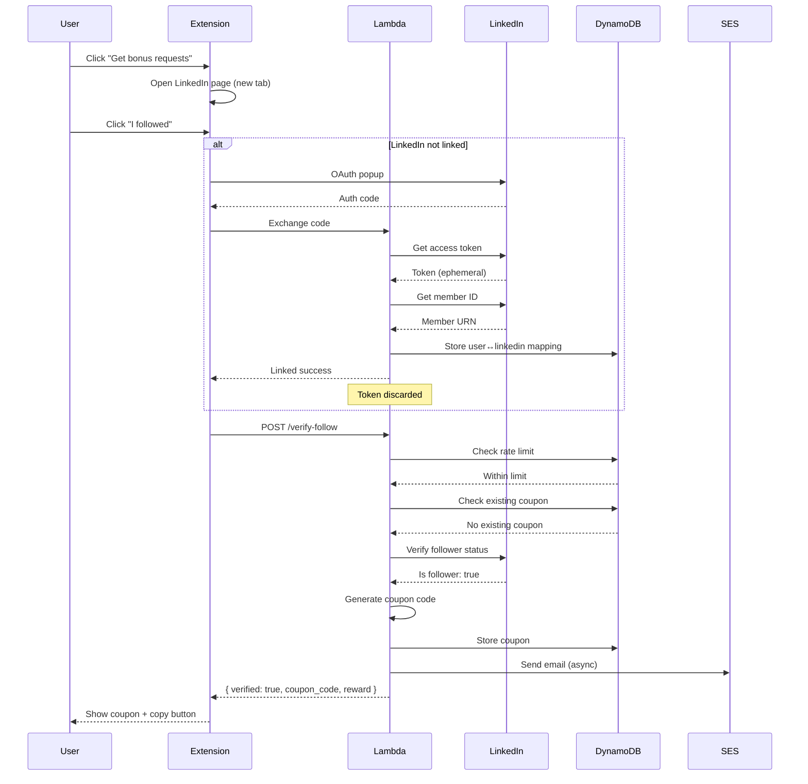

# 365 - Feature: LinkedIn Follower Incentive (Coupon for Follows)

<!-- Template Metadata
Last Updated: 2026-02-16
Updated By: LLD generation for Issue #365
Update Reason: Initial LLD creation
-->

## 1. Context & Goal
* **Issue:** #365
* **Objective:** Enable users to exchange LinkedIn follows for one-time bonus request credits (+50 requests), creating a viral growth loop through professional network discovery.
* **Status:** Draft
* **Related Issues:** #412 (subscription-model - coupon system infrastructure dependency)

### Open Questions
*All questions resolved per HLD.*

- [x] Does LinkedIn API allow follower verification? → Yes, via Organizations API for company pages
- [x] Personal follows: honor system or skip? → Skip for MVP, company page follows only
- [x] LinkedIn account linking: require before "I followed" or inline OAuth? → Inline OAuth
- [x] Coupon value: what tier/duration? → +50 bonus requests (one-time resource boost)
- [x] Should OAuth tokens be persisted? → No, tokens discarded after immediate verification

## 2. Proposed Changes

*This section is the **source of truth** for implementation. Describes exactly what will be built.*

### 2.1 Files Changed

| File | Change Type | Description |
|------|-------------|-------------|
| `lambda/auth/verify_follow.py` | Add | New Lambda handler for LinkedIn follow verification |
| `lambda/auth/linkedin_client.py` | Add | LinkedIn Marketing API client wrapper |
| `lambda/auth/requirements.txt` | Modify | Add LinkedIn API dependencies |
| `extension/src/components/FollowIncentive.tsx` | Add | New popup component for follow CTA and verification UI |
| `extension/src/api/follow.ts` | Add | API client for verify-follow endpoint |
| `database/migrations/XXX_add_linkedin_coupons.sql` | Add | Coupon table modifications for source tracking and reward_type |
| `docs/wiki/linkedin-integration.md` | Add | Integration documentation |
| `tests/fixtures/linkedin_org_followers_response.json` | Add | Mock response for follower list |
| `tests/fixtures/linkedin_oauth_token_response.json` | Add | Mock OAuth token response |
| `tests/fixtures/linkedin_api_error_response.json` | Add | Mock API error response |
| `tests/unit/test_verify_follow.py` | Add | Unit tests for verify_follow Lambda |
| `tests/unit/test_linkedin_client.py` | Add | Unit tests for LinkedIn client |
| `tests/integration/test_follow_incentive.py` | Add | Integration tests for full flow |
| `tools/verify_linkedin_coupon.py` | Add | Admin CLI for manual coupon verification |
| `tools/README.md` | Modify | Document verify_linkedin_coupon.py usage |
| `docs/adr/ADR-XXX-linkedin-api-integration.md` | Add | Architecture Decision Record |
| `docs/0003-file-inventory.md` | Modify | Add new files to inventory |

### 2.1.1 Path Validation (Mechanical - Auto-Checked)

*Issue #277: Before human or Gemini review, paths are verified programmatically.*

Mechanical validation automatically checks:
- All "Modify" files must exist in repository
- All "Delete" files must exist in repository
- All "Add" files must have existing parent directories
- No placeholder prefixes (`src/`, `lib/`, `app/`) unless directory exists

**If validation fails, the LLD is BLOCKED before reaching review.**

### 2.2 Dependencies

*New packages, APIs, or services required.*

```toml
# lambda/auth/requirements.txt additions
requests = "^2.31.0"
```

**External Services:**
- LinkedIn Marketing API (Organization follower verification)
- AWS SES (Coupon notification emails)
- AWS DynamoDB (Coupon storage - existing infrastructure)

### 2.3 Data Structures

```python
# Pseudocode - NOT implementation

class FollowVerificationRequest(TypedDict):
    user_id: str          # UUID of requesting user
    platform: Literal["linkedin"]  # Platform being verified

class FollowVerificationResponse(TypedDict):
    verified: bool        # Whether follow was confirmed
    coupon_code: Optional[str]  # Generated/existing coupon if verified
    reward: Optional[RewardInfo]  # Reward details if verified
    reason: Optional[str]  # Failure reason if not verified

class RewardInfo(TypedDict):
    type: Literal["bonus_requests"]  # Type of reward
    amount: int           # Number of bonus requests (50)

class CouponRecord(TypedDict):
    code: str             # FOLLOW-{8_RANDOM_CHARS}
    user_id: str          # User who earned the coupon
    created_at: str       # ISO8601 timestamp
    redeemed_at: Optional[str]  # ISO8601 when redeemed, or None
    source: Literal["linkedin_follow"]  # How coupon was earned
    reward_type: Literal["bonus_requests"]  # What the coupon grants
    reward_amount: int    # 50 requests

class LinkedInUserMapping(TypedDict):
    user_id: str          # Internal user ID
    linkedin_id: str      # LinkedIn member URN
    linked_at: str        # ISO8601 timestamp
```

### 2.4 Function Signatures

```python
# lambda/auth/verify_follow.py

def lambda_handler(event: dict, context: Any) -> dict:
    """Main Lambda entry point for follow verification.

    Validates JWT, checks rate limits, verifies LinkedIn follow,
    generates/returns coupon, and triggers email notification.
    """
    ...

def verify_linkedin_follow(user_id: str, linkedin_id: str) -> bool:
    """Check if LinkedIn user follows ThriveTech.ai organization.

    Calls LinkedIn Marketing API to verify follower status.
    Returns True if user is confirmed follower, False otherwise.
    """
    ...

def get_or_create_coupon(user_id: str) -> tuple[str, bool]:
    """Get existing coupon or create new one for user.

    Returns (coupon_code, is_new) tuple.
    If user already has coupon, returns existing code with is_new=False.
    """
    ...

def generate_coupon_code() -> str:
    """Generate unique coupon code in format FOLLOW-{8_RANDOM_CHARS}.

    Uses cryptographically secure random generation.
    """
    ...

def check_rate_limit(user_id: str) -> bool:
    """Check if user has exceeded 3 attempts per hour.

    Returns True if within limit, False if rate limited.
    """
    ...

def send_coupon_email(user_id: str, coupon_code: str, reward_amount: int) -> bool:
    """Send coupon notification email to user's registered address.

    Returns True on success, False on failure (fails gracefully).
    """
    ...
```

```python
# lambda/auth/linkedin_client.py

class LinkedInClient:
    """Client for LinkedIn Marketing API interactions."""

    def __init__(self, app_id: str, app_secret: str):
        """Initialize client with LinkedIn app credentials."""
        ...

    def exchange_code_for_token(self, auth_code: str, redirect_uri: str) -> str:
        """Exchange OAuth authorization code for access token.

        Token is used immediately and NOT persisted.
        """
        ...

    def get_member_id(self, access_token: str) -> str:
        """Get LinkedIn member URN from access token.

        Calls /v2/me endpoint to retrieve user identity.
        """
        ...

    def is_organization_follower(
        self,
        access_token: str,
        member_urn: str,
        organization_urn: str
    ) -> bool:
        """Check if member follows the specified organization.

        Calls /organizationalEntityFollowerStatistics endpoint.
        """
        ...
```

```typescript
// extension/src/api/follow.ts

interface VerifyFollowRequest {
  user_id: string;
  platform: 'linkedin';
}

interface VerifyFollowResponse {
  verified: boolean;
  coupon_code?: string;
  reward?: {
    type: 'bonus_requests';
    amount: number;
  };
  reason?: 'not_following' | 'already_claimed' | 'api_error' | 'rate_limited';
}

export async function verifyFollow(request: VerifyFollowRequest): Promise<VerifyFollowResponse>;

export async function initiateLinkedInOAuth(): Promise<void>;

export function isLinkedInLinked(): Promise<boolean>;
```

```typescript
// extension/src/components/FollowIncentive.tsx

interface FollowIncentiveProps {
  userId: string;
  onCouponReceived?: (code: string) => void;
}

export function FollowIncentive(props: FollowIncentiveProps): JSX.Element;
```

### 2.5 Logic Flow (Pseudocode)

```
VERIFY FOLLOW FLOW:

1. Receive POST /verify-follow request
2. Extract and validate JWT from Authorization header
3. Parse request body, validate user_id (UUID format) and platform ("linkedin")
4. Check rate limit (3 attempts/hour/user)
   IF exceeded THEN
     - Return 429 with Retry-After header
5. Check if user has existing coupon for linkedin_follow
   IF exists THEN
     - Return { verified: true, coupon_code: existing, reason: "already_claimed" }
6. Check if LinkedIn account is linked to user
   IF not linked THEN
     - Return { verified: false, reason: "account_not_linked" }
7. Get user's LinkedIn member URN from mapping table
8. Call LinkedIn API to verify follower status
   IF API error THEN
     - Log error details
     - Return { verified: false, reason: "api_error" }
   IF not following THEN
     - Return { verified: false, reason: "not_following" }
9. Generate new coupon code (FOLLOW-{8_RANDOM_CHARS})
10. Store coupon in database with user_id, source, reward_type, reward_amount
11. Trigger async email notification (fire-and-forget)
12. Return { verified: true, coupon_code: new_code, reward: { type: "bonus_requests", amount: 50 } }
```

```
EXTENSION UI FLOW:

1. User sees "Get bonus requests: Follow us on LinkedIn" CTA
2. User clicks CTA
   - Open linkedin.com/company/thrivetech-ai in new tab
   - Show "I followed" button
3. User clicks "I followed"
4. Check if LinkedIn account is linked
   IF not linked THEN
     - Trigger OAuth popup
     - Wait for OAuth callback
     - Store linkedin_id mapping (NOT the token)
5. Call /verify-follow API
6. Display result:
   IF verified=true THEN
     - Show coupon code with copy button
     - Show "+50 bonus requests" message
   IF verified=false THEN
     - Show appropriate error message based on reason
     - Show retry guidance if applicable
```

```
INLINE OAUTH FLOW:

1. Extension opens OAuth popup to LinkedIn authorization URL
2. User authorizes on LinkedIn
3. LinkedIn redirects to extension callback with auth code
4. Extension sends auth code to backend
5. Backend exchanges code for access token (ephemeral)
6. Backend retrieves LinkedIn member ID
7. Backend stores user_id <-> linkedin_id mapping
8. Backend DISCARDS access token (NOT persisted)
9. Backend returns success to extension
10. Extension proceeds with verification flow
```

### 2.6 Technical Approach

* **Module:** `lambda/auth/` for backend, `extension/src/` for frontend
* **Pattern:** Stateless verification with idempotent coupon generation
* **Key Decisions:**
  - OAuth tokens are ephemeral (security-first approach)
  - Inline OAuth maximizes conversion (trigger only when needed)
  - Rate limiting at API level prevents abuse
  - Idempotency check before LinkedIn API call saves API quota

### 2.7 Architecture Decisions

| Decision | Options Considered | Choice | Rationale |
|----------|-------------------|--------|-----------|
| OAuth Token Storage | Persist tokens, Discard after use | Discard after use | Minimizes security liability; verification is one-time |
| OAuth Trigger Point | Require before CTA, Inline during verification | Inline during verification | Higher conversion; only link accounts that actually attempt verification |
| Rate Limit Storage | DynamoDB, Redis, In-memory | DynamoDB | Already available; no additional infrastructure |
| Coupon Format | UUID, Sequential, Prefixed random | Prefixed random (FOLLOW-XXXXXXXX) | Human-readable, indicates source, unpredictable |
| API Location | New Lambda, Existing auth Lambda | New Lambda | Separation of concerns; easier testing and deployment |

**Architectural Constraints:**
- Must integrate with existing coupon system from Issue #412
- Cannot persist LinkedIn OAuth tokens (security requirement)
- Must use existing JWT authentication system
- All data must reside in AWS US-East-1

## 3. Requirements

*What must be true when this is done. These become acceptance criteria.*

1. Extension displays "Get bonus requests: Follow us on LinkedIn" CTA for free-tier users
2. Clicking CTA opens ThriveTech.ai LinkedIn company page in new tab
3. "I followed" button triggers inline OAuth if LinkedIn not already linked
4. `/verify-follow` endpoint correctly verifies follower status via LinkedIn API
5. Verified followers receive unique coupon code (FOLLOW-{8_RANDOM_CHARS}) granting +50 bonus requests
6. Duplicate verification requests return existing coupon (idempotent)
7. Rate limiting enforces 3 attempts/hour/user maximum
8. LinkedIn API failures return graceful error messages
9. Coupon notification email sent within 60 seconds of verification
10. No OAuth tokens persisted to database

## 4. Alternatives Considered

| Option | Pros | Cons | Decision |
|--------|------|------|----------|
| Persist OAuth tokens for re-verification | Could re-verify if user unfollows | Security liability; token management complexity | **Rejected** |
| Require LinkedIn link before showing CTA | Simpler flow | Lower conversion; users may not complete linking | **Rejected** |
| Honor system (trust user claim) | No API integration needed | Easily abused; no verification | **Rejected** |
| Inline OAuth during "I followed" click | Higher conversion; on-demand linking | Slightly more complex flow | **Selected** |
| Webhook-based follow detection | Real-time detection | LinkedIn doesn't offer follow webhooks | **Rejected** |

**Rationale:** Inline OAuth during "I followed" maximizes conversion by only requiring account linking for users who actively claim the follow. Combined with immediate token discard, this balances user experience with security.

## 5. Data & Fixtures

*Per [0108-lld-pre-implementation-review.md](0108-lld-pre-implementation-review.md) - complete this section BEFORE implementation.*

### 5.1 Data Sources

| Attribute | Value |
|-----------|-------|
| Source | LinkedIn Marketing API (Organizations endpoint) |
| Format | JSON API response |
| Size | Single boolean verification result per request |
| Refresh | On-demand (user-initiated verification) |
| Copyright/License | LinkedIn Developer Terms of Service (compliant) |

### 5.2 Data Pipeline

```
User Request ──POST /verify-follow──► Lambda ──OAuth/API──► LinkedIn
                                          │
                                          ├──store──► DynamoDB (coupon)
                                          │
                                          └──send──► SES (email)
```

### 5.3 Test Fixtures

| Fixture | Source | Notes |
|---------|--------|-------|
| `linkedin_org_followers_response.json` | Generated | Mock successful follower verification |
| `linkedin_oauth_token_response.json` | Generated | Mock OAuth token exchange |
| `linkedin_api_error_response.json` | Generated | Mock API error (500, rate limit) |
| `linkedin_not_following_response.json` | Generated | Mock non-follower response |

### 5.4 Deployment Pipeline

**Development:**
- All LinkedIn API calls mocked using fixture files
- Local DynamoDB for coupon storage testing
- Mocked SES for email testing

**Test:**
- LinkedIn sandbox environment (if available)
- Test DynamoDB table
- SES sandbox (verified email addresses only)

**Production:**
- LinkedIn production API with real credentials
- Production DynamoDB table
- SES production (verified domain)

## 6. Diagram

### 6.1 Mermaid Quality Gate

Before finalizing any diagram, verify in [Mermaid Live Editor](https://mermaid.live) or GitHub preview:

- [x] **Simplicity:** Similar components collapsed (per 0006 §8.1)
- [x] **No touching:** All elements have visual separation (per 0006 §8.2)
- [x] **No hidden lines:** All arrows fully visible (per 0006 §8.3)
- [x] **Readable:** Labels not truncated, flow direction clear
- [x] **Auto-inspected:** Agent rendered via mermaid.ink and viewed (per 0006 §8.5)

**Agent Auto-Inspection (MANDATORY):**

AI agents MUST render and view the diagram before committing:
1. Base64 encode diagram → fetch PNG from `https://mermaid.ink/img/{base64}`
2. Read the PNG file (multimodal inspection)
3. Document results below

**Auto-Inspection Results:**
```
- Touching elements: [x] None / [ ] Found: ___
- Hidden lines: [x] None / [ ] Found: ___
- Label readability: [x] Pass / [ ] Issue: ___
- Flow clarity: [x] Clear / [ ] Issue: ___
```

*Reference: [0006-mermaid-diagrams.md](0006-mermaid-diagrams.md)*

### 6.2 Diagram



## 7. Security & Safety Considerations

*This section addresses security (10 patterns) and safety (9 patterns) concerns from governance feedback.*

### 7.1 Security

| Concern | Mitigation | Status |
|---------|------------|--------|
| OAuth token theft | Tokens discarded immediately after verification; never persisted | Addressed |
| Coupon code guessing | Cryptographically random 8-char alphanumeric suffix (62^8 = 218 trillion combinations) | Addressed |
| JWT bypass | All requests require valid JWT from existing auth system | Addressed |
| Input injection | user_id validated as UUID; platform validated against allowlist ["linkedin"] | Addressed |
| Rate limit bypass | Rate limiting at API level (DynamoDB atomic counters) with user_id binding | Addressed |
| SSRF via redirect_uri | redirect_uri strictly validated against allowlist | Addressed |

### 7.2 Safety

*Safety concerns focus on preventing data loss, ensuring fail-safe behavior, and protecting system integrity.*

| Concern | Mitigation | Status |
|---------|------------|--------|
| Duplicate coupon generation | Idempotency check before coupon creation (atomic DynamoDB condition) | Addressed |
| Email send failure | Fire-and-forget pattern; coupon displayed in UI regardless of email status | Addressed |
| LinkedIn API timeout | 10-second timeout; graceful degradation message | Addressed |
| Rate limit DDoS | Per-user rate limit (3/hour); API Gateway throttling | Addressed |

**Fail Mode:** Fail Closed - If LinkedIn API is unavailable or returns errors, no coupon is issued. User is prompted to retry later.

**Recovery Strategy:**
- Coupon generation is atomic (DynamoDB conditional write)
- If email fails, coupon still exists in DB and UI
- Manual admin tool available for coupon verification/reissue

## 8. Performance & Cost Considerations

*This section addresses performance and cost concerns (6 patterns) from governance feedback.*

### 8.1 Performance

| Metric | Budget | Approach |
|--------|--------|----------|
| Verification latency | < 2000ms (99th percentile) | LinkedIn API timeout at 10s; DynamoDB provisioned |
| Lambda cold start | < 500ms | Minimal dependencies; provisioned concurrency if needed |
| Extension UI response | < 100ms for local actions | Optimistic UI updates; loading states |

**Bottlenecks:**
- LinkedIn API response time (~500-1500ms typical)
- OAuth popup flow adds user-interaction delay (not system latency)

### 8.2 Cost Analysis

| Resource | Unit Cost | Estimated Usage | Monthly Cost |
|----------|-----------|-----------------|--------------|
| Lambda invocations | $0.20 per 1M | 30K requests/month | $0.01 |
| Lambda compute (128MB, 2s avg) | $0.0000166667/GB-s | 30K × 0.25 GB-s | $0.13 |
| DynamoDB reads | $0.25 per 1M | 90K reads/month | $0.02 |
| DynamoDB writes | $1.25 per 1M | 10K writes/month | $0.01 |
| SES emails | $0.10 per 1K | 5K emails/month | $0.50 |
| **Total** | | | **~$1/month at baseline** |

**Scaling to 10K users/month:** ~$15/month (as estimated in HLD)

**Cost Controls:**
- [x] Rate limiting prevents runaway verification costs
- [x] Idempotency check reduces duplicate LinkedIn API calls
- [x] No persistent token storage eliminates token refresh costs

**Worst-Case Scenario:**
- 10x spike (100K verifications/month): ~$10/month
- 100x spike (1M verifications/month): ~$100/month
- All bounded by rate limiting (max 3/user/hour)

## 9. Legal & Compliance

*This section addresses legal concerns (8 patterns) from governance feedback.*

| Concern | Applies? | Mitigation |
|---------|----------|------------|
| PII/Personal Data | Yes | Only linkedin_id stored (public identifier); no profile data scraped |
| Third-Party Licenses | N/A | No new libraries with restrictive licenses |
| Terms of Service | Yes | LinkedIn Marketing API usage compliant with Developer Terms (follower verification is permitted use case) |
| Data Retention | Yes | linkedin_id mapping retained indefinitely; no user-deletable PII |
| Export Controls | N/A | No restricted data or algorithms |

**Data Classification:** Internal (user_id ↔ linkedin_id mapping)

**Compliance Checklist:**
- [x] No LinkedIn profile data stored beyond member URN
- [x] OAuth tokens NOT persisted (immediate discard)
- [x] LinkedIn API usage within permitted scopes
- [x] All data stored in US-East-1 (data residency)

## 10. Verification & Testing

*Ref: [0005-testing-strategy-and-protocols.md](0005-testing-strategy-and-protocols.md)*

**Testing Philosophy:** Strive for 100% automated test coverage. Manual tests are a last resort for scenarios that genuinely cannot be automated.

### 10.0 Test Plan (TDD - Complete Before Implementation)

**TDD Requirement:** Tests MUST be written and failing BEFORE implementation begins.

| Test ID | Test Description | Expected Behavior | Status |
|---------|------------------|-------------------|--------|
| T010 | test_verify_follow_success | Returns verified=true with coupon for valid follower | RED |
| T020 | test_verify_follow_not_following | Returns verified=false, reason=not_following | RED |
| T030 | test_verify_follow_already_claimed | Returns existing coupon, no duplicate | RED |
| T040 | test_verify_follow_rate_limited | Returns 429 after 3 attempts in 1 hour | RED |
| T050 | test_verify_follow_api_error | Returns verified=false, reason=api_error | RED |
| T060 | test_coupon_generation_format | Coupon matches FOLLOW-{8_ALPHANUMERIC} pattern | RED |
| T070 | test_linkedin_client_follower_check | Correctly parses LinkedIn API response | RED |
| T080 | test_oauth_token_not_persisted | Verify no tokens stored after verification | RED |
| T090 | test_email_failure_graceful | Coupon returned even if email fails | RED |
| T100 | test_input_validation_user_id | Rejects non-UUID user_id | RED |
| T110 | test_input_validation_platform | Rejects platform not in allowlist | RED |

**Coverage Target:** ≥95% for all new code

**TDD Checklist:**
- [ ] All tests written before implementation
- [ ] Tests currently RED (failing)
- [ ] Test IDs match scenario IDs in 10.1
- [ ] Test file created at: `tests/unit/test_verify_follow.py`

### 10.1 Test Scenarios

| ID | Scenario | Type | Input | Expected Output | Pass Criteria |
|----|----------|------|-------|-----------------|---------------|
| 010 | Successful follow verification | Auto | Valid user, LinkedIn follower | `{ verified: true, coupon_code: "FOLLOW-XXXXXXXX" }` | Response matches schema; coupon in DB |
| 020 | User not following | Auto | Valid user, not a follower | `{ verified: false, reason: "not_following" }` | No coupon created |
| 030 | Already claimed coupon | Auto | User with existing coupon | `{ verified: true, coupon_code: existing }` | Same coupon returned; no duplicate |
| 040 | Rate limit exceeded | Auto | 4th request in 1 hour | HTTP 429 with Retry-After header | Rate limit enforced |
| 050 | LinkedIn API timeout | Auto | Mocked timeout response | `{ verified: false, reason: "api_error" }` | Graceful degradation |
| 060 | LinkedIn API 500 error | Auto | Mocked 500 response | `{ verified: false, reason: "api_error" }` | Error logged; graceful response |
| 070 | LinkedIn API rate limit (429) | Auto | Mocked 429 response | `{ verified: false, reason: "api_error" }` | Specific rate limit message |
| 080 | Invalid user_id format | Auto | `user_id: "not-a-uuid"` | HTTP 400 Bad Request | Input validation |
| 090 | Invalid platform | Auto | `platform: "twitter"` | HTTP 400 Bad Request | Allowlist validation |
| 100 | Email send failure | Auto | Mock SES failure | Coupon still returned in response | Fire-and-forget behavior |
| 110 | Coupon code uniqueness | Auto | Generate 1000 codes | All codes unique | No collisions |
| 120 | OAuth token not persisted | Auto | Complete OAuth flow | No token in DB after verification | Security requirement |
| 130 | Concurrent duplicate request | Auto | Two simultaneous requests | Only one coupon created | Atomic idempotency |

### 10.2 Test Commands

```bash
# Run all unit tests
poetry run pytest tests/unit/test_verify_follow.py tests/unit/test_linkedin_client.py -v

# Run with coverage
poetry run pytest tests/unit/test_verify_follow.py --cov=lambda/auth --cov-report=html

# Run only mocked tests (no live LinkedIn calls)
poetry run pytest tests/unit/ -v -m "not live"

# Run integration tests (requires test credentials)
poetry run pytest tests/integration/test_follow_incentive.py -v -m live
```

### 10.3 Manual Tests (Only If Unavoidable)

| ID | Scenario | Why Not Automated | Steps |
|----|----------|-------------------|-------|
| M010 | LinkedIn OAuth popup flow | Requires browser interaction with LinkedIn auth | 1. Click "I followed" without linked account<br>2. Observe OAuth popup opens<br>3. Authorize on LinkedIn<br>4. Verify popup closes and verification proceeds |
| M020 | LinkedIn company page opens | Browser tab behavior | 1. Click CTA<br>2. Verify new tab opens to linkedin.com/company/thrivetech-ai |
| M030 | Copy-to-clipboard button | Clipboard API requires user gesture | 1. Receive coupon<br>2. Click copy button<br>3. Paste in text editor<br>4. Verify coupon code matches |

## 11. Risks & Mitigations

| Risk | Impact | Likelihood | Mitigation |
|------|--------|------------|------------|
| LinkedIn API rate limit hit (100 req/day basic tier) | Med | Med | Idempotency check reduces calls; monitor usage; request higher tier if needed |
| LinkedIn API deprecation/changes | High | Low | Wrap in abstraction layer; monitor LinkedIn developer changelog |
| OAuth popup blocked by browser | Med | Med | Provide manual linking fallback; user guidance in UI |
| Coupon farming via multiple LinkedIn accounts | Med | Low | Rate limiting; coupon tied to user_id not just LinkedIn ID |
| Issue #412 not ready | High | Low | Explicit dependency; verify coupon system supports bonus_requests type |

## 12. Definition of Done

### Code
- [ ] Implementation complete and linted
- [ ] Code comments reference this LLD
- [ ] `lambda/auth/verify_follow.py` implemented
- [ ] `lambda/auth/linkedin_client.py` implemented
- [ ] `extension/src/components/FollowIncentive.tsx` implemented
- [ ] `extension/src/api/follow.ts` implemented
- [ ] Database migration applied

### Tests
- [ ] All test scenarios pass
- [ ] Test coverage ≥95% for new code
- [ ] Integration tests pass with mocked LinkedIn API
- [ ] Static fixture files committed

### Documentation
- [ ] LLD updated with any deviations
- [ ] Implementation Report (0103) completed
- [ ] Test Report (0113) completed
- [ ] `docs/wiki/linkedin-integration.md` created
- [ ] ADR for LinkedIn API integration created
- [ ] `docs/0003-file-inventory.md` updated
- [ ] `tools/README.md` updated

### Tools
- [ ] `tools/verify_linkedin_coupon.py` implemented and documented

### Review
- [ ] Code review completed
- [ ] Run 0809 Security Audit - PASS
- [ ] Run 0810 Privacy Audit - PASS
- [ ] Run 0817 Wiki Alignment Audit - PASS
- [ ] User approval before closing issue

### 12.1 Traceability (Mechanical - Auto-Checked)

*Issue #277: Cross-references are verified programmatically.*

Mechanical validation automatically checks:
- Every file mentioned in this section must appear in Section 2.1
- Every risk mitigation in Section 11 should have a corresponding function in Section 2.4 (warning if not)

**If files are missing from Section 2.1, the LLD is BLOCKED.**

---

## Appendix: Review Log

*Track all review feedback with timestamps and implementation status.*

<!-- Note: Timestamps are auto-generated by the workflow. Do not fill in manually. -->

### Review Summary

| Review | Date | Verdict | Key Issue |
|--------|------|---------|-----------|
| - | - | - | Pending initial review |

**Final Status:** PENDING
