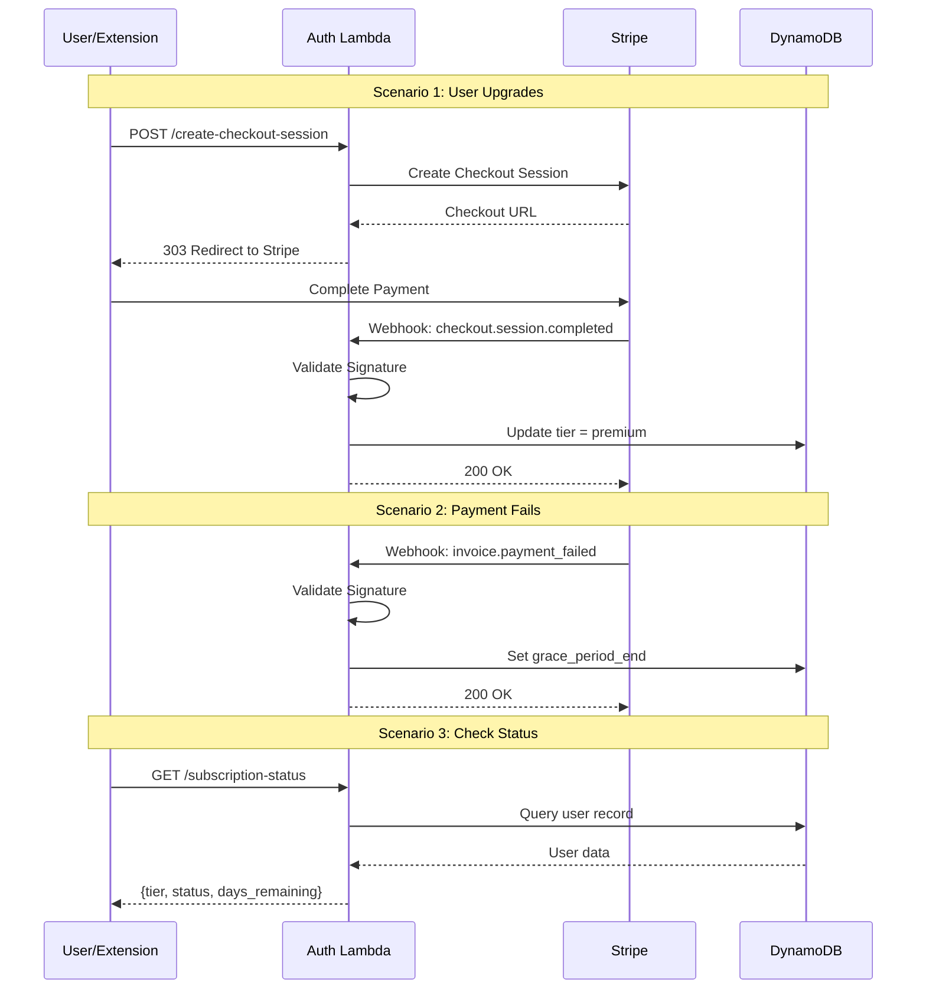

# 366 - Feature: Full Billing with Stripe Integration

## 1. Context & Goal
* **Issue:** #366
* **Objective:** Enable self-service subscription management via Stripe integration, allowing users to upgrade to paid tier through Stripe Checkout with automatic tier management based on payment status.
* **Status:** Draft
* **Related Issues:** #TBD (subscription-manual - must be completed first)

### Open Questions

*All questions from issue brief have been resolved.*

- None remaining

## 2. Proposed Changes

*This section is the **source of truth** for implementation. Describes exactly what will be built.*

### 2.1 Files Changed

| File | Change Type | Description |
|------|-------------|-------------|
| `auth-lambda/stripe_handler.py` | Add | Webhook handler, checkout session creation, signature validation |
| `auth-lambda/stripe_events.py` | Add | Event type handlers for tier changes and grace period logic |
| `auth-lambda/lambda_function.py` | Modify | Add routing for `/create-checkout-session`, `/stripe-webhook`, `/subscription-status` |
| `auth-lambda/requirements.txt` | Modify | Add `stripe` package dependency |
| `extension/popup/subscription-status.js` | Add | Subscription UI component with tier display and upgrade button |
| `extension/popup/popup.html` | Modify | Add subscription status section container |
| `extension/popup/popup.css` | Modify | Add styles for subscription UI elements |
| `infrastructure/secrets.tf` | Modify | Add Stripe API keys and webhook signing secret to Secrets Manager |
| `infrastructure/api-gateway.tf` | Modify | Add `/stripe-webhook` POST route |
| `tools/admin_subscriptions.py` | Add | CLI tool for subscription management with --dry-run mode |
| `docs/adr/0015-stripe-integration.md` | Add | Architecture decision record for Stripe integration |
| `tests/fixtures/stripe_webhook_events.json` | Add | Static webhook event fixtures for offline testing |
| `tests/unit/test_stripe_handler.py` | Add | Unit tests for webhook handling and checkout session |
| `tests/unit/test_stripe_events.py` | Add | Unit tests for event processing and tier transitions |
| `docs/0003-file-inventory.md` | Modify | Add new files to inventory |

### 2.1.1 Path Validation (Mechanical - Auto-Checked)

*Issue #277: Before human or Gemini review, paths are verified programmatically.*

Mechanical validation automatically checks:
- All "Modify" files must exist in repository
- All "Delete" files must exist in repository
- All "Add" files must have existing parent directories
- No placeholder prefixes (`src/`, `lib/`, `app/`) unless directory exists

**If validation fails, the LLD is BLOCKED before reaching review.**

### 2.2 Dependencies

```toml
# auth-lambda/requirements.txt additions
stripe>=7.0.0,<8.0.0
```

### 2.3 Data Structures

```python
# Pseudocode - NOT implementation

class StripeWebhookEvent(TypedDict):
    """Parsed Stripe webhook event structure."""
    id: str                    # Unique event ID for idempotency
    type: str                  # Event type (e.g., "checkout.session.completed")
    data: dict                 # Event-specific payload
    created: int               # Unix timestamp

class SubscriptionRecord(TypedDict):
    """User subscription fields in DynamoDB."""
    stripe_customer_id: Optional[str]      # Stripe customer ID
    stripe_subscription_id: Optional[str]  # Stripe subscription ID
    grace_period_end: Optional[int]        # Unix timestamp, None if not in grace
    processed_events: Set[str]             # Event IDs already processed

class SubscriptionStatus(TypedDict):
    """Response from /subscription-status endpoint."""
    tier: str                              # "free" | "premium"
    status: str                            # "active" | "grace_period" | "none"
    grace_period_days_remaining: Optional[int]  # Days left if in grace period
    stripe_customer_portal_url: Optional[str]   # URL to manage subscription

class CheckoutSessionResponse(TypedDict):
    """Response from /create-checkout-session endpoint."""
    checkout_url: str          # Stripe Checkout URL
    session_id: str            # Session ID for tracking
```

### 2.4 Function Signatures

```python
# auth-lambda/stripe_handler.py

def create_checkout_session(user_id: str, user_email: str) -> CheckoutSessionResponse:
    """Create Stripe Checkout session for subscription upgrade.

    Returns checkout URL and session ID. Raises StripeError on failure.
    """
    ...

def handle_webhook(request_body: bytes, signature_header: str) -> dict:
    """Validate and process Stripe webhook event.

    Returns {"status": "processed"} or {"status": "ignored", "reason": ...}.
    Raises WebhookSignatureError if signature invalid.
    """
    ...

def validate_webhook_signature(payload: bytes, signature: str, secret: str) -> StripeWebhookEvent:
    """Validate Stripe webhook signature and parse event.

    Raises WebhookSignatureError if validation fails.
    """
    ...

def get_subscription_status(user_id: str) -> SubscriptionStatus:
    """Get current subscription status for user.

    Returns tier, status, and grace period info if applicable.
    """
    ...

def get_stripe_secrets() -> dict:
    """Retrieve Stripe API keys and webhook secret from Secrets Manager.

    Cached at Lambda cold start. Returns dict with 'api_key', 'webhook_secret'.
    """
    ...

# auth-lambda/stripe_events.py

def handle_checkout_completed(event: StripeWebhookEvent, user_id: str) -> None:
    """Process checkout.session.completed - upgrade user to premium tier."""
    ...

def handle_invoice_paid(event: StripeWebhookEvent, user_id: str) -> None:
    """Process invoice.paid - log payment, clear grace period if active."""
    ...

def handle_invoice_payment_failed(event: StripeWebhookEvent, user_id: str) -> None:
    """Process invoice.payment_failed - initiate 7-day grace period."""
    ...

def handle_subscription_deleted(event: StripeWebhookEvent, user_id: str) -> None:
    """Process customer.subscription.deleted - downgrade to free tier."""
    ...

def is_event_processed(event_id: str, user_id: str) -> bool:
    """Check if event has already been processed (idempotency check)."""
    ...

def mark_event_processed(event_id: str, user_id: str) -> None:
    """Record event as processed to prevent duplicate processing."""
    ...

def calculate_grace_period_end() -> int:
    """Calculate Unix timestamp for grace period end (7 days from now)."""
    ...

# tools/admin_subscriptions.py

def get_user_subscription(email: str) -> dict:
    """Retrieve subscription details for user by email."""
    ...

def list_grace_period_users() -> list[dict]:
    """List all users currently in grace period."""
    ...

def adjust_user_tier(email: str, new_tier: str, dry_run: bool = True) -> dict:
    """Manually adjust user tier (emergency override).

    Returns planned/executed changes. Defaults to dry_run for safety.
    """
    ...
```

### 2.5 Logic Flow (Pseudocode)

**Checkout Session Creation Flow:**
```
1. Receive POST /create-checkout-session with authenticated user
2. Extract user_id and email from auth context
3. Get Stripe API key from Secrets Manager (cached)
4. Create Stripe Checkout session:
   - mode: "subscription"
   - customer_email: user.email
   - success_url: extension success page
   - cancel_url: extension cancel page
   - metadata: { user_id: user_id }
5. Return 303 redirect to checkout URL
```

**Webhook Processing Flow:**
```
1. Receive POST /stripe-webhook with raw body and signature header
2. Get webhook signing secret from Secrets Manager (cached)
3. Validate signature using Stripe SDK
   - IF invalid: return 400 Bad Request
4. Parse event from validated payload
5. Extract user_id from event metadata or customer lookup
6. Check idempotency:
   - IF event_id already processed: return 200 (acknowledge but skip)
7. Route by event type:
   - checkout.session.completed → upgrade tier to premium
   - invoice.paid → clear grace period flag (if set)
   - invoice.payment_failed → set grace_period_end to now + 7 days
   - customer.subscription.deleted → downgrade tier to free
   - unknown → log and return 200 (forward compatibility)
8. Mark event as processed
9. Return 200 OK
```

**Subscription Status Flow:**
```
1. Receive GET /subscription-status with authenticated user
2. Query DynamoDB for user record
3. Build response:
   - tier: user.tier (free/premium)
   - IF grace_period_end exists AND > now:
     - status: "grace_period"
     - days_remaining: (grace_period_end - now) / 86400
   - ELSE IF tier == "premium":
     - status: "active"
   - ELSE:
     - status: "none"
   - IF stripe_customer_id exists:
     - Generate customer portal URL
4. Return subscription status
```

**Grace Period Expiration (Handled by Stripe):**
```
1. Stripe retries payment per configured retry schedule
2. IF all retries fail:
   - Stripe sends customer.subscription.deleted
   - Webhook handler downgrades user to free tier
3. IF retry succeeds:
   - Stripe sends invoice.paid
   - Webhook handler clears grace period flag
```

### 2.6 Technical Approach

* **Module:** `auth-lambda/` (existing Lambda, new endpoints)
* **Pattern:** Event-driven webhook processing with idempotency
* **Key Decisions:**
  - Use Stripe Checkout (hosted) rather than custom payment form to minimize PCI scope
  - Store only Stripe IDs in DynamoDB, never card details
  - Grace period handled via DynamoDB field, not scheduled Lambda
  - Webhook signature validation happens before any business logic
  - Idempotency uses Stripe event ID stored in user record

### 2.7 Architecture Decisions

| Decision | Options Considered | Choice | Rationale |
|----------|-------------------|--------|-----------|
| Payment UI | Stripe Checkout (hosted), Stripe Elements (embedded), Custom form | Stripe Checkout | Minimizes PCI scope, handles all payment edge cases, mobile-friendly |
| Webhook idempotency | Separate DynamoDB table, User record field, Redis | User record field | Simplest, no new infrastructure, event IDs pruned after 30 days |
| Grace period tracking | DynamoDB TTL + Lambda trigger, Field with timestamp, SQS delayed message | Field with timestamp | Stripe handles retry/expiration, we just track state |
| Secrets management | Environment variables, Secrets Manager, Parameter Store | Secrets Manager | Already used in project, supports rotation, proper for API keys |
| Customer portal | Build custom management UI, Use Stripe Customer Portal | Stripe Customer Portal | Reduces scope, Stripe handles payment method updates |

**Architectural Constraints:**
- Must integrate with existing Auth Lambda routing pattern
- Cannot store card numbers or sensitive payment data (PCI compliance)
- Must work with existing DynamoDB user table schema
- Webhook endpoint must be publicly accessible (Stripe requirement)

## 3. Requirements

*What must be true when this is done. These become acceptance criteria.*

1. Users can initiate subscription upgrade via extension popup "Upgrade" button
2. Checkout session redirects to Stripe Checkout with user email pre-filled
3. Successful checkout immediately upgrades user to premium tier
4. Failed recurring payments initiate 7-day grace period with user notification
5. Subscription cancellation or grace period expiration downgrades user to free tier
6. Duplicate webhook events do not cause duplicate tier changes
7. All Stripe API keys retrieved from Secrets Manager, never hardcoded
8. Webhook endpoint validates Stripe signature before processing any event
9. Admin CLI can view subscription status and manually adjust tiers (with dry-run)
10. Extension displays current subscription status (Free/Premium/Grace Period)

## 4. Alternatives Considered

| Option | Pros | Cons | Decision |
|--------|------|------|----------|
| Stripe Checkout (hosted) | PCI-compliant, handles edge cases, mobile-friendly | Redirects away from extension | **Selected** |
| Stripe Elements (embedded) | Stays in extension context | Higher PCI scope, more complex | Rejected |
| LemonSqueezy | Simpler API, MoR model | Less mature, fewer features | Rejected |
| Paddle | MoR handles taxes | Higher fees, less control | Rejected |
| Manual invoicing | No integration needed | Doesn't scale, admin burden | Rejected |

**Rationale:** Stripe Checkout is the industry standard for SaaS subscriptions, minimizes PCI compliance burden, and provides the best user experience for payment handling. The redirect-based flow is acceptable for subscription upgrades (not frequent actions).

## 5. Data & Fixtures

### 5.1 Data Sources

| Attribute | Value |
|-----------|-------|
| Source | Stripe API (webhooks), DynamoDB (user records) |
| Format | JSON (Stripe events), DynamoDB items |
| Size | ~10KB per webhook event, ~1KB per user record update |
| Refresh | Real-time (event-driven) |
| Copyright/License | N/A - transactional data |

### 5.2 Data Pipeline

```
Stripe ──webhook POST──► Auth Lambda ──validate──► Event Handler ──DynamoDB update──► User Record
                                                                                          │
Extension Popup ◄──GET /subscription-status──◄─────────────────────────────────────────────┘
```

### 5.3 Test Fixtures

| Fixture | Source | Notes |
|---------|--------|-------|
| `checkout.session.completed` event | Generated from Stripe docs | Sanitized, no real customer data |
| `invoice.paid` event | Generated from Stripe docs | Sanitized |
| `invoice.payment_failed` event | Generated from Stripe docs | Sanitized |
| `customer.subscription.deleted` event | Generated from Stripe docs | Sanitized |
| Invalid signature payload | Handcrafted | For security testing |
| Duplicate event payload | Copy of valid event | For idempotency testing |

### 5.4 Deployment Pipeline

```
Local (Stripe test mode) → Staging (Stripe test mode) → Production (Stripe live mode)
```

**Key considerations:**
- Stripe test/live mode controlled by API key (separate secrets per environment)
- Webhook endpoints registered separately in Stripe dashboard per environment
- Test mode uses Stripe test card numbers, no real charges

## 6. Diagram

### 6.1 Mermaid Quality Gate

Before finalizing any diagram, verify in [Mermaid Live Editor](https://mermaid.live) or GitHub preview:

- [x] **Simplicity:** Similar components collapsed (per 0006 §8.1)
- [x] **No touching:** All elements have visual separation (per 0006 §8.2)
- [x] **No hidden lines:** All arrows fully visible (per 0006 §8.3)
- [x] **Readable:** Labels not truncated, flow direction clear
- [ ] **Auto-inspected:** Agent rendered via mermaid.ink and viewed (per 0006 §8.5)

**Auto-Inspection Results:**
```
- Touching elements: [ ] None / [ ] Found: ___
- Hidden lines: [ ] None / [ ] Found: ___
- Label readability: [ ] Pass / [ ] Issue: ___
- Flow clarity: [ ] Clear / [ ] Issue: ___
```

*To be completed during implementation phase.*

### 6.2 Diagram



## 7. Security & Safety Considerations

### 7.1 Security

| Concern | Mitigation | Status |
|---------|------------|--------|
| Webhook spoofing | Validate Stripe signature using webhook secret before processing | Addressed |
| API key exposure | Store in Secrets Manager, never log, never send to client | Addressed |
| Replay attacks | Track processed event IDs, reject duplicates | Addressed |
| Checkout manipulation | Session created server-side with fixed price, user cannot alter | Addressed |
| Privilege escalation | Tier changes only via validated webhook, not user request | Addressed |
| Input injection | Webhook parsed by Stripe SDK, event types whitelisted | Addressed |

### 7.2 Safety

| Concern | Mitigation | Status |
|---------|------------|--------|
| Incorrect downgrade | 7-day grace period before downgrade, Stripe retries payment | Addressed |
| Lost webhook | Stripe auto-retries failed deliveries, idempotency handles duplicates | Addressed |
| Database corruption | Atomic DynamoDB updates, no partial writes | Addressed |
| Admin mistakes | `--dry-run` default on tier adjustment CLI | Addressed |
| Secrets Manager outage | Lambda fails closed (503), user retains current tier | Addressed |

**Fail Mode:** Fail Closed - If signature validation or Secrets Manager fails, reject request and return error. User retains current tier until issue resolved.

**Recovery Strategy:**
- Webhook failures: Stripe retries automatically with exponential backoff
- Database issues: Idempotency ensures safe retry when service recovers
- Manual recovery: Admin CLI can force tier adjustment with audit trail

## 8. Performance & Cost Considerations

### 8.1 Performance

| Metric | Budget | Approach |
|--------|--------|----------|
| Webhook latency | < 2000ms | Simple validation + single DynamoDB write |
| Checkout creation | < 1000ms | Single Stripe API call |
| Status query | < 200ms | Single DynamoDB read |
| Cold start | < 3000ms | Secrets cached after first retrieval |

**Bottlenecks:**
- Secrets Manager API call on cold start (~500ms) - mitigated by caching
- Stripe API calls for checkout session creation - acceptable for user-initiated action

### 8.2 Cost Analysis

| Resource | Unit Cost | Estimated Usage | Monthly Cost |
|----------|-----------|-----------------|--------------|
| Lambda invocations | $0.20 per 1M | ~5000 webhook events | < $0.01 |
| Secrets Manager | $0.40 per secret + $0.05 per 10K calls | 3 secrets, ~15K calls | < $2.00 |
| DynamoDB writes | $1.25 per 1M | ~5000 updates | < $0.01 |
| DynamoDB reads | $0.25 per 1M | ~10000 status checks | < $0.01 |
| **Total AWS** | | | **< $5.00** |
| Stripe fees | 2.9% + $0.30 per transaction | Variable | Pass-through |

**Cost Controls:**
- [x] Budget alert configured at $10/month threshold (CloudWatch alarm)
- [x] No rate limiting needed - Stripe controls webhook volume
- [x] No expensive operations in webhook path

**Worst-Case Scenario:**
- 10x usage (50K webhooks/month): ~$5/month - acceptable
- 100x usage (500K webhooks/month): ~$15/month - still acceptable, indicates massive user growth

## 9. Legal & Compliance

| Concern | Applies? | Mitigation |
|---------|----------|------------|
| PII/Personal Data | Yes | Only store Stripe customer/subscription IDs, no card data; email used for checkout pre-fill only |
| Third-Party Licenses | Yes | Stripe Python SDK (MIT license) compatible with project |
| Terms of Service | Yes | Usage compliant with Stripe ToS; webhook endpoint follows Stripe integration patterns |
| Data Retention | Yes | Event IDs retained 30 days for idempotency, then pruned |
| Export Controls | No | No restricted data or algorithms |

**Data Classification:** Internal (Stripe IDs), Confidential (user-subscription association)

**Compliance Checklist:**
- [x] No PII stored without consent (Stripe handles payment PII)
- [x] All third-party licenses compatible with project license
- [x] External API usage compliant with provider ToS
- [x] Data retention policy documented (30-day event ID retention)
- [x] Data processing restricted to AWS us-east-1; Stripe per their policies

## 10. Verification & Testing

### 10.0 Test Plan (TDD - Complete Before Implementation)

**TDD Requirement:** Tests MUST be written and failing BEFORE implementation begins.

| Test ID | Test Description | Expected Behavior | Status |
|---------|------------------|-------------------|--------|
| T010 | test_checkout_session_created | Returns valid Stripe Checkout URL | RED |
| T020 | test_webhook_valid_signature | Processes event when signature valid | RED |
| T030 | test_webhook_invalid_signature | Returns 400 when signature invalid | RED |
| T040 | test_checkout_completed_upgrades_tier | User tier becomes premium | RED |
| T050 | test_invoice_paid_clears_grace | Grace period flag removed | RED |
| T060 | test_invoice_failed_sets_grace | Grace period end set to +7 days | RED |
| T070 | test_subscription_deleted_downgrades | User tier becomes free | RED |
| T080 | test_duplicate_event_ignored | Second event does not change tier | RED |
| T090 | test_subscription_status_free | Returns correct status for free user | RED |
| T100 | test_subscription_status_premium | Returns correct status for premium user | RED |
| T110 | test_subscription_status_grace | Returns days remaining during grace | RED |
| T120 | test_admin_view_subscription | CLI returns subscription details | RED |
| T130 | test_admin_dry_run | Outputs changes without modifying DB | RED |

**Coverage Target:** ≥95% for all new code

**TDD Checklist:**
- [ ] All tests written before implementation
- [ ] Tests currently RED (failing)
- [ ] Test IDs match scenario IDs in 10.1
- [ ] Test file created at: `tests/unit/test_stripe_handler.py`, `tests/unit/test_stripe_events.py`

### 10.1 Test Scenarios

| ID | Scenario | Type | Input | Expected Output | Pass Criteria |
|----|----------|------|-------|-----------------|---------------|
| 010 | Checkout session creation | Auto | User ID, email | Checkout URL with session ID | URL starts with https://checkout.stripe.com |
| 020 | Valid webhook signature | Auto | Signed payload from fixture | Event processed | Returns 200, tier updated |
| 030 | Invalid webhook signature | Auto | Tampered payload | Rejection | Returns 400, no tier change |
| 040 | checkout.session.completed | Auto | Event fixture | Tier upgrade | User tier = "premium" in DB |
| 050 | invoice.paid during grace | Auto | Event fixture, user in grace | Grace cleared | grace_period_end = None |
| 060 | invoice.payment_failed | Auto | Event fixture | Grace initiated | grace_period_end = now + 7 days |
| 070 | subscription.deleted | Auto | Event fixture | Tier downgrade | User tier = "free" in DB |
| 080 | Duplicate event | Auto | Same event ID twice | Idempotent | Second call returns 200, no DB change |
| 090 | Status - free user | Auto | Free tier user | Status response | {tier: "free", status: "none"} |
| 100 | Status - premium user | Auto | Premium tier user | Status response | {tier: "premium", status: "active"} |
| 110 | Status - grace period | Auto | User with grace_period_end | Status response | {status: "grace_period", days: N} |
| 120 | Admin view subscription | Auto | Valid user email | Subscription details | Returns tier, stripe IDs, status |
| 130 | Admin dry-run adjustment | Auto | Email, new tier, --dry-run | Planned changes | Outputs changes, DB unchanged |
| 140 | Replay attack prevention | Auto | Same webhook payload resent | Rejection | Event ID tracked, no duplicate processing |

### 10.2 Test Commands

```bash
# Run all unit tests (offline, uses fixtures)
poetry run pytest tests/unit/test_stripe_handler.py tests/unit/test_stripe_events.py -v

# Run only fast/mocked tests (exclude live)
poetry run pytest tests/unit/test_stripe*.py -v -m "not live"

# Run live integration tests (requires Stripe test mode)
poetry run pytest tests/integration/test_stripe_integration.py -v -m live
```

### 10.3 Manual Tests (Only If Unavoidable)

| ID | Scenario | Why Not Automated | Steps |
|----|----------|-------------------|-------|
| M01 | End-to-end checkout flow | Requires browser interaction with Stripe Checkout UI | 1. Click Upgrade in extension 2. Complete checkout with test card 3. Verify tier update in popup |
| M02 | Customer portal navigation | Requires browser interaction with Stripe portal | 1. Click "Manage Subscription" in extension 2. Verify portal loads 3. Update payment method |

*Note: These manual tests verify browser integration only. All backend logic is fully automated.*

## 11. Risks & Mitigations

| Risk | Impact | Likelihood | Mitigation |
|------|--------|------------|------------|
| Stripe webhook delivery failure | Med | Low | Stripe auto-retries; idempotency handles duplicates |
| Secrets Manager unavailable | High | Very Low | Fail closed, user retains current tier; Lambda retry |
| Incorrect tier on race condition | Med | Low | Atomic DynamoDB updates, event timestamp ordering |
| User charged but tier not updated | High | Low | Grace period provides buffer; admin CLI for manual fix |
| Webhook endpoint DDoS | Med | Low | API Gateway rate limiting, signature validation rejects invalid |
| Test/prod key mixup | High | Low | Separate secrets per environment, naming convention |

## 12. Definition of Done

### Code
- [ ] Implementation complete and linted
- [ ] Code comments reference this LLD (Issue #366)
- [ ] All new files added to `docs/0003-file-inventory.md`

### Tests
- [ ] All test scenarios pass (T010-T140)
- [ ] Test coverage ≥95% for new code
- [ ] Offline tests use fixtures only (no network)
- [ ] Integration tests pass in Stripe test mode

### Documentation
- [ ] LLD updated with any deviations
- [ ] ADR created at `docs/adr/0015-stripe-integration.md`
- [ ] README updated with subscription feature documentation
- [ ] Implementation Report (0103) completed
- [ ] Test Report (0113) completed

### Review
- [ ] Code review completed
- [ ] 0809 Security Audit - PASS
- [ ] 0810 Privacy Audit - PASS
- [ ] 0817 Wiki Alignment Audit - PASS (if wiki updated)
- [ ] User approval before closing issue

### 12.1 Traceability (Mechanical - Auto-Checked)

*Issue #277: Cross-references are verified programmatically.*

Files in Definition of Done that must appear in Section 2.1:
- `auth-lambda/stripe_handler.py` ✓
- `auth-lambda/stripe_events.py` ✓
- `auth-lambda/lambda_function.py` ✓
- `tools/admin_subscriptions.py` ✓
- `docs/adr/0015-stripe-integration.md` ✓
- `tests/fixtures/stripe_webhook_events.json` ✓

Risk mitigations mapped to functions:
- Webhook signature validation → `validate_webhook_signature()`
- Idempotency → `is_event_processed()`, `mark_event_processed()`
- Atomic tier updates → `handle_checkout_completed()`, `handle_subscription_deleted()`
- Admin override → `adjust_user_tier()`

---

## Appendix: Review Log

*Track all review feedback with timestamps and implementation status.*

### Review Summary

| Review | Date | Verdict | Key Issue |
|--------|------|---------|-----------|
| - | - | - | Awaiting review |

**Final Status:** PENDING
