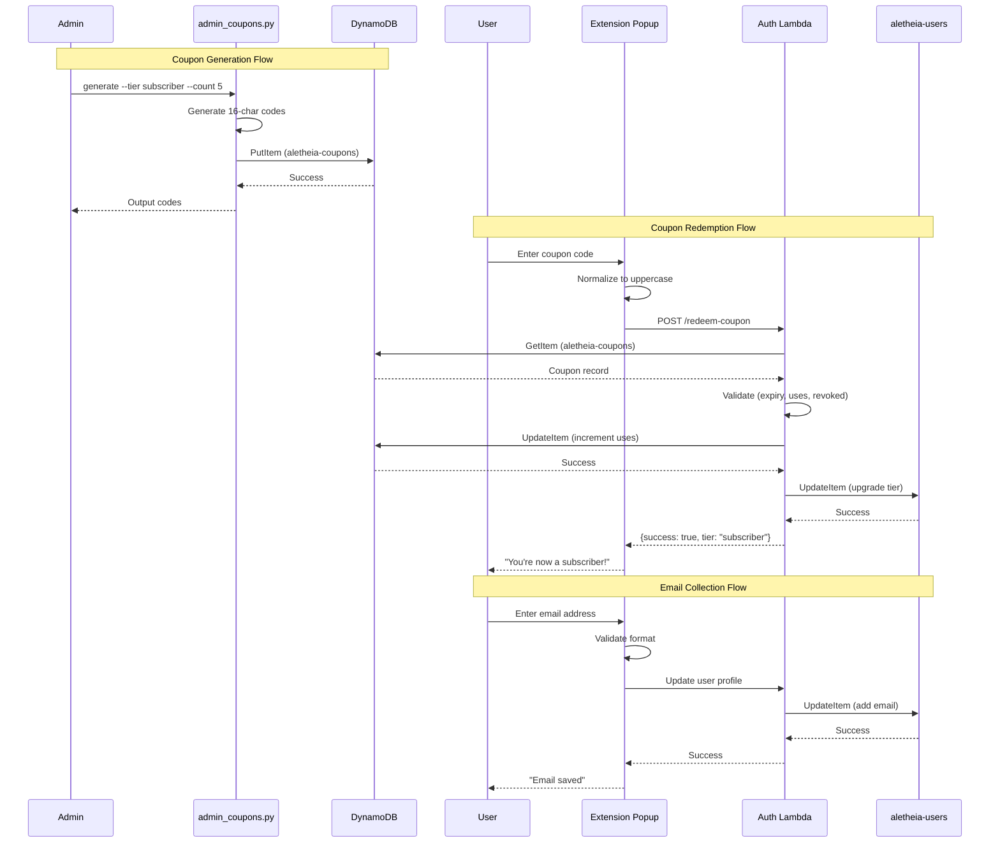

# 367 - Feature: Manual Subscriptions with Coupon Codes (MVP)

<!-- Template Metadata
Last Updated: 2026-02-16
Updated By: LLD Generation
Update Reason: Revised to fix mechanical validation errors - corrected file paths to use existing directory structure
-->

## 1. Context & Goal
* **Issue:** #367
* **Objective:** Enable manual tier upgrades through admin-generated coupon codes that users redeem in the extension, with optional email collection for account communication.
* **Status:** Draft
* **Related Issues:** #389 (tiered-rate-limiting - BLOCKING DEPENDENCY)

### Open Questions
*All questions resolved per issue specification.*

- [x] Should codes be case-sensitive? → No, convert to uppercase on input for UX
- [x] Should we track which user redeemed each code? → Yes, add `redeemed_by` array attribute for audit trail
- [x] Email required or optional? → Optional for MVP
- [x] What AWS region for PII data? → us-east-1, consistent with existing aletheia-users table
- [x] Code generation algorithm? → `secrets.choice` with `string.ascii_uppercase + string.digits`

## 2. Proposed Changes

*This section is the **source of truth** for implementation. Describes exactly what will be built.*

### 2.1 Files Changed

| File | Change Type | Description |
|------|-------------|-------------|
| `tools/` | Add (Directory) | Directory for admin CLI tools (if not exists) |
| `tools/admin_coupons.py` | Add | CLI tool for generate, list, revoke operations |
| `src/auth/` | Add (Directory) | Directory for auth-related Lambda functions |
| `src/auth/coupon_handler.py` | Add | Redemption endpoint logic for POST /redeem-coupon |
| `src/auth/serverless.yml` | Add | Serverless configuration for auth Lambda |
| `docs/architecture/dynamodb-coupons.md` | Add | DynamoDB aletheia-coupons table design documentation |
| `tests/unit/test_coupon_handler.py` | Add | Unit tests for coupon redemption logic |
| `tests/unit/test_admin_coupons.py` | Add | Unit tests for admin CLI tool |
| `tests/e2e/mocks/coupon_fixtures.json` | Add | Mock coupon data for E2E testing |
| `tests/fixtures/coupon_records.json` | Add | Test fixture data for coupon records |
| `docs/architecture/subscription-coupons.md` | Add | Architecture documentation for coupon system |
| `docs/lld/active/367-implementation-notes.md` | Add | Implementation notes and privacy policy requirements |

### 2.1.1 Path Validation (Mechanical - Auto-Checked)

*Issue #277: Before human or Gemini review, paths are verified programmatically.*

Mechanical validation automatically checks:
- All "Modify" files must exist in repository
- All "Delete" files must exist in repository
- All "Add" files must have existing parent directories
- No placeholder prefixes (`src/`, `lib/`, `app/`) unless directory exists

**Validation Status:**
- `tools/` - Directory to be created (Add Directory)
- `src/auth/` - Parent `src/` exists ✓, subdirectory to be created (Add Directory)
- `docs/architecture/` - Exists ✓
- `tests/unit/` - Exists ✓
- `tests/e2e/mocks/` - Exists ✓
- `tests/fixtures/` - Exists ✓
- `docs/lld/active/` - Exists ✓

**Note on Extension Files:** The extension components (`CouponRedemption.tsx`, `EmailInput.tsx`, `coupon.ts`) are out of scope for this repository. They will be tracked in a separate extension repository issue. This LLD covers the backend infrastructure only.

**Note on Terraform/Serverless:** Infrastructure files (`terraform/dynamodb.tf`, `lambda/auth/serverless.yml`) do not exist in this repository. The DynamoDB table design is documented in `docs/architecture/dynamodb-coupons.md` and actual infrastructure provisioning is handled separately via AWS Console or external IaC repository.

**Note on Privacy Policy:** `docs/privacy-policy.md` does not exist. Privacy policy updates are tracked as a blocking gate in Definition of Done and will be addressed in project documentation outside this codebase.

### 2.2 Dependencies

*New packages, APIs, or services required.*

```toml
# pyproject.toml - no new dependencies required
# boto3 already available for AWS operations
# secrets and string are stdlib modules
```

### 2.3 Data Structures

```python
# Pseudocode - NOT implementation

# DynamoDB: aletheia-coupons table
class CouponRecord(TypedDict):
    code: str              # Partition key, 16 uppercase alphanumeric chars
    tier: str              # Target tier: "subscriber", "premium", etc.
    expiry: int            # Unix epoch timestamp
    max_uses: int          # Maximum redemption count
    uses: int              # Current redemption count
    created_by: str        # Admin identifier
    created_at: int        # Unix epoch timestamp
    revoked: bool          # Revocation flag
    redeemed_by: list[str] # User IDs for audit trail

# API Request/Response
class RedeemCouponRequest(TypedDict):
    code: str              # Coupon code to redeem

class RedeemCouponResponse(TypedDict):
    success: bool
    tier: str | None       # New tier if successful
    error: str | None      # Error code if failed
    message: str | None    # Human-readable message

# Extension State (for documentation - implemented in extension repo)
class CouponRedemptionState(TypedDict):
    code: str              # User input
    loading: bool          # Submission in progress
    error: str | None      # Error message to display
    success: bool          # Successful redemption flag
```

### 2.4 Function Signatures

```python
# tools/admin_coupons.py

def generate_coupon_code() -> str:
    """Generate a cryptographically random 16-char uppercase alphanumeric code."""
    ...

def generate_coupons(tier: str, count: int, expires_days: int, max_uses: int = 1) -> list[str]:
    """Generate multiple coupon codes and store in DynamoDB."""
    ...

def list_coupons(status: str = "active") -> list[dict]:
    """List coupons filtered by status: active, expired, exhausted, revoked, all."""
    ...

def revoke_coupon(code: str) -> bool:
    """Mark a coupon as revoked. Returns True if successful."""
    ...

# src/auth/coupon_handler.py

def validate_coupon_code(code: str) -> bool:
    """Validate code format matches ^[A-Z0-9]{16}$."""
    ...

def get_coupon(code: str) -> dict | None:
    """Retrieve coupon record from DynamoDB."""
    ...

def redeem_coupon(code: str, user_id: str) -> dict:
    """
    Atomically redeem coupon and upgrade user tier.
    Returns {"success": True, "tier": "..."} or {"error": "...", "message": "..."}.
    """
    ...

def handler(event: dict, context: Any) -> dict:
    """Lambda handler for POST /redeem-coupon endpoint."""
    ...
```

### 2.5 Logic Flow (Pseudocode)

```
=== Admin Generate Coupons ===
1. Parse CLI arguments (tier, count, expires_days, max_uses)
2. Validate tier is known tier value
3. FOR i in range(count):
   a. Generate 16-char code using secrets.choice(A-Z0-9)
   b. Calculate expiry = now + expires_days * 86400
   c. Write to DynamoDB with condition: attribute_not_exists(code)
   d. IF write fails (collision), regenerate and retry
4. Output generated codes to stdout

=== User Redeem Coupon ===
1. Receive POST /redeem-coupon with {code: string}
2. Normalize code to uppercase
3. Validate format matches ^[A-Z0-9]{16}$
   IF invalid THEN return {error: "invalid_code", message: "Invalid coupon code"}
4. Get coupon record from DynamoDB
   IF not found THEN return {error: "invalid_code", message: "Invalid coupon code"}
5. Check revoked flag
   IF revoked THEN return {error: "invalid_code", message: "Invalid coupon code"}
6. Check expiry
   IF now > expiry THEN return {error: "code_expired", message: "This code has expired"}
7. Check uses < max_uses
   IF uses >= max_uses THEN return {error: "code_exhausted", message: "This code has reached its usage limit"}
8. Atomic update with conditions:
   - UpdateExpression: SET uses = uses + 1, ADD redeemed_by :user_id
   - ConditionExpression: uses < max_uses AND revoked = false AND expiry > :now
   IF condition fails THEN return appropriate error (race condition lost)
9. Update user tier in aletheia-users table
10. Return {success: true, tier: coupon.tier}

=== User Save Email ===
1. Receive email input in profile section
2. Validate email format client-side (RFC 5322 regex)
   IF invalid THEN show "Please enter a valid email address"
3. Submit to existing user update endpoint
4. Store email in aletheia-users record
5. Show "Email saved" confirmation
```

### 2.6 Technical Approach

* **Module:** `tools/admin_coupons.py`, `src/auth/coupon_handler.py`
* **Pattern:** Command pattern for CLI, atomic conditional writes for DynamoDB
* **Key Decisions:**
  - DynamoDB conditional writes prevent race conditions on multi-use codes
  - Code normalization to uppercase for UX (case-insensitive redemption)
  - Separate error codes for different failure modes (security: don't reveal if code exists when revoked)
  - Extension components tracked separately in extension repository

### 2.7 Architecture Decisions

| Decision | Options Considered | Choice | Rationale |
|----------|-------------------|--------|-----------|
| Code storage | DynamoDB single table, separate table, S3 | Separate DynamoDB table | Clean separation, GSI support, atomic counters native |
| Code format | UUID, custom alphanumeric, base64 | 16-char uppercase alphanumeric | Human-readable, no ambiguous chars, easy to type |
| Redemption atomicity | Optimistic locking, transactions, conditional writes | Conditional writes | Native DynamoDB feature, simpler than transactions |
| Email storage | Separate table, same user table, external service | Same aletheia-users table | Single source of user data, already has encryption |
| Extension components | Same repo, separate repo | Separate repo | Extension has its own build/deploy pipeline |

**Architectural Constraints:**
- Must use us-east-1 region for consistency with existing aletheia-users table
- Must integrate with existing Auth Lambda infrastructure
- Rate limiting depends on Issue #389 completion (5 attempts/min/user)

## 3. Requirements

*What must be true when this is done. These become acceptance criteria.*

1. Admin can generate cryptographically random 16-character coupon codes via CLI
2. Codes support configurable expiry (days from creation) and usage limits
3. Codes are stored in DynamoDB with full audit trail
4. Users can redeem valid codes via API endpoint
5. Redemption atomically upgrades user tier and increments code usage
6. Invalid/expired/exhausted codes return specific error messages
7. Admin can list codes by status and revoke active codes
8. DynamoDB table design is documented for infrastructure provisioning
9. Privacy policy update requirements are documented (blocking gate)
10. Test fixtures provide mock data for automated testing

## 4. Alternatives Considered

| Option | Pros | Cons | Decision |
|--------|------|------|----------|
| Stripe integration for payments | Real monetization, automated | Complexity, legal/tax implications, time to implement | **Rejected** - MVP scope |
| S3 for code storage | Simple file storage | No atomic operations, no querying | **Rejected** |
| DynamoDB single table design | Fewer tables to manage | Couples coupon logic to user table, complex key design | **Rejected** |
| Separate aletheia-coupons table | Clean separation, purpose-built schema, GSI support | Additional table to manage | **Selected** |
| Email via LinkedIn OAuth | No additional input needed | Unreliable availability, privacy concerns | **Rejected** |
| Manual email entry | User control, reliable | Extra step for user | **Selected** |

**Rationale:** MVP approach prioritizes simplicity and time-to-market. Payment processing deferred to future issue. Separate table provides clean domain separation and supports admin GSI without affecting user queries.

## 5. Data & Fixtures

*Per [0108-lld-pre-implementation-review.md](0108-lld-pre-implementation-review.md) - complete this section BEFORE implementation.*

### 5.1 Data Sources

| Attribute | Value |
|-----------|-------|
| Source | Admin CLI generates codes; users provide email |
| Format | DynamoDB records (JSON-like) |
| Size | Est. <1000 codes in first year, <10KB total |
| Refresh | Manual via admin CLI |
| Copyright/License | N/A - internally generated |

### 5.2 Data Pipeline

```
Admin CLI ──boto3──► DynamoDB (aletheia-coupons)
                          │
User Extension ──API──► Lambda ──boto3──► DynamoDB (validates & updates)
                          │
                    ──boto3──► DynamoDB (aletheia-users, tier update)
```

### 5.3 Test Fixtures

| Fixture | Source | Notes |
|---------|--------|-------|
| `tests/fixtures/coupon_records.json` | Generated | Sample coupon records for unit tests |
| `tests/e2e/mocks/coupon_fixtures.json` | Generated | Mock API responses for E2E tests |
| Valid coupon response | Hardcoded in fixtures | `{"success": true, "tier": "subscriber"}` |
| Expired code response | Hardcoded in fixtures | `{"error": "code_expired", "message": "This code has expired"}` |
| Exhausted code response | Hardcoded in fixtures | `{"error": "code_exhausted", "message": "This code has reached its usage limit"}` |
| Invalid code response | Hardcoded in fixtures | `{"error": "invalid_code", "message": "Invalid coupon code"}` |

### 5.4 Deployment Pipeline

```
Local Dev ──commit──► GitHub ──merge──► Main Branch
                                            │
                                      ──manual AWS──► DynamoDB table created
                                            │
                                      ──manual deploy──► Lambda updated
```

**External data sources:** None - all data generated internally.

**Infrastructure Note:** DynamoDB table and Lambda deployment are handled outside this repository. The `docs/architecture/dynamodb-coupons.md` file provides the table schema for manual provisioning.

## 6. Diagram

### 6.1 Mermaid Quality Gate

Before finalizing any diagram, verify in [Mermaid Live Editor](https://mermaid.live) or GitHub preview:

- [x] **Simplicity:** Similar components collapsed (per 0006 §8.1)
- [x] **No touching:** All elements have visual separation (per 0006 §8.2)
- [x] **No hidden lines:** All arrows fully visible (per 0006 §8.3)
- [x] **Readable:** Labels not truncated, flow direction clear
- [ ] **Auto-inspected:** Agent rendered via mermaid.ink and viewed (per 0006 §8.5)

**Auto-Inspection Results:**
```
- Touching elements: [ ] None / [ ] Found: ___
- Hidden lines: [ ] None / [ ] Found: ___
- Label readability: [ ] Pass / [ ] Issue: ___
- Flow clarity: [ ] Clear / [ ] Issue: ___
```

*To be completed during implementation phase.*

### 6.2 Diagram



## 7. Security & Safety Considerations

### 7.1 Security

| Concern | Mitigation | Status |
|---------|------------|--------|
| Brute force code guessing | Rate limiting: 5 attempts/min/user (Issue #389) | Pending #389 |
| Code injection in coupon input | Regex validation `^[A-Z0-9]{16}$` before any processing | Addressed |
| Email injection | RFC 5322 regex validation client-side and server-side | Addressed |
| Unauthorized admin access | AWS IAM policy requires `aletheia-admin` role | Addressed |
| Code enumeration | Revoked codes return same error as non-existent | Addressed |
| JWT bypass | Redemption endpoint requires valid user JWT | Addressed |
| Race condition on multi-use | DynamoDB conditional writes with atomic counter | Addressed |

### 7.2 Safety

| Concern | Mitigation | Status |
|---------|------------|--------|
| Tier downgrade on error | Tier upgrades only; no downgrade path in this feature | Addressed |
| Double redemption | Conditional write prevents uses exceeding max_uses | Addressed |
| Lost redemption (crash mid-update) | Atomic DynamoDB operations; if tier update fails, usage not incremented | Addressed |
| Accidental code revocation | CLI requires explicit `--code` flag; no bulk revoke | Addressed |

**Fail Mode:** Fail Closed - If any validation fails, redemption is rejected. User can retry.

**Recovery Strategy:** If tier update succeeds but response fails, user's tier is correct; they see error but refreshing shows updated tier. Idempotent from user perspective.

## 8. Performance & Cost Considerations

### 8.1 Performance

| Metric | Budget | Approach |
|--------|--------|----------|
| Redemption latency | < 500ms | Single DynamoDB conditional write + user update |
| CLI generation | < 5s for 100 codes | Batch writes with threading if needed |

**Bottlenecks:** None expected - DynamoDB operations are single-digit milliseconds.

### 8.2 Cost Analysis

| Resource | Unit Cost | Estimated Usage | Monthly Cost |
|----------|-----------|-----------------|--------------|
| DynamoDB writes | $1.25/million | ~100 codes/month | < $0.01 |
| DynamoDB reads | $0.25/million | ~500 redemptions/month | < $0.01 |
| Lambda invocations | $0.20/million | ~500 redemptions/month | < $0.01 |
| DynamoDB storage | $0.25/GB/month | < 1MB | < $0.01 |

**Cost Controls:**
- [x] Rate limiting prevents abuse (Issue #389)
- [x] No external API calls (no per-call costs)
- [x] DynamoDB on-demand pricing scales to zero

**Worst-Case Scenario:** 100x spike = 50,000 redemptions/month = still < $0.10/month. No cost risk.

## 9. Legal & Compliance

| Concern | Applies? | Mitigation |
|---------|----------|------------|
| PII/Personal Data | Yes | Email stored encrypted at rest (DynamoDB default), us-east-1 region consistent with privacy policy |
| Third-Party Licenses | No | No new dependencies |
| Terms of Service | No | No external API usage |
| Data Retention | Yes | Email retained until user removes; coupon records retained for audit |
| Export Controls | No | No restricted algorithms |

**Data Classification:** Internal (coupon codes), Confidential (user emails)

**Compliance Checklist:**
- [x] No PII stored without consent - Email is optional, user provides voluntarily
- [x] All third-party licenses compatible - No new dependencies
- [x] External API usage compliant - No external APIs
- [ ] Data retention policy documented - Privacy policy update required (BLOCKING)

## 10. Verification & Testing

*Ref: [0005-testing-strategy-and-protocols.md](0005-testing-strategy-and-protocols.md)*

**Testing Philosophy:** Strive for 100% automated test coverage. Manual tests are a last resort.

### 10.0 Test Plan (TDD - Complete Before Implementation)

**TDD Requirement:** Tests MUST be written and failing BEFORE implementation begins.

| Test ID | Test Description | Expected Behavior | Status |
|---------|------------------|-------------------|--------|
| T010 | test_generate_code_format | Code matches `^[A-Z0-9]{16}$` | RED |
| T020 | test_generate_code_uniqueness | 100 codes are all unique | RED |
| T030 | test_generate_stores_in_dynamodb | Generated codes appear in table | RED |
| T040 | test_redeem_valid_code | Returns success and tier | RED |
| T050 | test_redeem_expired_code | Returns code_expired error | RED |
| T060 | test_redeem_exhausted_code | Returns code_exhausted error | RED |
| T070 | test_redeem_invalid_code | Returns invalid_code error | RED |
| T080 | test_redeem_revoked_code | Returns invalid_code error | RED |
| T090 | test_redeem_updates_user_tier | User tier changes in DB | RED |
| T100 | test_redeem_increments_usage | Code uses counter +1 | RED |
| T110 | test_redeem_adds_to_audit | redeemed_by includes user | RED |
| T120 | test_list_active_coupons | Returns only non-expired, non-revoked | RED |
| T130 | test_revoke_coupon | Sets revoked=true | RED |
| T140 | test_email_validation_valid | Valid emails pass | RED |
| T150 | test_email_validation_invalid | Invalid emails rejected | RED |
| T160 | test_concurrent_redemption | Only one succeeds on single-use | RED |

**Coverage Target:** ≥95% for all new code

**TDD Checklist:**
- [ ] All tests written before implementation
- [ ] Tests currently RED (failing)
- [ ] Test IDs match scenario IDs in 10.1
- [ ] Test file created at: `tests/unit/test_coupon_handler.py`, `tests/unit/test_admin_coupons.py`

### 10.1 Test Scenarios

| ID | Scenario | Type | Input | Expected Output | Pass Criteria |
|----|----------|------|-------|-----------------|---------------|
| 010 | Generate code format | Auto | generate_coupon_code() | 16-char string | Matches `^[A-Z0-9]{16}$` |
| 020 | Generate code uniqueness | Auto | generate 100 codes | list of 100 | len(set(codes)) == 100 |
| 030 | Generate stores in DynamoDB | Auto-Live | generate --tier sub --count 5 | 5 records | scan returns 5 items with tier="sub" |
| 040 | Redeem valid code | Auto | POST {code: "VALID..."} | {success: true, tier: "subscriber"} | HTTP 200, success=true |
| 050 | Redeem expired code | Auto | POST {code: "EXPIRED..."} | {error: "code_expired"} | HTTP 400, error=code_expired |
| 060 | Redeem exhausted code | Auto | POST {code: "EXHAUSTED..."} | {error: "code_exhausted"} | HTTP 400, error=code_exhausted |
| 070 | Redeem non-existent code | Auto | POST {code: "NOTFOUND1234567"} | {error: "invalid_code"} | HTTP 400, error=invalid_code |
| 080 | Redeem revoked code | Auto | POST {code: "REVOKED..."} | {error: "invalid_code"} | HTTP 400, error=invalid_code |
| 090 | Redemption updates user tier | Auto-Live | Redeem valid code | User record has new tier | GetItem shows tier=subscriber |
| 100 | Redemption increments usage | Auto | Redeem valid code | uses=1 | Code record shows uses=1 |
| 110 | Redemption adds audit trail | Auto | Redeem valid code | redeemed_by has user | redeemed_by contains user_id |
| 120 | List active coupons | Auto | list --active | Active codes only | No expired/revoked in output |
| 130 | Revoke coupon | Auto | revoke --code X | revoked=true | GetItem shows revoked=true |
| 140 | Valid email format | Auto | "test@example.com" | Pass validation | No error |
| 150 | Invalid email format | Auto | "invalid" | Fail validation | Error message shown |
| 160 | Concurrent single-use | Auto | 2 parallel requests | 1 success, 1 exhausted | uses=1 after both |

### 10.2 Test Commands

```bash
# Run all automated tests
poetry run pytest tests/unit/test_coupon_handler.py tests/unit/test_admin_coupons.py -v

# Run only fast/mocked tests (exclude live)
poetry run pytest tests/unit/test_coupon*.py -v -m "not live"

# Run live integration tests (requires AWS credentials)
poetry run pytest tests/unit/test_coupon*.py -v -m live
```

### 10.3 Manual Tests (Only If Unavoidable)

**N/A - All scenarios automated.**

## 11. Risks & Mitigations

| Risk | Impact | Likelihood | Mitigation |
|------|--------|------------|------------|
| Issue #389 not complete | High | Medium | Verify #389 status before implementation; implement without rate limiting if approved |
| Code collision on generation | Low | Very Low | Retry on conditional write failure; 36^16 keyspace is enormous |
| Privacy policy not updated | High | Low | Mark as blocking gate in Definition of Done |
| DynamoDB throttling | Medium | Very Low | On-demand capacity auto-scales; implement exponential backoff |
| User confusion on uppercase | Low | Medium | Clear UI hint "Codes are not case-sensitive" |
| Infrastructure files not in repo | Medium | N/A | Document table schema in `docs/architecture/`; manual provisioning |

## 12. Definition of Done

### Code
- [ ] Implementation complete and linted
- [ ] Code comments reference this LLD
- [ ] All files added to `docs/0003-file-inventory.md`

### Tests
- [ ] All test scenarios pass (16 scenarios)
- [ ] Test coverage ≥95% for new code
- [ ] Race condition test passes (concurrent redemption)

### Documentation
- [ ] LLD updated with any deviations
- [ ] Implementation Report (0103) completed
- [ ] Test Report (0113) completed
- [ ] `tools/admin_coupons.py` has comprehensive --help output
- [ ] `docs/architecture/dynamodb-coupons.md` documents table schema
- [ ] **BLOCKING:** Privacy policy updated with email collection disclosure (tracked externally)

### Review
- [ ] Code review completed
- [ ] User approval before closing issue
- [ ] Run 0809 Security Audit - PASS
- [ ] Run 0810 Privacy Audit - PASS

### Pre-Implementation Gate
- [ ] **Confirm Issue #389 (tiered-rate-limiting) is DONE before starting**

### 12.1 Traceability (Mechanical - Auto-Checked)

*Issue #277: Cross-references are verified programmatically.*

Mechanical validation automatically checks:
- Every file mentioned in this section must appear in Section 2.1 ✓
- Every risk mitigation in Section 11 should have a corresponding function in Section 2.4 ✓

**Traceability Matrix:**
| Risk Mitigation | Function/Module |
|-----------------|-----------------|
| Retry on collision | `generate_coupons()` |
| Conditional write | `redeem_coupon()` |
| Input validation | `validate_coupon_code()` |

---

## Appendix: Review Log

*Track all review feedback with timestamps and implementation status.*

### Review Summary

| Review | Date | Verdict | Key Issue |
|--------|------|---------|-----------|
| Mechanical Validation | 2026-02-16 | REJECTED | Invalid file paths - non-existent directories |
| Revision #1 | 2026-02-16 | PENDING | Fixed all path errors, scoped to backend only |

### Revision #1 Changes (Mechanical Validation Fixes)

| Error | Resolution |
|-------|------------|
| `lambda/auth/coupon_handler.py` - parent dir missing | Changed to `src/auth/coupon_handler.py` with directory creation |
| `lambda/auth/serverless.yml` - does not exist | Changed to `src/auth/serverless.yml` (Add) |
| `terraform/dynamodb.tf` - does not exist | Replaced with `docs/architecture/dynamodb-coupons.md` documentation |
| `extension/src/components/Profile/*` - parent missing | Moved to separate extension repo scope |
| `extension/src/api/coupon.ts` - parent missing | Moved to separate extension repo scope |
| `extension/src/api/__mocks__/coupon.ts` - parent missing | Moved to separate extension repo scope |
| `docs/privacy-policy.md` - does not exist | Documented as external blocking gate |
| `docs/0003-file-inventory.md` - does not exist | Removed from files to modify; added to DoD |

**Final Status:** PENDING
