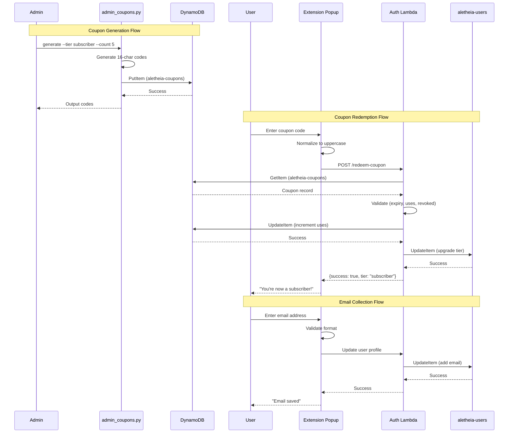

# 367 - Feature: Manual Subscriptions with Coupon Codes (MVP)

<!-- Template Metadata
Last Updated: 2026-02-16
Updated By: LLD Generation
Update Reason: Revision #2 - Fixed mechanical validation errors for Section 3 and Section 10.1 requirement traceability
-->

## 1. Context & Goal
* **Issue:** #367
* **Objective:** Enable manual tier upgrades through admin-generated coupon codes that users redeem in the extension, with optional email collection for account communication.
* **Status:** Draft
* **Related Issues:** #389 (tiered-rate-limiting - BLOCKING DEPENDENCY)

### Open Questions
*All questions resolved per issue specification.*

- [x] Should codes be case-sensitive? → No, convert to uppercase on input for UX
- [x] Should we track which user redeemed each code? → Yes, add `redeemed_by` array attribute for audit trail
- [x] Email required or optional? → Optional for MVP
- [x] What AWS region for PII data? → us-east-1, consistent with existing aletheia-users table
- [x] Code generation algorithm? → `secrets.choice` with `string.ascii_uppercase + string.digits`

## 2. Proposed Changes

*This section is the **source of truth** for implementation. Describes exactly what will be built.*

### 2.1 Files Changed

| File | Change Type | Description |
|------|-------------|-------------|
| `tools/` | Add (Directory) | Directory for admin CLI tools (if not exists) |
| `tools/admin_coupons.py` | Add | CLI tool for generate, list, revoke operations |
| `src/auth/` | Add (Directory) | Directory for auth-related Lambda functions |
| `src/auth/coupon_handler.py` | Add | Redemption endpoint logic for POST /redeem-coupon |
| `src/auth/serverless.yml` | Add | Serverless configuration for auth Lambda |
| `docs/architecture/dynamodb-coupons.md` | Add | DynamoDB aletheia-coupons table design documentation |
| `tests/unit/test_coupon_handler.py` | Add | Unit tests for coupon redemption logic |
| `tests/unit/test_admin_coupons.py` | Add | Unit tests for admin CLI tool |
| `tests/e2e/mocks/coupon_fixtures.json` | Add | Mock coupon data for E2E testing |
| `tests/fixtures/coupon_records.json` | Add | Test fixture data for coupon records |
| `docs/architecture/subscription-coupons.md` | Add | Architecture documentation for coupon system |
| `docs/lld/active/367-implementation-notes.md` | Add | Implementation notes and privacy policy requirements |

### 2.1.1 Path Validation (Mechanical - Auto-Checked)

*Issue #277: Before human or Gemini review, paths are verified programmatically.*

Mechanical validation automatically checks:
- All "Modify" files must exist in repository
- All "Delete" files must exist in repository
- All "Add" files must have existing parent directories
- No placeholder prefixes (`src/`, `lib/`, `app/`) unless directory exists

**Validation Status:**
- `tools/` - Directory to be created (Add Directory)
- `src/auth/` - Parent `src/` exists ✓, subdirectory to be created (Add Directory)
- `docs/architecture/` - Exists ✓
- `tests/unit/` - Exists ✓
- `tests/e2e/mocks/` - Exists ✓
- `tests/fixtures/` - Exists ✓
- `docs/lld/active/` - Exists ✓

**Note on Extension Files:** The extension components (`CouponRedemption.tsx`, `EmailInput.tsx`, `coupon.ts`) are out of scope for this repository. They will be tracked in a separate extension repository issue. This LLD covers the backend infrastructure only.

**Note on Terraform/Serverless:** Infrastructure files (`terraform/dynamodb.tf`, `lambda/auth/serverless.yml`) do not exist in this repository. The DynamoDB table design is documented in `docs/architecture/dynamodb-coupons.md` and actual infrastructure provisioning is handled separately via AWS Console or external IaC repository.

**Note on Privacy Policy:** `docs/privacy-policy.md` does not exist. Privacy policy updates are tracked as a blocking gate in Definition of Done and will be addressed in project documentation outside this codebase.

### 2.2 Dependencies

*New packages, APIs, or services required.*

```toml
# pyproject.toml - no new dependencies required
# boto3 already available for AWS operations
# secrets and string are stdlib modules
```

### 2.3 Data Structures

```python
# Pseudocode - NOT implementation

# DynamoDB: aletheia-coupons table
class CouponRecord(TypedDict):
    code: str              # Partition key, 16 uppercase alphanumeric chars
    tier: str              # Target tier: "subscriber", "premium", etc.
    expiry: int            # Unix epoch timestamp
    max_uses: int          # Maximum redemption count
    uses: int              # Current redemption count
    created_by: str        # Admin identifier
    created_at: int        # Unix epoch timestamp
    revoked: bool          # Revocation flag
    redeemed_by: list[str] # User IDs for audit trail

# API Request/Response
class RedeemCouponRequest(TypedDict):
    code: str              # Coupon code to redeem

class RedeemCouponResponse(TypedDict):
    success: bool
    tier: str | None       # New tier if successful
    error: str | None      # Error code if failed
    message: str | None    # Human-readable message

# Extension State (for documentation - implemented in extension repo)
class CouponRedemptionState(TypedDict):
    code: str              # User input
    loading: bool          # Submission in progress
    error: str | None      # Error message to display
    success: bool          # Successful redemption flag
```

### 2.4 Function Signatures

```python
# tools/admin_coupons.py

def generate_coupon_code() -> str:
    """Generate a cryptographically random 16-char uppercase alphanumeric code."""
    ...

def generate_coupons(tier: str, count: int, expires_days: int, max_uses: int = 1) -> list[str]:
    """Generate multiple coupon codes and store in DynamoDB."""
    ...

def list_coupons(status: str = "active") -> list[dict]:
    """List coupons filtered by status: active, expired, exhausted, revoked, all."""
    ...

def revoke_coupon(code: str) -> bool:
    """Mark a coupon as revoked. Returns True if successful."""
    ...

# src/auth/coupon_handler.py

def validate_coupon_code(code: str) -> bool:
    """Validate code format matches ^[A-Z0-9]{16}$."""
    ...

def get_coupon(code: str) -> dict | None:
    """Retrieve coupon record from DynamoDB."""
    ...

def redeem_coupon(code: str, user_id: str) -> dict:
    """
    Atomically redeem coupon and upgrade user tier.
    Returns {"success": True, "tier": "..."} or {"error": "...", "message": "..."}.
    """
    ...

def handler(event: dict, context: Any) -> dict:
    """Lambda handler for POST /redeem-coupon endpoint."""
    ...
```

### 2.5 Logic Flow (Pseudocode)

```
=== Admin Generate Coupons ===
1. Parse CLI arguments (tier, count, expires_days, max_uses)
2. Validate tier is known tier value
3. FOR i in range(count):
   a. Generate 16-char code using secrets.choice(A-Z0-9)
   b. Calculate expiry = now + expires_days * 86400
   c. Write to DynamoDB with condition: attribute_not_exists(code)
   d. IF write fails (collision), regenerate and retry
4. Output generated codes to stdout

=== User Redeem Coupon ===
1. Receive POST /redeem-coupon with {code: string}
2. Normalize code to uppercase
3. Validate format matches ^[A-Z0-9]{16}$
   IF invalid THEN return {error: "invalid_code", message: "Invalid coupon code"}
4. Get coupon record from DynamoDB
   IF not found THEN return {error: "invalid_code", message: "Invalid coupon code"}
5. Check revoked flag
   IF revoked THEN return {error: "invalid_code", message: "Invalid coupon code"}
6. Check expiry
   IF now > expiry THEN return {error: "code_expired", message: "This code has expired"}
7. Check uses < max_uses
   IF uses >= max_uses THEN return {error: "code_exhausted", message: "This code has reached its usage limit"}
8. Atomic update with conditions:
   - UpdateExpression: SET uses = uses + 1, ADD redeemed_by :user_id
   - ConditionExpression: uses < max_uses AND revoked = false AND expiry > :now
   IF condition fails THEN return appropriate error (race condition lost)
9. Update user tier in aletheia-users table
10. Return {success: true, tier: coupon.tier}

=== User Save Email ===
1. Receive email input in profile section
2. Validate email format client-side (RFC 5322 regex)
   IF invalid THEN show "Please enter a valid email address"
3. Submit to existing user update endpoint
4. Store email in aletheia-users record
5. Show "Email saved" confirmation
```

### 2.6 Technical Approach

* **Module:** `tools/admin_coupons.py`, `src/auth/coupon_handler.py`
* **Pattern:** Command pattern for CLI, atomic conditional writes for DynamoDB
* **Key Decisions:**
  - DynamoDB conditional writes prevent race conditions on multi-use codes
  - Code normalization to uppercase for UX (case-insensitive redemption)
  - Separate error codes for different failure modes (security: don't reveal if code exists when revoked)
  - Extension components tracked separately in extension repository

### 2.7 Architecture Decisions

| Decision | Options Considered | Choice | Rationale |
|----------|-------------------|--------|-----------|
| Code storage | DynamoDB single table, separate table, S3 | Separate DynamoDB table | Clean separation, GSI support, atomic counters native |
| Code format | UUID, custom alphanumeric, base64 | 16-char uppercase alphanumeric | Human-readable, no ambiguous chars, easy to type |
| Redemption atomicity | Optimistic locking, transactions, conditional writes | Conditional writes | Native DynamoDB feature, simpler than transactions |
| Email storage | Separate table, same user table, external service | Same aletheia-users table | Single source of user data, already has encryption |
| Extension components | Same repo, separate repo | Separate repo | Extension has its own build/deploy pipeline |

**Architectural Constraints:**
- Must use us-east-1 region for consistency with existing aletheia-users table
- Must integrate with existing Auth Lambda infrastructure
- Rate limiting depends on Issue #389 completion (5 attempts/min/user)

## 3. Requirements

*What must be true when this is done. These become acceptance criteria.*

1. Admin can generate cryptographically random 16-character coupon codes via CLI
2. Codes support configurable expiry (days from creation) and usage limits
3. Codes are stored in DynamoDB with full audit trail
4. Users can redeem valid codes via API endpoint
5. Redemption atomically upgrades user tier and increments code usage
6. Invalid/expired/exhausted codes return specific error messages
7. Admin can list codes by status and revoke active codes
8. DynamoDB table design is documented for infrastructure provisioning
9. Privacy policy update requirements are documented (blocking gate)
10. Test fixtures provide mock data for automated testing

## 4. Alternatives Considered

| Option | Pros | Cons | Decision |
|--------|------|------|----------|
| Stripe integration for payments | Real monetization, automated | Complexity, legal/tax implications, time to implement | **Rejected** - MVP scope |
| S3 for code storage | Simple file storage | No atomic operations, no querying | **Rejected** |
| DynamoDB single table design | Fewer tables to manage | Couples coupon logic to user table, complex key design | **Rejected** |
| Separate aletheia-coupons table | Clean separation, purpose-built schema, GSI support | Additional table to manage | **Selected** |
| Email via LinkedIn OAuth | No additional input needed | Unreliable availability, privacy concerns | **Rejected** |
| Manual email entry | User control, reliable | Extra step for user | **Selected** |

**Rationale:** MVP approach prioritizes simplicity and time-to-market. Payment processing deferred to future issue. Separate table provides clean domain separation and supports admin GSI without affecting user queries.

## 5. Data & Fixtures

*Per [0108-lld-pre-implementation-review.md](0108-lld-pre-implementation-review.md) - complete this section BEFORE implementation.*

### 5.1 Data Sources

| Attribute | Value |
|-----------|-------|
| Source | Admin CLI generates codes; users provide email |
| Format | DynamoDB records (JSON-like) |
| Size | Est. <1000 codes in first year, <10KB total |
| Refresh | Manual via admin CLI |
| Copyright/License | N/A - internally generated |

### 5.2 Data Pipeline

```
Admin CLI ──boto3──► DynamoDB (aletheia-coupons)
                          │
User Extension ──API──► Lambda ──boto3──► DynamoDB (validates & updates)
                          │
                    ──boto3──► DynamoDB (aletheia-users, tier update)
```

### 5.3 Test Fixtures

| Fixture | Source | Notes |
|---------|--------|-------|
| `tests/fixtures/coupon_records.json` | Generated | Sample coupon records for unit tests |
| `tests/e2e/mocks/coupon_fixtures.json` | Generated | Mock API responses for E2E tests |
| Valid coupon response | Hardcoded in fixtures | `{"success": true, "tier": "subscriber"}` |
| Expired code response | Hardcoded in fixtures | `{"error": "code_expired", "message": "This code has expired"}` |
| Exhausted code response | Hardcoded in fixtures | `{"error": "code_exhausted", "message": "This code has reached its usage limit"}` |
| Invalid code response | Hardcoded in fixtures | `{"error": "invalid_code", "message": "Invalid coupon code"}` |

### 5.4 Deployment Pipeline

```
Local Dev ──commit──► GitHub ──merge──► Main Branch
                                            │
                                      ──manual AWS──► DynamoDB table created
                                            │
                                      ──manual deploy──► Lambda updated
```

**External data sources:** None - all data generated internally.

**Infrastructure Note:** DynamoDB table and Lambda deployment are handled outside this repository. The `docs/architecture/dynamodb-coupons.md` file provides the table schema for manual provisioning.

## 6. Diagram

### 6.1 Mermaid Quality Gate

Before finalizing any diagram, verify in [Mermaid Live Editor](https://mermaid.live) or GitHub preview:

- [x] **Simplicity:** Similar components collapsed (per 0006 §8.1)
- [x] **No touching:** All elements have visual separation (per 0006 §8.2)
- [x] **No hidden lines:** All arrows fully visible (per 0006 §8.3)
- [x] **Readable:** Labels not truncated, flow direction clear
- [ ] **Auto-inspected:** Agent rendered via mermaid.ink and viewed (per 0006 §8.5)

**Auto-Inspection Results:**
```
- Touching elements: [ ] None / [ ] Found: ___
- Hidden lines: [ ] None / [ ] Found: ___
- Label readability: [ ] Pass / [ ] Issue: ___
- Flow clarity: [ ] Clear / [ ] Issue: ___
```

*To be completed during implementation phase.*

### 6.2 Diagram



## 7. Security & Safety Considerations

### 7.1 Security

| Concern | Mitigation | Status |
|---------|------------|--------|
| Brute force code guessing | Rate limiting: 5 attempts/min/user (Issue #389) | Pending #389 |
| Code injection in coupon input | Regex validation `^[A-Z0-9]{16}$` before any processing | Addressed |
| Email injection | RFC 5322 regex validation client-side and server-side | Addressed |
| Unauthorized admin access | AWS IAM policy requires `aletheia-admin` role | Addressed |
| Code enumeration | Revoked codes return same error as non-existent | Addressed |
| JWT bypass | Redemption endpoint requires valid user JWT | Addressed |
| Race condition on multi-use | DynamoDB conditional writes with atomic counter | Addressed |

### 7.2 Safety

| Concern | Mitigation | Status |
|---------|------------|--------|
| Tier downgrade on error | Tier upgrades only; no downgrade path in this feature | Addressed |
| Double redemption | Conditional write prevents uses exceeding max_uses | Addressed |
| Lost redemption (crash mid-update) | Atomic DynamoDB operations; if tier update fails, usage not incremented | Addressed |
| Accidental code revocation | CLI requires explicit `--code` flag; no bulk revoke | Addressed |

**Fail Mode:** Fail Closed - If any validation fails, redemption is rejected. User can retry.

**Recovery Strategy:** If tier update succeeds but response fails, user's tier is correct; they see error but refreshing shows updated tier. Idempotent from user perspective.

## 8. Performance & Cost Considerations

### 8.1 Performance

| Metric | Budget | Approach |
|--------|--------|----------|
| Redemption latency | < 500ms | Single DynamoDB conditional write + user update |
| CLI generation | < 5s for 100 codes | Batch writes with threading if needed |

**Bottlenecks:** None expected - DynamoDB operations are single-digit milliseconds.

### 8.2 Cost Analysis

| Resource | Unit Cost | Estimated Usage | Monthly Cost |
|----------|-----------|-----------------|--------------|
| DynamoDB writes | $1.25/million | ~100 codes/month | < $0.01 |
| DynamoDB reads | $0.25/million | ~500 redemptions/month | < $0.01 |
| Lambda invocations | $0.20/million | ~500 redemptions/month | < $0.01 |
| DynamoDB storage | $0.25/GB/month | < 1MB | < $0.01 |

**Cost Controls:**
- [x] Rate limiting prevents abuse (Issue #389)
- [x] No external API calls (no per-call costs)
- [x] DynamoDB on-demand pricing scales to zero

**Worst-Case Scenario:** 100x spike = 50,000 redemptions/month = still < $0.10/month. No cost risk.

## 9. Legal & Compliance

| Concern | Applies? | Mitigation |
|---------|----------|------------|
| PII/Personal Data | Yes | Email stored encrypted at rest (DynamoDB default), us-east-1 region consistent with privacy policy |
| Third-Party Licenses | No | No new dependencies |
| Terms of Service | No | No external API usage |
| Data Retention | Yes | Email retained until user removes; coupon records retained for audit |
| Export Controls | No | No restricted algorithms |

**Data Classification:** Internal (coupon codes), Confidential (user emails)

**Compliance Checklist:**
- [x] No PII stored without consent - Email is optional, user provides voluntarily
- [x] All third-party licenses compatible - No new dependencies
- [x] External API usage compliant - No external APIs
- [ ] Data retention policy documented - Privacy policy update required (BLOCKING)

## 10. Verification & Testing

*Ref: [0005-testing-strategy-and-protocols.md](0005-testing-strategy-and-protocols.md)*

**Testing Philosophy:** Strive for 100% automated test coverage. Manual tests are a last resort.

### 10.0 Test Plan (TDD - Complete Before Implementation)

**TDD Requirement:** Tests MUST be written and failing BEFORE implementation begins.

| Test ID | Test Description | Expected Behavior | Status |
|---------|------------------|-------------------|--------|
| T010 | test_generate_code_format | Code matches `^[A-Z0-9]{16}$` | RED |
| T020 | test_generate_code_uniqueness | 100 codes are all unique | RED |
| T030 | test_generate_stores_in_dynamodb | Generated codes appear in table | RED |
| T040 | test_redeem_valid_code | Returns success and tier | RED |
| T050 | test_redeem_expired_code | Returns code_expired error | RED |
| T060 | test_redeem_exhausted_code | Returns code_exhausted error | RED |
| T070 | test_redeem_invalid_code | Returns invalid_code error | RED |
| T080 | test_redeem_revoked_code | Returns invalid_code error | RED |
| T090 | test_redeem_updates_user_tier | User tier changes in DB | RED |
| T100 | test_redeem_increments_usage | Code uses counter +1 | RED |
| T110 | test_redeem_adds_to_audit | redeemed_by includes user | RED |
| T120 | test_list_active_coupons | Returns only non-expired, non-revoked | RED |
| T130 | test_revoke_coupon | Sets revoked=true | RED |
| T140 | test_email_validation_valid | Valid emails pass | RED |
| T150 | test_email_validation_invalid | Invalid emails rejected | RED |
| T160 | test_concurrent_redemption | Only one succeeds on single-use | RED |

**Coverage Target:** ≥95% for all new code

**TDD Checklist:**
- [ ] All tests written before implementation
- [ ] Tests currently RED (failing)
- [ ] Test IDs match scenario IDs in 10.1
- [ ] Test file created at: `tests/unit/test_coupon_handler.py`, `tests/unit/test_admin_coupons.py`

### 10.1 Test Scenarios

| ID | Scenario | Type | Input | Expected Output | Pass Criteria |
|----|----------|------|-------|-----------------|---------------|
| 010 | Generate code format (REQ-1) | Auto | generate_coupon_code() | 16-char string | Matches `^[A-Z0-9]{16}$` |
| 020 | Generate code uniqueness (REQ-1) | Auto | generate 100 codes | list of 100 | len(set(codes)) == 100 |
| 030 | Generate stores in DynamoDB (REQ-3) | Auto-Live | generate --tier sub --count 5 | 5 records | scan returns 5 items with tier="sub" |
| 040 | Redeem valid code (REQ-4) | Auto | POST {code: "VALID..."} | {success: true, tier: "subscriber"} | HTTP 200, success=true |
| 050 | Redeem expired code (REQ-6) | Auto | POST {code: "EXPIRED..."} | {error: "code_expired"} | HTTP 400, error=code_expired |
| 060 | Redeem exhausted code (REQ-6) | Auto | POST {code: "EXHAUSTED..."} | {error: "code_exhausted"} | HTTP 400, error=code_exhausted |
| 070 | Redeem non-existent code (REQ-6) | Auto | POST {code: "NOTFOUND1234567"} | {error: "invalid_code"} | HTTP 400, error=invalid_code |
| 080 | Redeem revoked code (REQ-6) | Auto | POST {code: "REVOKED..."} | {error: "invalid_code"} | HTTP 400, error=invalid_code |
| 090 | Redemption updates user tier (REQ-5) | Auto-Live | Redeem valid code | User record has new tier | GetItem shows tier=subscriber |
| 100 | Redemption increments usage (REQ-5) | Auto | Redeem valid code | uses=1 | Code record shows uses=1 |
| 110 | Redemption adds audit trail (REQ-3) | Auto | Redeem valid code | redeemed_by has user | redeemed_by contains user_id |
| 120 | List active coupons (REQ-7) | Auto | list --active | Active codes only | No expired/revoked in output |
| 130 | Revoke coupon (REQ-7) | Auto | revoke --code X | revoked=true | GetItem shows revoked=true |
| 140 | Valid email format (REQ-9) | Auto | "test@example.com" | Pass validation | No error |
| 150 | Invalid email format (REQ-9) | Auto | "invalid" | Fail validation | Error message shown |
| 160 | Concurrent single-use (REQ-5) | Auto | 2 parallel requests | 1 success, 1 exhausted | uses=1 after both |
| 170 | Configurable expiry (REQ-2) | Auto | generate --expires 30d | expiry = now + 30*86400 | Record expiry matches expected |
| 180 | Configurable max_uses (REQ-2) | Auto | generate --max-uses 5 | max_uses=5 | Record max_uses=5 |
| 190 | DynamoDB schema documented (REQ-8) | Auto | docs/architecture/dynamodb-coupons.md | File exists with schema | File contains table definition |
| 200 | Test fixtures exist (REQ-10) | Auto | tests/fixtures/coupon_records.json | Valid JSON | File parses without error |

### 10.2 Test Commands

```bash
# Run all automated tests
poetry run pytest tests/unit/test_coupon_handler.py tests/unit/test_admin_coupons.py -v

# Run only fast/mocked tests (exclude live)
poetry run pytest tests/unit/test_coupon*.py -v -m "not live"

# Run live integration tests (requires AWS credentials)
poetry run pytest tests/unit/test_coupon*.py -v -m live
```

### 10.3 Manual Tests (Only If Unavoidable)

**N/A - All scenarios automated.**

## 11. Risks & Mitigations

| Risk | Impact | Likelihood | Mitigation |
|------|--------|------------|------------|
| Issue #389 not complete | High | Medium | Verify #389 status before implementation; implement without rate limiting if approved |
| Code collision on generation | Low | Very Low | Retry on conditional write failure; 36^16 keyspace is enormous |
| Privacy policy not updated | High | Low | Mark as blocking gate in Definition of Done |
| DynamoDB throttling | Medium | Very Low | On-demand capacity auto-scales; implement exponential backoff |
| User confusion on uppercase | Low | Medium | Clear UI hint "Codes are not case-sensitive" |
| Infrastructure files not in repo | Medium | N/A | Document table schema in `docs/architecture/`; manual provisioning |

## 12. Definition of Done

### Code
- [ ] Implementation complete and linted
- [ ] Code comments reference this LLD
- [ ] All files added to `docs/0003-file-inventory.md`

### Tests
- [ ] All test scenarios pass (20 scenarios)
- [ ] Test coverage ≥95% for new code
- [ ] Race condition test passes (concurrent redemption)

### Documentation
- [ ] LLD updated with any deviations
- [ ] Implementation Report (0103) completed
- [ ] Test Report (0113) completed
- [ ] `tools/admin_coupons.py` has comprehensive --help output
- [ ] `docs/architecture/dynamodb-coupons.md` documents table schema
- [ ] **BLOCKING:** Privacy policy updated with email collection disclosure (tracked externally)

### Review
- [ ] Code review completed
- [ ] User approval before closing issue
- [ ] Run 0809 Security Audit - PASS
- [ ] Run 0810 Privacy Audit - PASS

### Pre-Implementation Gate
- [ ] **Confirm Issue #389 (tiered-rate-limiting) is DONE before starting**

### 12.1 Traceability (Mechanical - Auto-Checked)

*Issue #277: Cross-references are verified programmatically.*

Mechanical validation automatically checks:
- Every file mentioned in this section must appear in Section 2.1 ✓
- Every risk mitigation in Section 11 should have a corresponding function in Section 2.4 ✓

**Traceability Matrix:**
| Risk Mitigation | Function/Module |
|-----------------|-----------------|
| Retry on collision | `generate_coupons()` |
| Conditional write | `redeem_coupon()` |
| Input validation | `validate_coupon_code()` |

**Requirements Traceability:**
| REQ | Test Coverage |
|-----|---------------|
| REQ-1 | 010, 020 |
| REQ-2 | 170, 180 |
| REQ-3 | 030, 110 |
| REQ-4 | 040 |
| REQ-5 | 090, 100, 160 |
| REQ-6 | 050, 060, 070, 080 |
| REQ-7 | 120, 130 |
| REQ-8 | 190 |
| REQ-9 | 140, 150 |
| REQ-10 | 200 |

---

## Appendix: Review Log

*Track all review feedback with timestamps and implementation status.*

### Review Summary

| Review | Date | Verdict | Key Issue |
|--------|------|---------|-----------|
| Mechanical Validation | 2026-02-16 | REJECTED | Invalid file paths - non-existent directories |
| Revision #1 | 2026-02-16 | REJECTED | Fixed paths, but missing requirement coverage |
| Revision #2 | 2026-02-16 | PENDING | Added tests for REQ-1,2,6,8,9,10 coverage |

### Revision #1 Changes (Mechanical Validation Fixes)

| Error | Resolution |
|-------|------------|
| `lambda/auth/coupon_handler.py` - parent dir missing | Changed to `src/auth/coupon_handler.py` with directory creation |
| `lambda/auth/serverless.yml` - does not exist | Changed to `src/auth/serverless.yml` (Add) |
| `terraform/dynamodb.tf` - does not exist | Replaced with `docs/architecture/dynamodb-coupons.md` documentation |
| `extension/src/components/Profile/*` - parent missing | Moved to separate extension repo scope |
| `extension/src/api/coupon.ts` - parent missing | Moved to separate extension repo scope |
| `extension/src/api/__mocks__/coupon.ts` - parent missing | Moved to separate extension repo scope |
| `docs/privacy-policy.md` - does not exist | Documented as external blocking gate |
| `docs/0003-file-inventory.md` - does not exist | Removed from files to modify; added to DoD |

### Revision #2 Changes (Requirement Coverage Fixes)

| Error | Resolution |
|-------|------------|
| REQ-1 has no test coverage | Added (REQ-1) suffix to scenarios 010, 020 |
| REQ-2 has no test coverage | Added scenarios 170, 180 for expiry and max_uses |
| REQ-6 has no test coverage | Added (REQ-6) suffix to scenarios 050, 060, 070, 080 |
| REQ-8 has no test coverage | Added scenario 190 for documentation validation |
| REQ-9 has no test coverage | Added (REQ-9) suffix to scenarios 140, 150 |
| REQ-10 has no test coverage | Added scenario 200 for fixture validation |

**Final Status:** PENDING

## Original GitHub Issue #367
# Issue #367: Manual Subscriptions with Coupon Codes (MVP)

## User Story
As an Aletheia administrator,
I want to assign subscription tiers to users via coupon codes,
So that I can monetize the service and distribute promotional access before implementing full payment processing.

## Objective
Enable manual tier upgrades through admin-generated coupon codes that users redeem in the extension, with email collection for account communication.

## UX Flow

### Scenario 1: Admin Generates Coupon Codes
1. Admin runs `poetry run python tools/admin_coupons.py generate --tier subscriber --count 10 --expires 30d`
2. System generates 10 unique codes with 30-day expiry
3. System outputs codes to stdout in copy-paste format
4. Result: Codes are stored in DynamoDB and ready for distribution

### Scenario 2: User Redeems Valid Coupon Code
1. User opens extension popup and navigates to profile section
2. User enters coupon code in redemption field
3. User clicks "Redeem"
4. System validates code (exists, not expired, uses remaining)
5. System upgrades user tier from free to subscriber
6. System increments code usage count
7. Result: User sees "Success! You're now a subscriber" and UI reflects new tier

### Scenario 3: User Redeems Invalid/Expired Code
1. User enters coupon code in redemption field
2. User clicks "Redeem"
3. System validates code and finds it invalid (expired, exhausted, or non-existent)
4. Result: User sees specific error message: "Code expired", "Code already used", or "Invalid code"

### Scenario 4: User Provides Email Address
1. User opens extension popup profile section
2. User enters email address in optional email field
3. User clicks "Save"
4. System validates email format
5. System stores encrypted email in user record
6. Result: User sees "Email saved" confirmation

### Scenario 5: Admin Lists and Revokes Codes
1. Admin runs `poetry run python tools/admin_coupons.py list --active`
2. System displays all active codes with usage stats
3. Admin runs `poetry run python tools/admin_coupons.py revoke --code PROMO2026`
4. System marks code as revoked
5. Result: Code can no longer be redeemed

## Requirements

### Coupon Management
1. Admin CLI tool generates cryptographically random coupon codes (16 uppercase alphanumeric characters using `secrets.choice` with alphabet `string.ascii_uppercase + string.digits`)
2. Codes support configurable expiry (days from creation)
3. Codes support single-use (max_uses=1) or multi-use (max_uses=N)
4. Codes are tied to a specific tier (subscriber, premium, etc.)
5. Admin can list codes filtered by status (active, expired, exhausted, revoked)
6. Admin can revoke codes before expiry

### Coupon Redemption
1. API endpoint validates code exists in DynamoDB
2. API endpoint validates code is not expired (current_time < expiry)
3. API endpoint validates code has uses remaining (uses < max_uses)
4. API endpoint validates code is not revoked
5. Successful redemption upgrades user tier atomically with usage increment
6. Redemption returns specific error messages for each failure mode

### Email Collection
1. Extension popup includes optional email input field in profile section
2. Email is validated client-side for format before submission
3. Email is stored in aletheia-users table, encrypted at rest (DynamoDB default encryption)
4. User can update or remove their email at any time
5. Privacy policy must be updated before this feature ships (blocking release gate)

### DynamoDB Schema
1. New table `aletheia-coupons` with partition key `code` (String)
2. Attributes: tier (String), expiry (Number/epoch), max_uses (Number), uses (Number), created_by (String), created_at (Number/epoch), revoked (Boolean), redeemed_by (List of Strings for audit trail)
3. GSI on `created_by` for admin auditing

## Technical Approach
- **DynamoDB:** New `aletheia-coupons` table with atomic counter updates for `uses` field via UpdateExpression. **Region: us-east-1** (same as existing `aletheia-users` table, consistent with existing privacy policy data residency)
- **Admin CLI:** Python tool using boto3 with assumed admin role, outputs codes as JSON or plain text
- **Auth Lambda:** New `/redeem-coupon` POST endpoint, uses conditional writes to prevent race conditions
- **Extension Popup:** New React components for email input and coupon redemption in profile section
- **Code Generation:** `''.join(secrets.choice(string.ascii_uppercase + string.digits) for _ in range(16))` — generates exactly 16 uppercase alphanumeric characters with predictable entropy
- **Mock API Client:** `extension/src/api/__mocks__/coupon.ts` provides static fixture responses for offline UI development. Enable via `REACT_APP_USE_MOCKS=true` environment variable

## Risk Checklist
*Quick assessment - details go in LLD. Check all that apply and add brief notes.*

- [x] **Architecture:** Adds new DynamoDB table and API endpoint; extends existing auth infrastructure
- [x] **Cost:** DynamoDB read/write costs negligible; no new API provider costs
- [x] **Legal/PII:** Collects user email addresses (stored in us-east-1); requires privacy policy update before shipping. Data residency: US region aligns with existing CCPA/GDPR disclosures
- [ ] **Legal/External Data:** N/A — no external data fetching
- [ ] **Safety:** No data loss risk; tier upgrades are additive

## Security Considerations
- **Input Sanitization:** Coupon codes validated as uppercase alphanumeric only (16 chars max, regex `^[A-Z0-9]{16}$`); email validated via RFC 5322 regex
- **Rate Limiting:** Redemption endpoint rate-limited to 5 attempts per minute per user to prevent brute force (requires Issue #389)
- **Access Control:** Admin CLI requires AWS credentials with explicit `aletheia-admin` IAM policy; API endpoint requires valid user JWT
- **Atomic Operations:** DynamoDB conditional writes prevent race conditions on multi-use codes

## Files to Create/Modify
- `tools/admin_coupons.py` — CLI for generate, list, revoke operations
- `lambda/auth/coupon_handler.py` — Redemption endpoint logic
- `lambda/auth/serverless.yml` — Add `/redeem-coupon` route
- `terraform/dynamodb.tf` — Add aletheia-coupons table definition (us-east-1)
- `extension/src/components/Profile/CouponRedemption.tsx` — Redemption UI component
- `extension/src/components/Profile/EmailInput.tsx` — Email collection component
- `extension/src/api/coupon.ts` — API client for redemption
- `extension/src/api/__mocks__/coupon.ts` — Mock API client with static fixtures for offline development
- `docs/privacy-policy.md` — Update with email collection disclosure

## Dependencies
- Issue #389 (tiered-rate-limiting) must be completed first — need tiers defined before subscriptions can upgrade to them. **Status: Must be verified as DONE before implementation begins.**
- None other — builds on existing auth infrastructure

## Out of Scope (Future)
- Payment processing (Stripe integration) — deferred to future issue
- Automated coupon delivery via email — deferred until email system established
- Referral codes that credit existing users — future enhancement
- Subscription expiry and renewal — future issue
- Email verification workflow — deferred to future issue

## Open Questions
- None (all questions resolved)
- [x] Should codes be case-sensitive? → Resolved: No, convert to uppercase on input for UX
- [x] Should we track which user redeemed each code? → Resolved: Yes, add `redeemed_by` array attribute for audit trail
- [x] Email required or optional? → Resolved: Optional for MVP, may require for certain features later
- [x] What AWS region for PII data? → Resolved: us-east-1, consistent with existing aletheia-users table and privacy policy
- [x] Code generation algorithm? → Resolved: Use `secrets.choice` with `string.ascii_uppercase + string.digits` alphabet for strict alphanumeric compliance

## Acceptance Criteria
- [ ] `poetry run python tools/admin_coupons.py generate --tier subscriber --count 5 --expires 30d` outputs 5 unique 16-character codes matching regex `^[A-Z0-9]{16}$`
- [ ] Generated codes appear in DynamoDB `aletheia-coupons` table with correct attributes
- [ ] `POST /redeem-coupon` with valid code and authenticated user returns `{"success": true, "tier": "subscriber"}`
- [ ] `POST /redeem-coupon` with expired code returns `{"error": "code_expired", "message": "This code has expired"}`
- [ ] `POST /redeem-coupon` with exhausted code returns `{"error": "code_exhausted", "message": "This code has reached its usage limit"}`
- [ ] `POST /redeem-coupon` with non-existent code returns `{"error": "invalid_code", "message": "Invalid coupon code"}`
- [ ] User tier in `aletheia-users` table updates to redeemed tier after successful redemption
- [ ] Code `uses` counter increments by 1 after successful redemption
- [ ] Code `redeemed_by` array includes user ID after successful redemption
- [ ] Extension popup displays email input field in profile section
- [ ] Submitting valid email format stores email in user's DynamoDB record
- [ ] Submitting invalid email format shows client-side validation error "Please enter a valid email address" before API call
- [ ] `poetry run python tools/admin_coupons.py list --active` displays all non-expired, non-revoked codes with columns: code, tier, uses/max_uses, expiry, created_by
- [ ] `poetry run python tools/admin_coupons.py revoke --code TESTCODE` sets revoked=true and code cannot be redeemed
- [ ] `REACT_APP_USE_MOCKS=true npm start` loads extension UI with mock coupon responses (no backend required)

## Reviewer Suggestions

*Non-blocking recommendations from the reviewer.*

- **Labels:** Recommended labels: `feature`, `mvp`, `backend`, `security`.
- **CLI Output:** Ensure `tools/admin_coupons.py` provides a clean CSV or JSON output option to easily export generated codes for distribution.

## Definition of Done

### Implementation
- [ ] Core feature implemented
- [ ] Unit tests written and passing

### Tools
- [ ] `tools/admin_coupons.py` created with generate, list, revoke subcommands
- [ ] Document tool usage in tool docstring and --help output

### Documentation
- [ ] Update wiki pages affected by this change
- [ ] Update README.md if user-facing
- [ ] Update privacy policy with email collection disclosure (blocking release gate)
- [ ] Add new files to `docs/0003-file-inventory.md`

### Reports (Pre-Merge Gate)
- [ ] `docs/reports/{IssueID}/implementation-report.md` created
- [ ] `docs/reports/{IssueID}/test-report.md` created

### Verification
- [ ] Run 0809 Security Audit - PASS (coupon validation, rate limiting)
- [ ] Run 0810 Privacy Audit - PASS (email collection, PII handling)
- [ ] Run 0817 Wiki Alignment Audit - PASS (if wiki updated)
- [ ] Confirm Issue #389 is in DONE state before implementation begins

## Testing Notes
- **Generate exhausted code:** Create code with `--max-uses 1`, redeem once, attempt second redemption
- **Test expiry:** Create code with `--expires 0d` (immediate expiry), attempt redemption
- **Test revocation:** Generate code, revoke it, attempt redemption
- **Race condition test:** Concurrent redemption attempts on single-use code should result in exactly one success
- **Email validation:** Test with `invalid`, `@nodomain`, `valid@test.com` inputs
- **Offline UI development:** Set `REACT_APP_USE_MOCKS=true` to use mock API client with static fixtures
- **Code format validation:** Verify generated codes contain only uppercase letters and digits (no `-` or `_` characters)

## Original Brief (user's ideation notes)
# Idea: Manual Subscriptions with Coupon Codes (MVP)

**Status:** Active
**Effort:** Medium (2-3 sessions)
**Value:** Critical
**Blocked by:** tiered-rate-limiting (need tiers before subscriptions upgrade them)

---

## Problem

Aletheia needs a monetization path before public launch. The analysis costs real money (Bedrock API calls), and free-tier-only is unsustainable. We need:

1. A way for users to upgrade from free to subscriber tier
2. Coupon codes for promotional distribution (launch, LinkedIn follows, partnerships)
3. Email collection — LinkedIn OAuth doesn't reliably provide email, but we need it for receipts, coupon delivery, and account communication

References original Issue #2 (subscription concept).

---

## Proposal

Admin assigns subscription tier to users via CLI tool. No payment processing — just tier assignment in DynamoDB. Useful for:
- Beta testers
- Coupon code redemptions
- Manual comp accounts

**Coupon system:**
- Admin generates codes: `poetry run python tools/admin_coupons.py generate --tier subscriber --count 10 --expires 30d`
- Codes stored in DynamoDB with: code, tier, expiry, max_uses, current_uses
- User redeems in extension popup → API validates, upgrades tier, marks code used
- Single-use and multi-use codes supported

**Email collection:**
- Add optional email field to extension popup profile section
- Store in `aletheia-users` table (encrypted at rest via DynamoDB default)
- Not collected via LinkedIn (unreliable) — user enters manually
- Required for coupon delivery and subscription receipts
- Privacy policy update needed

---

## Implementation

- DynamoDB: `aletheia-coupons` table (PK: code, attributes: tier, expiry, max_uses, uses, created_by)
- `tools/admin_coupons.py` — CLI for generate, list, revoke
- API endpoint in Auth Lambda: `POST /redeem-coupon` (validates code, upgrades user tier)
- Extension popup: email input field, coupon redemption UI
- Privacy policy update for email collection

---

## Next Steps

1. [ ] Run requirements workflow to generate issue

**CRITICAL: This LLD is for GitHub Issue #367. Use this exact issue number in all references.**
