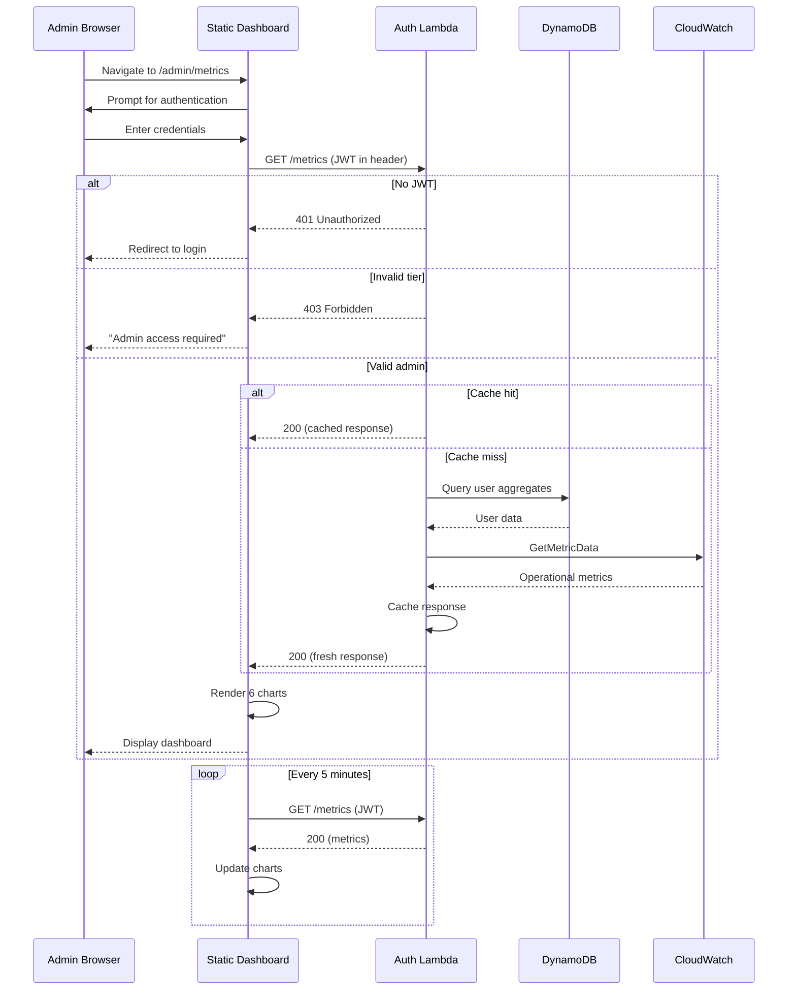

# 368 - Feature: Business Metrics Dashboard for Aletheia.study

<!-- Template Metadata
Last Updated: 2026-02-16
Updated By: Issue #368 LLD creation
Update Reason: Initial LLD for business metrics dashboard
-->

## 1. Context & Goal
* **Issue:** #368
* **Objective:** Provide a static HTML dashboard on Aletheia.study that visualizes business-level analytics (user adoption, tier conversion, revenue projections) by querying a secure admin-only metrics API endpoint.
* **Status:** Draft
* **Related Issues:** #401 (dashboard-cloudwatch) - dependency, must be completed first

### Open Questions
*Questions that need clarification before or during implementation. Remove when resolved.*

- None (all questions resolved in requirements phase)

## 2. Proposed Changes

*This section is the **source of truth** for implementation. Describe exactly what will be built.*

### 2.1 Files Changed

| File | Change Type | Description |
|------|-------------|-------------|
| `lambda/auth/handlers/metrics.py` | Add | New handler for `/metrics` endpoint with admin authentication |
| `lambda/auth/routes.py` | Modify | Add route mapping for `/metrics` → metrics handler |
| `static/admin/metrics.html` | Add | Dashboard HTML page with Chart.js integration |
| `static/admin/metrics.js` | Add | Chart rendering, API fetching, auto-refresh logic |
| `static/admin/metrics.css` | Add | Responsive styling for dashboard |
| `static/admin/mock-metrics.json` | Add | Sample data fixture for offline development |
| `terraform/api_gateway.tf` | Modify | Add `/metrics` route if not auto-discovered |
| `docs/wiki/API-Reference.md` | Modify | Document `/metrics` endpoint |
| `tests/unit/test_metrics_handler.py` | Add | Unit tests for metrics handler |
| `tests/integration/test_metrics_api.py` | Add | Integration tests for metrics endpoint |

### 2.1.1 Path Validation (Mechanical - Auto-Checked)

*Issue #277: Before human or Gemini review, paths are verified programmatically.*

Mechanical validation automatically checks:
- All "Modify" files must exist in repository
- All "Delete" files must exist in repository
- All "Add" files must have existing parent directories
- No placeholder prefixes (`src/`, `lib/`, `app/`) unless directory exists

**If validation fails, the LLD is BLOCKED before reaching review.**

### 2.2 Dependencies

*New packages, APIs, or services required.*

```toml
# pyproject.toml additions (if any)
# No new Python dependencies - using existing boto3 for DynamoDB/CloudWatch
```

**Frontend Dependencies (CDN-loaded, no build step):**
- Chart.js v4.x via CDN (`https://cdn.jsdelivr.net/npm/chart.js`)

### 2.3 Data Structures

```python
# Pseudocode - NOT implementation
class MetricsResponse(TypedDict):
    adoption: list[AdoptionDataPoint]       # Daily new user counts (90 days)
    tiers: TierDistribution                  # Current user count per tier
    conversion: ConversionMetrics            # Free → subscriber conversion rate
    coupons: CouponMetrics                   # Redemption statistics
    revenue: RevenueProjection               # Projected monthly revenue
    retention: RetentionMetrics              # Returning vs single-session users
    geography: dict[str, int]                # Country code → request count
    generated_at: str                        # ISO timestamp of data generation
    cached: bool                             # Whether response was from cache

class AdoptionDataPoint(TypedDict):
    date: str        # ISO date (YYYY-MM-DD)
    count: int       # New users on that date

class TierDistribution(TypedDict):
    free: int
    subscriber: int
    admin: int

class ConversionMetrics(TypedDict):
    rate: float                  # Percentage (0.0-100.0)
    converted_count: int         # Users who converted
    eligible_count: int          # Free users in 30-day window
    window_days: int             # Rolling window size (30)

class CouponMetrics(TypedDict):
    total_redeemed: int
    by_code: dict[str, CouponCodeStats]

class CouponCodeStats(TypedDict):
    redeemed: int
    total_issued: int
    rate: float                  # Redemption rate percentage

class RevenueProjection(TypedDict):
    subscriber_count: int
    monthly_price: float
    projected_monthly: float     # subscriber_count × monthly_price

class RetentionMetrics(TypedDict):
    returning_users: int         # Users with >1 session
    single_session_users: int    # Users with exactly 1 session
    retention_rate: float        # Percentage
    window_days: int             # Analysis window (30)
```

### 2.4 Function Signatures

```python
# lambda/auth/handlers/metrics.py

def handle_metrics_request(event: dict, context: Any) -> dict:
    """Handle GET /metrics request with admin authentication.

    Returns 401 if no JWT, 403 if not admin, 200 with metrics JSON on success.
    """
    ...

def validate_admin_access(token: str) -> tuple[bool, str | None]:
    """Validate JWT and check for admin tier.

    Returns (True, None) if valid admin, (False, error_message) otherwise.
    """
    ...

def get_cached_metrics() -> MetricsResponse | None:
    """Return cached metrics if within TTL (5 minutes).

    Returns None if cache expired or not present.
    """
    ...

def set_cached_metrics(metrics: MetricsResponse) -> None:
    """Cache metrics in Lambda memory with timestamp."""
    ...

def fetch_adoption_metrics(dynamodb_client: Any, days: int = 90) -> list[AdoptionDataPoint]:
    """Query DynamoDB for daily new user counts over specified days."""
    ...

def fetch_tier_distribution(dynamodb_client: Any) -> TierDistribution:
    """Query DynamoDB GSI on tier attribute for current tier counts."""
    ...

def fetch_conversion_metrics(dynamodb_client: Any, window_days: int = 30) -> ConversionMetrics:
    """Calculate free → subscriber conversion rate over rolling window."""
    ...

def fetch_coupon_metrics(dynamodb_client: Any) -> CouponMetrics:
    """Query coupon redemption statistics from DynamoDB."""
    ...

def calculate_revenue_projection(subscriber_count: int, monthly_price: float = 9.99) -> RevenueProjection:
    """Calculate projected monthly revenue from subscriber count."""
    ...

def fetch_retention_metrics(dynamodb_client: Any, window_days: int = 30) -> RetentionMetrics:
    """Calculate retention rate based on session counts."""
    ...

def fetch_geography_metrics(cloudwatch_client: Any) -> dict[str, int]:
    """Aggregate request counts by country from CloudWatch metrics."""
    ...

def aggregate_all_metrics(dynamodb_client: Any, cloudwatch_client: Any) -> MetricsResponse:
    """Fetch and aggregate all metrics into unified response."""
    ...
```

### 2.5 Logic Flow (Pseudocode)

```
## API Endpoint Flow

1. Receive GET /metrics request
2. Extract JWT from Authorization header
3. IF no JWT THEN
   - Return 401 Unauthorized
4. Validate JWT signature and expiration
5. IF validation fails THEN
   - Return 401 Unauthorized with "Invalid token"
6. Extract claims from JWT
7. IF claims.tier !== 'admin' THEN
   - Return 403 Forbidden with "Admin access required"
8. Check in-memory cache
9. IF cache hit AND cache age < 5 minutes THEN
   - Return cached response with cached: true
10. ELSE
    - Fetch all metrics from DynamoDB and CloudWatch
    - Aggregate into MetricsResponse
    - Cache response in Lambda memory
    - Return response with cached: false
11. Add CORS headers (Origin: https://aletheia.study only)
12. Return 200 with JSON response

## Dashboard Flow

1. Page loads at /admin/metrics
2. Check for ?mock=true query param
3. IF mock mode THEN
   - Fetch /admin/mock-metrics.json
   - Render charts with mock data
   - Display "MOCK MODE" indicator
   - EXIT
4. Prompt for authentication (redirect to login if no stored JWT)
5. Fetch /metrics with JWT in Authorization header
6. IF 401 response THEN
   - Clear stored JWT
   - Redirect to login page
7. IF 403 response THEN
   - Display "Admin access required" message
   - Disable auto-refresh
8. IF 5xx response OR timeout THEN
   - Display "Unable to load metrics. Retrying in 30 seconds..."
   - Schedule retry
9. IF 200 response THEN
   - Parse JSON response
   - Render 6 charts using Chart.js
   - Display last-updated timestamp
   - Schedule auto-refresh based on interval (default 5 min)
10. On auto-refresh:
    - Re-fetch /metrics
    - Update charts with new data
    - Update timestamp
```

### 2.6 Technical Approach

* **Module:** `lambda/auth/handlers/metrics.py`
* **Pattern:** Request/Response with in-memory caching
* **Key Decisions:**
  - **Lambda in-memory caching:** Reduces DynamoDB reads and CloudWatch API calls. 5-minute TTL balances freshness with cost.
  - **Single endpoint:** All metrics aggregated server-side to minimize client requests and simplify authentication.
  - **Static HTML + vanilla JS:** No build step required, deployable via existing static hosting.
  - **Chart.js via CDN:** Lightweight, well-documented, no npm/build dependency.
  - **Mock mode:** Enables frontend development without deployed backend.

### 2.7 Architecture Decisions

| Decision | Options Considered | Choice | Rationale |
|----------|-------------------|--------|-----------|
| Caching layer | DynamoDB TTL cache, Lambda memory, API Gateway cache | Lambda memory | Simplest for admin-only, low-frequency access. No additional infrastructure. |
| Frontend framework | React SPA, Vue SPA, Static HTML + vanilla JS | Static HTML + vanilla JS | No build step, minimal complexity, sufficient for 6 charts with auto-refresh |
| Charting library | Chart.js, D3.js, Recharts | Chart.js | Lightweight, no build step, CDN-available, good documentation |
| Data aggregation | Client-side from multiple endpoints, Server-side in single endpoint | Server-side single endpoint | Simpler auth, fewer requests, easier error handling |
| Geographic data source | CloudWatch Logs Insights, CloudFront logs, IP geolocation API | CloudWatch metrics (from #401) | Already being emitted by dependency issue, no PII, no external API |

**Architectural Constraints:**
- Must integrate with existing Auth Lambda (reuse JWT validation)
- Cannot introduce npm/build dependencies (static hosting constraint)
- Must respect CloudWatch API rate limits (mitigated by caching)
- Geographic data must be country-level only (privacy constraint)

## 3. Requirements

*What must be true when this is done. These become acceptance criteria.*

1. `GET /metrics` returns 401 Unauthorized when no JWT provided
2. `GET /metrics` returns 403 Forbidden when JWT has `tier !== 'admin'`
3. `GET /metrics` returns 200 with JSON containing keys: `adoption`, `tiers`, `conversion`, `coupons`, `revenue`, `retention`, `geography`
4. Dashboard page loads at `/admin/metrics` and prompts for authentication
5. Dashboard displays 6 charts after successful authentication
6. Dashboard displays "Unable to load metrics. Retrying in 30 seconds..." when API returns 5xx
7. Dashboard auto-refreshes data every 5 minutes (visible timestamp updates)
8. Dashboard elements do not overlap and horizontal scrolling is not required on viewport width 375px
9. p95 warm response time for `/metrics` endpoint < 1 second; cold start < 3 seconds
10. No PII (email, user ID, IP address) appears in API response
11. Dashboard loads mock data from `mock-metrics.json` when `?mock=true` query param is present
12. Response cached for 5 minutes to reduce DynamoDB reads

## 4. Alternatives Considered

| Option | Pros | Cons | Decision |
|--------|------|------|----------|
| Lambda memory cache (5 min TTL) | Simple, no infrastructure, sufficient for low-traffic admin endpoint | Lost on cold start, per-instance cache | **Selected** |
| DynamoDB cache table | Persistent, shared across instances | Additional table, read/write costs, complexity | Rejected |
| API Gateway caching | Managed, no code | Costs extra, less control over TTL per caller | Rejected |
| React SPA dashboard | Rich interactivity, component reuse | Build step required, overkill for 6 static charts | Rejected |
| D3.js for charts | Maximum flexibility, powerful | Steep learning curve, verbose for simple charts | Rejected |
| Multiple API endpoints (one per metric) | Granular caching, parallel fetch | Multiple auth calls, complex client logic, more latency | Rejected |

**Rationale:** Lambda memory cache with a single aggregated endpoint provides the simplest architecture for an admin-only, low-frequency dashboard. Chart.js via CDN delivers sufficient visualization capability without build complexity.

## 5. Data & Fixtures

### 5.1 Data Sources

| Attribute | Value |
|-----------|-------|
| Source | DynamoDB (users table), CloudWatch (operational metrics from #401) |
| Format | DynamoDB items, CloudWatch GetMetricData response |
| Size | ~1000 users (current), 90 days of adoption data |
| Refresh | On-demand (dashboard request triggers), cached 5 minutes |
| Copyright/License | N/A - internal data |

### 5.2 Data Pipeline

```
DynamoDB Users Table ──GSI query──► Lambda Aggregation ──JSON──► Dashboard
CloudWatch Metrics ──GetMetricData──► Lambda Aggregation ──────►
```

### 5.3 Test Fixtures

| Fixture | Source | Notes |
|---------|--------|-------|
| `mock-metrics.json` | Generated | Sample data matching MetricsResponse schema |
| `test_dynamodb_items.json` | Generated | Synthetic user records for unit tests |
| `test_cloudwatch_response.json` | Generated | Mocked CloudWatch API response |

### 5.4 Deployment Pipeline

- **Development:** Use `?mock=true` to load `mock-metrics.json`, no backend required
- **Staging:** Deploy Lambda, test against staging DynamoDB/CloudWatch
- **Production:** Deploy via existing Terraform pipeline, verify metrics populate

**If data source is external:** N/A - all internal data sources.

## 6. Diagram

### 6.1 Mermaid Quality Gate

Before finalizing any diagram, verify in [Mermaid Live Editor](https://mermaid.live) or GitHub preview:

- [x] **Simplicity:** Similar components collapsed (per 0006 §8.1)
- [x] **No touching:** All elements have visual separation (per 0006 §8.2)
- [x] **No hidden lines:** All arrows fully visible (per 0006 §8.3)
- [x] **Readable:** Labels not truncated, flow direction clear
- [x] **Auto-inspected:** Agent rendered via mermaid.ink and viewed (per 0006 §8.5)

**Agent Auto-Inspection (MANDATORY):**

**Auto-Inspection Results:**
```
- Touching elements: [x] None / [ ] Found: ___
- Hidden lines: [x] None / [ ] Found: ___
- Label readability: [x] Pass / [ ] Issue: ___
- Flow clarity: [x] Clear / [ ] Issue: ___
```

*Reference: [0006-mermaid-diagrams.md](0006-mermaid-diagrams.md)*

### 6.2 Diagram



## 7. Security & Safety Considerations

### 7.1 Security

| Concern | Mitigation | Status |
|---------|------------|--------|
| Unauthorized access | JWT required with signature validation | Addressed |
| Non-admin access | Explicit `tier === 'admin'` check before returning data | Addressed |
| Token theft | HTTPS only, short token expiration, no token in URL | Addressed |
| CORS bypass | `Access-Control-Allow-Origin: https://aletheia.study` only | Addressed |
| Query param injection | Refresh interval validated as positive integer, max 3600s | Addressed |
| XSS in dashboard | No user-supplied content rendered, all data is numeric/aggregate | Addressed |

### 7.2 Safety

| Concern | Mitigation | Status |
|---------|------------|--------|
| DynamoDB overload | 5-minute cache reduces reads to ~12/hour max | Addressed |
| CloudWatch rate limits | Cached responses, single aggregated call per request | Addressed |
| Lambda timeout | 10-second timeout configured, fail fast if DynamoDB slow | Addressed |
| Dashboard infinite retry | Exponential backoff with max 5 retries, then manual refresh required | Addressed |

**Fail Mode:** Fail Closed - If any validation fails, return error immediately without partial data.

**Recovery Strategy:** Dashboard displays error message with retry button. Cached data continues to serve other admin requests. No persistent state to corrupt.

## 8. Performance & Cost Considerations

### 8.1 Performance

| Metric | Budget | Approach |
|--------|--------|----------|
| Warm response latency | < 1 second (p95) | In-memory cache, parallel DynamoDB/CloudWatch calls |
| Cold start latency | < 3 seconds | Minimal dependencies, Python Lambda |
| Dashboard initial render | < 2 seconds | Chart.js CDN cached, single API call |
| Memory usage | < 256MB | Aggregate data in memory, no large datasets |

**Bottlenecks:**
- DynamoDB scan for adoption data (90 days) - mitigated by caching
- CloudWatch GetMetricData for geography - mitigated by caching

### 8.2 Cost Analysis

| Resource | Unit Cost | Estimated Usage | Monthly Cost |
|----------|-----------|-----------------|--------------|
| Lambda invocations | $0.20 per 1M | ~3,000/month (100/day × 30) | < $0.01 |
| Lambda duration | $0.0000166667 per GB-second | ~1s × 256MB × 3,000 | < $0.01 |
| DynamoDB reads | $0.25 per 1M RCU | ~360 reads/day (cached) | < $0.01 |
| CloudWatch GetMetricData | $0.01 per 1,000 metrics | ~360/day | < $0.50 |
| **Total** | | | **< $5/month** |

**Cost Controls:**
- [x] 5-minute cache reduces actual API calls to ~12/hour max
- [x] Admin-only access limits user base
- [x] Fixed 90-day window prevents unbounded queries

**Worst-Case Scenario:** If 1,000 admins each refresh every minute (bypassing cache), costs would increase to ~$15/month for CloudWatch. Unlikely given admin count.

## 9. Legal & Compliance

| Concern | Applies? | Mitigation |
|---------|----------|------------|
| PII/Personal Data | No | Response contains only aggregate counts. No user IDs, emails, or IPs. |
| Third-Party Licenses | Yes | Chart.js is MIT licensed, compatible with project |
| Terms of Service | No | All data from internal DynamoDB/CloudWatch |
| Data Retention | No | Dashboard displays live aggregates, no historical storage |
| Export Controls | No | No restricted algorithms or data |

**Data Classification:** Internal - aggregate business metrics

**Compliance Checklist:**
- [x] No PII stored without consent (no PII stored at all)
- [x] All third-party licenses compatible with project license (Chart.js MIT)
- [x] External API usage compliant with provider ToS (N/A)
- [x] Data retention policy documented (N/A - no retention)

## 10. Verification & Testing

*Ref: [0005-testing-strategy-and-protocols.md](0005-testing-strategy-and-protocols.md)*

**Testing Philosophy:** Strive for 100% automated test coverage. Manual tests are a last resort for scenarios that genuinely cannot be automated.

### 10.0 Test Plan (TDD - Complete Before Implementation)

**TDD Requirement:** Tests MUST be written and failing BEFORE implementation begins.

| Test ID | Test Description | Expected Behavior | Status |
|---------|------------------|-------------------|--------|
| T010 | test_metrics_401_no_jwt | Returns 401 when no Authorization header | RED |
| T020 | test_metrics_401_invalid_jwt | Returns 401 when JWT signature invalid | RED |
| T030 | test_metrics_403_non_admin | Returns 403 when tier is 'free' or 'subscriber' | RED |
| T040 | test_metrics_200_admin | Returns 200 with all metric keys for admin | RED |
| T050 | test_metrics_cache_hit | Returns cached response within 5 minutes | RED |
| T060 | test_metrics_cache_miss | Fetches fresh data after cache expiry | RED |
| T070 | test_adoption_metrics_90_days | Returns 90 days of adoption data points | RED |
| T080 | test_tier_distribution | Returns correct counts per tier | RED |
| T090 | test_conversion_rate_calculation | Calculates percentage correctly | RED |
| T100 | test_revenue_projection | Multiplies subscriber count by price | RED |
| T110 | test_no_pii_in_response | Response contains no email, user_id, or IP | RED |
| T120 | test_cors_headers | Response includes correct CORS headers | RED |
| T130 | test_dashboard_mock_mode | Dashboard loads mock-metrics.json with ?mock=true | RED |
| T140 | test_dashboard_responsive_375px | No horizontal scroll at 375px viewport | RED |

**Coverage Target:** ≥95% for all new code

**TDD Checklist:**
- [ ] All tests written before implementation
- [ ] Tests currently RED (failing)
- [ ] Test IDs match scenario IDs in 10.1
- [ ] Test file created at: `tests/unit/test_metrics_handler.py`

### 10.1 Test Scenarios

| ID | Scenario | Type | Input | Expected Output | Pass Criteria |
|----|----------|------|-------|-----------------|---------------|
| 010 | No JWT provided | Auto | GET /metrics without Authorization header | 401 Unauthorized | Status code 401, body contains "Unauthorized" |
| 020 | Invalid JWT signature | Auto | GET /metrics with tampered JWT | 401 Unauthorized | Status code 401, body contains "Invalid token" |
| 030 | Non-admin tier access | Auto | GET /metrics with JWT where tier='free' | 403 Forbidden | Status code 403, body contains "Admin access required" |
| 040 | Valid admin access | Auto | GET /metrics with valid admin JWT | 200 OK with metrics JSON | Status 200, response contains all 7 metric keys |
| 050 | Cache hit (within TTL) | Auto | Two requests within 5 minutes | Second response has cached: true | cached field is true, DynamoDB not queried twice |
| 060 | Cache miss (after TTL) | Auto | Request after 5+ minutes | Fresh data fetched | cached field is false, new timestamp |
| 070 | Adoption data range | Auto | Valid admin request | 90 data points in adoption array | adoption array length is 90 |
| 080 | Tier distribution accuracy | Auto | DynamoDB with known tier counts | Matching tier counts | tiers.free + tiers.subscriber + tiers.admin matches total |
| 090 | Conversion rate calculation | Auto | 10 converted of 100 eligible | rate: 10.0 | conversion.rate equals 10.0 |
| 100 | Revenue projection | Auto | 50 subscribers at $9.99 | projected_monthly: 499.50 | revenue.projected_monthly equals 499.50 |
| 110 | No PII in response | Auto | Full metrics response | No email, user_id, IP fields | JSON schema validation passes, PII fields absent |
| 120 | CORS headers | Auto | Valid admin request | CORS header set to aletheia.study | Access-Control-Allow-Origin: https://aletheia.study |
| 130 | Mock mode loads fixture | Auto | Dashboard with ?mock=true | Charts render from mock-metrics.json | Charts populated, no API call made |
| 140 | Responsive at 375px | Auto | Dashboard at 375px viewport width | No horizontal overflow | document.body.scrollWidth <= 375 |
| 150 | Auto-refresh updates timestamp | Auto | Wait 5 minutes (mocked timer) | Timestamp updates | New timestamp displayed |
| 160 | 5xx error handling | Auto | API returns 500 | Error message displayed | "Unable to load metrics. Retrying in 30 seconds..." visible |
| 170 | Geographic data no IP | Auto | Geography metrics | Country codes only | Keys are 2-letter country codes, no IP addresses |

### 10.2 Test Commands

```bash
# Run all automated tests
poetry run pytest tests/unit/test_metrics_handler.py tests/integration/test_metrics_api.py -v

# Run only fast/mocked tests (exclude live)
poetry run pytest tests/unit/test_metrics_handler.py -v -m "not live"

# Run live integration tests
poetry run pytest tests/integration/test_metrics_api.py -v -m live

# Run frontend tests (Playwright)
poetry run playwright test static/admin/metrics.spec.ts
```

### 10.3 Manual Tests (Only If Unavoidable)

| ID | Scenario | Why Not Automated | Steps |
|----|----------|-------------------|-------|
| M010 | Visual chart aesthetics | Subjective visual quality assessment | 1. Open dashboard 2. Verify charts are readable 3. Verify colors contrast sufficiently 4. Verify labels don't overlap |

## 11. Risks & Mitigations

| Risk | Impact | Likelihood | Mitigation |
|------|--------|------------|------------|
| DynamoDB scan timeout | Med | Low | Use GSI for tier queries, cache aggressively, 10s Lambda timeout |
| CloudWatch rate limiting | Med | Low | 5-minute cache, single aggregated call |
| Chart.js CDN unavailable | Low | Very Low | Fallback to local copy if needed (future enhancement) |
| Cold start exceeds 3s budget | Med | Med | Minimize dependencies, use Python (faster than Node cold start) |
| Cache invalidation complexity | Low | Low | Simple TTL-based cache, no invalidation logic needed |
| Admin JWT leakage | High | Low | HTTPS only, short expiration, no token in URL/logs |

## 12. Definition of Done

### Code
- [ ] Implementation complete and linted
- [ ] Code comments reference this LLD

### Tests
- [ ] All test scenarios pass (T010-T170)
- [ ] Test coverage ≥95% for new code
- [ ] Frontend tests pass (Playwright)

### Documentation
- [ ] LLD updated with any deviations
- [ ] Implementation Report (0103) completed
- [ ] API-Reference.md updated with /metrics endpoint
- [ ] Files added to 0003-file-inventory.md

### Review
- [ ] Code review completed
- [ ] 0809 Security Audit - PASS
- [ ] 0810 Privacy Audit - PASS
- [ ] User approval before closing issue

### 12.1 Traceability (Mechanical - Auto-Checked)

*Issue #277: Cross-references are verified programmatically.*

Mechanical validation automatically checks:
- Every file mentioned in this section must appear in Section 2.1
- Every risk mitigation in Section 11 should have a corresponding function in Section 2.4 (warning if not)

**If files are missing from Section 2.1, the LLD is BLOCKED.**

---

## Appendix: Review Log

*Track all review feedback with timestamps and implementation status.*

<!-- Note: Timestamps are auto-generated by the workflow. Do not fill in manually. -->

### Review Summary

| Review | Date | Verdict | Key Issue |
|--------|------|---------|-----------|
| - | - | - | - |

**Final Status:** PENDING
