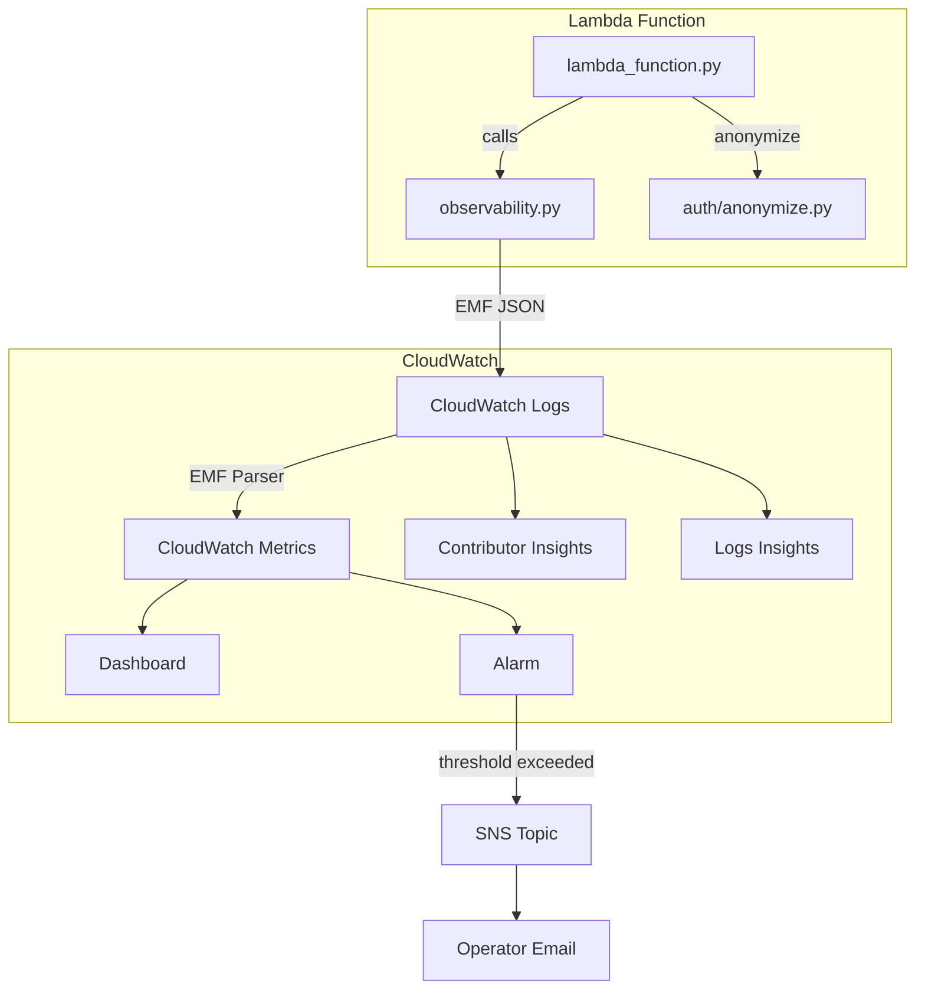

# 369 - Feature: CloudWatch Usage Dashboard (MVP)

<!-- Template Metadata
Last Updated: 2026-02-16
Updated By: Issue #369 LLD revision
Update Reason: Fixed mechanical validation errors - corrected file paths to match actual repository structure
-->

## 1. Context & Goal
* **Issue:** #369
* **Objective:** Provide real-time operational visibility into Aletheia API usage through privacy-preserving CloudWatch metrics and dashboards using Embedded Metric Format (EMF).
* **Status:** Draft
* **Related Issues:** #XXX (tiered-rate-limiting - blocking dependency)

### Open Questions
*Questions that need clarification before or during implementation. Remove when resolved.*

- [ ] Confirm the exact issue number for tiered-rate-limiting dependency (referenced as #XXX in requirements)
- [ ] Confirm SNS topic email address for operator notifications

## 2. Proposed Changes

*This section is the **source of truth** for implementation. Describe exactly what will be built.*

### 2.1 Files Changed

| File | Change Type | Description |
|------|-------------|-------------|
| `src/observability.py` | Modify | Add EMF structured logging helpers and metric emission functions |
| `src/auth/__init__.py` | Modify | Add anonymization import and metric emission calls |
| `src/auth/anonymize.py` | Add | New module with user ID hashing function |
| `src/lambda_function.py` | Modify | Add EMF structured logging for Latency, ErrorRate, BedrockCostEstimate metrics in response handling |
| `docs/runbooks/` | Add (Directory) | Directory for operational runbooks |
| `docs/runbooks/cloudwatch-dashboard.json` | Add | Dashboard widget definitions for Aletheia-Usage |
| `docs/runbooks/provision-cloudwatch.sh` | Add | Dashboard creation, SNS topic, and alarm provisioning commands |
| `docs/runbooks/sns-alarm.json` | Add | SNS topic and CloudWatch alarm configuration |
| `docs/runbooks/contributor-insights-top-talkers.json` | Add | Contributor Insights rule for abuse detection |
| `docs/runbooks/logs-insights-active-users.sql` | Add | Logs Insights query for unique user count |
| `tests/unit/test_anonymize.py` | Add | Unit tests for anonymization function |
| `tests/unit/test_metrics_emf.py` | Add | Unit tests for EMF metric emission and fail-open behavior |

### 2.1.1 Path Validation (Mechanical - Auto-Checked)

*Issue #277: Before human or Gemini review, paths are verified programmatically.*

Mechanical validation automatically checks:
- All "Modify" files must exist in repository
- All "Delete" files must exist in repository
- All "Add" files must have existing parent directories
- No placeholder prefixes (`src/`, `lib/`, `app/`) unless directory exists

**Validation Results:**
- `src/observability.py` - EXISTS ✓
- `src/auth/__init__.py` - EXISTS ✓ (directory exists with `__init__.py` implied)
- `src/auth/anonymize.py` - Parent `src/auth/` EXISTS ✓
- `src/lambda_function.py` - EXISTS ✓
- `docs/runbooks/` - Will be created as new directory ✓
- All files under `docs/runbooks/` - Parent created in same changeset ✓
- `tests/unit/test_anonymize.py` - Parent `tests/unit/` EXISTS ✓
- `tests/unit/test_metrics_emf.py` - Parent `tests/unit/` EXISTS ✓

**If validation fails, the LLD is BLOCKED before reaching review.**

### 2.2 Dependencies

*New packages, APIs, or services required.*

```toml
# pyproject.toml additions (if any)
# No new dependencies - uses standard library (hashlib, json, logging)
# AWS SDK (boto3) already present for Lambda environment
```

**AWS Services Required:**
- CloudWatch Metrics (via EMF)
- CloudWatch Logs (existing)
- CloudWatch Contributor Insights
- CloudWatch Alarms
- SNS (Simple Notification Service)

### 2.3 Data Structures

```python
# Pseudocode - NOT implementation

class EMFMetricPayload(TypedDict):
    """CloudWatch Embedded Metric Format payload structure."""
    _aws: EMFMetadata  # CloudWatch EMF metadata block
    Tier: str  # free | subscriber | admin
    Window: Optional[str]  # hourly | daily | monthly
    RequestCount: Optional[int]  # 1 per request
    CapUtilization: Optional[float]  # 0-100 percentage
    CapDenied: Optional[int]  # 1 when denied
    BedrockCostEstimate: Optional[float]  # USD value
    Latency: Optional[float]  # milliseconds
    StatusCode: Optional[int]  # HTTP status code

class EMFMetadata(TypedDict):
    """CloudWatch EMF _aws block structure."""
    Timestamp: int  # Unix timestamp in milliseconds
    CloudWatchMetrics: List[CloudWatchMetricDefinition]

class CloudWatchMetricDefinition(TypedDict):
    """Metric definition within EMF payload."""
    Namespace: str  # "Aletheia/API"
    Dimensions: List[List[str]]  # [["Tier"], ["Tier", "Window"]]
    Metrics: List[MetricSpec]

class MetricSpec(TypedDict):
    """Individual metric specification."""
    Name: str  # Metric name
    Unit: str  # Count, Percent, Milliseconds, None (for currency)
```

### 2.4 Function Signatures

```python
# src/auth/anonymize.py
def anonymize_user_id(user_id: str) -> str:
    """
    Hash user ID for privacy-preserving logging.

    Returns 12-character hex string derived from SHA-256 hash.
    Used for pattern correlation in logs without exposing PII.
    """
    ...

# src/observability.py
def emit_request_metric(tier: str) -> None:
    """
    Emit RequestCount metric via EMF with Tier dimension.
    Fail-open: catches all exceptions, logs warning, continues.
    """
    ...

def emit_cap_utilization_metric(tier: str, window: str, utilization_percent: float) -> None:
    """
    Emit CapUtilization metric via EMF with Tier and Window dimensions.
    Fail-open: catches all exceptions, logs warning, continues.
    """
    ...

def emit_cap_denied_metric(tier: str) -> None:
    """
    Emit CapDenied metric via EMF when request rejected.
    Fail-open: catches all exceptions, logs warning, continues.
    """
    ...

def log_anonymized_user(user_id: str) -> None:
    """
    Log anonymized user ID to CloudWatch Logs for pattern analysis.
    Uses 12-char truncated SHA-256 hash.
    """
    ...

def emit_latency_metric(latency_ms: float) -> None:
    """
    Emit Latency metric via EMF in milliseconds.
    Fail-open: catches all exceptions, logs warning, continues.
    """
    ...

def emit_error_rate_metric(status_code: int) -> None:
    """
    Emit ErrorRate metric via EMF for 4xx/5xx responses.
    Fail-open: catches all exceptions, logs warning, continues.
    """
    ...

def emit_bedrock_cost_metric(estimated_cost_usd: float) -> None:
    """
    Emit BedrockCostEstimate metric via EMF with USD value.
    Fail-open: catches all exceptions, logs warning, continues.
    """
    ...

# Internal helper
def _emit_emf_log(payload: dict) -> None:
    """
    Write EMF-formatted JSON to stdout for CloudWatch Logs ingestion.
    CloudWatch Logs agent parses _aws block and extracts metrics.
    """
    ...
```

### 2.5 Logic Flow (Pseudocode)

```
=== Request Processing Flow (Auth Module) ===

1. Receive API request
2. Extract user_id from auth token
3. Determine tier (free/subscriber/admin)
4. TRY:
   a. Emit RequestCount metric with Tier dimension
   b. Log anonymized_user_id (12-char hash)
   CATCH any exception:
   a. Log warning "Metric emission failed: {error}"
   b. Continue processing (fail-open)
5. Check rate cap for tier/window
6. IF cap exceeded THEN:
   a. TRY emit CapDenied metric
   b. CATCH: log warning, continue
   c. Return 429 response
7. Calculate cap utilization percentage
8. TRY emit CapUtilization metric
   CATCH: log warning, continue
9. Continue to handler

=== Response Processing Flow (Lambda Function) ===

1. Handler completes, response ready
2. Calculate latency_ms = end_time - start_time
3. TRY:
   a. Emit Latency metric
   b. IF status_code >= 400:
      - Emit ErrorRate metric with StatusCode dimension
   c. IF bedrock_call_made:
      - Calculate estimated_cost from token counts
      - Emit BedrockCostEstimate metric
   CATCH any exception:
   a. Log warning "Response metric emission failed: {error}"
   b. Continue (fail-open)
4. Return response to client

=== EMF Emission Pattern ===

1. Build payload dict with metric values
2. Add _aws block with:
   - Timestamp (Unix ms)
   - Namespace: "Aletheia/API"
   - Dimensions list
   - Metrics list with names and units
3. Serialize to JSON
4. Write to stdout (CloudWatch Logs captures)
5. CloudWatch Logs agent extracts metrics from _aws block
```

### 2.6 Technical Approach

* **Module:** `src/observability.py` (centralized EMF helpers), `src/auth/` (anonymization), `src/lambda_function.py` (response metrics)
* **Pattern:** Embedded Metric Format (EMF) - structured JSON logging
* **Key Decisions:**
  - EMF via stdout instead of PutMetricData API calls to avoid HTTP latency impact
  - 12-character truncated SHA-256 for user anonymization (sufficient entropy, readable)
  - Fail-open pattern: all metric code in try/except, failures logged but don't block requests
  - High-cardinality user analysis via Logs Insights, not custom metrics (cost control)
  - Contributor Insights for abuse detection (log-based, not metric-based)
  - Infrastructure files placed in `docs/runbooks/` to align with existing documentation structure

### 2.7 Architecture Decisions

| Decision | Options Considered | Choice | Rationale |
|----------|-------------------|--------|-----------|
| Metric emission method | PutMetricData API, EMF via logs | EMF via logs | Non-blocking, no HTTP latency, automatic batching |
| User identification | Raw user ID, full SHA-256, truncated hash | 12-char truncated SHA-256 | Privacy-preserving, sufficient for pattern correlation, readable in logs |
| Active user counting | Custom metric, Logs Insights query | Logs Insights query | CloudWatch metrics cannot calculate cardinality; avoids high-cardinality cost |
| Abuse detection | Per-user custom metrics, Contributor Insights | Contributor Insights | Avoids $0.30/metric/month cost explosion for user-level metrics |
| Failure handling | Fail-closed, fail-open | Fail-open | Observability must never block user requests |
| Infrastructure file location | `infrastructure/` (new), `docs/runbooks/` (existing) | `docs/runbooks/` | Aligns with existing repository structure; no new top-level directory needed |

**Architectural Constraints:**
- Must integrate with existing `src/observability.py` module and Lambda function
- Must not add significant latency to API requests
- Must comply with Aletheia privacy policy (no PII in metrics/logs)
- Must stay within reasonable CloudWatch costs (<$10/month at MVP scale)

## 3. Requirements

*What must be true when this is done. These become acceptance criteria.*

1. RequestCount metric emitted with Tier dimension on every API request via EMF
2. CapUtilization metric emitted with percentage value (0-100) when cap checked via EMF
3. CapDenied metric emitted with count=1 when request rejected for cap exceeded via EMF
4. BedrockCostEstimate metric emitted with estimated USD value per request via EMF
5. ErrorRate metric emitted with HTTP status code dimension for 4xx/5xx responses via EMF
6. Latency metric emitted with response time in milliseconds via EMF
7. All metric emission code wrapped in try/except; metric failure returns gracefully without blocking request
8. API request completes successfully even when CloudWatch is unreachable (fail-open verified)
9. CloudWatch dashboard "Aletheia-Usage" exists after running `provision-cloudwatch.sh`
10. Dashboard JSON passes `jq .` validation before provisioning
11. Dashboard contains widgets: RequestVolume, TierBreakdown, CapUtilization, CostTrend, ErrorRate, LatencyPercentiles
12. CloudWatch alarm "Aletheia-CapDenialSpike" triggers when CapDenied > 10 in 1 hour
13. SNS notification sent to configured email when alarm triggers
14. Anonymized user ID (12-char hex hash) logged to CloudWatch Logs on each request
15. Contributor Insights rule "Aletheia-TopTalkers" created and queries logs for high-volume users
16. Logs Insights query `logs-insights-active-users.sql` returns unique user count for specified time period
17. No PII (email, name, request content) appears in any metric dimension, value, or log field
18. No custom metric dimensions contain user IDs

## 4. Alternatives Considered

| Option | Pros | Cons | Decision |
|--------|------|------|----------|
| PutMetricData API | Direct, real-time | HTTP round-trip latency, can block requests | **Rejected** |
| EMF via stdout | Non-blocking, batched, no latency impact | Requires structured JSON format | **Selected** |
| Per-user custom metrics | Real-time per-user visibility | High cardinality cost explosion ($0.30/metric/month × users) | **Rejected** |
| Logs Insights for user analysis | No per-user metric cost, flexible queries | Not real-time, requires manual queries | **Selected** |
| Raw user IDs in logs | Easy debugging | PII exposure, privacy violation | **Rejected** |
| Truncated SHA-256 hash | Privacy-preserving, pattern correlation | Requires resolution tool for moderation | **Selected** |
| New `infrastructure/` directory | Clear separation of concerns | Creates new top-level directory, diverges from existing structure | **Rejected** |
| `docs/runbooks/` directory | Uses existing directory pattern, co-locates with operational docs | Mixes code and docs | **Selected** |

**Rationale:** EMF provides the best balance of non-blocking performance and CloudWatch integration. Per-user analysis via Logs Insights avoids the cost explosion of high-cardinality custom metrics while still enabling abuse pattern detection. Using `docs/runbooks/` aligns with the existing repository structure without creating new top-level directories.

## 5. Data & Fixtures

### 5.1 Data Sources

| Attribute | Value |
|-----------|-------|
| Source | Lambda runtime (request context, response data) |
| Format | Python objects → JSON (EMF format) |
| Size | ~500 bytes per metric log entry |
| Refresh | Real-time (per request) |
| Copyright/License | N/A - internally generated operational data |

### 5.2 Data Pipeline

```
Lambda Request ──emit_emf_log()──► CloudWatch Logs ──EMF Parser──► CloudWatch Metrics
                                          │
                                          ├──► Logs Insights Queries
                                          │
                                          └──► Contributor Insights Rules
```

### 5.3 Test Fixtures

| Fixture | Source | Notes |
|---------|--------|-------|
| Mock request context | Generated | Simulates Lambda event with tier info |
| Sample EMF payloads | Generated | Valid EMF JSON structures for validation |
| Test user IDs | Generated | Synthetic IDs for anonymization tests |

### 5.4 Deployment Pipeline

1. Code changes deployed via standard Lambda deployment
2. `provision-cloudwatch.sh` creates/updates CloudWatch dashboard via CLI
3. `provision-cloudwatch.sh` creates SNS topic and CloudWatch alarm
4. Dashboard JSON validated via `jq` before `put-dashboard` call
5. Contributor Insights rule created via `put-insight-rules`

**If data source is external:** N/A - all data is internally generated.

## 6. Diagram

### 6.1 Mermaid Quality Gate

Before finalizing any diagram, verify in [Mermaid Live Editor](https://mermaid.live) or GitHub preview:

- [x] **Simplicity:** Similar components collapsed (per 0006 §8.1)
- [x] **No touching:** All elements have visual separation (per 0006 §8.2)
- [x] **No hidden lines:** All arrows fully visible (per 0006 §8.3)
- [x] **Readable:** Labels not truncated, flow direction clear
- [ ] **Auto-inspected:** Agent rendered via mermaid.ink and viewed (per 0006 §8.5)

**Auto-Inspection Results:**
```
- Touching elements: [ ] None / [ ] Found: ___
- Hidden lines: [ ] None / [ ] Found: ___
- Label readability: [ ] Pass / [ ] Issue: ___
- Flow clarity: [ ] Clear / [ ] Issue: ___
```

*Reference: [0006-mermaid-diagrams.md](0006-mermaid-diagrams.md)*

### 6.2 Diagram



## 7. Security & Safety Considerations

### 7.1 Security

| Concern | Mitigation | Status |
|---------|------------|--------|
| PII in metrics | User IDs hashed (SHA-256 truncated) before any logging | Addressed |
| Injection via user ID | SHA-256 hash produces safe hex output only | Addressed |
| Unauthorized dashboard access | IAM policies restrict CloudWatch access to operators | Addressed |
| Metric dimension injection | Tier values validated against enum (free/subscriber/admin) | Addressed |
| Log data exposure | No request content or user PII logged | Addressed |

### 7.2 Safety

| Concern | Mitigation | Status |
|---------|------------|--------|
| Metric failure blocks requests | All metric code wrapped in try/except (fail-open) | Addressed |
| CloudWatch unavailability | Fail-open pattern ensures API continues serving | Addressed |
| Cost runaway from high cardinality | Per-user analysis via Logs Insights, not custom metrics | Addressed |
| Dashboard provisioning failure | JSON validated via `jq` before `put-dashboard` | Addressed |

**Fail Mode:** Fail Open - Observability failures must never impact API availability. Users should never experience degraded service due to metric emission issues.

**Recovery Strategy:** If CloudWatch ingestion fails, metrics are lost for that period but API continues. No retry logic for metrics - they are fire-and-forget.

## 8. Performance & Cost Considerations

### 8.1 Performance

| Metric | Budget | Approach |
|--------|--------|----------|
| Metric emission latency | < 1ms | EMF via stdout (no HTTP call) |
| Memory overhead | < 1MB | JSON serialization only |
| CPU overhead | Negligible | String hashing and JSON formatting |

**Bottlenecks:** None expected. EMF writes to stdout are synchronous but extremely fast.

### 8.2 Cost Analysis

| Resource | Unit Cost | Estimated Usage | Monthly Cost |
|----------|-----------|-----------------|--------------|
| CloudWatch custom metrics | $0.30/metric/month | ~18 metric streams (6 types × 3 tiers) | ~$5.40 |
| CloudWatch Logs ingestion | $0.50/GB | ~1GB (500 bytes × 2M requests) | ~$0.50 |
| CloudWatch Logs storage | $0.03/GB | ~1GB (default retention) | ~$0.03 |
| Contributor Insights | $0.02/rule/month | 1 rule | ~$0.02 |
| Logs Insights queries | $0.005/GB scanned | ~10 queries/month × 1GB | ~$0.05 |
| SNS notifications | $0.50/100K | ~100/month | ~$0.01 |

**Total estimated monthly cost:** ~$6.00

**Cost Controls:**
- [x] No per-user custom metrics (avoids high-cardinality explosion)
- [x] Use Logs Insights for ad-hoc analysis instead of real-time metrics
- [x] Default CloudWatch retention (15 months) - no custom retention cost

**Worst-Case Scenario:** At 10x traffic (20M requests/month), costs scale to ~$10/month for logs. At 100x (200M requests), ~$55/month. Metric cost stays flat regardless of request volume.

## 9. Legal & Compliance

| Concern | Applies? | Mitigation |
|---------|----------|------------|
| PII/Personal Data | Yes | User IDs hashed before logging; no email/name/content in metrics |
| Third-Party Licenses | No | Uses only AWS services and Python stdlib |
| Terms of Service | Yes | CloudWatch usage within AWS ToS |
| Data Retention | Yes | CloudWatch default retention (15 months); no PII retained |
| Export Controls | No | No restricted algorithms or data |

**Data Classification:** Internal (operational metrics only, no user content)

**Compliance Checklist:**
- [x] No PII stored - user IDs anonymized via SHA-256
- [x] All third-party licenses compatible (AWS SDK, Python stdlib)
- [x] External API usage compliant with AWS ToS
- [x] Data retention follows CloudWatch defaults

## 10. Verification & Testing

### 10.0 Test Plan (TDD - Complete Before Implementation)

**TDD Requirement:** Tests MUST be written and failing BEFORE implementation begins.

| Test ID | Test Description | Expected Behavior | Status |
|---------|------------------|-------------------|--------|
| T010 | test_anonymize_user_id_returns_12_char_hex | Hash output is 12 lowercase hex characters | RED |
| T020 | test_anonymize_user_id_deterministic | Same input produces same output | RED |
| T030 | test_anonymize_user_id_no_pii_leakage | Output does not contain input email | RED |
| T040 | test_emit_request_metric_valid_emf | Output is valid EMF JSON with _aws block | RED |
| T050 | test_emit_request_metric_fail_open | Exception in metric code does not propagate | RED |
| T060 | test_emit_cap_denied_metric | CapDenied metric emitted with count=1 | RED |
| T070 | test_emit_latency_metric_milliseconds | Latency value in correct unit | RED |
| T080 | test_emit_error_rate_metric_4xx | ErrorRate emitted for 4xx status | RED |
| T090 | test_emit_error_rate_metric_5xx | ErrorRate emitted for 5xx status | RED |
| T100 | test_emit_bedrock_cost_metric | Cost value emitted as float | RED |
| T110 | test_emf_namespace_correct | Namespace is "Aletheia/API" | RED |
| T120 | test_emf_dimensions_correct | Tier dimension present on all metrics | RED |

**Coverage Target:** ≥95% for all new code

**TDD Checklist:**
- [ ] All tests written before implementation
- [ ] Tests currently RED (failing)
- [ ] Test IDs match scenario IDs in 10.1
- [ ] Test file created at: `tests/unit/test_anonymize.py`, `tests/unit/test_metrics_emf.py`

### 10.1 Test Scenarios

| ID | Scenario | Type | Input | Expected Output | Pass Criteria |
|----|----------|------|-------|-----------------|---------------|
| 010 | Anonymize valid email | Auto | "test@example.com" | 12-char hex string | len() == 12, all chars in 0-9a-f |
| 020 | Anonymize deterministic | Auto | Same email twice | Identical outputs | output1 == output2 |
| 030 | Anonymize no PII leakage | Auto | "test@example.com" | Hash output | "test" not in output, "@" not in output |
| 040 | EMF valid structure | Auto | Mock request | JSON with _aws block | JSON parseable, _aws.CloudWatchMetrics exists |
| 050 | EMF fail-open | Auto | Mock CloudWatch failure | No exception raised | Function returns normally |
| 060 | CapDenied emission | Auto | Cap exceeded event | EMF with CapDenied=1 | Metric value is 1 |
| 070 | Latency metric unit | Auto | 150.5ms latency | EMF with Latency=150.5 | Unit is Milliseconds |
| 080 | ErrorRate 4xx | Auto | 404 response | EMF with ErrorRate, StatusCode=404 | Metric emitted |
| 090 | ErrorRate 5xx | Auto | 500 response | EMF with ErrorRate, StatusCode=500 | Metric emitted |
| 100 | Bedrock cost emission | Auto | $0.0025 cost | EMF with BedrockCostEstimate=0.0025 | Value is float |
| 110 | Namespace validation | Auto | Any metric | Namespace="Aletheia/API" | Namespace field correct |
| 120 | Tier dimension present | Auto | free/subscriber/admin | Tier in dimensions | Dimension included |
| 130 | Dashboard JSON valid | Auto | cloudwatch-dashboard.json | Valid JSON | jq exits 0 |
| 140 | Dashboard widgets complete | Auto | cloudwatch-dashboard.json | All 6 widgets | Widgets array has 6 items |
| 150 | Alarm threshold correct | Auto | sns-alarm.json | Threshold=10, Period=3600 | Values match spec |

### 10.2 Test Commands

```bash
# Run all automated tests
poetry run pytest tests/unit/test_anonymize.py tests/unit/test_metrics_emf.py -v

# Run only fast/mocked tests (exclude live)
poetry run pytest tests/unit/test_anonymize.py tests/unit/test_metrics_emf.py -v -m "not live"

# Validate dashboard JSON
jq . docs/runbooks/cloudwatch-dashboard.json

# Validate alarm JSON
jq . docs/runbooks/sns-alarm.json
```

### 10.3 Manual Tests (Only If Unavoidable)

| ID | Scenario | Why Not Automated | Steps |
|----|----------|-------------------|-------|
| M010 | SNS email delivery | Requires real email account and human verification | 1. Trigger alarm via `aws cloudwatch set-alarm-state` 2. Check operator email inbox 3. Verify notification received |
| M020 | Dashboard visual verification | Widget layout requires visual inspection | 1. Open CloudWatch console 2. Navigate to Aletheia-Usage dashboard 3. Verify all 6 widgets render correctly |
| M030 | Contributor Insights rule execution | Requires log data accumulation | 1. Generate test traffic 2. Wait for log ingestion 3. Run Contributor Insights rule 4. Verify top talkers output |

## 11. Risks & Mitigations

| Risk | Impact | Likelihood | Mitigation |
|------|--------|------------|------------|
| CloudWatch EMF parsing changes | Med | Low | Pin to documented EMF schema; monitor CloudWatch changelog |
| Metric cardinality exceeds budget | Med | Low | User analysis via Logs Insights only; validated in cost section |
| Dashboard JSON syntax error | Low | Med | jq validation in provision-cloudwatch.sh before put-dashboard |
| SNS notification not received | Med | Low | Manual test with set-alarm-state during deployment verification |
| Hash collision enables tracking evasion | Low | Very Low | 12-char hex (48 bits) sufficient for pattern correlation; not security-critical |
| Lambda stdout buffer overflow | Low | Very Low | EMF logs are small (~500 bytes); Lambda stdout buffer is 4KB |

## 12. Definition of Done

### Code
- [ ] Implementation complete and linted
- [ ] Code comments reference this LLD (#369)
- [ ] All metric emission wrapped in try/except

### Tests
- [ ] All test scenarios pass
- [ ] Test coverage ≥95% for new code
- [ ] Fail-open behavior verified under mock failures

### Documentation
- [ ] LLD updated with any deviations
- [ ] Implementation Report (0103) completed
- [ ] Test Report (0113) completed
- [ ] Files added to `docs/0003-file-inventory.md`

### Infrastructure
- [ ] Dashboard JSON validated via jq
- [ ] provision-cloudwatch.sh creates dashboard successfully
- [ ] SNS topic created
- [ ] CloudWatch alarm created
- [ ] Contributor Insights rule created

### Verification
- [ ] Run 0809 Security Audit - PASS
- [ ] Run 0810 Privacy Audit - PASS
- [ ] `aws cloudwatch list-metrics --namespace Aletheia/API` shows no user ID dimensions

### Review
- [ ] Code review completed
- [ ] User approval before closing issue

### 12.1 Traceability (Mechanical - Auto-Checked)

*Issue #277: Cross-references are verified programmatically.*

Mechanical validation automatically checks:
- Every file mentioned in this section must appear in Section 2.1
- Every risk mitigation in Section 11 should have a corresponding function in Section 2.4 (warning if not)

**Files verified in Section 2.1:**
- `src/observability.py` ✓
- `src/auth/anonymize.py` ✓
- `src/lambda_function.py` ✓
- `docs/runbooks/cloudwatch-dashboard.json` ✓
- `docs/runbooks/provision-cloudwatch.sh` ✓
- `docs/runbooks/sns-alarm.json` ✓
- `docs/runbooks/contributor-insights-top-talkers.json` ✓
- `docs/runbooks/logs-insights-active-users.sql` ✓

---

## Appendix: Review Log

*Track all review feedback with timestamps and implementation status.*

### Review Summary

| Review | Date | Verdict | Key Issue |
|--------|------|---------|-----------|
| Mechanical Validation | 2026-02-16 | REJECTED | Invalid file paths - files marked Modify don't exist, directories marked Add don't have parents |

**Final Status:** PENDING
