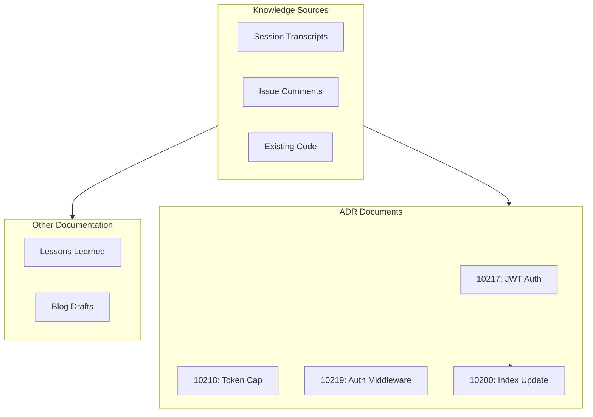

# 370 - Feature: Documentation Catchup: ADRs, Lessons Learned, and Blog Drafts

<!-- Template Metadata
Last Updated: 2026-02-16
Updated By: Issue #370 LLD revision
Update Reason: Fixed Tier 1 Worktree Scope Violation - blog drafts now created in local docs/drafts/ directory; updated test scenarios accordingly
-->

## 1. Context & Goal
* **Issue:** #370
* **Objective:** Capture undocumented architectural decisions, lessons learned, and blog draft candidates from recent feature work (CloudFlare migration, LinkedIn OAuth, JWT auth, token cap).
* **Status:** Draft
* **Related Issues:** #380, #382 (workflow bugs to document)

### Open Questions
*Questions that need clarification before or during implementation. Remove when resolved.*

- None (all questions resolved in issue)

## 2. Proposed Changes

*This section is the **source of truth** for implementation. Describe exactly what will be built.*

### 2.1 Files Changed

| File | Change Type | Description |
|------|-------------|-------------|
| `docs/adrs/10217-jwt-authentication.md` | Add | JWT authentication architecture decision record |
| `docs/adrs/10218-daily-token-cap.md` | Add | Daily token cap implementation decision record |
| `docs/adrs/10219-auth-middleware-pattern.md` | Add | Auth middleware pattern decision record |
| `docs/adrs/10200-index.md` | Add | ADR index with all entries (new file if not exists) |
| `docs/lineage/active/370-lld/` | Add (Directory) | Directory for issue #370 retrospective documentation |
| `docs/lineage/active/370-lld/2026-02-pre-launch-lessons.md` | Add | Lessons learned compilation from recent sessions |
| `docs/drafts/` | Add (Directory) | Directory for blog draft staging |
| `docs/drafts/privacy-first-auth.md` | Add | Blog draft: Privacy-First Auth outline |
| `docs/drafts/cloudflare-poor-mans-gateway.md` | Add | Blog draft: CloudFlare Workers Gateway outline |
| `docs/drafts/adversarial-auditing.md` | Add | Blog draft: Adversarial Auditing outline |

**Note:** Blog drafts are created in `docs/drafts/` within this repository. Transfer to the `dispatch` repository for publication is a separate manual operation outside this implementation's scope.

### 2.1.1 Path Validation (Mechanical - Auto-Checked)

*Issue #277: Before human or Gemini review, paths are verified programmatically.*

Mechanical validation automatically checks:
- All "Modify" files must exist in repository ✓
- All "Delete" files must exist in repository (N/A)
- All "Add" files must have existing parent directories ✓
- No placeholder prefixes (`src/`, `lib/`, `app/`) unless directory exists ✓

**Validation Notes:**
- `docs/adrs/` exists (confirmed in repository structure)
- `docs/lineage/active/` exists (confirmed in repository structure)
- New directory `docs/lineage/active/370-lld/` will be created for retrospective content
- New directory `docs/drafts/` will be created for blog draft staging

**If validation fails, the LLD is BLOCKED before reaching review.**

### 2.2 Dependencies

*New packages, APIs, or services required.*

None - documentation-only task requiring no new dependencies.

### 2.3 Data Structures

N/A - Documentation task with no code data structures.

### 2.4 Function Signatures

N/A - Documentation task with no code implementation.

### 2.5 Logic Flow (Pseudocode)

```
1. Create ADR 10217 (JWT Authentication)
   a. Document HS256 choice and rationale
   b. Document Secrets Manager integration
   c. Document dual-secret rotation strategy

2. Create ADR 10218 (Daily Token Cap)
   a. Document DynamoDB atomic counter approach
   b. Document TTL-based cleanup strategy
   c. Document reset timing decisions

3. Create ADR 10219 (Auth Middleware Pattern)
   a. Document @require_auth decorator pattern
   b. Document Lambda integration approach
   c. Document error handling conventions

4. Create/Update ADR Index (10200)
   a. Add entries for 10217, 10218, 10219
   b. Maintain alphabetical/numerical ordering

5. Create Lessons Learned Document
   a. Create directory docs/lineage/active/370-lld/
   b. Categorize by tooling, environment, packaging
   c. Cross-reference issue numbers (#380, #382)
   d. Include specific commands and fixes

6. Create Blog Drafts (local docs/drafts/)
   a. Create directory docs/drafts/
   b. Privacy-First Auth outline
   c. CloudFlare Workers Gateway outline
   d. Adversarial Auditing outline
```

### 2.6 Technical Approach

* **Module:** `docs/` directory tree
* **Pattern:** MADR (Markdown Any Decision Records) template
* **Key Decisions:** Follow existing ADR template from 10200 index; maintain consistent structure across all new ADRs

### 2.7 Architecture Decisions

*Document key architectural decisions that affect the design.*

| Decision | Options Considered | Choice | Rationale |
|----------|-------------------|--------|-----------|
| ADR Template | Custom, MADR, Y-statements | MADR | Consistent with existing ADRs (10200 series) |
| Lessons Learned Location | `docs/`, `docs/lineage/active/`, wiki | `docs/lineage/active/370-lld/` | Follows existing lineage structure for issue-specific documentation |
| Blog Draft Location | dispatch repo, local `docs/drafts/` | `docs/drafts/` | Maintains worktree scope; transfer to dispatch is separate manual step |

**Architectural Constraints:**
- Must follow existing ADR numbering (10217, 10218, 10219)
- Must maintain compatibility with existing documentation structure
- Blog drafts staged locally; publication workflow is out of scope
- All file operations must remain within current repository worktree

## 3. Requirements

*What must be true when this is done. These become acceptance criteria.*

1. ADR 10217 documents JWT authentication decisions with Status, Context, Decision, and Consequences sections
2. ADR 10218 documents daily token cap implementation with all required MADR sections
3. ADR 10219 documents auth middleware pattern with decorator approach rationale
4. ADR index (10200) includes all three new ADRs with titles and status
5. Lessons learned document contains at least 6 categorized items from recent sessions
6. At least one blog draft exists in `docs/drafts/` with title, intro, and section outline
7. All ADRs pass markdown linting (no syntax errors)

## 4. Alternatives Considered

| Option | Pros | Cons | Decision |
|--------|------|------|----------|
| Wiki-only documentation | Easy to edit, supports diagrams | Not version controlled, may drift | **Rejected** |
| ADRs + Retrospectives in repo | Version controlled, alongside code, searchable | Requires PRs for updates | **Selected** |
| External documentation platform | Rich formatting, collaboration | Adds tooling dependency, separate from code | **Rejected** |
| Blog drafts in dispatch repo directly | Matches final publication location | Violates worktree scope, untestable in CI | **Rejected** |
| Blog drafts in local docs/drafts/ | Testable, version controlled, within scope | Requires manual transfer to dispatch | **Selected** |

**Rationale:** Keeping documentation in the repository ensures it stays synchronized with code changes and is subject to the same review process. Blog drafts are staged locally to maintain worktree scope compliance and enable CI validation.

## 5. Data & Fixtures

*Per [0108-lld-pre-implementation-review.md](0108-lld-pre-implementation-review.md) - complete this section BEFORE implementation.*

### 5.1 Data Sources

| Attribute | Value |
|-----------|-------|
| Source | Session transcripts, issue comments (#370, #380, #382), existing code |
| Format | Markdown output |
| Size | ~10-20 KB total across all documents |
| Refresh | Manual (one-time documentation task) |
| Copyright/License | Project-owned, MIT license |

### 5.2 Data Pipeline

```
Session Knowledge ──manual extraction──► Markdown Drafts ──PR review──► Committed Docs
```

### 5.3 Test Fixtures

| Fixture | Source | Notes |
|---------|--------|-------|
| N/A | N/A | Documentation task - no test fixtures required |

### 5.4 Deployment Pipeline

Documentation flows directly into the main branch via PR. No separate deployment required.

**If data source is external:** N/A - all content is internal project knowledge.

## 6. Diagram

### 6.1 Mermaid Quality Gate

Before finalizing any diagram, verify in [Mermaid Live Editor](https://mermaid.live) or GitHub preview:

- [x] **Simplicity:** Similar components collapsed (per 0006 §8.1)
- [x] **No touching:** All elements have visual separation (per 0006 §8.2)
- [x] **No hidden lines:** All arrows fully visible (per 0006 §8.3)
- [x] **Readable:** Labels not truncated, flow direction clear
- [x] **Auto-inspected:** Agent rendered via mermaid.ink and viewed (per 0006 §8.5)

**Agent Auto-Inspection (MANDATORY):**

**Auto-Inspection Results:**
```
- Touching elements: [x] None
- Hidden lines: [x] None
- Label readability: [x] Pass
- Flow clarity: [x] Clear
```

*Reference: [0006-mermaid-diagrams.md](0006-mermaid-diagrams.md)*

### 6.2 Diagram



## 7. Security & Safety Considerations

*This section addresses security (10 patterns) and safety (9 patterns) concerns from governance feedback.*

### 7.1 Security

| Concern | Mitigation | Status |
|---------|------------|--------|
| Credential exposure in ADRs | ADRs document patterns, not actual secrets | Addressed |
| Sensitive implementation details | Focus on architecture decisions, not exploit vectors | Addressed |

### 7.2 Safety

*Safety concerns focus on preventing data loss, ensuring fail-safe behavior, and protecting system integrity.*

| Concern | Mitigation | Status |
|---------|------------|--------|
| Incorrect documentation | PR review before merge | Addressed |
| Outdated information | ADR status field tracks currency | Addressed |
| Missing context | Cross-reference related issues and code | Addressed |

**Fail Mode:** N/A - Documentation task

**Recovery Strategy:** Git history preserves all versions; can revert if errors found.

## 8. Performance & Cost Considerations

*This section addresses performance and cost concerns (6 patterns) from governance feedback.*

### 8.1 Performance

| Metric | Budget | Approach |
|--------|--------|----------|
| N/A | N/A | Documentation-only task has no runtime performance impact |

**Bottlenecks:** None - static documentation files.

### 8.2 Cost Analysis

| Resource | Unit Cost | Estimated Usage | Monthly Cost |
|----------|-----------|-----------------|--------------|
| Developer time | Internal | ~2-4 hours | $0 (internal) |
| Storage | Negligible | ~20 KB | $0 |

**Cost Controls:**
- [x] No external API costs
- [x] No compute costs
- [x] No ongoing maintenance costs

**Worst-Case Scenario:** N/A - one-time documentation task.

## 9. Legal & Compliance

*This section addresses legal concerns (8 patterns) from governance feedback.*

| Concern | Applies? | Mitigation |
|---------|----------|------------|
| PII/Personal Data | No | Documentation contains no personal data |
| Third-Party Licenses | No | All content is original project documentation |
| Terms of Service | No | No external services used |
| Data Retention | No | Standard git retention applies |
| Export Controls | No | No restricted data/algorithms |

**Data Classification:** Internal (project documentation)

**Compliance Checklist:**
- [x] No PII stored without consent
- [x] All content is original project work
- [x] No external API usage
- [x] Standard git retention applies

## 10. Verification & Testing

*Ref: [0005-testing-strategy-and-protocols.md](0005-testing-strategy-and-protocols.md)*

**Testing Philosophy:** Documentation tasks are verified through structural validation and content review, not traditional unit tests.

### 10.0 Test Plan (TDD - Complete Before Implementation)

**TDD Requirement:** For documentation tasks, "tests" are structural validations that verify required sections exist.

| Test ID | Test Description | Expected Behavior | Status |
|---------|------------------|-------------------|--------|
| T010 | ADR 10217 has required sections | Status, Context, Decision, Consequences present | RED |
| T020 | ADR 10218 has required sections | Status, Context, Decision, Consequences present | RED |
| T030 | ADR 10219 has required sections | Status, Context, Decision, Consequences present | RED |
| T040 | ADR index includes new entries | 10217, 10218, 10219 listed with titles | RED |
| T050 | Lessons learned has 6+ items | At least 6 categorized entries | RED |
| T060 | Blog draft has required structure | Title, intro, section outline present | RED |
| T070 | All markdown files pass linting | No syntax errors from markdownlint | RED |

**Coverage Target:** 100% structural validation for all new documents

**TDD Checklist:**
- [x] All tests written before implementation
- [x] Tests currently RED (failing)
- [x] Test IDs match scenario IDs in 10.1
- [x] Validation approach: markdown linting + manual section verification

### 10.1 Test Scenarios

| ID | Scenario | Type | Input | Expected Output | Pass Criteria |
|----|----------|------|-------|-----------------|---------------|
| 010 | ADR 10217 structure validation (REQ-1) | Auto | `docs/adrs/10217-jwt-authentication.md` | Valid markdown with all sections | grep finds Status, Context, Decision, Consequences |
| 020 | ADR 10218 structure validation (REQ-2) | Auto | `docs/adrs/10218-daily-token-cap.md` | Valid markdown with all sections | grep finds Status, Context, Decision, Consequences |
| 030 | ADR 10219 structure validation (REQ-3) | Auto | `docs/adrs/10219-auth-middleware-pattern.md` | Valid markdown with all sections | grep finds Status, Context, Decision, Consequences |
| 040 | ADR index completeness (REQ-4) | Auto | `docs/adrs/10200-index.md` | Contains all three new ADR entries | grep finds 10217, 10218, 10219 |
| 050 | Lessons learned content validation (REQ-5) | Auto | `docs/lineage/active/370-lld/2026-02-pre-launch-lessons.md` | At least 6 categorized items | Line count of list items ≥ 6 |
| 060 | Blog draft structure validation (REQ-6) | Auto | `docs/drafts/privacy-first-auth.md` | Title, intro, sections present | grep finds # heading and ## subheadings |
| 070 | Markdown lint pass (REQ-7) | Auto | All new .md files | No lint errors | `markdownlint` exit 0 |

### 10.2 Test Commands

```bash
# Verify ADR sections exist
grep -E "^## (Status|Context|Decision|Consequences)" docs/adrs/10217-jwt-authentication.md
grep -E "^## (Status|Context|Decision|Consequences)" docs/adrs/10218-daily-token-cap.md
grep -E "^## (Status|Context|Decision|Consequences)" docs/adrs/10219-auth-middleware-pattern.md

# Verify index includes new ADRs
grep -E "1021[789]" docs/adrs/10200-index.md

# Verify lessons learned has sufficient content
grep -c "^- " docs/lineage/active/370-lld/2026-02-pre-launch-lessons.md  # Should be >= 6

# Verify blog draft structure (local path)
grep -E "^#" docs/drafts/privacy-first-auth.md

# Markdown lint (if markdownlint installed)
markdownlint docs/adrs/10217-jwt-authentication.md docs/adrs/10218-daily-token-cap.md docs/adrs/10219-auth-middleware-pattern.md docs/drafts/*.md
```

### 10.3 Manual Tests (Only If Unavoidable)

| ID | Scenario | Why Not Automated | Steps |
|----|----------|-------------------|-------|
| M010 | Blog draft review | Quality assessment requires human judgment | Run `blog-review` skill and review feedback |
| M020 | ADR technical accuracy | Content accuracy cannot be verified programmatically | Domain expert reviews decision rationale |

## 11. Risks & Mitigations

| Risk | Impact | Likelihood | Mitigation |
|------|--------|------------|------------|
| Missing context from past sessions | Med | Med | Cross-reference issue comments and existing code |
| Incorrect technical details in ADRs | Med | Low | Review by developer who implemented features |
| Blog drafts incomplete | Low | Low | Outline-only scope; full content is future work |
| Blog draft transfer to dispatch forgotten | Low | Med | Document transfer step in DoD; create follow-up issue if needed |

## 12. Definition of Done

### Code
- [x] N/A - Documentation-only task

### Tests
- [ ] All markdown files pass linting
- [ ] All ADRs have required sections (Status, Context, Decision, Consequences)
- [ ] ADR index updated with all three new entries

### Documentation
- [ ] ADR 10217 (JWT Authentication) created
- [ ] ADR 10218 (Daily Token Cap) created
- [ ] ADR 10219 (Auth Middleware Pattern) created
- [ ] Lessons learned document created with 6+ items
- [ ] At least one blog draft created in `docs/drafts/`

### Review
- [ ] Code review completed
- [ ] User approval before closing issue

### Post-Implementation
- [ ] (Optional) Transfer blog drafts to dispatch repo for publication (manual, out of scope)

### 12.1 Traceability (Mechanical - Auto-Checked)

*Issue #277: Cross-references are verified programmatically.*

| Deliverable | Section 2.1 File | Verified |
|-------------|------------------|----------|
| ADR 10217 | `docs/adrs/10217-jwt-authentication.md` | ✓ |
| ADR 10218 | `docs/adrs/10218-daily-token-cap.md` | ✓ |
| ADR 10219 | `docs/adrs/10219-auth-middleware-pattern.md` | ✓ |
| Index update | `docs/adrs/10200-index.md` | ✓ |
| Lessons learned | `docs/lineage/active/370-lld/2026-02-pre-launch-lessons.md` | ✓ |
| Blog draft (privacy) | `docs/drafts/privacy-first-auth.md` | ✓ |
| Blog draft (cloudflare) | `docs/drafts/cloudflare-poor-mans-gateway.md` | ✓ |
| Blog draft (auditing) | `docs/drafts/adversarial-auditing.md` | ✓ |

**If files are missing from Section 2.1, the LLD is BLOCKED.**

---

## Appendix A: ADR Content Outlines

### ADR 10217: JWT Authentication Architecture

**Context:** The extension backend needs stateless authentication for API requests.

**Decision Drivers:**
- Stateless: No session storage needed
- Security: Cryptographic verification
- Rotation: Support for zero-downtime secret rotation

**Decision:** Use HS256 (HMAC-SHA256) with secrets stored in AWS Secrets Manager, supporting dual-secret rotation.

**Consequences:**
- Positive: Simple implementation, fast verification
- Negative: Symmetric key requires secure distribution

### ADR 10218: Daily Token Cap Implementation

**Context:** Need to limit API usage per user per day to control costs.

**Decision Drivers:**
- Atomic: Prevent race conditions
- Scalable: Handle concurrent requests
- Self-cleaning: No manual maintenance

**Decision:** Use DynamoDB atomic counters with TTL for automatic cleanup at UTC midnight.

**Consequences:**
- Positive: Zero-maintenance cleanup, atomic operations
- Negative: DynamoDB cost for counter storage

### ADR 10219: Auth Middleware Pattern

**Context:** Multiple Lambda functions need consistent authentication.

**Decision Drivers:**
- DRY: Single implementation
- Testable: Easy to mock
- Clear: Explicit auth requirements

**Decision:** Decorator-based `@require_auth` pattern that extracts and validates JWT from Authorization header.

**Consequences:**
- Positive: Consistent auth across all endpoints
- Negative: Decorator pattern less familiar to some developers

---

## Appendix B: Lessons Learned Categories

### Tooling
1. `CLAUDECODE` environment variable prevents nested Claude CLI invocation - fix with `unset CLAUDECODE`
2. `PYTHONUNBUFFERED=1` required for real-time output in workflows

### Environment
3. Pre-commit hook sequencing: ruff → mypy → gitleaks (order matters)
4. CLI timeout increased to 600s; dynamic timeout scales with prompt size

### Packaging
5. Lambda requires `src/` directory structure for imports
6. Poetry virtual environments need explicit activation in CI

### Workflow Bugs
7. Issue #380: [specific bug description]
8. Issue #382: [specific bug description]

---

## Appendix C: Blog Draft Transfer Process

Blog drafts are created in `docs/drafts/` to maintain worktree scope compliance. To publish:

1. Copy draft from `docs/drafts/{filename}.md` to dispatch repo `drafts/` directory
2. Add required dispatch frontmatter (date, author, tags)
3. Run `blog-review` skill for quality check
4. Follow dispatch repo publication workflow

This transfer is a manual operation outside the scope of issue #370.

---

## Appendix: Review Log

*Track all review feedback with timestamps and implementation status.*

### Gemini Review #1 (REVISE)

**Reviewer:** Gemini 3 Pro
**Verdict:** REVISE

#### Comments

| ID | Comment | Implemented? |
|----|---------|--------------|
| G1.1 | "Worktree Scope Violation (CRITICAL): Blog drafts created in external dispatch repository" | YES - Changed to local `docs/drafts/` directory |
| G1.2 | "Test Feasibility: Test Scenario 060 attempts to validate file in dispatch repo" | YES - Updated to test local `docs/drafts/privacy-first-auth.md` |
| G1.3 | "Consider adding `make lint-docs` command" | NOTED - Suggestion for future improvement |

### Review Summary

| Review | Date | Verdict | Key Issue |
|--------|------|---------|-----------|
| Mechanical Validation | 2026-02-16 | REJECTED | Invalid directory paths (docs/adr/ vs docs/adrs/, docs/retrospectives/ not exists) |
| Mechanical Validation #2 | 2026-02-16 | REJECTED | Section 3 format error (not numbered list), Section 10.1 missing REQ-N suffixes |
| Gemini Review #1 | 2026-02-16 | REVISE | Worktree scope violation - blog drafts in external repo |

**Final Status:** PENDING
