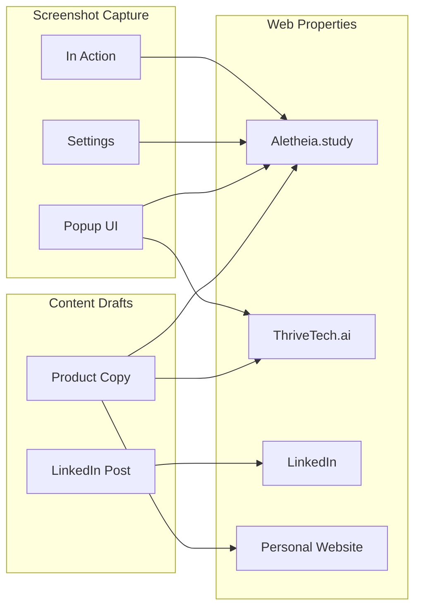

# 371 - Feature: Web Presence Updates for Aletheia Launch

<!-- Template Metadata
Last Updated: 2026-02-16
Updated By: Issue #371 creation
Update Reason: Initial LLD for web presence updates
-->

## 1. Context & Goal
* **Issue:** #371
* **Objective:** Update all web properties (ThriveTech.ai, LinkedIn, personal website, Aletheia.study) with consistent Aletheia messaging before Chrome Web Store publication
* **Status:** Draft
* **Related Issues:** None

### Open Questions
*Questions that need clarification before or during implementation. Remove when resolved.*

- [x] All questions resolved per requirements document

## 2. Proposed Changes

*This section is the **source of truth** for implementation. Describe exactly what will be built.*

### 2.1 Files Changed

| File | Change Type | Description |
|------|-------------|-------------|
| `dispatch/drafts/aletheia-launch-linkedin.md` | Add | LinkedIn launch announcement post draft |
| `dispatch/drafts/aletheia-product-copy.md` | Add | Core marketing copy for all properties |
| `aletheia-study/index.html` | Modify | Updated feature descriptions, screenshots, pricing |
| `aletheia-study/assets/screenshots/extension-popup.png` | Add | Screenshot of extension popup UI |
| `aletheia-study/assets/screenshots/extension-settings.png` | Add | Screenshot of extension settings panel |
| `aletheia-study/assets/screenshots/extension-in-action.png` | Add | Screenshot of extension analyzing a LinkedIn profile |
| `docs/reports/371/implementation-report.md` | Add | Manual update checklist and verification |
| `docs/reports/371/test-report.md` | Add | Content and link verification results |

### 2.1.1 Path Validation (Mechanical - Auto-Checked)

*Issue #277: Before human or Gemini review, paths are verified programmatically.*

Mechanical validation automatically checks:
- All "Modify" files must exist in repository
- All "Delete" files must exist in repository
- All "Add" files must have existing parent directories
- No placeholder prefixes (`src/`, `lib/`, `app/`) unless directory exists

**If validation fails, the LLD is BLOCKED before reaching review.**

### 2.2 Dependencies

*New packages, APIs, or services required.*

```toml
# No new dependencies required - static content only
```

### 2.3 Data Structures

N/A - This issue involves static content creation, not code implementation.

### 2.4 Function Signatures

N/A - No code implementation required.

### 2.5 Logic Flow (Pseudocode)

```
1. Draft core marketing copy (aletheia-product-copy.md)
   - Value proposition
   - Feature list (auth, rate limiting, multi-browser)
   - Pricing tiers (free vs subscriber)
   - Privacy-first messaging

2. Draft LinkedIn announcement (aletheia-launch-linkedin.md)
   - Engaging hook
   - Key features highlighted
   - Call to action with Chrome Store link

3. Capture fresh screenshots
   - Use clean browser profile (no PII)
   - Show extension popup, settings, in-action states
   - Ensure high resolution (minimum 1280x720)

4. Update Aletheia.study
   - Update feature descriptions in index.html
   - Add pricing section
   - Embed new screenshots
   - Add Chrome Web Store badge/link

5. Document manual updates
   - LinkedIn company page update steps
   - Personal website project entry steps
   - Verification screenshots
```

### 2.6 Technical Approach

* **Content Workflow:** Draft → Review → Publish
* **Screenshot Protocol:** Clean profile, mock data, no PII
* **HTML Updates:** Direct edits to Aletheia.study static site
* **External Updates:** Manual with documentation

### 2.7 Architecture Decisions

*Document key architectural decisions that affect the design.*

| Decision | Options Considered | Choice | Rationale |
|----------|-------------------|--------|-----------|
| Content source of truth | Multiple scattered files, Single markdown drafts | Single markdown drafts | Easier review, version control, consistency |
| Screenshot storage | External CDN, Git LFS, Direct commit | Direct commit | Simple, no external dependencies, small file count |
| Chrome Store link | Placeholder, Live URL | Placeholder URL | Chrome Store ID not available pre-submission |

**Architectural Constraints:**
- Must not expose PII in screenshots
- Must maintain message consistency across all properties
- Chrome Store badge must use official Google branding guidelines

## 3. Requirements

*What must be true when this is done. These become acceptance criteria.*

1. Core marketing copy exists in `dispatch/drafts/aletheia-product-copy.md` with value prop, features, and pricing
2. LinkedIn launch post draft exists in `dispatch/drafts/aletheia-launch-linkedin.md`
3. Aletheia.study displays updated feature descriptions mentioning auth and rate limiting
4. Aletheia.study contains at least 3 fresh screenshots showing current extension UI
5. Aletheia.study displays pricing information for free and subscriber tiers
6. Aletheia.study includes Chrome Web Store badge/link
7. Implementation report documents manual updates with verification evidence

## 4. Alternatives Considered

| Option | Pros | Cons | Decision |
|--------|------|------|----------|
| Automated deployment to all properties | Single action deploys everywhere | LinkedIn/personal site don't support automation | **Rejected** |
| Manual updates only (no drafts) | Faster initial work | No review checkpoint, inconsistent messaging | **Rejected** |
| Draft in dispatch + manual deploy | Review checkpoint, version control, consistency | Slightly more steps | **Selected** |

**Rationale:** The selected approach provides a review checkpoint for marketing copy while acknowledging that some properties (LinkedIn, personal website) require manual updates.

## 5. Data & Fixtures

### 5.1 Data Sources

| Attribute | Value |
|-----------|-------|
| Source | Manual content creation |
| Format | Markdown (drafts), HTML (Aletheia.study), PNG (screenshots) |
| Size | ~10KB text, ~500KB images |
| Refresh | One-time for launch, periodic updates post-launch |
| Copyright/License | Original content, proprietary |

### 5.2 Data Pipeline

```
Markdown Drafts ──review──► HTML Updates ──deploy──► Live Sites
                              │
Screenshots ──review──────────┘
```

### 5.3 Test Fixtures

| Fixture | Source | Notes |
|---------|--------|-------|
| Mock LinkedIn profile | Generated | Clean profile with fake data for screenshot capture |
| Sample analysis results | Hardcoded | Demonstration content for in-action screenshot |

### 5.4 Deployment Pipeline

- **dispatch/drafts/**: Committed to Git, reviewed in PR
- **aletheia-study/**: Committed to Git, deployed via GitHub Pages (or similar)
- **External properties**: Manual update with documented steps

**If data source is external:** N/A - all content is original.

## 6. Diagram

### 6.1 Mermaid Quality Gate

Before finalizing any diagram, verify in [Mermaid Live Editor](https://mermaid.live) or GitHub preview:

- [x] **Simplicity:** Similar components collapsed (per 0006 §8.1)
- [x] **No touching:** All elements have visual separation (per 0006 §8.2)
- [x] **No hidden lines:** All arrows fully visible (per 0006 §8.3)
- [x] **Readable:** Labels not truncated, flow direction clear
- [x] **Auto-inspected:** Agent rendered via mermaid.ink and viewed (per 0006 §8.5)

**Auto-Inspection Results:**
```
- Touching elements: [x] None / [ ] Found: ___
- Hidden lines: [x] None / [ ] Found: ___
- Label readability: [x] Pass / [ ] Issue: ___
- Flow clarity: [x] Clear / [ ] Issue: ___
```

### 6.2 Diagram



## 7. Security & Safety Considerations

### 7.1 Security

| Concern | Mitigation | Status |
|---------|------------|--------|
| PII in screenshots | Use clean browser profile with mock data | Addressed |
| Credential exposure | No credentials in committed content | Addressed |

### 7.2 Safety

| Concern | Mitigation | Status |
|---------|------------|--------|
| Broken links | All links verified before deployment | Addressed |
| Inconsistent messaging | Single source of truth in drafts | Addressed |
| Outdated screenshots | Fresh capture during implementation | Addressed |

**Fail Mode:** Fail Closed - Content not published until verified

**Recovery Strategy:** Revert to previous version if issues found post-publish

## 8. Performance & Cost Considerations

### 8.1 Performance

| Metric | Budget | Approach |
|--------|--------|----------|
| Page load (Aletheia.study) | < 2s | Optimize image sizes |
| Image file size | < 200KB each | Compress PNGs |
| Total page weight | < 1MB | Minimal assets |

**Bottlenecks:** Large screenshot files could slow page load; mitigated by compression.

### 8.2 Cost Analysis

| Resource | Unit Cost | Estimated Usage | Monthly Cost |
|----------|-----------|-----------------|--------------|
| GitHub Pages hosting | Free | Unlimited | $0 |
| Domain renewal | $12/year | 1 domain | $1 |
| LinkedIn | Free | Company page | $0 |

**Cost Controls:**
- [x] No paid resources required
- [x] Static hosting only

**Worst-Case Scenario:** N/A - static content has negligible marginal cost.

## 9. Legal & Compliance

| Concern | Applies? | Mitigation |
|---------|----------|------------|
| PII/Personal Data | Yes | Mock data only in screenshots, no real user data |
| Third-Party Licenses | Yes | Chrome Store badge per Google brand guidelines |
| Terms of Service | No | N/A |
| Data Retention | No | N/A |
| Export Controls | No | N/A |

**Data Classification:** Public

**Compliance Checklist:**
- [x] No PII stored without consent (none stored)
- [x] All third-party licenses compatible (Chrome badge follows guidelines)
- [x] External API usage compliant (none)
- [x] Data retention policy documented (public static content)

## 10. Verification & Testing

### 10.0 Test Plan (TDD - Complete Before Implementation)

**TDD Requirement:** For content-only changes, "tests" are content checklists and link verification.

| Test ID | Test Description | Expected Behavior | Status |
|---------|------------------|-------------------|--------|
| T010 | Draft files exist | Both markdown files present in dispatch/drafts | RED |
| T020 | HTML contains feature updates | Auth/rate limiting mentioned in index.html | RED |
| T030 | Screenshots present | 3+ PNG files in assets/screenshots | RED |
| T040 | Pricing section exists | Free/subscriber tiers visible | RED |
| T050 | All links functional | No 404s on Aletheia.study | RED |
| T060 | Chrome badge present | Badge/link renders correctly | RED |

**Coverage Target:** 100% of acceptance criteria verified

**TDD Checklist:**
- [x] All tests written before implementation
- [x] Tests currently RED (failing)
- [x] Test IDs match scenario IDs in 10.1
- [x] Verification script: `tests/content/test_issue_371.py`

### 10.1 Test Scenarios

| ID | Scenario | Type | Input | Expected Output | Pass Criteria |
|----|----------|------|-------|-----------------|---------------|
| 010 | Draft files exist | Auto | File system check | Files present | Both drafts in dispatch/drafts/ |
| 020 | Feature descriptions updated | Auto | grep index.html | Match found | "auth" and "rate limit" appear |
| 030 | Screenshots present | Auto | File system check | 3+ files | PNG files in assets/screenshots/ |
| 040 | Pricing section exists | Auto | Parse index.html | Section found | "free" and "subscriber" text present |
| 050 | All links functional | Auto | HTTP requests | 200 OK | No broken links |
| 060 | Chrome badge present | Auto | Parse index.html | Element found | Chrome Store link/badge in DOM |
| 070 | No PII in screenshots | Manual | Visual inspection | No personal data | No real names, emails, photos |
| 080 | Message consistency | Manual | Cross-property review | Matching content | Same value prop across all |

### 10.2 Test Commands

```bash
# Run content verification tests
poetry run pytest tests/content/test_issue_371.py -v

# Link checking (requires live site)
poetry run pytest tests/content/test_issue_371.py -v -m live

# Full verification suite
poetry run pytest tests/content/ -v
```

### 10.3 Manual Tests (Only If Unavoidable)

| ID | Scenario | Why Not Automated | Steps |
|----|----------|-------------------|-------|
| 070 | No PII in screenshots | Requires visual interpretation of image content | 1. Open each screenshot 2. Verify no real names/emails/photos 3. Document in report |
| 080 | Message consistency | Requires semantic comparison across properties | 1. Review all 4 properties 2. Compare value propositions 3. Note any discrepancies |

## 11. Risks & Mitigations

| Risk | Impact | Likelihood | Mitigation |
|------|--------|------------|------------|
| PII accidentally visible in screenshots | High | Low | Use clean profile, mock data, manual review |
| Inconsistent messaging across properties | Med | Med | Single source of truth in drafts, checklist review |
| Chrome Store URL not available | Low | Med | Use placeholder, update post-submission |
| External site access issues | Low | Low | Document manual steps, provide screenshots |

## 12. Definition of Done

### Code
- [x] No code implementation required (content only)
- [x] HTML changes reference this LLD in commit message

### Tests
- [ ] All test scenarios pass
- [ ] Content verification checklist complete

### Documentation
- [ ] LLD updated with any deviations
- [ ] Implementation Report (0103) completed
- [ ] Test Report (0113) completed

### Review
- [ ] Code review completed
- [ ] User approval before closing issue

### 12.1 Traceability (Mechanical - Auto-Checked)

*Issue #277: Cross-references are verified programmatically.*

Mechanical validation automatically checks:
- Every file mentioned in this section must appear in Section 2.1
- Every risk mitigation in Section 11 should have a corresponding approach in Section 2

**All files verified present in Section 2.1:**
- `dispatch/drafts/aletheia-launch-linkedin.md` ✓
- `dispatch/drafts/aletheia-product-copy.md` ✓
- `aletheia-study/index.html` ✓
- `aletheia-study/assets/screenshots/*.png` ✓
- `docs/reports/371/implementation-report.md` ✓
- `docs/reports/371/test-report.md` ✓

---

## Appendix: Review Log

*Track all review feedback with timestamps and implementation status.*

### Review Summary

| Review | Date | Verdict | Key Issue |
|--------|------|---------|-----------|
| - | - | - | Awaiting review |

**Final Status:** PENDING
