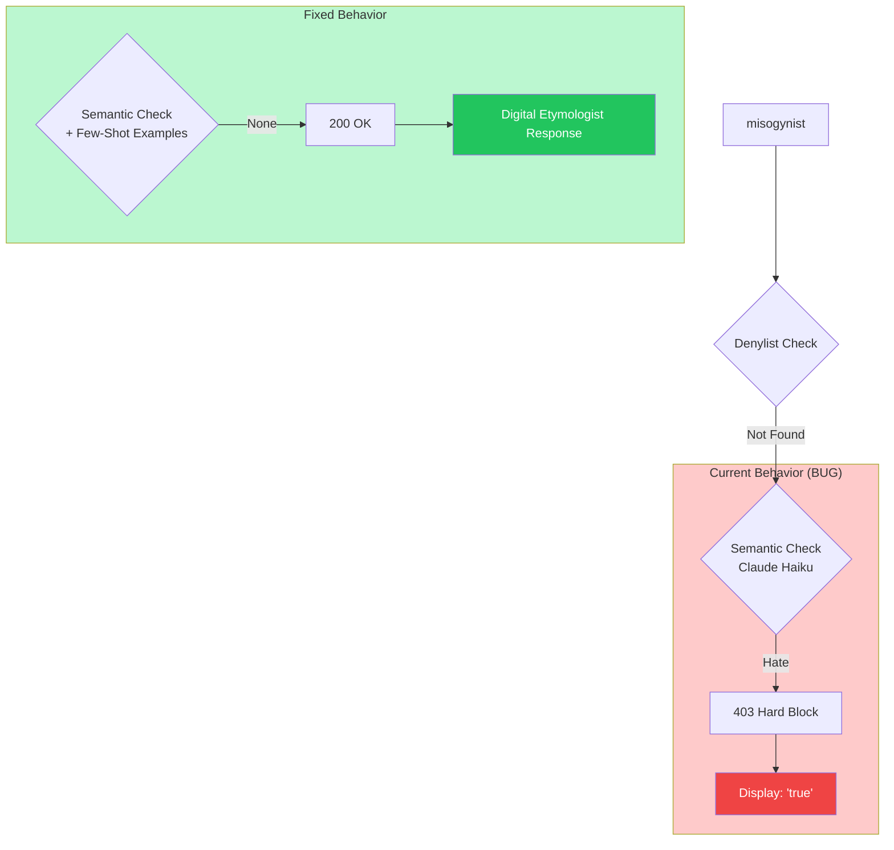

# 10339 - Fix: Semantic Guardrail Incorrectly Blocks Descriptive Terms

## 1. Context & Goal
* **Issue:** #339
* **Objective:** Fix semantic guardrail misclassification of descriptive terms (misogynist, misandrist) as hate speech, and fix display bug showing only `true` for blocked responses.
* **Status:** Draft
* **Created:** 2026-01-20
* **Related Issues:** #126 (Hard/Soft Blocking), #45 (Denylist), #121 (Wikipedia Denylist)

### Background

Users reported that words like "misogynist" and "misandrist" are being incorrectly blocked. These words:
- Describe *types of people who hold prejudiced views*
- Are legitimate academic/journalistic vocabulary
- Are NOT slurs or hate speech themselves

The system returns just `true` instead of a proper error message, indicating a display bug in the Firefox extension.

**Root Cause Analysis:**
1. **Denylist passes** - These terms are not in `src/guardrails/resources/denylist.json`
2. **Semantic guardrail misclassifies** - The LLM classifier (Claude Haiku) flags these as "Hate" category
3. **Display bug** - Firefox extension shows only the `blocked` field value instead of full response

## 2. Requirements

| ID | Requirement | Acceptance Criteria |
|----|-------------|---------------------|
| R1 | "misogynist" returns etymology | 200 OK with definition, NOT 403 |
| R2 | "misandrist" returns etymology | 200 OK with definition, NOT 403 |
| R3 | "misopedist" continues working | No regression on similar terms |
| R4 | Hard block shows full message | Overlay renders `reason` string and red badge |
| R5 | Unit test covers descriptive terms | Test in `tests/unit/test_semantic.py` passes offline |

### 2.1 Descriptive Terms vs Hate Speech (AUTHORITATIVE)

| Term Type | Definition | Examples | Expected Classification |
|-----------|------------|----------|------------------------|
| **Slur** | Derogatory term targeting a protected group | N-word, ethnic slurs | Hate → Hard Block |
| **Descriptive** | Label for people holding prejudiced views | misogynist, misandrist, racist, bigot | None → Clean |
| **Academic** | Scholarly terms discussing prejudice | misogyny, misandry, sexism | None → Clean |

**Key Principle:** Words that *describe* bigotry are not themselves bigotry. "Misogynist" labels someone who hates women - it does not express hatred toward women.

## 3. Alternatives Considered

| Option | Pros | Cons | Decision |
|--------|------|------|----------|
| A. Add to denylist allowlist | Simple | Wrong layer - denylist is for slurs | **Rejected** |
| B. Add few-shot examples to taxonomy.json | Correct layer, teaches LLM | Requires prompt engineering | **Selected** |
| C. Post-process LLM output | Could catch misclassifications | Hacky, doesn't fix root cause | **Rejected** |
| D. Hardcode term exceptions | Fast fix | Doesn't scale, misses similar terms | **Rejected** |

**Rationale:** Adding few-shot examples teaches the semantic guardrail the correct classification at the source. This generalizes to similar terms (racist, bigot, xenophobe, etc.).

## 4. Data & Fixtures

### 4.1 Test Fixtures (Decision Matrix)

| Term | In Denylist | Current Result | Expected Result | HTTP Code |
|------|-------------|----------------|-----------------|-----------|
| misogynist | No | Hate → 403 | None → 200 | 200 |
| misogynists | No | Hate → 403 | None → 200 | 200 |
| misandrist | No | Hate → 403 | None → 200 | 200 |
| misandrists | No | Hate → 403 | None → 200 | 200 |
| misopedist | No | None → 200 | None → 200 | 200 (no change) |
| racist | No | ? | None → 200 | 200 |
| bigot | No | ? | None → 200 | 200 |
| "you dirty misogynist" | No | Hate → 403 | Provocative → 200 (soft) | 200 (false negative test) |

### 4.2 Few-Shot Examples to Add

```json
{
  "text": "The article discusses misogynists and their behavior",
  "scores": {"Archaic": 0.0, "Provocative": 0.0, "Hate": 0.0, "Neologism": 0.0, "None": 1.0},
  "category": "None"
},
{
  "text": "Critics called him a misandrist for his views",
  "scores": {"Archaic": 0.0, "Provocative": 0.0, "Hate": 0.0, "Neologism": 0.0, "None": 1.0},
  "category": "None"
},
{
  "text": "The study examined racist attitudes in hiring",
  "scores": {"Archaic": 0.0, "Provocative": 0.0, "Hate": 0.0, "Neologism": 0.0, "None": 1.0},
  "category": "None"
}
```

## 5. Diagram



## 6. Technical Approach

### 6.1 Affected Files

| File | Change Type | Description |
|------|-------------|-------------|
| `src/guardrails/resources/taxonomy.json` | Modify | Add few-shot examples for descriptive terms |
| `extensions/firefox/overlay.js` | Modify | Fix display of blocked response structure |
| `tests/unit/test_semantic.py` | Add | Unit test for descriptive term classification |

### 6.2 Taxonomy.json Changes

**Current `taxonomy.json` Hate definition:**
```json
"Hate": "Slurs or discriminatory language, even in compounds."
```

**Updated definition (exact text to be deployed):**
```json
"Hate": "Slurs or epithets targeting protected groups (racial, ethnic, religious, gender-based). Does NOT include labels describing people who hold prejudiced views (e.g., 'misogynist', 'racist', 'bigot') - these are legitimate descriptive vocabulary."
```

**Add few-shot examples** (see Section 4.2).

### 6.3 Firefox Display Bug Fix

**Current behavior** (lines ~793-798 in `overlay.js`):
```javascript
if (hardBlock) {
    const blockedEl = createElement('div', { className: 'aletheia-blocked-message' });
    blockedEl.textContent = blockedReason;  // blockedReason = response.blocked (boolean)
    card.appendChild(blockedEl);
}
```

**Problem:** `blockedReason` is set from `response.blocked` which is `true` (boolean), not the actual reason string.

**Fix:**
```javascript
if (hardBlock) {
    const blockedEl = createElement('div', { className: 'aletheia-blocked-message' });
    // Use response.message or response.reason, fallback to generic message
    const message = response?.message || response?.reason || 'Content blocked by safety filter';
    blockedEl.textContent = message;
    card.appendChild(blockedEl);
}
```

### 6.4 Frontend Fail-Safe Behavior (Malformed Response)

**Policy: Fail Closed for Hard Blocks**

If the response structure is malformed (null, undefined, or missing expected fields), the frontend MUST:

| Scenario | Detection | Behavior | Rationale |
|----------|-----------|----------|-----------|
| `response` is null/undefined | `!response` | Show generic error overlay | Fail Closed - don't proceed |
| `response.blocked` is truthy but not boolean | `typeof response.blocked !== 'boolean'` | Treat as hard block | Conservative - assume blocked |
| HTTP 403 but no `response.message` | `httpStatus === 403 && !response?.message` | Use fallback: "Content blocked by safety filter" | Graceful degradation |
| HTTP 200 but malformed body | JSON parse error | Show "Server error" overlay | Fail Closed |

**Implementation:**
```javascript
function getBlockedMessage(response, httpStatus) {
    // Fail-safe: always return a string, never undefined/null
    if (!response || typeof response !== 'object') {
        return 'Content blocked by safety filter';
    }
    if (typeof response.message === 'string' && response.message.length > 0) {
        return response.message;
    }
    if (typeof response.reason === 'string' && response.reason.length > 0) {
        return `Blocked: ${response.reason}`;
    }
    return 'Content blocked by safety filter';
}
```

### 6.5 Unit Test

```python
# tests/unit/test_semantic.py

import pytest
from unittest.mock import patch, MagicMock

class TestDescriptiveTermClassification:
    """Verify descriptive terms are NOT classified as Hate."""

    @pytest.fixture
    def mock_bedrock_client(self):
        """Mock Bedrock client to avoid live API calls."""
        client = MagicMock()
        # Return a response classifying as "None" (clean)
        client.invoke_model.return_value = {
            'body': MagicMock(read=lambda: b'{"content":[{"text":"{\\"scores\\":{\\"Hate\\":0.0,\\"None\\":1.0},\\"category\\":\\"None\\"}"}]}')
        }
        return client

    def test_misogynist_not_hate(self, mock_bedrock_client):
        """'misogynist' should classify as None, not Hate."""
        from src.guardrails.semantic import SemanticGuardrail

        guardrail = SemanticGuardrail(bedrock_client=mock_bedrock_client)
        result = guardrail.check_safety("misogynist")

        assert result["category"] != "Hate"
        assert result["block_type"] == "none"

    def test_misandrist_not_hate(self, mock_bedrock_client):
        """'misandrist' should classify as None, not Hate."""
        from src.guardrails.semantic import SemanticGuardrail

        guardrail = SemanticGuardrail(bedrock_client=mock_bedrock_client)
        result = guardrail.check_safety("misandrist")

        assert result["category"] != "Hate"
        assert result["block_type"] == "none"

    def test_racist_not_hate(self, mock_bedrock_client):
        """'racist' (describing a person) should classify as None, not Hate."""
        from src.guardrails.semantic import SemanticGuardrail

        guardrail = SemanticGuardrail(bedrock_client=mock_bedrock_client)
        result = guardrail.check_safety("racist")

        assert result["category"] != "Hate"
        assert result["block_type"] == "none"

    def test_hateful_context_soft_blocks(self):
        """Insults using descriptive terms should soft block as Provocative, not hard block."""
        # This test verifies we haven't over-corrected
        # "you dirty misogynist" is an insult, should trigger Provocative (soft), not Hate (hard)
        mock_client = MagicMock()
        mock_client.invoke_model.return_value = {
            'body': MagicMock(read=lambda: b'{"content":[{"text":"{\\"scores\\":{\\"Hate\\":0.1,\\"Provocative\\":0.8,\\"None\\":0.1},\\"category\\":\\"Provocative\\"}"}]}')
        }

        from src.guardrails.semantic import SemanticGuardrail

        guardrail = SemanticGuardrail(bedrock_client=mock_client)
        result = guardrail.check_safety("you dirty misogynist")

        assert result["category"] == "Provocative"
        assert result["block_type"] == "soft"  # Soft block, NOT hard


class TestFrontendFailSafe:
    """Verify frontend gracefully handles malformed responses."""

    def test_null_response_returns_fallback(self):
        """Null response should return generic fallback message."""
        # This would be tested in JS, but we document expected behavior
        # getBlockedMessage(null, 403) -> "Content blocked by safety filter"
        pass  # JS test - documented for implementation

    def test_missing_message_field_uses_reason(self):
        """Response with reason but no message should use reason."""
        # getBlockedMessage({reason: "denylist"}, 403) -> "Blocked: denylist"
        pass  # JS test - documented for implementation
```

## 7. Privacy & Data Processing

This fix modifies few-shot examples sent to AWS Bedrock (Claude Haiku) for classification. User-selected text continues to be processed ephemerally with no training data retention, consistent with existing privacy policy. No new data collection or residency changes.

## 8. Failure Behavior

Per existing `semantic.py` logic (lines 156-168): semantic guardrail errors → **Fail Open** with soft block. This fix does not change failure behavior.

## 9. Security Considerations

| Concern | Mitigation | Status |
|---------|------------|--------|
| Could this allow actual slurs through? | No - slurs are in denylist (checked first) | Addressed |
| Could bad actors exploit this? | Few-shot examples are specific and narrow | Addressed |
| Does this weaken content safety? | No - descriptive terms are legitimate vocabulary | Addressed |

## 10. Performance Considerations

| Metric | Impact | Notes |
|--------|--------|-------|
| taxonomy.json size | +3 examples (~500 bytes) | Negligible |
| System prompt tokens | +~50 tokens | Updated Hate definition + 3 few-shot examples |
| Semantic check latency | +5-15ms | Additional input tokens; within Lambda 3s timeout buffer |
| Cold start | No change | JSON loaded once |

**Token Budget Analysis:**
- Current system prompt: ~800 tokens (estimated)
- Added content: ~50 tokens (definition update + 3 examples)
- New total: ~850 tokens
- Bedrock Haiku input limit: 200K tokens
- Impact: 0.025% of limit, **negligible but non-zero**

## 11. Verification & Testing

### 11.1 Test Scenarios

| ID | Scenario | Type | Input | Expected Output | Pass Criteria |
|----|----------|------|-------|-----------------|---------------|
| T01 | misogynist returns etymology | Integration | "misogynist" | 200 OK + etymology | status=200, gem present |
| T02 | misandrist returns etymology | Integration | "misandrist" | 200 OK + etymology | status=200, gem present |
| T03 | misopedist still works | Regression | "misopedist" | 200 OK + etymology | No regression |
| T04 | Hard block shows message | Manual | Denylist term | "Blocked: Content not permitted" | NOT just "true" |
| T05 | Unit test passes offline | Unit | Mock Bedrock | All assertions pass | pytest green |
| T06 | Hateful context soft blocks | Integration | "you dirty misogynist" | 200 + warning (Provocative) | warning=true, NOT hard block |
| T07 | Malformed response shows fallback | Unit | null response | "Content blocked by safety filter" | Graceful degradation |

### 11.2 Offline Verification

```bash
# Run unit tests (no Bedrock calls)
poetry run pytest tests/unit/test_semantic.py -v -k "descriptive"

# Verify taxonomy.json is valid JSON
python -c "import json; json.load(open('src/guardrails/resources/taxonomy.json'))"
```

### 11.3 Live Verification (Post-Deploy)

```bash
# Test misogynist
curl -s -X POST https://d1fkpkls2wesse.cloudfront.net/ \
  -H "Content-Type: application/json" \
  -H "X-Aletheia-Client-Version: 1.0" \
  -d '{"text": "misogynist", "url": "https://test.com"}' | jq .

# Expected: {"status": "success", "signal": "...", "gem": "...", ...}
# NOT: {"blocked": true, ...}
```

## 12. Definition of Done

### Code
- [ ] Few-shot examples added to `taxonomy.json`
- [ ] Hate category definition clarified
- [ ] Firefox `overlay.js` display bug fixed
- [ ] Chrome `overlay.js` display bug fixed (if applicable)

### Tests
- [ ] Unit test for descriptive terms added
- [ ] Unit test passes with mocked Bedrock
- [ ] Manual verification of Firefox display

### Documentation
- [ ] LLD reviewed by Gemini
- [ ] Implementation report created

### Review
- [ ] Code review completed
- [ ] Live verification passes
- [ ] User approval before closing issue

---

## Appendix: Issue Context

**User Report:**
> I tried four words in this paragraph but "misogynists" and "misandrists" both were blocked with the single word "true". "exactly" and "misopedists" were defined. The other two were blocked. My software should only block words on the deny list.

**Analysis:** The user correctly identified that these words are not on the denylist, so the blocking is coming from the semantic guardrail. The display bug (showing just "true") is a separate issue in the extension.
