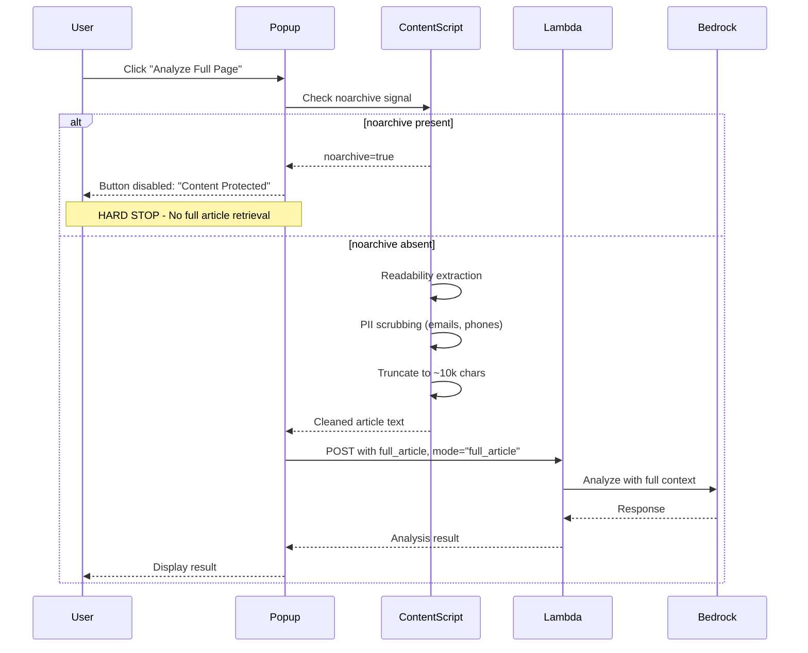

# 1106 - Feature: Full Article Context Retrieval

## 1. Context & Goal
* **Issue:** #106
* **Objective:** Enable retrieval of full article content when surrounding text selection is insufficient for accurate analysis.
* **Status:** Draft (Revised per Gemini Review 2026-01-06)
* **Related Issues:** #162 (noarchive Transform layer), #155 (noarchive skip persistence)

### Open Questions
*Questions that need clarification before or during implementation. Remove when resolved.*

- [x] ~~What triggers "full article" mode?~~ **Popup button (explicit consent)**
- [x] ~~How do we handle copyright implications?~~ **Hard Stop for noarchive pages**
- [x] ~~What's the maximum article length?~~ **~10k chars (~2.5k tokens) truncated client-side**
- [x] ~~Should full article content be persisted to DynamoDB?~~ **No - in-memory only (privacy)**
- [x] ~~How does this interact with noarchive signals?~~ **Hard Stop - feature disabled**
- [x] ~~Do we need user consent UI?~~ **Yes - popup button is explicit consent**
- [x] ~~Should this be opt-in per-request or a global preference?~~ **Per-request (button click = consent)**

### Resolved Questions (Gemini Review 2026-01-06)

| Question | Resolution |
|----------|------------|
| UX Trigger | **Popup button** - explicit consent, easiest to implement |
| noarchive handling | **Hard Stop** - button disabled, "Content Protected" message |
| Extraction method | **Readability-style** - not raw innerText (avoids nav/footer noise) |
| PII handling | **Client-side scrubbing** - regex for emails/phone numbers |
| Truncation location | **Client-side** - no benefit sending 5MB to delete 4.9MB server-side |

## 2. Requirements

| ID | Requirement | Acceptance Criteria |
|----|-------------|---------------------|
| R1 | Readability-style text extraction | Isolate article content, exclude nav/footer/ads |
| R2 | Popup button trigger | "Analyze Full Page" button in popup (explicit consent) |
| R3 | Client-side truncation | Truncate to ~10k chars before transmission |
| R4 | **Hard Stop for noarchive** | Button disabled on noarchive pages |
| R5 | **PII scrubbing** | Redact emails/phone numbers client-side |
| R6 | Cost monitoring | Log with `mode="full_article"` tag for CloudWatch queries |
| R7 | Performance budget | Full retrieval adds <500ms to response |

## 3. Alternatives Considered

| Option | Pros | Cons | Decision |
|--------|------|------|----------|
| A. Popup button | Explicit consent, easy to implement | Extra click | **Selected** |
| B. Automatic detection | Seamless UX | No consent, copyright risk | Rejected |
| C. Context menu option | Integrated | Menu clutter | Rejected |
| D. Always send full article | Maximum context | Privacy/copyright issues | Rejected |

**Rationale:** Popup button provides explicit user consent (addresses privacy/copyright concerns) and is the simplest implementation path.

## 4. Data & Fixtures

### 4.1 Data Sources

| Attribute | Value |
|-----------|-------|
| Source | Readability-style extraction (article/main tags, text density scoring) |
| Format | Plain text (PII-scrubbed) |
| Size | Max ~10KB after truncation |
| Refresh | Per-request |
| Copyright/License | User-provided content - Hard Stop on noarchive |

### 4.2 Data Pipeline

```
Page ──Readability extraction──► PII scrub ──truncate (client)──► Lambda ──► Bedrock
```

**Key change:** Truncation happens at Extension level, NOT Lambda.

### 4.3 Test Fixtures

| Fixture | Source | Notes |
|---------|--------|-------|
| Short article (<1000 words) | **Generated (Lorem Ipsum)** | Normal case |
| Long article (>5000 words) | **Generated (Lorem Ipsum)** | Truncation test |
| Page with noarchive | Test HTML | Hard Stop test |
| Page with emails/phones | Test HTML | PII scrubbing test |

**CRITICAL:** All test fixtures MUST be synthetic (Lorem Ipsum) or public domain. Do NOT paste copyrighted content into the repository.

### 4.4 Deployment Pipeline

Extension update only (truncation/extraction client-side). Lambda changes minimal.

## 5. Diagram



## 6. Technical Approach

* **Module:**
  - `extensions/chrome/content-script.js` (extraction, scrubbing, truncation)
  - `extensions/chrome/popup.js` (button handler)
  - `extensions/chrome/popup.html` (button UI)
  - `src/lambda_function.py` (minimal changes - logging only)
* **Dependencies:** None new
* **Pattern:** Client-side processing with explicit consent

### 6.1 Readability-Style Extraction (REQUIRED)

```javascript
// content-script.js
// DO NOT use raw document.body.innerText (captures nav, footer, ads)

function extractArticleContent() {
  // Priority 1: Look for semantic article containers
  const article = document.querySelector('article');
  if (article) {
    return cleanText(article.innerText);
  }

  // Priority 2: Look for main content area
  const main = document.querySelector('main');
  if (main) {
    return cleanText(main.innerText);
  }

  // Priority 3: Look for common article class patterns
  const contentSelectors = [
    '[class*="article-content"]',
    '[class*="post-content"]',
    '[class*="entry-content"]',
    '[role="article"]',
    '.content',
    '#content'
  ];

  for (const selector of contentSelectors) {
    const el = document.querySelector(selector);
    if (el && el.innerText.length > 500) {
      return cleanText(el.innerText);
    }
  }

  // Fallback: Body minus obvious non-content (LAST RESORT)
  const clone = document.body.cloneNode(true);
  clone.querySelectorAll('script, style, nav, footer, header, aside, [role="navigation"], [role="banner"], [role="contentinfo"]').forEach(el => el.remove());
  return cleanText(clone.innerText);
}

function cleanText(text) {
  return text
    .replace(/\s+/g, ' ')  // Normalize whitespace
    .trim();
}
```

### 6.2 PII Scrubbing (REQUIRED)

```javascript
// content-script.js
const PII_PATTERNS = {
  // Email: user@domain.tld
  email: /[a-zA-Z0-9._%+-]+@[a-zA-Z0-9.-]+\.[a-zA-Z]{2,}/g,
  // Phone: various formats (US-centric, extend as needed)
  phone: /(\+?1[-.\s]?)?(\(?\d{3}\)?[-.\s]?)?\d{3}[-.\s]?\d{4}/g,
};

function scrubPII(text) {
  let scrubbed = text;
  scrubbed = scrubbed.replace(PII_PATTERNS.email, '[email redacted]');
  scrubbed = scrubbed.replace(PII_PATTERNS.phone, '[phone redacted]');
  return scrubbed;
}
```

### 6.3 Client-Side Truncation (REQUIRED)

```javascript
// content-script.js
const MAX_ARTICLE_CHARS = 10000;  // ~2500 tokens

function truncateArticle(text) {
  if (text.length <= MAX_ARTICLE_CHARS) {
    return { text, truncated: false };
  }
  return {
    text: text.substring(0, MAX_ARTICLE_CHARS) + '\n...[truncated]',
    truncated: true
  };
}
```

### 6.4 noarchive Hard Stop (REQUIRED)

```javascript
// popup.js
async function updateFullPageButton() {
  const [tab] = await chrome.tabs.query({ active: true, currentWindow: true });
  const noarchive = await checkNoarchive(tab.id);

  const button = document.getElementById('full-page-btn');

  if (noarchive) {
    button.disabled = true;
    button.textContent = 'Content Protected';
    button.title = 'This page is marked noarchive - full retrieval disabled';
  } else {
    button.disabled = false;
    button.textContent = 'Analyze Full Page';
  }
}
```

### 6.5 Lambda Logging (Cost Monitoring)

```python
# lambda_function.py
import json

def lambda_handler(event, context):
    mode = "full_article" if event.get('full_article') else "selection"

    # Log mode for CloudWatch Insights cost analysis
    print(json.dumps({
        "action": "analysis_request",
        "mode": mode,
        "input_chars": len(event.get('full_article', event.get('text', ''))),
    }))

    # ... rest of handler
```

**CloudWatch Insights Query for Cost Analysis:**
```sql
fields @timestamp, mode, input_chars
| filter action = "analysis_request"
| stats count() as requests, avg(input_chars) as avg_chars by mode
```

## 7. Interface Specification

### 7.1 Data Structures
```python
# Request payload with full article
{
    "text": "selected text (if any)",
    "url": "https://example.com/page",
    "full_article": "extracted, scrubbed, truncated article text...",  # NEW
    "signals": {
        "noarchive": false  # Will always be false if full_article present
    }
}
```

### 7.2 Function Signatures
```javascript
// Extension - content-script.js
function extractArticleContent(): string;
function scrubPII(text: string): string;
function truncateArticle(text: string): { text: string, truncated: boolean };

// Extension - popup.js
async function updateFullPageButton(): void;
async function handleFullPageClick(): void;
```

### 7.3 Logic Flow (Pseudocode)
```
1. User opens popup
2. Popup checks noarchive status
   - IF noarchive: disable "Analyze Full Page" button, show "Content Protected"
   - ELSE: enable button
3. User clicks "Analyze Full Page" button
4. Content script extracts article (Readability-style)
5. Content script scrubs PII (emails, phone numbers)
6. Content script truncates to ~10k chars
7. Extension sends request with full_article field + mode tag
8. Lambda logs request with mode="full_article"
9. Lambda generates prompt with full article context
10. Return response to user
```

## 8. Security Considerations

| Concern | Mitigation | Status |
|---------|------------|--------|
| PII in full article | **Client-side regex scrubbing** | Addressed |
| Copyright infringement | **Hard Stop for noarchive** | Addressed |
| Large payload attacks | **Client-side truncation (10k chars)** | Addressed |
| Nav/footer noise | **Readability-style extraction** | Addressed |

**Fail Mode:** Fail Safe - If extraction fails, fall back to selection-only mode.

## 9. Performance Considerations

| Metric | Budget | Approach |
|--------|--------|----------|
| Article extraction | < 50ms | DOM queries |
| PII scrubbing | < 10ms | Regex |
| Truncation | < 1ms | String ops |
| Payload size | ~10KB max | Client-side truncation |
| Network | Same as selection | No extra request |
| Bedrock | +200-500ms | Larger prompt |

**Bottlenecks:** Bedrock response time increases with input length, but capped by truncation.

## 10. Risks & Mitigations

| Risk | Impact | Likelihood | Mitigation |
|------|--------|------------|------------|
| Poor extraction quality | Med | Med | Multi-strategy extraction, test across site types |
| PII leakage | High | Low | Client-side scrubbing, regex patterns |
| Copyright violation | High | Low | Hard Stop on noarchive |
| High Bedrock costs | Med | Med | Client truncation, mode logging for monitoring |
| Button confusing | Low | Low | Clear labeling, tooltip |

## 11. Verification & Testing

*Ref: [0005-testing-strategy-and-protocols.md](0005-testing-strategy-and-protocols.md)*

**Testing Philosophy:** All scenarios are automated. CloudWatch verification requires live Lambda but is still automated.

### 11.1 Test Scenarios

| ID | Scenario | Type | Input | Expected Output | Pass Criteria |
|----|----------|------|-------|-----------------|---------------|
| 010 | Article extraction (article tag) | Auto | Page with `<article>` | Article content only | No nav/footer |
| 020 | Article extraction (main tag) | Auto | Page with `<main>` | Main content only | No nav/footer |
| 030 | Article extraction (fallback) | Auto | Page with no semantic tags | Body minus nav/footer | Reasonable content |
| 040 | PII scrubbing - email | Auto | Text with emails | `[email redacted]` | Pattern replaced |
| 050 | PII scrubbing - phone | Auto | Text with phones | `[phone redacted]` | Pattern replaced |
| 060 | Client-side truncation | Auto | 15k char text | 10k chars + truncation marker | Under limit |
| 070 | noarchive Hard Stop | Auto | noarchive page | Button disabled | "Content Protected" |
| 080 | Mode logging | Auto-Live | Full article request | Log with mode="full_article" | CloudWatch entry |
| 090 | Fallback on error | Auto | Malformed page | Selection-only mode | Graceful degradation |

### 11.2 Test Commands

```bash
# Extension unit tests
npm test -- --grep "full article"

# E2E tests (all automated)
npx playwright test --grep "full article"

# CloudWatch log verification (Auto-Live - hits real AWS)
aws logs filter-log-events \
  --log-group-name /aws/lambda/AletheiaLambda \
  --filter-pattern '{ $.mode = "full_article" }'
```

### 11.3 Manual Tests

N/A - All scenarios automated.

### 11.4 Fixture Requirements

All test fixtures MUST be:
- **Synthetic:** Generated Lorem Ipsum or procedurally created
- **Public Domain:** If using real text, must be legally free (e.g., Project Gutenberg)
- **NOT copyrighted:** Do NOT paste news articles, blog posts, or other copyrighted content

## 12. Definition of Done

### Code
- [ ] Readability-style extraction implemented (article/main/fallback)
- [ ] PII scrubbing implemented (email, phone regex)
- [ ] Client-side truncation implemented (~10k chars)
- [ ] noarchive Hard Stop implemented (button disabled)
- [ ] "Analyze Full Page" button added to popup
- [ ] Lambda logging with `mode="full_article"` tag
- [ ] Changes mirrored to Firefox extension

### Tests
- [ ] Unit tests for extraction strategies
- [ ] Unit tests for PII scrubbing
- [ ] Unit tests for truncation
- [ ] E2E test for noarchive Hard Stop
- [ ] All fixtures are synthetic/public domain

### Documentation
- [ ] User guide updated (how to use full page feature)
- [ ] 0007-legal-compliance-strategy.md verified

### Review
- [ ] Code review completed
- [ ] User approval before closing issue

---

## Appendix: Review Log

*Track all review feedback with timestamps and implementation status.*

### Gemini Review #1 (APPROVED)

**Timestamp:** 2026-01-06
**Reviewer:** Gemini 3 Pro
**Verdict:** APPROVED (after revisions)

#### Comments

| ID | Comment | Implemented? |
|----|---------|--------------|
| G1.1 | "[BLOCKING] Extraction strategy uses innerText - captures nav/footer noise" | ✅ YES - Readability-style extraction in Section 6.1 |
| G1.2 | "[BLOCKING] PII scrubbing required before sending to Lambda" | ✅ YES - Client-side regex in Section 6.2 |
| G1.3 | "[BLOCKING] noarchive should be Hard Stop, not Warn" | ✅ YES - Button disabled in Section 6.4 |
| G1.4 | "[HIGH] Truncation should happen client-side, not Lambda" | ✅ YES - Client-side truncation in Section 6.3 |
| G1.5 | "[HIGH] Test fixtures must be synthetic/public domain" | ✅ YES - Section 11.4 added |
| G1.6 | "[SUGGESTION] UX trigger should be explicit consent" | ✅ YES - Popup button in Section 6.4 |
| G1.7 | "[SUGGESTION] Add cost monitoring via logging" | ✅ YES - mode="full_article" tag in Section 6.5 |

### Review Summary

| Review | Date | Verdict | Key Issue |
|--------|------|---------|-----------|
| Gemini #1 | 2026-01-06 | APPROVED | noarchive Hard Stop required |

**Final Status:** APPROVED
