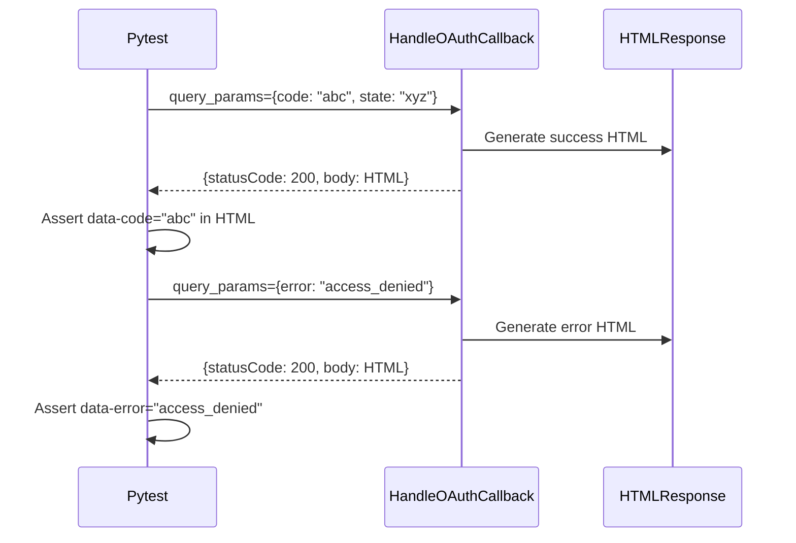

# 1262 - Test: Add Lambda OAuth Callback Endpoint Tests

## 1. Context & Goal
* **Issue:** #262
* **Objective:** Add unit tests for the `/auth/callback` OAuth endpoint used by Firefox extension.
* **Status:** Draft
* **Related Issues:** #256 (Firefox OAuth tabs-based flow), docs/reports/256/test-report.md

### Open Questions
*Questions that need clarification before or during implementation. Remove when resolved.*

- [x] What test framework? **pytest (existing infrastructure)**
- [x] Mock Lambda event structure? **Yes - no live Lambda invocation**
- [x] Test HTML output parsing? **Yes - verify data attributes**

## 2. Requirements

Per Test Gap Analysis 2026-01-10:

| ID | Requirement | Acceptance Criteria |
|----|-------------|---------------------|
| R1 | Unit tests for `handle_oauth_callback()` | Function tested in isolation |
| R2 | Valid code/state test | Returns HTML with data-code, data-state |
| R3 | Missing code test | Returns appropriate error HTML |
| R4 | Missing state test | Returns appropriate error HTML |
| R5 | Error parameter test | Returns error HTML with error message |
| R6 | HTML format validation | Response contains expected structure |
| R7 | Tests run in CI | Added to pytest suite |

## 3. Alternatives Considered

| Option | Pros | Cons | Decision |
|--------|------|------|----------|
| Unit tests (pytest) | Fast, isolated, no AWS cost | Doesn't test full Lambda integration | **Selected** |
| Integration tests (live Lambda) | Tests real deployment | Slow, requires credentials, flaky | Future consideration |
| E2E tests (Playwright) | Tests full Firefox flow | Complex setup, browser dependency | Covered by #256 tests |

**Rationale:** Unit tests provide fast, reliable coverage of the `handle_oauth_callback()` function logic without external dependencies. Integration tests can be added later.

## 4. Data & Fixtures

### 4.1 Data Sources

| Attribute | Value |
|-----------|-------|
| Source | Mock Lambda events (hardcoded) |
| Format | Python dicts mimicking API Gateway events |
| Size | ~10 test cases |
| Refresh | N/A (static fixtures) |
| Copyright/License | N/A |

### 4.2 Data Pipeline

```
pytest ──import──► lambda_auth_function.handle_oauth_callback() ──return──► Assert response
```

No external services required.

### 4.3 Test Fixtures

| Fixture | Source | Notes |
|---------|--------|-------|
| Valid OAuth callback params | Hardcoded | code=test_auth_code, state=test_state |
| Error params | Hardcoded | error=access_denied |
| Missing params | Hardcoded | Empty dicts |

### 4.4 Deployment Pipeline

Tests only - no deployment changes.

## 5. Diagram



## 6. Technical Approach

* **Module:** `tests/unit/test_lambda_auth_callback.py` (new file)
* **Dependencies:** pytest, html (for XSS fix), beautifulsoup4 (for HTML parsing)
* **Pattern:** Direct function call testing (no moto/localstack)

### 6.0 Security Fix Required (XSS)

**MANDATORY:** Before writing tests, fix the XSS vulnerability in `handle_oauth_callback()`:

```python
# src/lambda_auth_function.py - REQUIRED FIX
import html

def handle_oauth_callback(query_params: dict) -> dict:
    code = html.escape(query_params.get("code", ""))
    state = html.escape(query_params.get("state", ""))
    error = html.escape(query_params.get("error", ""))
    error_description = html.escape(query_params.get("error_description", ""))
    # ... rest of function
```

This fix MUST be applied as part of this issue. Tests will verify escaping works correctly.

### 6.1 Test File Structure

```python
# tests/unit/test_lambda_auth_callback.py
"""
Unit tests for handle_oauth_callback() - Firefox OAuth redirect endpoint.

Issue #262: Lambda OAuth callback endpoint tests.
See: src/lambda_auth_function.py handle_oauth_callback()
"""

import pytest
import re
from src.lambda_auth_function import handle_oauth_callback


class TestOAuthCallback:
    """Tests for GET /auth/callback endpoint."""

    def test_valid_code_and_state(self):
        """Happy path: LinkedIn returns code and state."""
        query_params = {"code": "test_auth_code_123", "state": "test_state_abc"}

        response = handle_oauth_callback(query_params)

        assert response["statusCode"] == 200
        assert "text/html" in response["headers"]["Content-Type"]

        body = response["body"]
        assert "Login Successful" in body
        assert 'data-code="test_auth_code_123"' in body
        assert 'data-state="test_state_abc"' in body

    def test_missing_code(self):
        """Code parameter missing - returns success HTML with empty code."""
        query_params = {"state": "test_state_abc"}

        response = handle_oauth_callback(query_params)

        assert response["statusCode"] == 200
        body = response["body"]
        # Empty code still renders (extension handles validation)
        assert 'data-code=""' in body

    def test_missing_state(self):
        """State parameter missing - returns success HTML with empty state."""
        query_params = {"code": "test_auth_code_123"}

        response = handle_oauth_callback(query_params)

        assert response["statusCode"] == 200
        body = response["body"]
        assert 'data-state=""' in body

    def test_empty_params(self):
        """Both parameters missing - returns success HTML with empty values."""
        query_params = {}

        response = handle_oauth_callback(query_params)

        assert response["statusCode"] == 200
        body = response["body"]
        assert 'data-code=""' in body
        assert 'data-state=""' in body

    def test_error_from_linkedin(self):
        """User denied access - LinkedIn returns error."""
        query_params = {
            "error": "access_denied",
            "error_description": "User denied access"
        }

        response = handle_oauth_callback(query_params)

        assert response["statusCode"] == 200
        body = response["body"]
        assert "Login Failed" in body
        assert 'data-error="access_denied"' in body
        assert "User denied access" in body

    def test_error_without_description(self):
        """Error without description - shows error code only."""
        query_params = {"error": "server_error"}

        response = handle_oauth_callback(query_params)

        assert response["statusCode"] == 200
        body = response["body"]
        assert "Login Failed" in body
        assert 'data-error="server_error"' in body

    def test_html_structure_success(self):
        """Verify success HTML has required structure for extension parsing."""
        query_params = {"code": "abc", "state": "xyz"}

        response = handle_oauth_callback(query_params)
        body = response["body"]

        # Required elements for extension
        assert "<title>Aletheia" in body
        assert 'id="oauth-result"' in body
        assert "data-code=" in body
        assert "data-state=" in body

    def test_html_structure_error(self):
        """Verify error HTML has required structure."""
        query_params = {"error": "test_error"}

        response = handle_oauth_callback(query_params)
        body = response["body"]

        assert "<title>Aletheia" in body
        assert 'id="oauth-result"' in body
        assert "data-error=" in body

    def test_xss_prevention_code(self):
        """Code parameter with XSS attempt is HTML-escaped."""
        query_params = {
            "code": '<script>alert("xss")</script>',
            "state": "safe"
        }

        response = handle_oauth_callback(query_params)
        body = response["body"]

        # Raw script tags MUST NOT appear - must be escaped
        assert response["statusCode"] == 200
        assert "<script>" not in body
        assert "&lt;script&gt;" in body  # Escaped version present

    def test_xss_prevention_error(self):
        """Error description with XSS attempt is HTML-escaped."""
        query_params = {
            "error": "test",
            "error_description": '<script>alert("xss")</script>'
        }

        response = handle_oauth_callback(query_params)
        body = response["body"]

        # Raw script tags MUST NOT appear - must be escaped
        assert response["statusCode"] == 200
        assert "<script>" not in body
        assert "&lt;script&gt;" in body  # Escaped version present
```

### 6.2 Import Path Setup

Ensure `src/` is in Python path via `conftest.py`:

```python
# tests/conftest.py (if not already present)
import sys
from pathlib import Path

sys.path.insert(0, str(Path(__file__).parent.parent / "src"))
```

## 7. Interface Specification

### 7.1 Data Structures

```python
# Input: query_params dict
QueryParams = dict[str, str]  # {"code": "...", "state": "...", "error": "..."}

# Output: Lambda response dict
LambdaResponse = TypedDict('LambdaResponse', {
    'statusCode': int,
    'headers': dict[str, str],
    'body': str,  # HTML content
})
```

### 7.2 Function Signatures

```python
def handle_oauth_callback(query_params: dict) -> dict:
    """
    Handle GET /auth/callback - OAuth redirect endpoint for Firefox.

    Args:
        query_params: Dict with code, state, error, error_description

    Returns:
        Lambda response with HTML body
    """
    ...
```

### 7.3 Logic Flow (Pseudocode)

```
1. Extract code, state, error, error_description from query_params
2. IF error present:
   - Generate error HTML with error message
3. ELSE:
   - Generate success HTML with code and state in data attributes
4. Return {statusCode: 200, headers: {Content-Type: text/html}, body: HTML}
```

## 8. Security Considerations

| Concern | Mitigation | Status |
|---------|------------|--------|
| XSS in HTML output | **MANDATORY:** Apply `html.escape()` to all params | TODO (Required) |
| Code/state injection | Values in data attributes only (not executed) | Addressed |
| Open redirect | No redirect - returns static HTML | N/A |

**Fail Mode:** Fail Safe - Invalid params return HTML (extension handles validation).

**IMPORTANT:** The XSS fix in Section 6.0 is MANDATORY. This issue cannot be closed without applying `html.escape()` to all user-provided parameters in `handle_oauth_callback()`.

## 9. Performance Considerations

| Metric | Budget | Approach |
|--------|--------|----------|
| Test execution | < 1s total | Direct function calls, no I/O |
| CI overhead | < 5s | Fast unit tests |

**Bottlenecks:** None - pure Python function tests.

## 10. Risks & Mitigations

| Risk | Impact | Likelihood | Mitigation |
|------|--------|------------|------------|
| Function signature changes | Low | Low | Tests import directly, will fail loudly |
| HTML format changes | Med | Low | Tests check key attributes, not full HTML |
| Missing edge cases | Low | Med | Start with documented cases, add as found |

## 11. Verification & Testing

### 11.1 Test Scenarios

| ID | Scenario | Type | Input | Expected Output | Pass Criteria |
|----|----------|------|-------|-----------------|---------------|
| 010 | Valid code and state | Auto | {code, state} | Success HTML | data-code, data-state present |
| 020 | Missing code | Auto | {state only} | Success HTML | data-code="" |
| 030 | Missing state | Auto | {code only} | Success HTML | data-state="" |
| 040 | Empty params | Auto | {} | Success HTML | Empty attributes |
| 050 | Error from LinkedIn | Auto | {error, description} | Error HTML | data-error, message shown |
| 060 | Error no description | Auto | {error only} | Error HTML | data-error present |
| 070 | HTML structure (success) | Auto | Valid params | Complete HTML | Required elements |
| 080 | HTML structure (error) | Auto | Error params | Complete HTML | Required elements |
| 090 | XSS in code escaped | Auto | XSS payload | Escaped HTML | `&lt;script&gt;` in body |
| 100 | XSS in error escaped | Auto | XSS payload | Escaped HTML | `&lt;script&gt;` in body |

### 11.2 Test Commands

```bash
# Run OAuth callback tests only
poetry run pytest tests/unit/test_lambda_auth_callback.py -v

# Run with coverage
poetry run pytest tests/unit/test_lambda_auth_callback.py -v --cov=src.lambda_auth_function --cov-report=term-missing

# Run all auth tests
poetry run pytest tests/unit/ -k "auth" -v
```

### 11.3 Manual Tests

N/A - All scenarios automated.

## 12. Definition of Done

### Code
- [ ] **XSS FIX:** `html.escape()` applied to all params in `handle_oauth_callback()`
- [ ] `tests/unit/test_lambda_auth_callback.py` created
- [ ] All 10 test scenarios implemented
- [ ] Tests pass locally

### Tests
- [ ] `pytest tests/unit/test_lambda_auth_callback.py` passes
- [ ] XSS prevention tests verify proper escaping
- [ ] Coverage > 90% for `handle_oauth_callback()`
- [ ] Tests run in CI (GitHub Actions)

### Documentation
- [ ] Test file has docstrings explaining each test
- [ ] Issue #262 linked in test file header

### Review
- [ ] Code review completed
- [ ] Gemini review passed

---

## Appendix: Review Log

*Track all review feedback with timestamps and implementation status.*

### Gemini Review #1 (REJECTED)

**Timestamp:** 2026-01-10
**Reviewer:** Gemini 3 Pro Preview
**Verdict:** REJECTED

#### Comments

| ID | Comment | Implemented? |
|----|---------|--------------|
| G1.1 | "[BLOCKING] Test file at wrong path - should be tests/unit/" | ✅ YES - Moved to tests/unit/ |
| G1.2 | "[HIGH] XSS vulnerability should be fixed, not documented" | ✅ YES - Section 6.0 mandates fix |
| G1.3 | "[SUGGESTION] Use BeautifulSoup for HTML parsing" | ⏳ PENDING - Consider during implementation |

### Gemini Review #2 (APPROVED)

**Timestamp:** 2026-01-10
**Reviewer:** Gemini 3 Pro Preview
**Verdict:** APPROVED

#### Comments

| ID | Comment | Implemented? |
|----|---------|--------------|
| G2.1 | "All prior issues resolved" | ✅ YES |

### Review Summary

| Review | Date | Verdict | Key Issue |
|--------|------|---------|-----------|
| Gemini #1 | 2026-01-10 | REJECTED | Test path + XSS fix required |
| Gemini #2 | 2026-01-10 | APPROVED | All issues resolved |

**Final Status:** APPROVED
