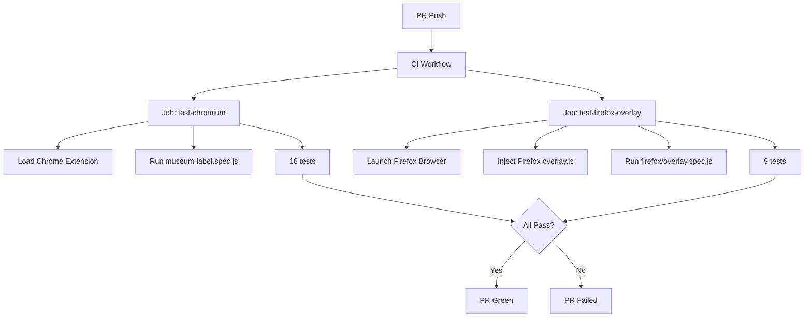

# 1265 - Test: Firefox overlay.js E2E Tests

## 1. Context & Goal
* **Issue:** #265
* **Objective:** Add E2E tests for Firefox overlay.js to verify rendering and behavior in Firefox.
* **Status:** Draft
* **Related Issues:** #125 (Museum Label UI), #197 (Shadow DOM hardening)

### Open Questions
*Questions that need clarification before or during implementation. Remove when resolved.*

- [x] ~~Should tests run against actual Firefox browser or inject into Chromium?~~ **Use Firefox browser for authentic rendering**
- [x] ~~Do we need full extension loading or script injection?~~ **Script injection (matches museum-label approach)**
- [ ] Should we run Firefox tests on every PR or only on schedule?

### Key Finding

Chrome and Firefox `overlay.js` are **functionally identical** (diff shows only comment changes). The tests validate:
1. Firefox rendering engine compatibility
2. Shadow DOM behavior in Firefox
3. CSS rendering differences

## 2. Requirements

Per Issue #265:
1. Firefox overlay E2E tests created
2. Museum label rendering tested in Firefox
3. Shadow DOM isolation verified
4. Overlay dismiss behavior tested
5. CI runs Firefox E2E tests

## 3. Alternatives Considered

| Option | Pros | Cons | Decision |
|--------|------|------|----------|
| Full Firefox extension loading | Tests real extension flow | Playwright Firefox extension support is limited | Rejected |
| Script injection (like museum-label) | Simple, proven approach | Doesn't test manifest/popup | **Selected** |
| Selenium with Firefox | Full extension support | Different test framework | Rejected (maintenance burden) |
| Skip Firefox overlay tests | Less work | Leaves gap in coverage | Rejected |

**Rationale:** Script injection approach is already proven in museum-label.spec.js. Since overlay.js is nearly identical between browsers, the main value is verifying Firefox rendering engine compatibility.

## 4. Technical Approach

### 4.1 Test Strategy

Reuse the same test patterns from `museum-label.spec.js` but:
1. Run against Firefox browser (`browserName: 'firefox'`)
2. Inject Firefox's `overlay.js` instead of Chrome's
3. Use same fixtures and assertions

### 4.2 Playwright Configuration

Add Firefox project to `playwright.config.js`:

```javascript
projects: [
  {
    name: 'chromium',
    use: { browserName: 'chromium', headless: false }
  },
  {
    name: 'firefox-overlay',
    use: {
      browserName: 'firefox',
      headless: true  // Firefox doesn't need extension loading
    }
  }
]
```

### 4.3 Test File Structure

Create `tests/e2e/firefox/overlay.spec.js`:
- Import shared helpers from museum-label (or create common utils)
- Point to Firefox overlay.js path
- Run subset of critical tests (not full duplication)

### 4.4 Critical Tests to Port

| Test ID | Description | Priority |
|---------|-------------|----------|
| 010 | Neutral badge rendering | HIGH |
| 020 | Warning badge rendering | HIGH |
| 030 | Block badge rendering | HIGH |
| 040 | Gem appears on hover | MEDIUM |
| 060 | Context expand/collapse | MEDIUM |
| 100 | Close button works | HIGH |
| 110 | Escape key closes | HIGH |
| 130 | Focus management | MEDIUM |
| 160 | XSS prevention | HIGH |

Total: 9 tests (vs 16 in Chrome) - focuses on rendering and security.

## 5. Diagram



## 6. Implementation Details

### 6.1 Helper Module

Create `tests/e2e/helpers/overlay-helpers.js`:

```javascript
// Shared helpers for overlay E2E tests
// Extracted from museum-label.spec.js

async function injectOverlay(page, browser = 'chrome') {
  const overlayPath = browser === 'firefox'
    ? path.join(__dirname, '../../../extensions/firefox/overlay.js')
    : path.join(__dirname, '../../../extensions/chrome/overlay.js');
  await page.addScriptTag({ path: overlayPath });
  await page.waitForFunction(() => window.showAletheiaResult !== undefined);
}

async function shadowQuery(page, selector) { /* ... */ }
async function shadowClick(page, selector) { /* ... */ }
async function isOverlayVisible(page) { /* ... */ }

module.exports = { injectOverlay, shadowQuery, shadowClick, isOverlayVisible };
```

### 6.2 Firefox Test File

```javascript
// tests/e2e/firefox/overlay.spec.js
const { test, expect } = require('@playwright/test');
const { injectOverlay, shadowQuery, isOverlayVisible } = require('../helpers/overlay-helpers');

test.describe('Firefox Overlay (#265)', () => {
  test.beforeEach(async ({ page }) => {
    await page.goto('/test-museum-label.html');
    await page.waitForLoadState('domcontentloaded');
  });

  // Critical rendering tests
  test('010: Neutral badge renders correctly', async ({ page }) => { /* ... */ });
  test('020: Warning badge renders correctly', async ({ page }) => { /* ... */ });
  // ... etc
});
```

## 7. Risks & Mitigations

| Risk | Likelihood | Impact | Mitigation |
|------|------------|--------|------------|
| Shadow DOM behaves differently in Firefox | Low | Medium | Tests will catch this |
| CSS rendering differences | Medium | Low | Visual comparison in tests |
| Firefox headless mode quirks | Low | Medium | Use headed mode if needed |
| CI Firefox installation issues | Low | High | Use official Playwright Firefox |

## 8. Acceptance Criteria

- [ ] `tests/e2e/firefox/overlay.spec.js` created
- [ ] `tests/e2e/helpers/overlay-helpers.js` extracted
- [ ] 9 Firefox overlay tests pass
- [ ] CI runs Firefox overlay tests
- [ ] No regression in existing Chrome tests
- [ ] Test report documents Firefox-specific findings

## 9. Out of Scope

- Full Firefox extension loading in Playwright
- Firefox popup.js E2E tests (separate issue)
- Visual regression comparison Chrome vs Firefox
- Firefox Developer Edition specific testing
