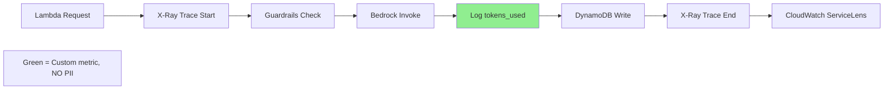

# 10007 - Chore: Observability Tracing

## 1. Context & Goal
* **Issue:** #7
* **Objective:** Add observability and tracing to Lambda functions.
* **Status:** **READY FOR IMPLEMENTATION (MVP Version)**

### Orchestrator Decision (2026-01-06)

**Verdict: IMPLEMENT (MVP Version)**

**Reasoning:** If the Lambda breaks for a user in Germany, you need to know why.

---

### Resolved Questions (Orchestrator 2026-01-06)

#### Tool Selection Questions
- [x] **Q1:** AWS X-Ray (native, simple) vs OpenTelemetry (vendor-agnostic, complex)?
  - **Answer: AWS X-Ray**
  - Why: Native to Lambda. Just check a box in provision.sh ("Active Tracing") and add one library (`aws-xray-sdk`). Zero infrastructure to manage.

- [x] **Q2:** Do we need distributed tracing across extension + Lambda, or Lambda-only?
  - **Answer: Lambda-Only**
  - Why: Distributed tracing from Chrome Extension is insecure (exposes API keys) and hard to correlate.

- [x] **Q3:** What visualization tool?
  - **Answer: CloudWatch ServiceLens**
  - Why: Native, free-ish, no additional setup.

#### Metrics Questions
- [x] **Q4:** What metrics are essential?
  - **Answer:**
    1. **Duration** (Latency)
    2. **Error Rate** (500s)
    3. **Throttles** (Are we hitting concurrency limits?)
    4. **Bedrock Token Count** (Custom Metric - crucial for cost)

- [x] **Q5:** What's the retention period for traces?
  - **Answer: 14 Days**
  - Why: Matches our "delete data fast" privacy stance.

- [x] **Q6:** Do we need custom metrics?
  - **Answer:** Yes - Bedrock `tokens_used` and `model_id` (for cost tracking)

#### Alerting Questions
- [ ] **Q7:** What conditions should trigger alerts?
  - **Deferred** - Alerting is premature before launch. Implement after baseline established.

- [ ] **Q8:** Where do alerts go?
  - **Deferred** - No on-call structure yet.

- [ ] **Q9:** Who is on-call?
  - **Deferred** - Premature before launch.

#### Cost Questions
- [ ] **Q10:** What's the estimated monthly cost?
  - **Answer:** Minimal with 5% sampling. X-Ray free tier: 100K traces/month.

- [x] **Q11:** Is sampling required to control costs?
  - **Answer: 5% Sampling**
  - Why: 100% tracing is expensive and slows down Lambda. 5% gives enough signal to debug trends.

#### Privacy Questions
- [x] **Q12:** Are we accidentally logging PII in traces?
  - **Answer: STRICT BAN**
  - Rule: X-Ray trace must **NEVER** record prompt or completion text as metadata. Only record `tokens_used` and `model_id`.

- [x] **Q13:** What's the log retention policy?
  - **Answer: 14 Days** (Same as trace retention)

---

## 2. Requirements

| ID | Requirement | Acceptance Criteria |
|----|-------------|---------------------|
| R1 | Enable AWS X-Ray on Lambda | Active tracing enabled in provision.sh |
| R2 | Install aws-xray-sdk | Added to pyproject.toml |
| R3 | 5% sampling rate | Configured in X-Ray settings |
| R4 | 14-day retention | CloudWatch log retention set |
| R5 | Custom metric: tokens_used | Logged to CloudWatch Metrics |
| R6 | Custom metric: model_id | Logged to CloudWatch Metrics |
| R7 | **NO PII in traces** | Never log prompt/completion text |

## 3. Technical Approach

* **Module:** `src/lambda_function.py` (instrumentation)
* **Infrastructure:** `provision.sh` (X-Ray enablement)
* **Dependencies:** `aws-xray-sdk` (pip/poetry)
* **Performance Budget:** < 5ms overhead

### 3.1 Enable X-Ray in provision.sh

```bash
# provision.sh - Add to Lambda configuration
aws lambda update-function-configuration \
    --function-name AletheiaLambda \
    --tracing-config Mode=Active
```

Or in SAM template:
```yaml
Tracing: Active
```

### 3.2 Install X-Ray SDK

```bash
poetry add aws-xray-sdk
```

### 3.3 Lambda Instrumentation

```python
# src/lambda_function.py
from aws_xray_sdk.core import xray_recorder
from aws_xray_sdk.core import patch_all
import json

# Patch boto3 for automatic tracing
patch_all()

# Configure sampling (5%)
xray_recorder.configure(sampling=True)

def lambda_handler(event, context):
    # Create subsegment for Bedrock call
    with xray_recorder.in_subsegment('bedrock_invoke') as subsegment:
        response = invoke_bedrock(prompt)

        # Log custom metrics (NO PII - only counts)
        subsegment.put_annotation('model_id', 'anthropic.claude-3-sonnet')
        subsegment.put_metadata('tokens_used', response.get('usage', {}).get('total_tokens', 0))

        # STRICT BAN: Never log prompt or completion text
        # subsegment.put_metadata('prompt', prompt)  # FORBIDDEN
        # subsegment.put_metadata('response', response)  # FORBIDDEN

    return response
```

### 3.4 CloudWatch Custom Metrics

```python
# src/lambda_function.py
import boto3

cloudwatch = boto3.client('cloudwatch')

def log_bedrock_metrics(tokens_used: int, model_id: str):
    """Log custom metrics for cost tracking. NO PII."""
    cloudwatch.put_metric_data(
        Namespace='Aletheia',
        MetricData=[
            {
                'MetricName': 'BedrockTokensUsed',
                'Value': tokens_used,
                'Unit': 'Count',
                'Dimensions': [
                    {'Name': 'ModelId', 'Value': model_id}
                ]
            }
        ]
    )
```

### 3.5 Sampling Configuration

```python
# sampling_rules.json (deploy with Lambda)
{
    "version": 2,
    "rules": [
        {
            "description": "Default 5% sampling",
            "host": "*",
            "http_method": "*",
            "url_path": "*",
            "fixed_target": 1,
            "rate": 0.05
        }
    ],
    "default": {
        "fixed_target": 1,
        "rate": 0.05
    }
}
```

### 3.6 Log Retention

```bash
# Set CloudWatch log retention to 14 days
aws logs put-retention-policy \
    --log-group-name /aws/lambda/AletheiaLambda \
    --retention-in-days 14
```

## 4. Diagram



## 5. Verification & Testing

### 5.1 Test Scenarios

| ID | Scenario | Type | Input | Expected Output | Pass Criteria |
|----|----------|------|-------|-----------------|---------------|
| 010 | X-Ray trace created | Manual | Invoke Lambda | Trace in ServiceLens | Trace visible |
| 020 | Custom metric logged | Manual | Invoke Lambda | BedrockTokensUsed metric | CloudWatch shows data |
| 030 | No PII in trace | Auto | Grep traces for prompt text | No matches | Zero PII leaked |
| 040 | 5% sampling works | Manual | 100 invocations | ~5 traces | Sampling ratio correct |
| 050 | 14-day retention | Manual | Check log group | Retention = 14 | Correctly configured |

### 5.2 Test Commands

```bash
# Verify X-Ray is enabled
aws lambda get-function-configuration \
    --function-name AletheiaLambda \
    --query 'TracingConfig.Mode'

# Get recent traces
aws xray get-trace-summaries \
    --start-time $(date -d '1 hour ago' +%s) \
    --end-time $(date +%s)

# Check custom metrics
aws cloudwatch get-metric-statistics \
    --namespace Aletheia \
    --metric-name BedrockTokensUsed \
    --start-time $(date -d '1 hour ago' -Iseconds) \
    --end-time $(date -Iseconds) \
    --period 300 \
    --statistics Sum

# Verify log retention
aws logs describe-log-groups \
    --log-group-name-prefix /aws/lambda/AletheiaLambda \
    --query 'logGroups[0].retentionInDays'

# PII audit - MUST return empty
aws xray get-trace-summaries --start-time ... | grep -i "prompt\|completion\|input"
```

### 5.3 Manual Smoke Test

1. Deploy Lambda with X-Ray enabled
2. Invoke Lambda via extension
3. Open CloudWatch ServiceLens
4. Verify trace appears with subsegments (bedrock_invoke)
5. Verify `tokens_used` annotation present
6. Verify **NO prompt/completion text** in trace metadata
7. Check CloudWatch Metrics for `Aletheia/BedrockTokensUsed`

## 6. Definition of Done

### Infrastructure
- [ ] X-Ray Active Tracing enabled in provision.sh
- [ ] `aws-xray-sdk` added to pyproject.toml
- [ ] Sampling rules configured (5%)
- [ ] CloudWatch log retention set to 14 days

### Code
- [ ] Lambda instrumented with `xray_recorder`
- [ ] Bedrock call wrapped in subsegment
- [ ] Custom metrics: `tokens_used`, `model_id`
- [ ] **VERIFIED: No PII in traces**

### Tests
- [ ] Trace appears in ServiceLens
- [ ] Custom metrics appear in CloudWatch
- [ ] PII audit passes (grep returns empty)

### Documentation
- [ ] 0812-audit-performance.md updated with tracing info
- [ ] AgentOS:audits/0802-privacy-audit updated (trace retention policy)

---

## Appendix: Review History

| Date | Reviewer | Verdict |
|------|----------|---------|
| 2026-01-05 | Gemini 3 Pro | DEFER (stub) |
| 2026-01-06 | Orchestrator | **IMPLEMENT (MVP)** |

---

## Appendix: Privacy Checklist

**Before merging, verify:**

- [ ] `subsegment.put_metadata('prompt', ...)` does NOT exist in code
- [ ] `subsegment.put_metadata('response', ...)` does NOT exist in code
- [ ] `subsegment.put_metadata('input', ...)` does NOT exist in code
- [ ] `subsegment.put_annotation('text', ...)` does NOT exist in code
- [ ] Only safe metadata: `tokens_used`, `model_id`, `duration`, `status_code`

**If any PII is found in traces during code review: BLOCK THE PR.**
