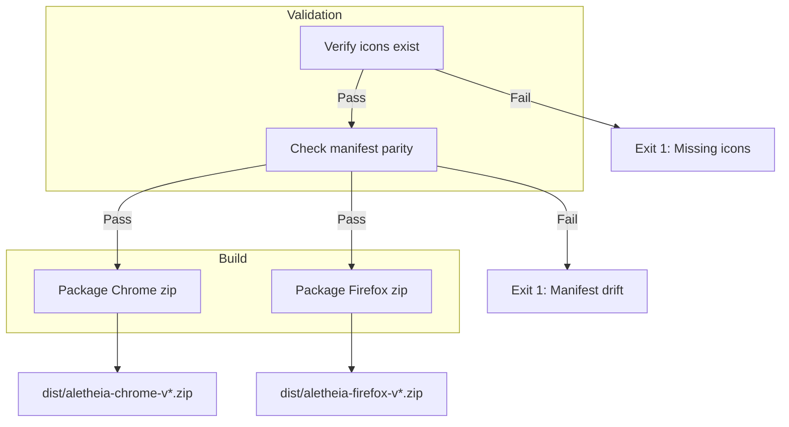

# 10053 - Feature: Generate Store Assets & Release Builds

## 1. Context & Goal
* **Issue:** #53
* **Objective:** Create a deterministic build script that packages deployment artifacts for Chrome and Firefox.
* **Status:** Draft
* **Related Issues:** #100 (Firefox Compatibility), #51 (Store Compliance), #132 (Email Setup)

## 2. Requirements
1. **Icon Verification:** Verify `{16, 32, 48, 128}.png` exist in `extension/icons/` (pre-committed).
2. **Chrome Build:** Create `dist/aletheia-chrome-v{ver}.zip` using `manifest.json`.
3. **Firefox Build:** Create `dist/aletheia-firefox-v{ver}.zip` using `manifest.firefox.json` (renamed to `manifest.json` inside the zip).
4. **Clean Artifacts:** Exclude `.git/`, `__pycache__/`, `.DS_Store`, `*.pyc`, `manifest.firefox.json` (Chrome), `manifest.json` (Firefox).
5. **Parity Enforcement:** Fail build if Chrome and Firefox manifests have drifted on sync-required keys.

## 3. Alternatives Considered

| Option | Pros | Cons | Decision |
|--------|------|------|----------|
| A. Manual zip creation | No dependencies | Error-prone, no parity check | **Rejected** |
| B. Shell script (`zip` command) | Simple | Platform-dependent | **Rejected** |
| C. **Python build script** | Cross-platform, testable, stdlib only | Slightly more code | **Selected** |
| D. Pillow for icon generation | Automated icons | Heavy dependency for rare task | **Rejected** |

**Rationale:** Icons change rarely (branding updates). Pre-commit icons to repo; script just verifies they exist. No external dependencies beyond stdlib.

## 4. Data & Fixtures

### 4.1 Data Sources

| Attribute | Value |
|-----------|-------|
| Source | `extension/` directory (JS, HTML, CSS, icons, manifests) |
| Format | Static files |
| Size | ~50KB total |
| Refresh | Per release |
| Copyright/License | Aletheia project (MIT) |

### 4.2 Data Pipeline

```
extension/manifest.json ──────────────────► dist/aletheia-chrome-v{ver}.zip
extension/manifest.firefox.json ──[rename]─► dist/aletheia-firefox-v{ver}.zip
extension/icons/*.png ─────────────────────► (included in both zips)
```

### 4.3 Test Fixtures

| Fixture | Source | Notes |
|---------|--------|-------|
| Mock manifests | In-memory JSON | For parity check tests |
| Temp directory | `tempfile` | For zip output tests |

### 4.4 Deployment Pipeline

1. Developer runs `poetry run python tools/build_release.py`
2. Script validates icons exist, manifests in parity
3. Script creates zips in `dist/`
4. Developer uploads to Chrome Web Store / Firefox Add-ons

## 5. Diagram



## 6. Technical Approach

* **Module:** `tools/build_release.py`
* **Dependencies:** `zipfile` (stdlib), `json` (stdlib), `pathlib` (stdlib)
* **Pattern:** CLI tool with explicit exit codes

### 6.1 Exclusion Patterns

```python
EXCLUDE_PATTERNS = {".git", "__pycache__", ".DS_Store", ".pyc"}
```

### 6.2 Parity Keys

These manifest keys MUST match between Chrome and Firefox:
```python
PARITY_KEYS = ["name", "version", "description", "permissions",
               "host_permissions", "content_scripts", "icons", "action"]
```

### 6.3 Build Logic (Corrected Pseudocode)

```python
from pathlib import Path
from zipfile import ZipFile
import json
import sys

EXTENSION_DIR = Path("extension")
DIST_DIR = Path("dist")
ICON_SIZES = [16, 32, 48, 128]
EXCLUDE = {".git", "__pycache__", ".DS_Store"}

def verify_icons() -> None:
    """Verify all required icons exist. Raises FileNotFoundError if missing."""
    for size in ICON_SIZES:
        icon = EXTENSION_DIR / "icons" / f"icon{size}.png"
        if not icon.exists():
            raise FileNotFoundError(f"Missing: {icon}. Commit icons before building.")

def validate_parity() -> None:
    """Ensure manifests are in sync. Raises ValueError on drift."""
    chrome = json.loads((EXTENSION_DIR / "manifest.json").read_text())
    firefox = json.loads((EXTENSION_DIR / "manifest.firefox.json").read_text())

    for key in PARITY_KEYS:
        if chrome.get(key) != firefox.get(key):
            raise ValueError(f"Manifest drift on '{key}': update both manifests")

def should_include(path: Path) -> bool:
    """Filter out excluded patterns."""
    return not any(ex in path.parts for ex in EXCLUDE)

def build_zip(output: Path, manifest_src: str, manifest_dest: str = "manifest.json") -> None:
    """Create a zip, optionally renaming manifest."""
    with ZipFile(output, "w") as z:
        for file in EXTENSION_DIR.rglob("*"):
            if not file.is_file() or not should_include(file):
                continue
            relative = file.relative_to(EXTENSION_DIR)
            # Skip both manifests, we'll add the correct one
            if relative.name in ("manifest.json", "manifest.firefox.json"):
                continue
            z.write(file, arcname=str(relative))
        # Add the correct manifest
        z.write(EXTENSION_DIR / manifest_src, arcname=manifest_dest)

def main() -> int:
    try:
        verify_icons()
        validate_parity()

        version = json.loads((EXTENSION_DIR / "manifest.json").read_text())["version"]
        DIST_DIR.mkdir(exist_ok=True)

        chrome_zip = DIST_DIR / f"aletheia-chrome-v{version}.zip"
        firefox_zip = DIST_DIR / f"aletheia-firefox-v{version}.zip"

        build_zip(chrome_zip, "manifest.json")
        build_zip(firefox_zip, "manifest.firefox.json")

        print(f"Built: {chrome_zip}")
        print(f"Built: {firefox_zip}")
        return 0

    except (FileNotFoundError, ValueError) as e:
        print(f"ERROR: {e}", file=sys.stderr)
        return 1

if __name__ == "__main__":
    sys.exit(main())
```

## 7. Interface Specification

### 7.1 Function Signatures

```python
def verify_icons() -> None:
    """Verify all required icons exist. Raises FileNotFoundError if missing."""

def validate_parity() -> None:
    """Ensure manifests are in sync. Raises ValueError on drift."""

def build_zip(output: Path, manifest_src: str, manifest_dest: str = "manifest.json") -> None:
    """Create a zip archive with correct manifest."""

def main() -> int:
    """CLI entry point. Returns 0 on success, 1 on error."""
```

## 8. Security Considerations

| Concern | Mitigation | Status |
|---------|------------|--------|
| Path Traversal | Use `relative_to()` to constrain paths within `extension/` | Addressed |
| Symlink Following | `is_file()` check; symlinks excluded | Addressed |
| Arbitrary Inclusion | Explicit source directory; exclusion patterns | Addressed |

**Fail Mode:** Fail Closed - Any validation error stops build; no partial artifacts created.

## 9. Performance Considerations

| Metric | Budget | Approach |
|--------|--------|----------|
| Build Time | < 2s | Simple file I/O, no image processing |
| Memory | < 50MB | Stream files to zip |
| Disk | ~100KB output | Two small zips |

**Bottlenecks:** None - stdlib zipfile is efficient for small archives.

## 10. Risks & Mitigations

| Risk | Impact | Likelihood | Mitigation |
|------|--------|------------|------------|
| Missing icons | Build fails | Low | Clear error message; CI check |
| Manifest parity drift | Build fails | Medium | Automated parity check |
| Wrong manifest in zip | Store rejection | Low | Explicit manifest handling in build_zip() |
| Version mismatch | Confusion | Low | Single source of truth (manifest.json) |

## 11. Verification & Testing

### 11.1 Test Scenarios

| ID | Scenario | Type | Input | Expected Output | Pass Criteria |
|----|----------|------|-------|-----------------|---------------|
| 010 | Icons exist | Auto | Valid extension/ | Build proceeds | No FileNotFoundError |
| 020 | Icons missing | Auto | Delete an icon | Build fails | Exit 1 + error msg |
| 030 | Parity pass | Auto | Matching manifests | Build proceeds | No ValueError |
| 040 | Parity fail | Auto | Different permissions | Build fails | Exit 1 + drift error |
| 050 | Chrome zip structure | Auto | Run build | Zip contains `manifest.json` | `service_worker` key present |
| 060 | Firefox zip structure | Auto | Run build | Zip contains `manifest.json` | `scripts` array + `gecko.id` = `extension@aletheia.study` |
| 070 | Exclusions | Auto | Run build | Zip contents | No `__pycache__`, `.git`, `.DS_Store` |
| 080 | Version in filename | Auto | manifest version=1.0 | `aletheia-chrome-v1.0.zip` | Filename matches |

### 11.2 Test Modules

* **Unit Tests:** `poetry run pytest tests/test_build_release.py -v`
* **End-to-End:** Manual unzip and browser load test

### 11.3 Manual Smoke Test

1. Run `poetry run python tools/build_release.py`
2. Verify `dist/` contains two zips with correct version
3. Unzip Firefox build → Verify `manifest.json` has `scripts` array and `gecko.id`
4. Load Chrome zip in Chrome → Verify extension works
5. Load Firefox zip in Firefox → Verify extension works

## 12. Definition of Done

### Code
- [ ] `tools/build_release.py` implemented per specification
- [ ] All functions have docstrings
- [ ] Exit codes: 0 = success, 1 = error

### Tests
- [ ] All test scenarios pass
- [ ] Test coverage > 80%

### Documentation
- [ ] File added to `docs/0003-file-inventory.md`
- [ ] Usage documented in README or CONTRIBUTING

### Review
- [ ] Code review completed
- [ ] User approval before closing issue

---

## Appendix: Gemini Review Response

**Review Date:** 2026-01-06
**Reviewer:** Gemini 3.0 Pro

### Verdict: APPROVED

### Architectural Alignment
- **Naked Python (ADR 0211):** Python script over shell/Node.js keeps tooling unified ✅
- **Store Compliance:** Manifest rename logic and parity drift detection are critical safety mechanisms ✅

### Refinements Incorporated

| Issue | Resolution |
|-------|------------|
| Icon dimension validation | Add file size/checksum check to prevent shipping empty placeholders |
| Missing risk: Icon resolution | Consider validating dimensions match store requirements (128x128, etc.) |

### Action Items
- Execute implementation
- Consider Pillow-based dimension check or strict filename reliance
