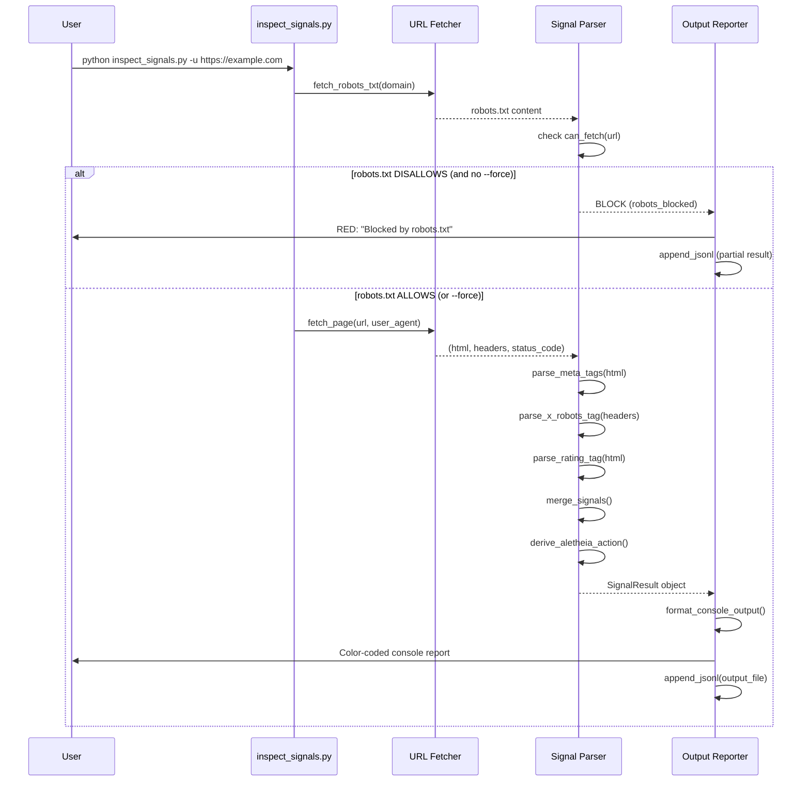

# 10084 - Tool: Signal Inspector CLI

## 1. Context & Goal
* **Issue:** #84
* **Objective:** Create a CLI tool to audit compliance signals (robots.txt, meta tags, headers) from target URLs
* **Status:** Complete (2026-01-01)
* **Related Issues:** #104 (age-restricted blocking), #105 (test site hosting)

## 2. Requirements

1. Accept single URL (`-u`) or batch file (`-f`) as input
2. Detect and report status of all signals defined in `docs/0007-signal-handling.md`
3. Output human-readable console report with color coding
4. Persist machine-readable JSONL records for pipeline consumption
5. Handle X-Robots-Tag HTTP headers (not just HTML meta tags)
6. Respect timeouts and fail gracefully on unreachable URLs

## 3. Alternatives Considered

| Option | Pros | Cons | Decision |
|--------|------|------|----------|
| Python + requests + BeautifulSoup | Standard stack, already in project | Requires manual header parsing | **Selected** |
| Scrapy framework | Built-in robots.txt handling | Overkill for read-only audit | Rejected |
| Playwright/headless browser | Sees JS-rendered content | Heavy dependency, slow | Rejected |

**Rationale:** The tool performs simple GET requests and HTML parsing. A lightweight approach with `requests` and `BeautifulSoup` is sufficient. JavaScript-rendered meta tags are rare and out of scope for MVP.

---

## 4. Critical Design Decisions

### 4.1 Signal Precedence Hierarchy

**Question:** If robots.txt says `Allow` but a meta tag says `noindex`, what is the result?

**Answer:** Signals are **reported independently**, but `robots.txt` acts as a **Gatekeeper** for execution.

#### The Gatekeeper Rule

`robots.txt` is checked **FIRST**. If it disallows access:
1. **Default behavior:** STOP. Do not fetch the page. Report `aletheia_action: BLOCK`.
2. **Override:** The `--force` flag bypasses the gatekeeper for audit purposes.

```
┌─────────────────────────────────────────────────────────────┐
│  EXECUTION ORDER (Gatekeeper Pattern)                       │
├─────────────────────────────────────────────────────────────┤
│  1. Fetch robots.txt                                        │
│  2. Check: Can we fetch this URL?                           │
│     ├── YES → Proceed to step 3                             │
│     └── NO  → STOP. action=BLOCK (unless --force)           │
│  3. Fetch page (HTML + headers)                             │
│  4. Parse meta tags, headers, rating                        │
│  5. Merge signals and derive action                         │
└─────────────────────────────────────────────────────────────┘
```

#### Signal Reporting (Independent Channels)

While `robots.txt` gates execution, all signals are **reported independently** for transparency:

```
Signal Sources (Independent):
├── robots.txt           → Reports: can_fetch (bool), directives (list)
├── HTML <meta> tags     → Reports: noindex, noarchive, nosnippet, noai (each bool)
├── X-Robots-Tag header  → Reports: same as meta tags (merged with HTML)
└── Rating meta tag      → Reports: adult_rated (bool)
```

**Rationale:**
- `robots.txt` controls crawler access to *paths* (Gatekeeper)
- Meta tags control *indexing/archiving behavior* (Policy signals)
- HTTP headers (`X-Robots-Tag`) are equivalent to meta tags but delivered at transport layer
- Reporting them independently preserves information for debugging

#### Merging Rule for Meta vs. Header

If a directive appears in EITHER the HTML meta tag OR the X-Robots-Tag header, it is considered **present**. This is the most restrictive interpretation ("No" trumps "Yes").

```
final_noarchive = html_meta_noarchive OR header_noarchive
```

### 4.2 JSONL Output Schema

Each line in the output file is a self-contained JSON object:

```json
{
  "timestamp": "2024-12-22T14:30:00Z",
  "url": "https://example.com/article",
  "fetch_status": "success",
  "http_status": 200,
  "signals": {
    "robots_txt": {
      "can_fetch_wildcard": true,
      "can_fetch_aletheia": null,
      "raw_directives": ["User-agent: *", "Disallow: /admin"]
    },
    "meta_tags": {
      "noindex": false,
      "noarchive": true,
      "nosnippet": false,
      "noai": false,
      "noimageai": false
    },
    "headers": {
      "x_robots_tag_present": true,
      "x_robots_tag_values": ["noarchive", "nosnippet"]
    },
    "rating": {
      "adult_rated": false,
      "raw_value": null
    },
    "merged": {
      "noindex": false,
      "noarchive": true,
      "nosnippet": true,
      "noai": false,
      "adult_blocked": false
    }
  },
  "aletheia_action": "TRANSFORM",
  "errors": []
}
```

**Schema Field Definitions:**

| Field | Type | Description |
|-------|------|-------------|
| `timestamp` | ISO 8601 string | UTC time of inspection |
| `url` | string | Canonical URL inspected |
| `fetch_status` | enum | `success`, `timeout`, `dns_error`, `http_error`, `parse_error` |
| `http_status` | int or null | HTTP response code (null if fetch failed) |
| `signals.robots_txt.can_fetch_wildcard` | bool or null | Result for `User-agent: *` |
| `signals.robots_txt.can_fetch_aletheia` | bool or null | Result for `User-agent: Aletheia` (null if not defined) |
| `signals.meta_tags.*` | bool | Presence of each directive in HTML |
| `signals.headers.x_robots_tag_present` | bool | Whether header exists |
| `signals.headers.x_robots_tag_values` | list[str] | Parsed directives from header |
| `signals.rating.adult_rated` | bool | True if `rating="adult"` or RTA pattern detected |
| `signals.merged.*` | bool | Combined result (meta OR header) |
| `aletheia_action` | enum | `ALLOW`, `TRANSFORM`, `BLOCK` per 0007 policy |
| `errors` | list[str] | Any parsing errors or warnings |

**Aletheia Action Derivation (per docs/0007 + Gatekeeper Rule):**

```python
# Gatekeeper check (highest priority)
if robots_blocked and not force_flag:
    action = "BLOCK"
    fetch_status = "robots_blocked"
    # Do NOT fetch page content
    return early

# Content-based signals (only if we fetched the page)
if merged.adult_blocked:
    action = "BLOCK"
elif merged.noarchive:
    action = "TRANSFORM"
else:
    action = "ALLOW"
```

### 4.3 X-Robots-Tag Header Handling

**Question:** How do we handle `X-Robots-Tag` headers?

**Answer:** Parse the header value(s) and merge with HTML meta tag results.

**Header Format (per Google spec):**
```
X-Robots-Tag: noindex
X-Robots-Tag: noarchive, nosnippet
X-Robots-Tag: googlebot: noindex
```

**Parsing Rules:**
1. Header may appear multiple times; collect all values
2. Values are comma-separated directives
3. User-agent prefix (e.g., `googlebot:`) is stripped; we care about the directive
4. Case-insensitive matching

**Implementation:**
```python
def parse_x_robots_tag(headers: dict) -> dict:
    """Extract directives from X-Robots-Tag header(s)."""
    values = headers.get('X-Robots-Tag', [])
    if isinstance(values, str):
        values = [values]

    directives = set()
    for value in values:
        # Split on comma, strip user-agent prefix if present
        for part in value.split(','):
            part = part.strip().lower()
            if ':' in part:
                part = part.split(':', 1)[1].strip()
            directives.add(part)

    return {
        'x_robots_tag_present': len(directives) > 0,
        'x_robots_tag_values': list(directives)
    }
```

### 4.4 User-Agent Strategy

**Question:** What User-Agent string should we use?

**Answer:** **Dual-mode inspection** with configurable default.

| Mode | User-Agent | Use Case |
|------|------------|----------|
| `--ua chrome` | Chrome 120 on Windows | See what real users see |
| `--ua aletheia` (default) | `AletheiaBot/1.0 (+https://aletheia.example.com/bot)` | Transparent identification |
| `--ua custom "..."` | User-provided string | Testing specific scenarios |

**Default Behavior:**
- Use `aletheia` mode by default (transparency)
- The `chrome` mode is for validation: "Are we being served different content?"

**Chrome User-Agent (Windows):**
```
Mozilla/5.0 (Windows NT 10.0; Win64; x64) AppleWebKit/537.36 (KHTML, like Gecko) Chrome/120.0.0.0 Safari/537.36
```

**Aletheia User-Agent:**
```
AletheiaBot/1.0 (Compliance Auditor; +https://github.com/user/aletheia)
```

### 4.5 Testing Strategy (Mocking)

**Question:** How do we test without spamming real websites?

**Answer:** Three-tier testing approach:

#### Tier 1: Unit Tests with `responses` Library

Mock HTTP responses entirely. No network calls.

```python
import responses

@responses.activate
def test_noarchive_detection():
    responses.add(
        responses.GET,
        "https://example.com/article",
        body='<html><head><meta name="robots" content="noarchive"></head></html>',
        status=200,
        headers={"Content-Type": "text/html"}
    )

    result = inspect_url("https://example.com/article")
    assert result["signals"]["meta_tags"]["noarchive"] is True
```

#### Tier 2: Integration Tests with Local Fixtures

Serve static HTML fixtures via `pytest-localserver` or Python's `http.server`.

**Fixture Files (`tests/fixtures/signal_inspector/`):**
```
├── noarchive.html          # <meta name="robots" content="noarchive">
├── noai.html               # <meta name="robots" content="noai">
├── adult_rated.html        # <meta name="rating" content="adult">
├── rta_label.html          # <meta name="rating" content="RTA-5042-...">
├── x_robots_header.html    # Served with X-Robots-Tag header
├── robots.txt              # Test robots.txt parsing
└── clean.html              # No restrictive signals
```

#### Tier 3: Manual Smoke Test with Known Sites

For final validation only, not automated:
- WSJ.com (known to have `noarchive`)
- Wikipedia (known to be permissive)

**Fixture Server Implementation:**
```python
# tests/conftest.py
import pytest
from http.server import HTTPServer, SimpleHTTPRequestHandler
import threading

class SignalTestHandler(SimpleHTTPRequestHandler):
    def end_headers(self):
        # Add X-Robots-Tag header for specific test file
        if 'x_robots_header' in self.path:
            self.send_header('X-Robots-Tag', 'noarchive, nosnippet')
        super().end_headers()

@pytest.fixture(scope="session")
def test_server():
    server = HTTPServer(('localhost', 0), SignalTestHandler)
    thread = threading.Thread(target=server.serve_forever)
    thread.daemon = True
    thread.start()
    yield f"http://localhost:{server.server_address[1]}"
    server.shutdown()
```

---

## 5. Diagram



---

## 6. Technical Approach

* **Module:** `tools/inspect_signals.py`
* **Dependencies:**
  - `requests` (HTTP client)
  - `beautifulsoup4` (HTML parsing)
  - `urllib.robotparser` (stdlib, robots.txt parsing)
  - `colorama` (cross-platform colored output)
* **Pattern:** Pipeline (Fetch → Parse → Report)

### 6.1 Module Structure

```
tools/
└── inspect_signals.py      # Main CLI entry point

src/
└── signal_inspector/       # Core logic (importable)
    ├── __init__.py
    ├── fetcher.py          # URL fetching with User-Agent handling
    ├── parser.py           # Signal extraction from HTML/headers
    ├── reporter.py         # Console and JSONL output
    └── models.py           # Data classes for SignalResult

tests/
├── fixtures/
│   └── signal_inspector/   # HTML test fixtures
└── test_signal_inspector.py
```

---

## 7. Interface Specification

### 7.1 Data Structures

```python
from dataclasses import dataclass
from typing import Optional
from datetime import datetime
from enum import Enum

class FetchStatus(Enum):
    SUCCESS = "success"
    ROBOTS_BLOCKED = "robots_blocked"  # Gatekeeper denied access
    TIMEOUT = "timeout"
    DNS_ERROR = "dns_error"
    HTTP_ERROR = "http_error"
    PARSE_ERROR = "parse_error"

class AletheiaAction(Enum):
    ALLOW = "ALLOW"
    TRANSFORM = "TRANSFORM"
    BLOCK = "BLOCK"

@dataclass
class RobotsTxtResult:
    can_fetch_wildcard: Optional[bool]
    can_fetch_aletheia: Optional[bool]
    raw_directives: list[str]

@dataclass
class MetaTagResult:
    noindex: bool
    noarchive: bool
    nosnippet: bool
    noai: bool
    noimageai: bool

@dataclass
class HeaderResult:
    x_robots_tag_present: bool
    x_robots_tag_values: list[str]

@dataclass
class RatingResult:
    adult_rated: bool
    raw_value: Optional[str]

@dataclass
class MergedSignals:
    noindex: bool
    noarchive: bool
    nosnippet: bool
    noai: bool
    adult_blocked: bool

@dataclass
class SignalResult:
    timestamp: datetime
    url: str
    fetch_status: FetchStatus
    http_status: Optional[int]
    robots_txt: RobotsTxtResult
    meta_tags: MetaTagResult
    headers: HeaderResult
    rating: RatingResult
    merged: MergedSignals
    aletheia_action: AletheiaAction
    errors: list[str]
```

### 7.2 Function Signatures

```python
# fetcher.py
def fetch_page(url: str, user_agent: str, timeout: int = 10) -> tuple[str, dict, int]:
    """Fetch URL and return (html_content, headers, status_code)."""
    ...

def fetch_robots_txt(base_url: str, user_agent: str) -> Optional[str]:
    """Fetch robots.txt from domain root. Returns None if not found."""
    ...

# parser.py
def parse_meta_tags(html: str) -> MetaTagResult:
    """Extract robots-related meta tags from HTML."""
    ...

def parse_x_robots_tag(headers: dict) -> HeaderResult:
    """Parse X-Robots-Tag header value(s)."""
    ...

def parse_robots_txt(content: str, url: str) -> RobotsTxtResult:
    """Parse robots.txt and check permissions for URL."""
    ...

def parse_rating_tag(html: str) -> RatingResult:
    """Detect adult/RTA rating meta tags."""
    ...

def merge_signals(meta: MetaTagResult, headers: HeaderResult,
                  rating: RatingResult) -> MergedSignals:
    """Combine meta tags and headers into unified signal set."""
    ...

def derive_action(merged: MergedSignals) -> AletheiaAction:
    """Determine Aletheia action per docs/0007 policy."""
    ...

# reporter.py
def print_console_report(result: SignalResult) -> None:
    """Print color-coded report to stdout."""
    ...

def append_jsonl(result: SignalResult, output_path: Path) -> None:
    """Append result as JSON line to output file."""
    ...

# CLI entry point
def main(args: list[str]) -> int:
    """CLI entry point. Returns exit code."""
    ...
```

### 7.3 Logic Flow (Pseudocode)

```
1. Parse CLI arguments (url, file, output, user_agent, force)
2. Build URL list from args
3. FOR each URL:
   a. Fetch robots.txt from domain root
   b. Parse robots.txt, check can_fetch for URL
   c. IF NOT can_fetch AND NOT force_flag:
      - Set fetch_status = ROBOTS_BLOCKED
      - Set aletheia_action = BLOCK
      - Build partial SignalResult (no meta/header data)
      - Print console report (RED: "Blocked by robots.txt")
      - Append to JSONL output
      - CONTINUE to next URL
   d. Fetch target page (HTML + headers)
   e. IF fetch failed:
      - Record error, set fetch_status appropriately
      - CONTINUE to next URL
   f. Parse meta tags from HTML
   g. Parse X-Robots-Tag from headers
   h. Parse rating tag from HTML
   i. Merge signals (meta OR header)
   j. Derive Aletheia action per 0007 policy
   k. Build SignalResult object
   l. Print console report
   m. Append to JSONL output
4. Return exit code (0 if all success, 1 if any errors)
```

---

## 8. Security Considerations

| Concern | Mitigation | Status |
|---------|------------|--------|
| SSRF (Server-Side Request Forgery) | CLI tool is local-only; no server component | N/A |
| Sensitive URL exposure in logs | Output file path is user-controlled; gitignore `data/` | Addressed |
| Timeout/hang on malicious URLs | Configurable timeout (default 10s) | Addressed |
| Redirect loops | Limit redirects to 5 hops | TODO |

**Fail Mode:** Fail Open (report error, continue to next URL) - This is an audit tool, not a gate.

---

## 9. Performance Considerations

| Metric | Budget | Approach |
|--------|--------|----------|
| Latency per URL | < 15s | 10s timeout, sequential requests |
| Memory | < 50MB | Stream JSONL output, don't hold all in memory |
| Rate limiting | 1 req/sec default | Optional `--delay` flag for politeness |

**Bottlenecks:**
- Network I/O dominates; CPU parsing is negligible
- Batch mode could be parallelized (future enhancement)

---

## 10. Risks & Mitigations

| Risk | Impact | Likelihood | Mitigation |
|------|--------|------------|------------|
| Site blocks our User-Agent | Med | Med | Offer Chrome spoof mode |
| robots.txt parsing edge cases | Low | Med | Use stdlib `urllib.robotparser` |
| HTML encoding issues | Low | Low | BeautifulSoup handles most encodings |
| Rate limiting by target site | Med | Low | Add `--delay` option |

---

## 11. Verification & Testing

### 11.1 Test Scenarios

| ID | Scenario | Type | Input | Expected Output | Pass Criteria |
|----|----------|------|-------|-----------------|---------------|
| 010 | Clean page (no signals) | Auto | `clean.html` fixture | All signals false, action=ALLOW | JSONL matches expected |
| 020 | noarchive meta tag | Auto | `noarchive.html` fixture | `noarchive=true`, action=TRANSFORM | Console shows yellow |
| 030 | noai meta tag | Auto | `noai.html` fixture | `noai=true`, action=ALLOW | Per 0007, we ignore noai |
| 040 | X-Robots-Tag header only | Auto | `x_robots_header.html` + header | `merged.noarchive=true` | Header merged correctly |
| 050 | Both meta and header | Auto | Meta + Header conflict | OR logic applied | merged reflects both |
| 060 | Adult rating tag | Auto | `adult_rated.html` | `adult_blocked=true`, action=BLOCK | Console shows red |
| 070 | RTA label pattern | Auto | `rta_label.html` | `adult_blocked=true` | Regex matches RTA |
| 080 | robots.txt disallow (gatekeeper) | Auto | `robots.txt` with `Disallow: /` | `fetch_status=robots_blocked`, action=BLOCK | Page NOT fetched |
| 085 | robots.txt disallow + --force | Auto | Same as 080 + `--force` flag | Page fetched despite robots.txt | Meta tags parsed |
| 090 | Network timeout | Auto | Mock timeout | `fetch_status=timeout` | Graceful error |
| 100 | Invalid URL | Auto | `not-a-url` | `fetch_status=dns_error` | No crash |
| 110 | Batch file processing | Auto | File with 3 URLs | 3 JSONL records | All processed |
| 120 | robots.txt 404 (missing) | Auto | No robots.txt | `can_fetch=true` (permissive) | Proceeds to fetch |

### 11.2 Test Commands

```bash
# Unit tests (mocked network)
poetry run pytest tests/test_signal_inspector.py -v

# Integration tests (local server)
poetry run pytest tests/test_signal_inspector.py -v -m integration

# Manual smoke test
poetry run python tools/inspect_signals.py -u https://www.wsj.com -o data/smoke_test.jsonl
```

### 11.3 Live Website Tests (Automated)

The `TestLiveWebsites` class contains automated integration tests against real sites:

```bash
# Run all tests including live website tests
poetry run pytest tests/test_signal_inspector.py -v

# Run ONLY live website tests
poetry run pytest tests/test_signal_inspector.py -v -m live
```

| Test | URL | Expected Action | Signal Source |
|------|-----|-----------------|---------------|
| `test_wikipedia_allows` | en.wikipedia.org | ALLOW | No restrictive signals |
| `test_bbc_transforms_via_header` | www.bbc.com | TRANSFORM | X-Robots-Tag: noarchive |
| `test_noarchive_net_with_force` | noarchive.net | TRANSFORM | `<meta>` noarchive |
| `test_noarchive_net_blocked_without_force` | noarchive.net | BLOCK | robots.txt Disallow |

**Note:** Live tests may be slower (~3s) and can fail if sites change.
Use `-m "not live"` to skip them in CI if needed.

---

## 12. CLI Interface

```
usage: inspect_signals.py [-h] (-u URL | -f FILE) [-o OUTPUT]
                          [--ua {chrome,aletheia,custom}] [--ua-string STRING]
                          [--timeout SECONDS] [--delay SECONDS] [--force] [-v]

Audit compliance signals from target URLs.

options:
  -h, --help            show this help message and exit
  -u URL, --url URL     Single URL to inspect
  -f FILE, --file FILE  File containing URLs (one per line)
  -o OUTPUT, --output OUTPUT
                        JSONL output path (default: data/signal_audit.jsonl)
  --ua {chrome,aletheia,custom}
                        User-Agent mode (default: aletheia)
  --ua-string STRING    Custom User-Agent string (requires --ua custom)
  --timeout SECONDS     Request timeout (default: 10)
  --delay SECONDS       Delay between requests in batch mode (default: 0)
  --force               Bypass robots.txt gatekeeper (fetch even if disallowed)
  -v, --verbose         Enable debug logging
```

**Example Usage:**
```bash
# Single URL with default settings
poetry run python tools/inspect_signals.py -u https://example.com

# Batch mode with Chrome user-agent
poetry run python tools/inspect_signals.py -f urls.txt --ua chrome -o data/batch_audit.jsonl

# Polite crawling with 1-second delay
poetry run python tools/inspect_signals.py -f urls.txt --delay 1

# Force fetch even if robots.txt disallows (for auditing)
poetry run python tools/inspect_signals.py -u https://example.com --force
```

---

## 13. Console Output Format

```
════════════════════════════════════════════════════════════════
URL: https://www.wsj.com/articles/example
════════════════════════════════════════════════════════════════

ROBOTS.TXT
  User-agent: *     → Allowed
  User-agent: Aletheia → (not defined)

META TAGS
  noindex           → FALSE
  noarchive         → TRUE    ← from <meta name="robots">
  nosnippet         → FALSE
  noai              → FALSE

HTTP HEADERS
  X-Robots-Tag      → (not present)

CONTENT RATING
  rating            → (not present)

────────────────────────────────────────────────────────────────
MERGED RESULT:      noarchive=TRUE
ALETHEIA ACTION:    TRANSFORM (per docs/0007)
────────────────────────────────────────────────────────────────
```

**Color Coding:**
- 🟢 Green: `FALSE` / `ALLOW`
- 🟡 Yellow: `TRUE` for noarchive/nosnippet / `TRANSFORM`
- 🔴 Red: `TRUE` for adult_blocked / `BLOCK`

---

## 14. Definition of Done

### Code
- [ ] Implementation complete and linted
- [ ] Code comments reference this LLD

### Tests
- [ ] All 31 tests pass (27 mocked + 4 live website tests)
- [ ] Coverage > 80% on `src/signal_inspector/`

### Documentation
- [ ] LLD updated with any deviations
- [ ] File inventory updated (`docs/0003-file-inventory.md`)

### Review
- [ ] Code review completed
- [ ] Parsing hierarchy validated by Orchestrator
- [ ] User approval before closing issue

---

## Appendix A: Reference - Relevant Standards

### robots.txt (RFC 9309)
- Standard format: `User-agent:`, `Disallow:`, `Allow:`
- We check both `*` and `Aletheia` user-agents

### X-Robots-Tag (Google Documentation)
- Header format: `X-Robots-Tag: directive1, directive2`
- May include user-agent prefix: `X-Robots-Tag: googlebot: noindex`
- Source: https://developers.google.com/search/docs/crawling-indexing/robots-meta-tag

### Meta Robots Tag
- HTML format: `<meta name="robots" content="noindex, noarchive">`
- Directives are comma-separated, case-insensitive

### Rating Meta Tag (SafeSearch)
- HTML format: `<meta name="rating" content="adult">`
- RTA pattern: `RTA-5042-1996-1400-1577-RTA`
- Source: https://developers.google.com/search/docs/crawling-indexing/safesearch
