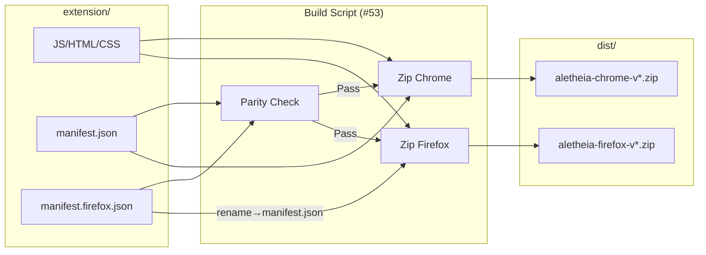

# 10100 - Feature: Firefox Compatibility (Two-Manifest Strategy)

## 1. Context & Goal
* **Issue:** #100
* **Objective:** Enable Aletheia to run on Firefox without maintaining a separate codebase.
* **Status:** Draft
* **Related Issues:** #53 (Build Script), #51 (Store Compliance), #132 (Email Setup)

## 2. Requirements
1. **Single Source:** All logic lives in `extension/` (one set of JS files).
2. **Dual Target:** Support Chrome (Manifest V3 + Service Worker) and Firefox (Manifest V3 + Background Scripts).
3. **No Runtime Detection:** Use explicit manifest files, not runtime browser sniffing.
4. **Validation:** Both artifacts must load cleanly in their respective browsers (0 warnings).
5. **Parity Enforcement:** Build must fail if manifests drift out of sync.

## 3. Alternatives Considered

| Option | Pros | Cons | Decision |
|--------|------|------|----------|
| A. Single `manifest.json` with conditionals | One file | Firefox/Chrome parsing conflicts; `background` key ambiguity | **Rejected** |
| B. Two full codebases | Perfect isolation | Massive maintenance drift risk | **Rejected** |
| C. **Two Manifests, One Source** | Clean config, shared code, testable | Requires build script (#53), requires drift detection | **Selected** |

**Rationale:** Option C maintains code DRY while isolating browser-specific configuration. The build script (Issue #53) handles the packaging, and a parity check prevents silent drift.

## 4. Data & Fixtures

*Per [AgentOS:templates/0108-lld-pre-impl-review](AgentOS:templates/0108-lld-pre-impl-review)*

### 4.1 Data Sources

| Attribute | Value |
|-----------|-------|
| Source | `extension/manifest.json`, `extension/manifest.firefox.json` |
| Format | JSON (Manifest V3 specification) |
| Size | ~1KB each |
| Refresh | Manual (when permissions or config changes) |
| Copyright/License | Aletheia project (MIT) |

### 4.2 Data Pipeline

```
extension/manifest.json ──[Chrome Build]──► dist/aletheia-chrome-v{ver}.zip
extension/manifest.firefox.json ──[Firefox Build]──► dist/aletheia-firefox-v{ver}.zip
                                      ↑
                              (renamed to manifest.json inside zip)
```

### 4.3 Test Fixtures

| Fixture | Source | Notes |
|---------|--------|-------|
| Chrome manifest | `extension/manifest.json` | Existing file |
| Firefox manifest | `extension/manifest.firefox.json` | New file (this feature) |

### 4.4 Deployment Pipeline

1. Developer modifies source in `extension/`
2. Build script generates both zips (`poetry run python tools/build_release.py`)
3. Chrome zip → Chrome Web Store Developer Console
4. Firefox zip → Firefox Add-ons Developer Hub

## 5. Diagram



## 6. Technical Approach

* **Module:** `extension/manifest.firefox.json` (new file)
* **Dependencies:** None (static JSON)
* **Pattern:** Configuration Split

### 6.1 The Configuration Split

**A. `extension/manifest.json` (Chrome - Default)**

Standard MV3 configuration using `service_worker`:
```json
{
  "manifest_version": 3,
  "name": "Aletheia",
  "version": "1.0",
  "background": {
    "service_worker": "service-worker.js"
  }
}
```

**B. `extension/manifest.firefox.json` (Firefox - Specific)**

Firefox MV3 requires `scripts` array (not `service_worker`) and a gecko ID:
```json
{
  "manifest_version": 3,
  "name": "Aletheia",
  "version": "1.0",
  "background": {
    "scripts": ["service-worker.js"]
  },
  "browser_specific_settings": {
    "gecko": {
      "id": "extension@aletheia.study",
      "strict_min_version": "109.0"
    }
  }
}
```

**Why `strict_min_version: 109.0`?** Firefox 109 (January 2023) is the first stable release with full Manifest V3 support. Earlier versions have incomplete or experimental MV3 implementations.

### 6.2 Parity Enforcement

The following keys MUST be identical between manifests:
- `permissions`
- `host_permissions`
- `content_scripts`
- `icons`
- `action`
- `version`
- `name`

The build script (Issue #53) enforces this via a parity check that fails the build on drift.

## 7. Interface Specification

### 7.1 Data Structures

```json
// manifest.firefox.json - Firefox-specific keys
{
  "browser_specific_settings": {
    "gecko": {
      "id": "string",           // Extension ID (email format)
      "strict_min_version": "string"  // Minimum Firefox version
    }
  },
  "background": {
    "scripts": ["string"]       // Array of background scripts (not service_worker)
  }
}
```

### 7.2 Function Signatures

*N/A - This feature is static configuration only. Build logic is in Issue #53.*

### 7.3 Logic Flow (Pseudocode)

```
1. Developer modifies extension code
2. Developer runs build script
3. Build script validates manifest parity
4. IF parity fails THEN
   - Build fails with explicit error
   - Developer fixes drift
   ELSE
   - Generate Chrome zip (with manifest.json)
   - Generate Firefox zip (with manifest.firefox.json → manifest.json)
5. Developer submits to stores
```

## 8. Security Considerations

| Concern | Mitigation | Status |
|---------|------------|--------|
| Gecko ID Spoofing | ID must be registered with Firefox Add-ons | TODO (store submission) |
| Permission Drift | Parity check in build script fails on mismatch | Addressed (#53) |
| Manifest Tampering | Zips are built from source, not downloaded | Addressed |

**Fail Mode:** Fail Closed - If parity check fails, no artifacts are produced.

## 9. Performance Considerations

| Metric | Budget | Approach |
|--------|--------|----------|
| Build Time | < 5s | Simple file operations |
| Extension Size | < 500KB | Same assets for both browsers |
| Memory | N/A | Static config |

**Bottlenecks:** None identified.

## 10. Risks & Mitigations

| Risk | Impact | Likelihood | Mitigation |
|------|--------|------------|------------|
| Manifest drift (silent) | High | Medium | Automated parity check in build |
| Firefox MV3 API divergence | Medium | Low | Pin minimum version; test quarterly |
| Gecko ID conflict | High | Low | Register with Mozilla before public release |
| Developer forgets to update both | Medium | High | Parity check fails build loudly |

## 11. Verification & Testing

*Ref: [AgentOS:standards/0007-testing-strategy](AgentOS:standards/0007-testing-strategy)*

### 11.1 Test Scenarios

| ID | Scenario | Type | Input | Expected Output | Pass Criteria |
|----|----------|------|-------|-----------------|---------------|
| 010 | Chrome loads extension | Manual | Load unpacked `extension/` | Icon visible, popup works | 0 console errors |
| 020 | Firefox loads extension | Manual | Load temp add-on via `about:debugging` | Icon visible, popup works | 0 console errors |
| 030 | Parity check pass | Auto | Both manifests in sync | Build succeeds | Exit code 0 |
| 040 | Parity check fail | Auto | Manifests with different permissions | Build fails | Exit code 1 + error message |

### 11.2 Test Modules (from 0005)

* **Unit Tests:** `poetry run pytest tests/test_build_release.py -v` (in #53)
* **Semantic (Module B):** N/A
* **End-to-End (Module C):** Manual browser testing

### 11.3 Manual Smoke Test

1. **Chrome:** Load unpacked `extension/` → Verify popup opens, badge works
2. **Firefox:** `about:debugging` → This Firefox → Load Temporary Add-on → Select `manifest.firefox.json` → Verify popup opens, badge works
3. **Build:** Run `poetry run python tools/build_release.py` → Verify both zips created
4. **Parity:** Temporarily change a permission in one manifest → Run build → Verify build fails

## 12. Definition of Done

### Code
- [ ] `extension/manifest.firefox.json` created with correct structure
- [ ] Firefox gecko ID set to `extension@aletheia.study`
- [ ] Code comments reference this LLD

### Tests
- [ ] Manual smoke test passes in Chrome
- [ ] Manual smoke test passes in Firefox Developer Edition
- [ ] Parity check test scenarios pass (in #53)

### Documentation
- [ ] LLD updated with any deviations
- [ ] File added to `docs/0003-file-inventory.md`

### Review
- [ ] LLD reviewed by architect
- [ ] User approval before closing issue
