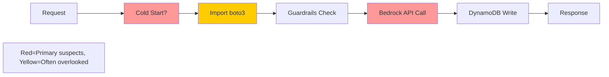

# 10137 - Investigation: 5-Second Lambda Latency

## 1. Context & Goal
* **Issue:** #137
* **Objective:** Investigate and resolve the ~5 second Lambda response time.
* **Status:** Draft
* **Related Issues:** #156 (extension latency - different), #161 (benchmarks)

### Open Questions
*Questions that need clarification before or during implementation. Remove when resolved.*

- [ ] What's the current measured latency breakdown? (Cold start vs Bedrock API vs DynamoDB vs guardrails)
- [ ] Is this cold start latency only, or also warm Lambda?
- [ ] Has CloudWatch X-Ray tracing been enabled to identify bottlenecks?
- [ ] What's the Lambda memory allocation? Would increasing it help?
- [ ] Is Bedrock API itself slow, or is it our invocation pattern?
- [ ] Are semantic guardrails (denylist check) contributing significant time?
- [x] ~~Is Lambda in a VPC?~~ **No** - Direct access to AWS services (per Gemini review)

### Resolved Questions (Gemini Review 2026-01-05)

1. **Q: Is Lambda in a VPC?**
   **A: No.** Lambda has direct internet access to Bedrock/DynamoDB endpoints. VPC cold starts are not a factor.

## 2. Requirements

1. Identify root cause of 5-second latency
2. Document findings with evidence
3. Propose remediation plan
4. Target: <2 second total response time (or document why not achievable)

## 3. Alternatives Considered

N/A - Investigation phase; alternatives will emerge from findings.

## 4. Data & Fixtures

### 4.1 Data Sources

| Attribute | Value |
|-----------|-------|
| Source | CloudWatch Logs, X-Ray traces |
| Format | Log entries, trace data |
| Analysis | Timing breakdown |

## 5. Diagram

### Suspected Latency Contributors



**Note:** Import time (boto3) is often overlooked. X-Ray captures initialization segments separately from handler execution.

## 6. Technical Approach

### Phase 1: Measurement

* **Module:** CloudWatch, X-Ray
* **Tools:** AWS Console, CLI

```bash
# Enable X-Ray tracing (if not already)
aws lambda update-function-configuration \
    --function-name AletheiaLambda \
    --tracing-config Mode=Active

# Check recent invocation durations
aws logs filter-log-events \
    --log-group-name /aws/lambda/AletheiaLambda \
    --filter-pattern "REPORT" \
    --limit 20
```

### Phase 2: Analysis

Break down timing:
1. **Cold Start:** Compare first invocation vs subsequent
2. **Import Time:** Check X-Ray initialization segment (boto3 import cost)
3. **Bedrock API:** Time the `invoke_model` call specifically
4. **DynamoDB:** Time `put_item` call
5. **Guardrails:** Time denylist check

```python
# Add timing instrumentation with STRUCTURED JSON logging
import time
import json

def lambda_handler(event, context):
    timings = {}

    start = time.time()
    # ... guardrails check ...
    timings['guardrails_ms'] = round((time.time() - start) * 1000, 2)

    start = time.time()
    # ... bedrock call ...
    timings['bedrock_ms'] = round((time.time() - start) * 1000, 2)

    start = time.time()
    # ... dynamodb write ...
    timings['dynamodb_ms'] = round((time.time() - start) * 1000, 2)

    timings['total_ms'] = sum(v for v in timings.values())

    # STRUCTURED JSON for CloudWatch Insights parsing
    print(f"TIMING_METRICS: {json.dumps(timings)}")
```

**CloudWatch Insights Query:**
```sql
fields @timestamp, @message
| filter @message like /TIMING_METRICS/
| parse @message "TIMING_METRICS: *" as metrics
| sort @timestamp desc
| limit 50
```

### Phase 3: Remediation (Based on Findings)

| Finding | Remediation |
|---------|-------------|
| Cold start | Provisioned concurrency |
| Bedrock slow | Check model, streaming response |
| DynamoDB slow | Check capacity mode |
| Dependencies slow | Layer optimization |

## 7. Interface Specification

N/A - Investigation, no new interfaces.

## 8. Security Considerations

| Concern | Mitigation | Status |
|---------|------------|--------|
| Timing data in logs | Don't log sensitive content | TODO |

**Fail Mode:** N/A

## 9. Performance Considerations

This IS the performance investigation.

**Target Metrics:**
| Metric | Current | Target |
|--------|---------|--------|
| Total latency | ~5000ms | <2000ms |
| Cold start | Unknown | <500ms |
| Bedrock API | Unknown | <1500ms |

## 10. Risks & Mitigations

| Risk | Impact | Likelihood | Mitigation |
|------|--------|------------|------------|
| Bedrock API is inherently slow | High | Med | Consider caching, streaming |
| Provisioned concurrency cost | Med | Med | Calculate ROI |
| Issue is client-side, not Lambda | Med | Low | Measure E2E vs Lambda-only |

## 11. Verification & Testing

### 11.1 Test Scenarios

| ID | Scenario | Type | Input | Expected Output | Pass Criteria |
|----|----------|------|-------|-----------------|---------------|
| 010 | Measure cold start | Manual | Fresh Lambda | Timing data | Baseline established |
| 020 | Measure warm Lambda | Manual | Repeat request | Timing data | Compare to cold |
| 030 | X-Ray trace analysis | Manual | Enable tracing | Trace segments | Bottleneck identified |
| 040 | Verify no VPC | Manual | Check config | No VPC | Direct access confirmed |

### 11.2 Forcing Cold Starts for Testing

To reliably reproduce cold starts:

```bash
# Method 1: Update environment variable (forces new execution environment)
aws lambda update-function-configuration \
    --function-name AletheiaLambda \
    --environment "Variables={COLD_START_TEST=$(date +%s)}"

# Wait for update to complete
aws lambda wait function-updated --function-name AletheiaLambda

# Now invoke - this will be a cold start
aws lambda invoke --function-name AletheiaLambda ...

# Method 2: Publish new version (also forces cold start)
aws lambda publish-version --function-name AletheiaLambda
```

**Note:** Simply waiting for Lambda to "cool down" (15+ minutes of inactivity) is unreliable. Use configuration updates for deterministic cold start testing.

### 11.3 Test Commands

```bash
# Invoke and measure
time aws lambda invoke \
    --function-name AletheiaLambda \
    --payload '{"text":"test","url":"https://example.com"}' \
    response.json

# Check X-Ray traces
aws xray get-trace-summaries \
    --start-time $(date -d '1 hour ago' +%s) \
    --end-time $(date +%s)
```

## 12. Definition of Done

### Investigation
- [ ] Timing instrumentation added
- [ ] X-Ray traces captured
- [ ] Root cause identified with evidence

### Documentation
- [ ] Findings documented in this LLD
- [ ] Remediation plan proposed

### Remediation (Separate PR)
- [ ] Fix implemented based on findings
- [ ] Latency reduced to target
- [ ] 0812 Performance Audit updated

---

## Appendix: Gemini Review Response

**Review Date:** 2026-01-05
**Reviewer:** Gemini 3 Pro

### Tier 2 Issues (HIGH) - Addressed

| Issue | Resolution |
|-------|------------|
| Structured Logging | Changed to `json.dumps()` with `TIMING_METRICS:` prefix for CloudWatch Insights |
| Baseline Cold Start | Added §11.2 with deterministic cold start reproduction methods |

### Tier 3 Issues (SUGGESTIONS) - Addressed

| Issue | Resolution |
|-------|------------|
| Import Time hypothesis | Added to diagram and Phase 2 analysis |
| VPC Check | Confirmed Lambda is NOT in VPC; added to resolved questions |
