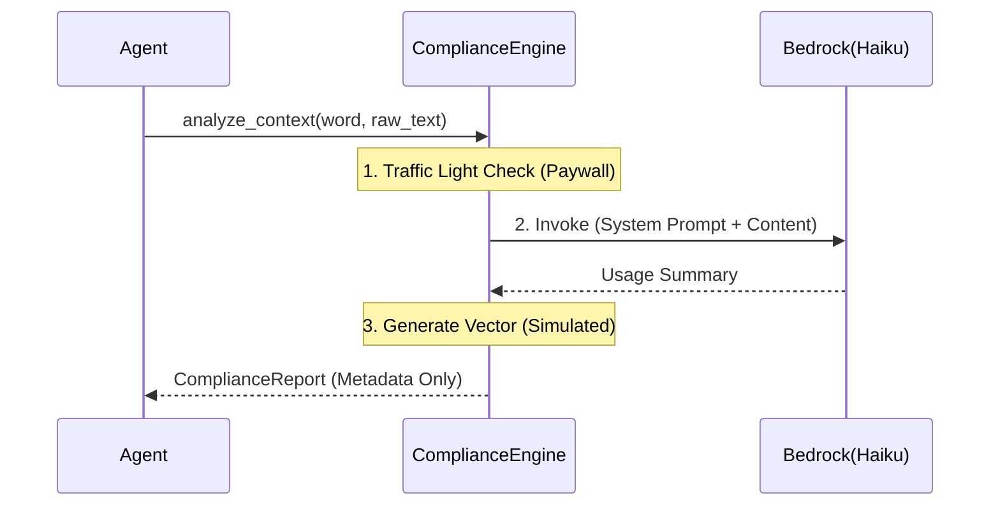

# 1014 - Feature: Compliance Engine

## 1. Context & Goal
* **Issue:** #14
* **Objective:** Implement a "Stateful Serverless" compliance engine that ingests raw user context, extracts semantic metadata, and discards the copyrighted raw text to ensure "Safe Harbor" data handling.
* **Status:** In Progress (Zombie Code Identified)

## 2. Requirements
* **Input:** Target Word (`str`), Raw Context (`str`).
* **Output:** `ComplianceReport` containing:
    * `usage_summary`: A synthetic description of how the word is used (fair use).
    * `content_vector`: A 1536-dim embedding (simulated in MVP).
    * `paywall_status`: `OPEN` | `PAYWALLED` | `UNKNOWN`.
* **Constraint:** Raw text must NEVER be persisted or returned.
* **Model:** Claude 3 Haiku (for speed/cost).

## 3. Diagram



## 4. Technical Approach

* **Module:** `compliance.py` (Root level)
* **Dependencies:** `langchain_aws`, `langchain_core`
* **Performance Budget:** < 3.0s (Haiku Latency)

## 5. Implementation Details

### 5.1 Schema (`ComplianceReport`)

```python
class ComplianceReport(TypedDict):
    usage_summary: str      # The "Fair Use" synthetic description
    content_vector: list    # The embedding (simulated for MVP)
    paywall_status: Literal["OPEN", "PAYWALLED", "UNKNOWN"]

```

### 5.2 The System Prompt

The engine uses a strict system prompt to enforce summarization over reproduction:

> "Your goal is to read the provided text and generate a 'Usage Report' that captures the semantic meaning of the target word WITHOUT reproducing the copyrighted text verbatim."

### 5.3 Function Signature

```python
def analyze_context(word: str, raw_context: str) -> ComplianceReport:
    """
    Ephemeral Processor: Ingests raw text, extracts metadata, discards text.
    """
    # Logic implementation details...

```

## 6. Verification & Testing

*Ref: [AgentOS:standards/0007-testing-strategy*](AgentOS:standards/0007-testing-strategy)

### 6.1 Test Modules

* **Module A (Unit):** `poetry run pytest tests/test_compliance.py -v`

### 6.2 Test Scenarios

| Scenario | Input | Expected Output | Pass Criteria |
| --- | --- | --- | --- |
| **Standard Ingestion** | Word: "test", Context: "This is a test." | `usage_summary`: "User describes a test." | Output is a dict with valid keys. |
| **Paywall Check** | (Mocked meta tags) | `paywall_status`: "OPEN" | Default behavior verified. |

## 7. Definition of Done

* [x] Code complete
* [ ] Unit tests pass
* [ ] Doc updated with actual test results
