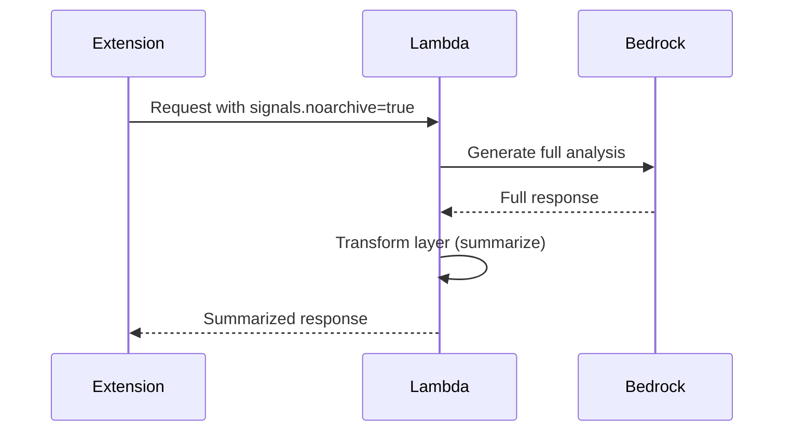

# 10162 - Feature: Apply Transform Layer (Summarization) When 'noarchive' Signal Present

## 1. Context & Goal
* **Issue:** #162
* **Objective:** Route responses through Transform layer (summarization) when `noarchive` signal is detected, per docs/0007-signal-handling.md.
* **Status:** Draft
* **Related Issues:** #155 (Skip DynamoDB persistence for noarchive - related but different)

### Open Questions
*Questions that need clarification before or during implementation. Remove when resolved.*

- [x] ~~What exactly does "Transform layer" mean?~~ **Summarize/abstract the output via modified prompt**
- [x] ~~Is this about copyright compliance (don't reproduce full content) or privacy (don't persist)?~~ **Both - complementary to #155**
- [x] ~~How aggressive should summarization be?~~ **Brief abstract (2-3 sentences), no deep analysis**
- [x] ~~Should Transform apply INSTEAD of or IN ADDITION to skipping persistence (#155)?~~ **IN ADDITION - both apply**
- [ ] Does the Digital Etymologist persona already do some summarization? Is this redundant?
- [x] ~~What's the difference between this issue and #155?~~ **#155 skips persistence, #162 summarizes output**

### Resolved Questions (Gemini Review 2026-01-05)

1. **Q: Which implementation option?**
   **A: Option B - Prompt Engineering (SELECTED).** Latency is critical. We CANNOT afford a 2x slowdown for privacy compliance. Use a single LLM call with conditionally modified prompt.

2. **Q: How does this interact with #155?**
   **A: Both apply (additive privacy layers).** When `noarchive` is present:
   - #155: Skip DynamoDB persistence
   - #162 (this): Summarize/transform the output
   Apply BOTH, not one or the other.

## 2. Requirements

Per docs/0007-signal-handling.md:
1. Detect `noarchive` signal (same as #155)
2. If present, apply Transform layer (summarization) to response
3. Return summarized content instead of full analysis

## 3. Alternatives Considered

| Option | Pros | Cons | Decision |
|--------|------|------|----------|
| Second LLM call for summarization | Complete separation | **2x latency/cost** | **Rejected** |
| **Conditional prompt modification** | Single LLM call, no latency penalty | Prompt complexity | **Selected** |
| Truncate response | Simple | Loses context, not a real summary | Rejected |
| Summarize in extension | No Lambda change | JS complexity, client-side processing | Rejected |

**Rationale:** Latency is critical. Using a conditionally modified prompt (Option B) achieves summarization without doubling LLM calls. The prompt instructs: "Since this content is marked noarchive, provide a brief abstract/summary only. Do not analyze in depth."

## 4. Data & Fixtures

### 4.1 Data Sources

| Attribute | Value |
|-----------|-------|
| Source | LLM response |
| Format | Text |
| Transform | Summarization |

### 4.2 Data Pipeline

```
User request ──check noarchive──► LLM analysis ──Transform──► Summarized response
```

## 5. Diagram



## 6. Technical Approach

* **Module:** `src/lambda_function.py`
* **Dependencies:** Bedrock (existing - no additional calls)
* **Pattern:** Conditional prompt modification (SELECTED)

### 6.1 Selected Implementation: Conditional Prompt

```python
def get_prompt(text: str, context: str, noarchive: bool) -> str:
    """
    Generate prompt, with summarization mode for noarchive content.

    When noarchive=True, instruct LLM to provide brief abstract only.
    This avoids a second LLM call while respecting copyright signals.
    """
    base_prompt = f"""You are a Digital Etymologist analyzing this text:
    {text}
    """

    if noarchive:
        # TRANSFORM MODE: Brief summary only
        return base_prompt + """
        IMPORTANT: This content is marked 'noarchive' for copyright/privacy.
        Provide ONLY a brief abstract (2-3 sentences) summarizing the key point.
        Do NOT analyze in depth or reproduce source content verbatim.
        """
    else:
        # FULL MODE: Detailed analysis
        return base_prompt + """
        Provide a detailed analysis including etymology, context, and usage.
        """
```

### 6.2 Lambda Handler Integration

```python
def lambda_handler(event, context):
    signals = event.get('signals', {})
    noarchive = signals.get('noarchive', False)

    # Single LLM call with conditional prompt
    prompt = get_prompt(text, page_context, noarchive=noarchive)
    response = invoke_bedrock(prompt)

    # Also skip persistence (per #155)
    if not noarchive:
        save_state(thread_id, text, url, safety_score)

    return {'statusCode': 200, 'body': response}
```

### 6.3 Rejected: Second LLM Call

```python
# ❌ REJECTED - 2x latency/cost penalty
def transform_response(full_response: str) -> str:
    prompt = f"Summarize this: {full_response}"
    return invoke_bedrock_for_summary(prompt)  # EXTRA LLM CALL
```

## 7. Interface Specification

### 7.1 Function Signatures
```python
def transform_response(response: str, transform_type: str = "summarize") -> str:
    """Apply transformation to response content."""
    ...

def lambda_handler(event, context):
    ...
    signals = event.get('signals', {})

    response = generate_analysis(text, page_context)

    if signals.get('noarchive', False):
        response = transform_response(response)

    return {'statusCode': 200, 'body': response}
```

## 8. Security Considerations

| Concern | Mitigation | Status |
|---------|------------|--------|
| Copyright infringement | Summarization reduces reproduction | Goal of feature |
| Double LLM cost | Consider single-call approach | TODO |

**Fail Mode:** Fail Open - If transform fails, return full response (acceptable fallback).

## 9. Performance Considerations

| Metric | Budget | Approach |
|--------|--------|----------|
| Additional latency | < 500ms | Single modified prompt preferred |
| LLM cost | No doubling | Avoid second LLM call |

**Bottlenecks:** Second LLM call would significantly increase latency and cost.

## 10. Risks & Mitigations

| Risk | Impact | Likelihood | Mitigation |
|------|--------|------------|------------|
| Summary loses important context | Med | Med | Balance brevity vs usefulness |
| Doubled latency | High | Med | Use single-call prompt approach |
| Confusion with #155 | Med | High | Clarify relationship in docs |

## 11. Verification & Testing

### 11.1 Test Scenarios

| ID | Scenario | Type | Input | Expected Output | Pass Criteria |
|----|----------|------|-------|-----------------|---------------|
| 010 | noarchive triggers transform | Auto | signals.noarchive=true | Shorter response | Response is summarized |
| 020 | No noarchive = full response | Auto | signals.noarchive=false | Full response | No transformation |
| 030 | Transform quality | Manual | Various inputs | Useful summaries | Human review |

### 11.2 Test Commands

```bash
# Unit tests
poetry run pytest tests/test_lambda_function.py -v -k transform
```

## 12. Definition of Done

### Prerequisites (RESOLVED)
- [x] ~~Clarify: What is Transform layer exactly?~~ **Conditional prompt for brief summary**
- [x] ~~Clarify: Relationship to #155 (skip persistence)~~ **Both apply - additive privacy layers**

### Code
- [ ] `get_prompt()` function with `noarchive` parameter
- [ ] Conditional prompt instructs LLM to summarize when `noarchive=True`
- [ ] **Single LLM call** - no second call for summarization
- [ ] Integrate with #155 skip-persistence logic

### Tests
- [ ] Unit tests for `get_prompt()` with both modes
- [ ] Verify summarized response is shorter/different
- [ ] E2E test with `noarchive.html` fixture (shared with #155)

### Documentation
- [ ] 0007-signal-handling.md verified/updated

---

## Appendix: Gemini Review Response

**Review Date:** 2026-01-05
**Reviewer:** Gemini 3 Pro

### Tier 2 Issues (HIGH) - Addressed

| Issue | Resolution |
|-------|------------|
| Option A vs B left as open alternatives | **Selected Option B (Prompt Engineering)** to avoid 2x latency/cost |

**Verdict:** APPROVED after selecting Option B.

**Key Decision:** Latency is critical. Use conditional prompt modification (single LLM call) instead of post-processing with a second LLM call.
