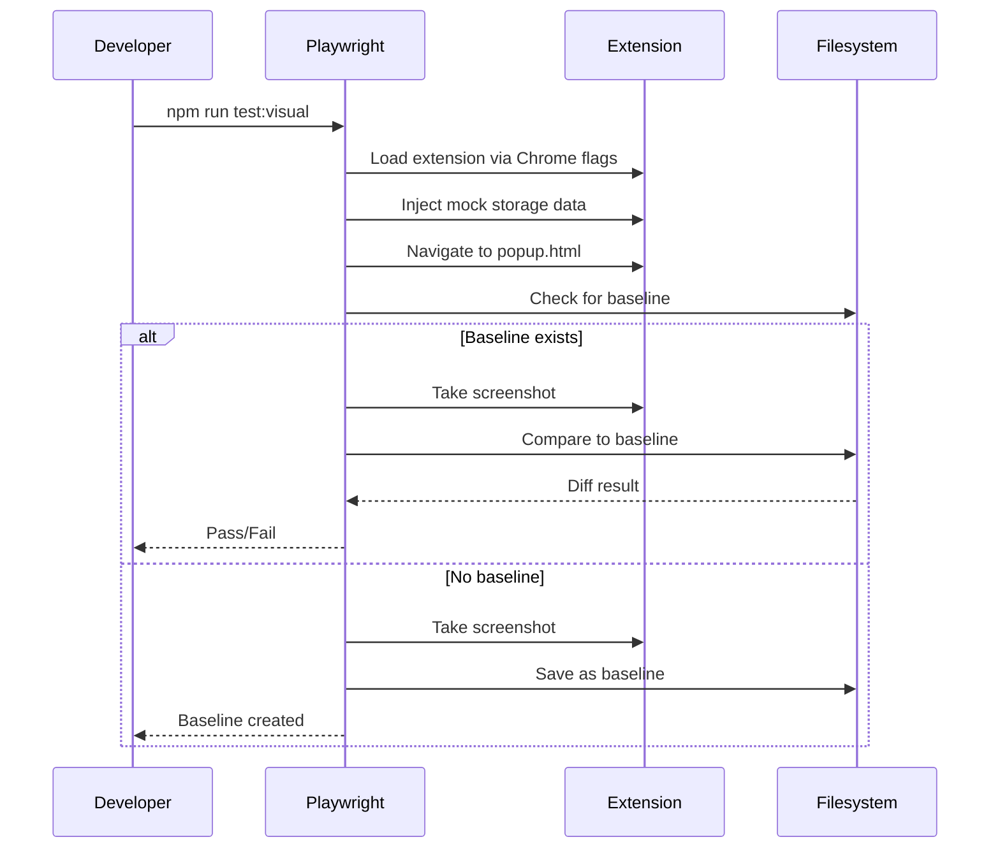

# 10173 - Feature: Visual Regression Testing Infrastructure (Phase 1)

## 1. Context & Goal
* **Issue:** #173
* **Objective:** Set up foundational Playwright infrastructure for visual regression testing
* **Status:** Draft
* **Related Issues:** #53 (Store Assets), #160 (Accessibility CI), #161 (Performance CI)

### Open Questions
*Resolved per Gemini review 2026-01-06.*

- [x] ~~Should baselines be platform-specific (Linux vs Windows) or use tolerance?~~
  **Decision:** Platform-specific baselines. Playwright auto-suffixes with platform name. Pixel tolerance is a trap that hides bugs.
- [x] ~~What specific popup/overlay state should the POC test capture?~~
  **Decision:** "Main view - inactive" (popup open, site not allowlisted). Most stable state for proving infrastructure.

## 2. Requirements

1. Playwright config updated with `toHaveScreenshot()` settings
2. New npm script `test:visual` for running visual tests
3. Shared utilities module for test helpers
4. Mock data module for deterministic auth/storage states
5. One proof-of-concept visual test that:
   - Generates baseline on first run
   - Compares against baseline on subsequent runs
   - Detects differences when UI changes

## 3. Alternatives Considered

| Option | Pros | Cons | Decision |
|--------|------|------|----------|
| Playwright native `toHaveScreenshot()` | Built-in, no deps, well-documented | Less features than Percy/Chromatic | **Selected** |
| Percy.io | Cloud baselines, review UI | External service, cost, complexity | Rejected |
| Chromatic | Storybook integration | Requires Storybook setup | Rejected |
| jest-image-snapshot | Popular, flexible | Separate from Playwright, extra config | Rejected |

**Rationale:** Playwright 1.40.0 includes mature `toHaveScreenshot()` support. Using built-in tooling minimizes dependencies and integrates seamlessly with existing E2E tests.

## 4. Data & Fixtures

### 4.1 Data Sources

| Attribute | Value |
|-----------|-------|
| Source | Mock data (hardcoded in test files) |
| Format | JavaScript objects for chrome.storage.local |
| Size | Small (< 1KB per mock state) |
| Refresh | Static (updated only when tests change) |
| Copyright/License | N/A - internal test data |

### 4.2 Data Pipeline

```
Mock Data ──inject via addInitScript──► chrome.storage.local ──read by──► Extension popup.js
```

### 4.3 Test Fixtures

| Fixture | Source | Notes |
|---------|--------|-------|
| Auth states (authenticated/unauthenticated) | Hardcoded | Mock userId, displayName |
| Allowlist states (empty/populated) | Hardcoded | Array of domain strings |
| Tab states (UNKNOWN/RESTRICTED/ALLOWED) | Hardcoded | Matches TabState enum |

### 4.4 Deployment Pipeline

Baselines are committed to git in `tests/e2e/__snapshots__/`. No external deployment.

**Update workflow:**
1. Developer makes intentional UI change
2. Run `npm run test:visual:update` to regenerate baselines
3. Review diff in git
4. Commit new baselines with UI change

## 5. Diagram



## 6. Technical Approach

* **Module:** `tests/e2e/` (test files), `playwright.config.js` (config)
* **Dependencies:** `@playwright/test` (existing, v1.40.0+)
* **Pattern:** Page Object pattern for popup interactions

### Key Configuration

```javascript
// playwright.config.js additions
expect: {
    toHaveScreenshot: {
        maxDiffPixels: 100,        // Antialiasing tolerance
        threshold: 0.2,             // Per-pixel color threshold
        animations: 'disabled',     // Deterministic captures
    }
},
snapshotDir: './tests/e2e/__snapshots__',
```

## 7. Interface Specification

### 7.1 Data Structures

```javascript
// tests/e2e/mocks/mock-data.js

/**
 * Mock authentication states for visual testing
 */
const AUTH_STATES = {
    unauthenticated: {},
    authenticated: {
        userId: 'test-user-12345',
        displayName: 'Test User',
        refreshToken: 'mock-refresh-token'
    }
};

/**
 * Mock allowlist states
 */
const ALLOWLIST_STATES = {
    empty: { allowlist: [] },
    populated: { allowlist: ['example.com', 'github.com', 'stackoverflow.com'] }
};

/**
 * Tab states matching service-worker.js TabState enum
 */
const TAB_STATES = {
    UNKNOWN: 'unknown',
    RESTRICTED: 'restricted',
    ALLOWED: 'allowed'
};
```

### 7.2 Function Signatures

```javascript
// tests/e2e/utils/test-helpers.js

/**
 * Wait for extension to fully initialize after page load.
 * Includes font loading wait to prevent flaky text rendering.
 * @param {Page} page - Playwright page object
 * @param {number} timeout - Max wait time in ms (default: 1500)
 */
async function waitForExtensionReady(page, timeout = 1500);

/**
 * Wait for all fonts to load before taking screenshots.
 * Prevents flaky text rendering differences.
 * @param {Page} page - Playwright page object
 */
async function waitForFontsReady(page);

/**
 * Inject mock data into chrome.storage.local before popup loads.
 * Must be called before page.goto().
 * @param {Page} page - Playwright page object
 * @param {object} storageData - Object to set in chrome.storage.local
 */
async function injectStorageState(page, storageData);

/**
 * Get stable extension ID from manifest key.
 * @returns {string} Extension ID
 */
function getExtensionId();

/**
 * Configure screenshot options with defaults.
 * @param {string} name - Screenshot filename (without path)
 * @param {object} options - Override options
 * @returns {object} Playwright screenshot options
 */
function screenshotOptions(name, options = {});
```

### 7.3 Logic Flow (Pseudocode)

```
1. Test setup
   - Get extension ID from manifest key
   - Configure storage mock data

2. For each visual test:
   a. Create new browser context
   b. Inject mock storage via addInitScript
   c. Navigate to extension popup URL
   d. Wait for target view to be visible
   e. Call expect(locator).toHaveScreenshot(name)

3. Playwright handles:
   - First run: Save as baseline
   - Subsequent runs: Compare and report diff
```

## 8. Security Considerations

| Concern | Mitigation | Status |
|---------|------------|--------|
| Mock data leakage to prod | Test files in `tests/` never bundled | Addressed |
| Extension ID exposure | ID derived from public manifest key | N/A |

**Fail Mode:** Fail Closed - If screenshots don't match, test fails.

## 9. Performance Considerations

| Metric | Budget | Approach |
|--------|--------|----------|
| Test duration | < 30s per test | Serial execution, local screenshots |
| Screenshot size | < 500KB each | PNG compression, focused viewports |
| CI time | < 5 min total | Parallel with other jobs |

**Bottlenecks:** Extension loading requires headed Chrome mode, which is slower than headless. Already configured in existing E2E tests.

## 10. Risks & Mitigations

| Risk | Impact | Likelihood | Mitigation |
|------|--------|------------|------------|
| Flaky screenshots (antialiasing) | Med | Med | `maxDiffPixels: 100` tolerance |
| Platform differences (fonts) | Med | Med | Platform-specific baselines (Playwright auto-suffix) |
| Extension load timing | Low | Low | `waitForExtensionReady()` + `waitForFontsReady()` |
| CI failure visibility | Med | Med | Upload `test-results/` as artifact on failure |

## 11. Verification & Testing

### 11.1 Test Scenarios

| ID | Scenario | Type | Input | Expected Output | Pass Criteria |
|----|----------|------|-------|-----------------|---------------|
| 010 | First run creates baseline | Auto | No baseline exists | Baseline PNG saved | File created in `__snapshots__/` |
| 020 | Second run compares to baseline | Auto | Baseline exists, no UI change | Test passes | Exit code 0 |
| 030 | UI change detected as diff | Auto | Baseline exists, UI modified | Test fails with diff | Exit code 1, diff image created |
| 040 | Update baseline regenerates | Auto | Run with UPDATE_SNAPSHOTS=true | New baseline saved | File updated |

### 11.2 Test Commands

```bash
# Run visual regression tests
npm run test:visual

# Update baselines (after intentional UI change)
npm run test:visual:update

# Run with visible browser for debugging
npm run test:visual -- --headed
```

### 11.3 CI Artifact Upload (Future Phase 5)

When CI integration is added, the workflow must upload artifacts on failure:

```yaml
- name: Upload test results on failure
  if: failure()
  uses: actions/upload-artifact@v4
  with:
    name: visual-regression-results
    path: test-results/
    retention-days: 7
```

This ensures developers can see diff images when visual tests fail in CI.

### 11.4 Manual Tests (Only If Unavoidable)

N/A - All scenarios automated.

## 12. Definition of Done

### Code
- [ ] `playwright.config.js` updated with visual regression settings
- [ ] `package.json` has `test:visual` and `test:visual:update` scripts
- [ ] `tests/e2e/utils/test-helpers.js` created with helper functions
- [ ] `tests/e2e/mocks/mock-data.js` created with mock states
- [ ] `tests/e2e/visual-poc.spec.js` created with at least one visual test

### Tests
- [ ] POC test passes on first run (creates baseline)
- [ ] POC test passes on second run (compares to baseline)
- [ ] POC test fails when UI is intentionally modified
- [ ] Baseline update workflow works

### Documentation
- [ ] LLD updated with any deviations
- [ ] Implementation Report completed
- [ ] Test Report completed

### Review
- [ ] Code review completed
- [ ] User approval before closing issue
