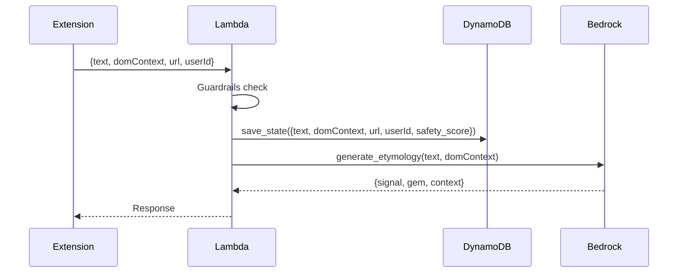

# 10177 - Feature: Store Surrounding Paragraph (domContext) in DynamoDB

## 1. Context & Goal
* **Issue:** #177
* **Objective:** Persist the surrounding paragraph (`domContext`) to DynamoDB alongside user-selected text for analytics and quality monitoring.
* **Status:** Draft
* **Related Issues:** #178 (Store AI response), #145 (DynamoDB TTL)

### Open Questions
*Questions that need clarification before or during implementation. Remove when resolved.*

- [ ] Should we store full domContext or truncate to save storage costs?
- [ ] Does storing more context have privacy implications? (30-day TTL applies regardless)

## 2. Requirements

1. Add `domContext` field to DynamoDB item in `save_state()`
2. Field must be included in TTL auto-deletion (already inherited from item TTL)
3. Analytics tooling should be able to query/export this field

## 3. Alternatives Considered

| Option | Pros | Cons | Decision |
|--------|------|------|----------|
| Store full domContext | Complete data | Larger storage costs | **Selected** |
| Truncate to 500 chars | Smaller storage | May lose useful context | Rejected |
| Store hash only | Minimal storage | Useless for analytics | Rejected |

**Rationale:** Storage costs are minimal for text data with 30-day TTL. Full context enables better quality analysis.

## 4. Data & Fixtures

### 4.1 Data Sources

| Attribute | Value |
|-----------|-------|
| Source | Extension content script (surrounding paragraph extraction) |
| Format | Plain text string |
| Size | Typically 100-2000 characters |
| Refresh | Per-request |
| Copyright/License | User-submitted content |

### 4.2 Data Pipeline

```
Extension ──extracts paragraph──► Lambda ──save_state()──► DynamoDB
```

### 4.3 Test Fixtures

| Fixture | Source | Notes |
|---------|--------|-------|
| Mock event with domContext | Generated | Include in unit tests |

### 4.4 Deployment Pipeline

Standard Lambda deployment via `provision.sh`. No schema migration needed - DynamoDB is schemaless.

## 5. Diagram



## 6. Technical Approach

* **Module:** `src/lambda_function.py`
* **Dependencies:** None new
* **Pattern:** Simple field addition to existing save

### Implementation

```python
# Current (line 278-286):
save_state(
    thread_id,
    {
        "text": text,
        "url": body.get("url", ""),
        "userId": body.get("userId"),
        "safety_score": metadata.get("scores", {}),
    },
)

# Updated (with safety truncation per Gemini review):
dom_context = body.get("domContext", "")[:100000]  # 100KB cap prevents DynamoDB 400KB limit

save_state(
    thread_id,
    {
        "text": text,
        "domContext": dom_context,  # NEW - truncated for safety
        "url": body.get("url", ""),
        "userId": body.get("userId"),
        "safety_score": metadata.get("scores", {}),
    },
)
```

## 7. Interface Specification

### 7.1 Data Structures
```python
# DynamoDB item schema (updated)
{
    "thread_id": {"S": "hash"},
    "checkpoint_id": {"S": "timestamp"},
    "text": {"S": "user selected text"},
    "domContext": {"S": "surrounding paragraph"},  # NEW
    "url": {"S": "source url"},
    "userId": {"S": "linkedin_id or None"},
    "safety_score": {"M": {...}},
    "ttl": {"N": "epoch"},
}
```

### 7.2 Function Signatures
```python
# No new functions - just additional field in save_state() call
```

## 8. Security Considerations

| Concern | Mitigation | Status |
|---------|------------|--------|
| PII in surrounding text | 30-day TTL auto-delete | Addressed |
| Storage costs | TTL limits accumulation | Addressed |

**Fail Mode:** Fail Open - If domContext is missing/empty, save empty string.

## 9. Performance Considerations

| Metric | Budget | Approach |
|--------|--------|----------|
| Additional latency | < 1ms | Single field addition |
| Storage increase | ~1KB/item | Acceptable with TTL |

**Bottlenecks:** None - trivial change.

## 10. Risks & Mitigations

| Risk | Impact | Likelihood | Mitigation |
|------|--------|------------|------------|
| Large domContext bloats storage | Low | Low | TTL auto-cleanup |
| Privacy concerns | Med | Low | Same retention policy as text |

## 11. Verification & Testing

### 11.1 Test Scenarios

| ID | Scenario | Type | Input | Expected Output | Pass Criteria |
|----|----------|------|-------|-----------------|---------------|
| 010 | domContext stored | Auto | Event with domContext | Item in DynamoDB | domContext field populated |
| 020 | Missing domContext | Auto | Event without domContext | Item with empty string | No error, empty field |
| 030 | Large domContext | Auto | 5000 char context | Item stored | Field truncated or stored |

### 11.2 Test Commands

```bash
poetry run pytest tests/test_lambda_function.py -v -k domContext
```

### 11.3 Manual Tests
N/A - All scenarios automated.

## 12. Definition of Done

### Code
- [ ] Add `domContext` to save_state() call in lambda_function.py
- [ ] Handle missing domContext gracefully (empty string default)

### Tests
- [ ] Unit test verifies domContext is persisted
- [ ] Unit test verifies missing domContext doesn't error

### Documentation
- [ ] Update wiki Privacy.md to reflect stored fields (if needed)
- [ ] Run 0810 Privacy Audit - verify no new concerns

### Review
- [ ] Code review completed
- [ ] User approval before closing issue

---

## Appendix: Gemini Review Response

**Review Date:** 2026-01-06
**Reviewer:** Gemini 3.0 Pro

### Verdict: APPROVED

### Architectural Alignment
- **Privacy-First (ADR 0201):** Relies on existing 30-day TTL for data expiration ✅
- **Stateful Serverless (ADR 0203):** Extends existing DynamoDB schema correctly ✅

### Refinements Incorporated

| Issue | Resolution |
|-------|------------|
| DynamoDB 400KB item limit | Added 100KB hard cap on domContext string before save |
| Payload size risk | `[:100000]` truncation prevents ValidationException on outliers |

### Action Items
- Execute implementation with truncation safety
- Coordinate with #178 (both modify save_state)
