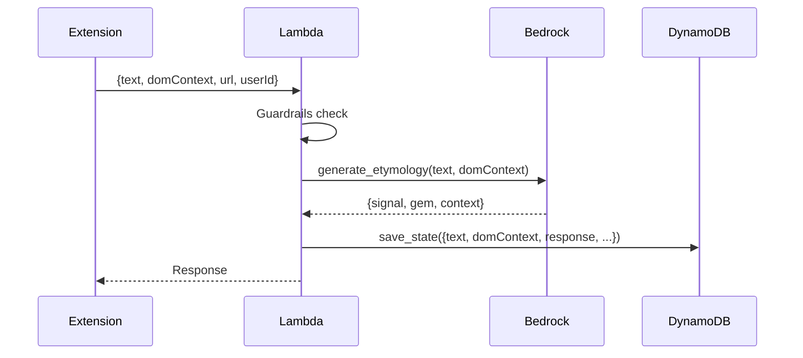

# 10178 - Feature: Store AI Etymology Response in DynamoDB

## 1. Context & Goal
* **Issue:** #178
* **Objective:** Persist the AI etymology response (signal, gem, context) to DynamoDB for quality monitoring and analytics.
* **Status:** Draft
* **Related Issues:** #177 (Store domContext), #145 (DynamoDB TTL), #124 (Digital Etymologist)

### Open Questions
*Questions that need clarification before or during implementation. Remove when resolved.*

- [ ] Should we store the full response or just key fields (signal, gem)?
- [ ] Storage size implications of storing `context` field (can be lengthy)?
- [ ] Should response storage be optional (flag-controlled)?

## 2. Requirements

1. Store AI response fields (`signal`, `gem`, `context`) in DynamoDB
2. Response must be associated with the same thread_id as the input
3. Must not add significant latency to user experience
4. Field must be included in TTL auto-deletion

## 3. Alternatives Considered

| Option | Pros | Cons | Decision |
|--------|------|------|----------|
| Move save_state() after generation | Single write, complete data | Slight code restructure | **Selected** |
| Add second DynamoDB write | No restructure | 2x write latency | Rejected |
| Update item after generation | Cleaner separation | Extra API call | Rejected |
| Store response in separate table | Clean separation | Query complexity | Rejected |

**Rationale:** Moving `save_state()` after `generate_etymology()` allows capturing both input and output in a single DynamoDB write with no additional latency.

## 4. Data & Fixtures

### 4.1 Data Sources

| Attribute | Value |
|-----------|-------|
| Source | Bedrock/Claude etymology response |
| Format | Structured JSON (signal, gem, context) |
| Size | 200-2000 characters typically |
| Refresh | Per-request |
| Copyright/License | AI-generated content |

### 4.2 Data Pipeline

```
Bedrock ──response──► Lambda ──save_state()──► DynamoDB
```

### 4.3 Test Fixtures

| Fixture | Source | Notes |
|---------|--------|-------|
| Mock etymology response | Generated | Include in unit tests |

### 4.4 Deployment Pipeline

Standard Lambda deployment via `provision.sh`. No schema migration needed.

## 5. Diagram



## 6. Technical Approach

* **Module:** `src/lambda_function.py`
* **Dependencies:** None new
* **Pattern:** Restructure to save AFTER generation

### Current Flow (lines 277-300)
```python
# 4. Persist to DynamoDB (BEFORE generation)
save_state(thread_id, {...})

# 5. Generate etymology
result = generate_etymology(text, context_text)

# Build response
response_body = {...}
```

### Updated Flow
```python
# 4. Generate etymology FIRST
result = generate_etymology(text, context_text)

# 5. Persist to DynamoDB (AFTER generation, includes response)
save_state(
    thread_id,
    {
        "text": text,
        "domContext": body.get("domContext", ""),  # From #177
        "url": body.get("url", ""),
        "userId": body.get("userId"),
        "safety_score": metadata.get("scores", {}),
        # NEW: Store AI response
        "response": {
            "signal": result["response"]["signal"],
            "gem": result["response"]["gem"],
            "context": result["response"]["context"],
        },
    },
)

# 6. Build response for client
response_body = {...}
```

### Edge Case: Generation Failure (CRITICAL - per Gemini Review)

**MANDATORY:** The `save_state()` call MUST happen even if `generate_etymology()` fails. This ensures we capture what input caused the failure for debugging.

```python
# REQUIRED PATTERN: try/except/finally ensures save_state always executes
response_data = None
try:
    result = generate_etymology(text, context_text)
    response_data = result["response"]
except Exception as e:
    # Capture error state for debugging
    response_data = {"signal": "error", "gem": str(e), "context": "Generation failed"}
    logger.error(f"Etymology generation failed: {e}")
finally:
    # ALWAYS save - even on failure - so we know what input caused issues
    save_state(thread_id, {
        "text": text,
        "domContext": dom_context,  # From #177
        "url": body.get("url", ""),
        "userId": body.get("userId"),
        "safety_score": metadata.get("scores", {}),
        "response": response_data,
    })
```

**Why this matters:** If Lambda crashes or Bedrock times out, we lose visibility into what caused the failure. By saving in `finally`, we ensure the input is always recorded for post-mortem analysis.

## 7. Interface Specification

### 7.1 Data Structures
```python
# DynamoDB item schema (updated)
{
    "thread_id": {"S": "hash"},
    "checkpoint_id": {"S": "timestamp"},
    "text": {"S": "user selected text"},
    "domContext": {"S": "surrounding paragraph"},  # From #177
    "url": {"S": "source url"},
    "userId": {"S": "linkedin_id or None"},
    "safety_score": {"M": {...}},
    "response": {  # NEW
        "M": {
            "signal": {"S": "green|yellow|orange|red"},
            "gem": {"S": "etymology explanation"},
            "context": {"S": "contextual analysis"},
        }
    },
    "ttl": {"N": "epoch"},
}
```

### 7.2 Function Signatures
```python
# No new functions - restructured flow in lambda_handler
```

## 8. Security Considerations

| Concern | Mitigation | Status |
|---------|------------|--------|
| AI hallucinations stored | For monitoring, not user-facing | Acceptable |
| Storage bloat | TTL auto-cleanup | Addressed |
| Response contains input text | Same retention as input | Addressed |

**Fail Mode:** Fail Open - If response storage fails, still return to user.

## 9. Performance Considerations

| Metric | Budget | Approach |
|--------|--------|----------|
| Additional latency | 0ms | Same single write, just more data |
| Storage increase | ~2KB/item | Acceptable with TTL |

**Bottlenecks:** None - same DynamoDB write, slightly larger payload.

## 10. Risks & Mitigations

| Risk | Impact | Likelihood | Mitigation |
|------|--------|------------|------------|
| Generation failure loses input | Med | Low | Try/finally ensures save |
| Large context field | Low | Med | TTL limits accumulation |

## 11. Verification & Testing

### 11.1 Test Scenarios

| ID | Scenario | Type | Input | Expected Output | Pass Criteria |
|----|----------|------|-------|-----------------|---------------|
| 010 | Response stored | Auto | Normal request | Item with response field | response.signal populated |
| 020 | Generation failure | Auto | Mocked failure | Item with error response | Saves error state |
| 030 | Signal values | Auto | Various inputs | Correct signal colors | green/yellow/orange/red |

### 11.2 Test Commands

```bash
poetry run pytest tests/test_lambda_function.py -v -k response
```

### 11.3 Manual Tests
N/A - All scenarios automated.

## 12. Definition of Done

### Code
- [ ] Move save_state() after generate_etymology()
- [ ] Add response fields to save_state() payload
- [ ] Handle generation failure gracefully (still save)
- [ ] Coordinate with #177 (domContext) if implementing together

### Tests
- [ ] Unit test verifies response is persisted
- [ ] Unit test verifies failure case saves error state
- [ ] Verify signal color values stored correctly

### Documentation
- [ ] Update wiki Privacy.md to reflect stored fields
- [ ] Run 0810 Privacy Audit - verify no new concerns

### Review
- [ ] Code review completed
- [ ] User approval before closing issue

---

## Appendix: Gemini Review Response

**Review Date:** 2026-01-06
**Reviewer:** Gemini 3.0 Pro

### Verdict: APPROVED WITH ADVISORY

### Architectural Alignment
- **Latency Optimization:** Single write after generation eliminates extra DB round-trip ✅
- **Coupling:** Correctly identifies dependency on #177 ✅

### Critical Advisory (INCORPORATED)

| Issue | Resolution |
|-------|------------|
| Generation failure loses input | **MANDATORY:** try/except/finally pattern ensures save_state() always executes |
| Observability backup | Issue #7 (X-Ray traces) provides crash-level observability |

**Key Constraint:** The `save_state()` call MUST happen even if `generate_etymology()` raises an exception. We want to know what input caused the failure.

### Action Items
- Execute implementation with try/finally pattern
- Coordinate with #177 (both modify save_state)

---

## Implementation Note

**#177 and #178 should be implemented together** since they both modify `save_state()`. The combined change:

```python
# After guardrails, generate etymology FIRST
result = generate_etymology(text, context_text)

# Then persist everything in one write
save_state(
    thread_id,
    {
        "text": text,
        "domContext": body.get("domContext", ""),  # #177
        "url": body.get("url", ""),
        "userId": body.get("userId"),
        "safety_score": metadata.get("scores", {}),
        "response": {  # #178
            "signal": result["response"]["signal"],
            "gem": result["response"]["gem"],
            "context": result["response"]["context"],
        },
    },
)
```
