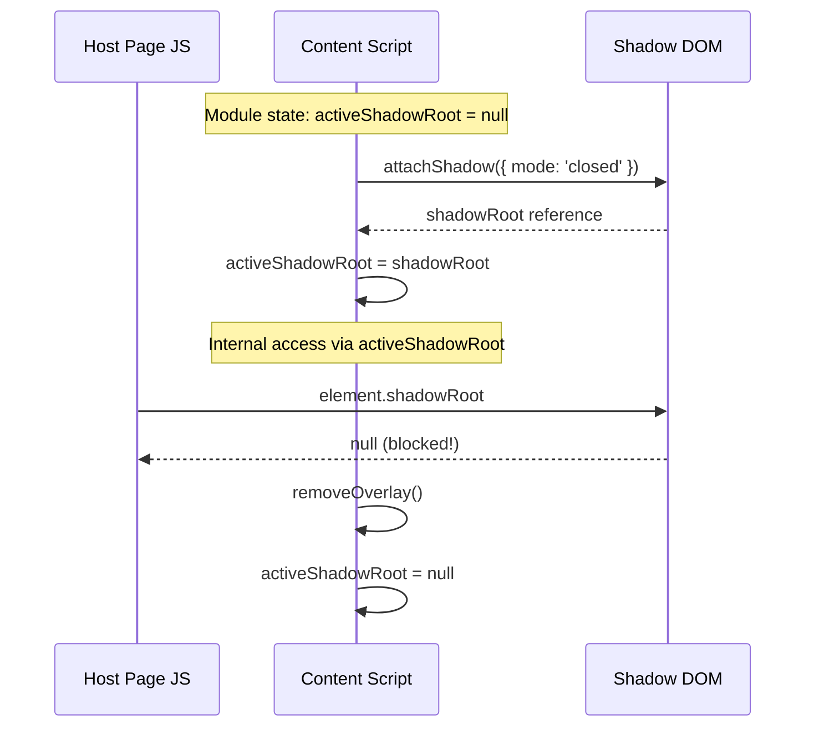

# 10197 - Feature: Shadow DOM Security Hardening

## 1. Context & Goal
* **Issue:** #197
* **Objective:** Change Shadow DOM from `mode: 'open'` to `mode: 'closed'` per ADR 0202
* **Status:** Draft
* **Related Issues:** #77 (Action Feedback), #94 (XSS Test Harness)
* **Related ADR:** [0202-ADR-shadow-dom-isolation.md](0202-ADR-shadow-dom-isolation.md)

### Open Questions
*None - solution pattern provided by Gemini review.*

## 2. Requirements

| ID | Requirement | Priority |
|----|-------------|----------|
| R1 | All `attachShadow()` calls must use `mode: 'closed'` | MUST |
| R2 | Overlay must continue to render correctly | MUST |
| R3 | Legacy `window.updateAletheiaOverlay()` API must continue to work | MUST |
| R4 | Host page JavaScript must NOT be able to access shadow root | MUST |
| R5 | No memory leaks from stale shadow root references | SHOULD |

## 3. Alternatives Considered

| Option | Pros | Cons | Decision |
|--------|------|------|----------|
| A: Module-level reference pattern | Preserves internal access, blocks external | Requires careful cleanup | **Selected** |
| B: WeakMap for shadow references | Auto garbage collection | Overcomplicated for single overlay | Rejected |
| C: Re-query DOM each time | No state management | Performance overhead, still needs shadowRoot | Rejected |

**Rationale:** The module-level reference pattern is the standard approach for closed Shadow DOM when internal access is needed. It's simple, explicit, and matches the existing code style.

## 4. Data & Fixtures

### 4.1 Data Sources
N/A - No external data. This is a security refactor.

### 4.2 Data Pipeline
N/A

### 4.3 Test Fixtures
| Fixture | Source | Notes |
|---------|--------|-------|
| Test page with malicious JS | `tests/fixtures/html/test-shadow-access.html` | New fixture to verify closed mode |

### 4.4 Deployment Pipeline
Standard extension release process. Changes bundled in next Chrome/Firefox release ZIP.

## 5. Diagram



## 6. Technical Approach

* **Module:** `extensions/chrome/overlay.js`, `extensions/firefox/overlay.js`
* **Dependencies:** None (pure JavaScript)
* **Pattern:** Module-level state for closed Shadow DOM access

### 6.1 The Reference Pattern

When using `mode: 'closed'`, `element.shadowRoot` returns `null` to all callers, including our own code. We solve this by capturing the reference at creation time:

```javascript
// Module-level state
let activeShadowRoot = null;

// At creation
const shadow = host.attachShadow({ mode: 'closed' });
activeShadowRoot = shadow;  // Capture reference

// For internal access
activeShadowRoot.querySelector('.overlay');  // Works
host.shadowRoot.querySelector('.overlay');   // Returns null - don't use

// At cleanup
activeShadowRoot = null;  // Prevent memory leaks
```

## 7. Interface Specification

### 7.1 State Variable

```javascript
// At top of overlay.js, after existing variable declarations
let activeShadowRoot = null;
```

### 7.2 Modified Functions

**showLoadingOverlay() - Line ~478**
```javascript
// Before:
const shadow = host.attachShadow({ mode: 'open' });

// After:
const shadow = host.attachShadow({ mode: 'closed' });
activeShadowRoot = shadow;
```

**showResultOverlay() - Line ~527**
```javascript
// Before:
const shadow = host.attachShadow({ mode: 'open' });

// After:
const shadow = host.attachShadow({ mode: 'closed' });
activeShadowRoot = shadow;
```

**showAletheiaOverlay() - Line ~728**
```javascript
// Before:
const shadow = host.attachShadow({ mode: 'open' });

// After:
const shadow = host.attachShadow({ mode: 'closed' });
activeShadowRoot = shadow;
```

**removeOverlay() - Line ~446**
```javascript
// Add at end of function, before closing brace:
activeShadowRoot = null;
```

**updateAletheiaOverlay() - Line ~795-815**
```javascript
// Before (line ~799):
if (!host || !host.isConnected || !host.shadowRoot) {

// After:
if (!host || !host.isConnected || !activeShadowRoot) {

// Before (line ~815):
const overlay = host.shadowRoot.querySelector('.overlay');

// After:
const overlay = activeShadowRoot.querySelector('.overlay');
```

### 7.3 Logic Flow

```
1. User triggers overlay (selection, context menu)
2. showLoadingOverlay() or showResultOverlay() called
3. Create host element with id='aletheia-overlay-host'
4. Call attachShadow({ mode: 'closed' })
5. Store reference: activeShadowRoot = shadow
6. Build and append content to activeShadowRoot
7. Append host to document.body

Internal updates:
8. updateAletheiaOverlay() uses activeShadowRoot.querySelector()

Cleanup:
9. removeOverlay() removes host from DOM
10. Set activeShadowRoot = null
```

## 8. Security Considerations

| Concern | Mitigation | Status |
|---------|------------|--------|
| Host page DOM access | `mode: 'closed'` returns null for element.shadowRoot | Addressed |
| DOM clobbering attacks | Closed mode prevents manipulation | Addressed |
| Style hijacking | Shadow DOM isolates styles bidirectionally | Addressed |
| Stale reference attack | activeShadowRoot nulled on removal | Addressed |

**Fail Mode:** Fail Secure - If overlay cannot be created, no DOM exposure occurs.

### 8.1 Attack Vectors Blocked

1. **DOM Clobbering:** Malicious page cannot create elements that shadow our overlay
2. **Style Injection:** Host CSS cannot affect shadow content
3. **Event Hijacking:** Host cannot attach listeners to shadow elements
4. **Content Manipulation:** Host cannot read or modify overlay content

## 9. Performance Considerations

| Metric | Budget | Approach |
|--------|--------|----------|
| Memory | Negligible | Single reference variable |
| Latency | 0ms impact | No additional operations |
| CPU | Negligible | Reference assignment only |

**Bottlenecks:** None. This is a 1-line change at each location.

## 10. Risks & Mitigations

| Risk | Impact | Likelihood | Mitigation |
|------|--------|------------|------------|
| Forgot to set activeShadowRoot | Overlay updates fail | Low | Code review, automated test |
| Forgot to null on removal | Memory leak | Low | Code review, cleanup test |
| Other code uses host.shadowRoot | Runtime error | Med | Grep codebase, fix all refs |

## 11. Verification & Testing

### 11.1 Test Scenarios

| ID | Scenario | Type | Input | Expected Output | Pass Criteria |
|----|----------|------|-------|-----------------|---------------|
| 010 | Security: shadowRoot null from host | Auto | Console: `document.getElementById('aletheia-overlay-host').shadowRoot` | `null` | Returns null, not shadow root |
| 020 | Regression: Overlay renders | Auto | Trigger overlay on allowlisted site | Overlay appears | Visible, correctly styled |
| 030 | Regression: Overlay updates | Auto | Call updateAletheiaOverlay() | Message changes | New message displayed |
| 040 | Regression: Overlay removes | Auto | Click close or trigger removeOverlay() | Overlay gone | No host element in DOM |
| 050 | Memory: No stale reference | Auto | Create/remove overlay 10x | No memory growth | activeShadowRoot is null after each removal |
| 060 | Cross-browser: Chrome | Manual | Full test on Chrome | All scenarios pass | Chrome MV3 works |
| 070 | Cross-browser: Firefox | Manual | Full test on Firefox | All scenarios pass | Firefox MV3 works |

### 11.2 Test Commands

```bash
# Run Playwright E2E tests (includes security verification)
npx playwright test tests/e2e/shadow-dom-security.spec.js

# Manual security verification (run in browser console on test page)
# Should return null:
document.getElementById('aletheia-overlay-host').shadowRoot
```

### 11.3 Manual Tests

| ID | Scenario | Why Not Automated | Steps |
|----|----------|-------------------|-------|
| 060 | Chrome full test | Visual verification of styling | 1. Load extension in Chrome, 2. Visit test site, 3. Trigger overlay, 4. Verify appearance |
| 070 | Firefox full test | Visual verification of styling | 1. Load extension in Firefox, 2. Visit test site, 3. Trigger overlay, 4. Verify appearance |

### 11.4 Security Test (Console Verification)

After implementation, run this in browser DevTools console on any page with the overlay visible:

```javascript
// This MUST return null after the fix
const host = document.getElementById('aletheia-overlay-host');
console.log('shadowRoot accessible?', host.shadowRoot);
// Expected: null
// If not null: SECURITY VIOLATION - fix not applied correctly
```

## 12. Definition of Done

### Code
- [ ] All 3 `attachShadow` calls changed to `mode: 'closed'` in Chrome overlay.js
- [ ] All 3 `attachShadow` calls changed to `mode: 'closed'` in Firefox overlay.js
- [ ] `activeShadowRoot` variable added to both files
- [ ] `activeShadowRoot` assigned after each `attachShadow` call
- [ ] `activeShadowRoot = null` added to `removeOverlay()`
- [ ] `updateAletheiaOverlay` uses `activeShadowRoot` instead of `host.shadowRoot`
- [ ] Code comments reference this LLD and ADR 0202

### Tests
- [ ] Security test passes (shadowRoot returns null)
- [ ] Regression tests pass (overlay renders, updates, removes)
- [ ] Manual cross-browser verification complete

### Documentation
- [ ] LLD updated with any deviations
- [ ] Implementation Report completed
- [ ] Test Report completed

### Review
- [ ] Code review completed (Gemini)
- [ ] Security verification by orchestrator
- [ ] User approval before closing issue

## 13. Affected Files

| File | Changes |
|------|---------|
| `extensions/chrome/overlay.js` | Add state var, modify 3 attachShadow calls, modify removeOverlay, modify updateAletheiaOverlay |
| `extensions/firefox/overlay.js` | Same changes as Chrome |
| `tests/e2e/shadow-dom-security.spec.js` | New test file for security verification |
| `tests/fixtures/html/test-shadow-access.html` | New fixture for testing |

## 14. References

- [ADR 0202: Shadow DOM for Injected UI](0202-ADR-shadow-dom-isolation.md)
- [MDN: Element.attachShadow()](https://developer.mozilla.org/en-US/docs/Web/API/Element/attachShadow)
- [MDN: ShadowRoot](https://developer.mozilla.org/en-US/docs/Web/API/ShadowRoot)
- [OWASP: DOM Clobbering](https://owasp.org/www-community/attacks/DOM_Clobbering)
