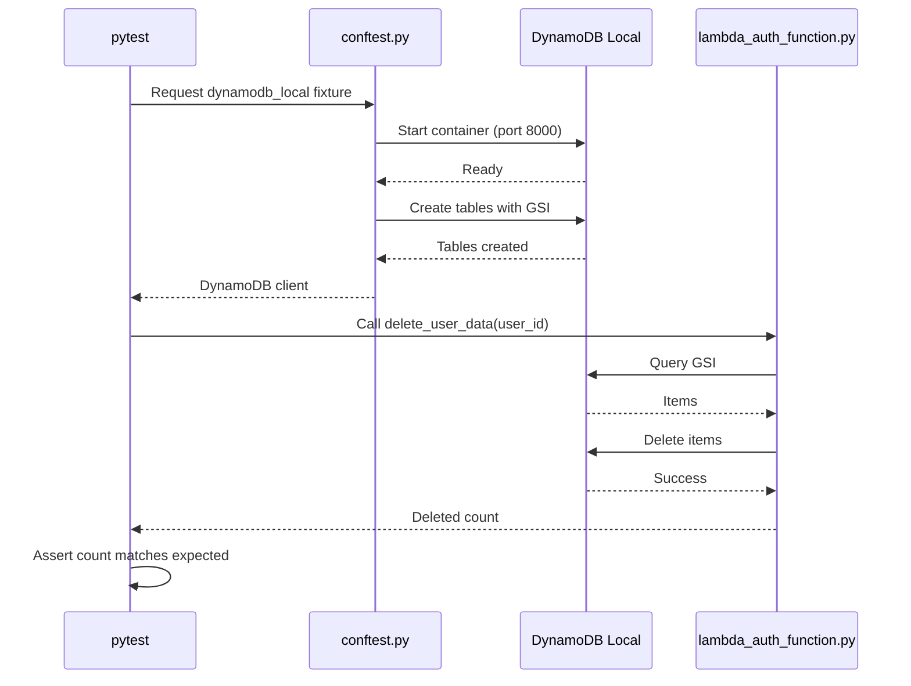

# 10264 - Feature: DynamoDB Integration Test Fixtures

## 1. Context & Goal
* **Issue:** #264
* **Objective:** Create DynamoDB Local integration test infrastructure for Lambda data operations
* **Status:** Draft
* **Related Issues:** #147 (GDPR delete_user_data), #150 (TTL backfill)

### Open Questions
*Questions that need clarification before or during implementation. Remove when resolved.*

- [x] Should fixtures run in CI on every push or only on manual trigger? → **On push** (fast with service containers)
- [x] Is Docker-in-Docker needed for GitHub Actions, or can we use service containers? → **Service containers** (native support)

## 2. Requirements
When this is done:
1. DynamoDB Local runs in CI via Docker service container
2. Test fixtures create tables matching production schema (with GSI)
3. Integration tests for `delete_user_data()` GDPR function
4. Integration tests for `save_state()` with TTL verification
5. Pagination tested with >1MB fixture data (DynamoDB page limit)
6. Tests isolated from production (no real AWS calls)

## 3. Alternatives Considered

| Option | Pros | Cons | Decision |
|--------|------|------|----------|
| **A: DynamoDB Local (Docker)** | Official AWS, exact API compatibility | Requires Docker | **Selected** |
| B: Moto library | Pure Python, no Docker | May have API gaps | Rejected |
| C: LocalStack | Full AWS stack | Overkill for DynamoDB only | Rejected |

**Rationale:** DynamoDB Local is AWS's official local testing tool with 100% API compatibility. Moto is great for unit tests but integration tests benefit from the real DynamoDB engine.

## 4. Data & Fixtures

### 4.1 Data Sources

| Attribute | Value |
|-----------|-------|
| Source | Generated test data |
| Format | Python dicts → DynamoDB items |
| Size | Variable (10 items → 10,000 items for pagination) |
| Refresh | Created fresh per test run |
| Copyright/License | N/A (synthetic) |

### 4.2 Data Pipeline

```
pytest ──fixture──► DynamoDB Local ──Lambda code──► Assertions
                        ▲
                  Docker service
```

### 4.3 Test Fixtures

| Fixture | Source | Notes |
|---------|--------|-------|
| `dynamodb_local` | Docker | Session-scoped, creates tables |
| `agent_state_table` | Fixture | Creates AletheiaAgentState table with GSI |
| `users_table` | Fixture | Creates AletheiaUsers table |
| `sample_user_data` | Generated | 10 items for user_id=test-user-1 |
| `large_user_data` | Generated | 2000 items to trigger pagination |

### 4.4 Deployment Pipeline

- Tests run in CI via GitHub Actions
- DynamoDB Local runs as a service container
- No deployment needed (test infrastructure only)

## 5. Diagram



## 6. Technical Approach

* **Module:** `tests/integration/conftest.py`, `tests/integration/test_dynamodb_ops.py`
* **Dependencies:** pytest, boto3, testcontainers-python (required for test group)
* **Pattern:** pytest fixtures with session scope for Docker container

### 6.1 Endpoint Injection Strategy (per Gemini G1.BLOCKING)

**Problem:** Lambda code uses `boto3.client("dynamodb")` which connects to real AWS by default.

**Solution:** Environment variable injection via `DYNAMODB_ENDPOINT`:

```python
# In lambda_auth_function.py (minimal change)
def get_dynamodb_client():
    endpoint = os.environ.get("DYNAMODB_ENDPOINT")
    if endpoint:
        return boto3.client("dynamodb", endpoint_url=endpoint)
    return boto3.client("dynamodb")  # Default: real AWS
```

**Test fixture sets env var:**
```python
@pytest.fixture(scope="session", autouse=True)
def set_dynamodb_endpoint(dynamodb_local):
    os.environ["DYNAMODB_ENDPOINT"] = "http://localhost:8000"
    yield
    del os.environ["DYNAMODB_ENDPOINT"]
```

**Why this approach:**
- Minimal production code change (1 function)
- No mocking required - tests exercise real boto3 + DynamoDB Local
- Same code path as production, just different endpoint

### 6.2 Dual-Mode Container Strategy (per Gemini Implementation Review)

**Problem:** The original implementation always started a testcontainers instance, even when CI provided a DynamoDB service container via `DYNAMODB_ENDPOINT`.

**Solution:** Conditional container startup based on environment:

```python
@pytest.fixture(scope="session")
def dynamodb_endpoint() -> Generator[str, None, None]:
    """Get DynamoDB endpoint - uses existing if set (CI), otherwise starts container (local)."""
    existing_endpoint = os.environ.get("DYNAMODB_ENDPOINT")
    if existing_endpoint:
        # CI mode: use existing service container
        yield existing_endpoint
        return

    # Local mode: start container via testcontainers
    container = DockerContainer("amazon/dynamodb-local:latest")
    ...
```

**Behavior:**
| Environment | `DYNAMODB_ENDPOINT` | Container Action |
|-------------|---------------------|------------------|
| CI (GitHub Actions) | Set to `http://localhost:8000` | Skip creation, use existing |
| Local dev | Not set | Start via testcontainers |

**Why this matters:**
- Avoids running two DynamoDB instances in CI (wasteful)
- Maintains local dev experience (no manual Docker required)
- Single code path for both environments

### 6.3 Test Isolation Strategy (per Gemini G1.HIGH)

**Approach:** Function-scoped data cleanup with session-scoped container.

```python
@pytest.fixture(autouse=True)
def cleanup_tables(dynamodb_local, agent_state_table):
    """Delete all items after each test."""
    yield  # Test runs here
    # Cleanup: scan and delete all items
    response = dynamodb_local.scan(TableName=agent_state_table)
    for item in response.get("Items", []):
        dynamodb_local.delete_item(
            TableName=agent_state_table,
            Key={"thread_id": item["thread_id"], "checkpoint_id": item["checkpoint_id"]}
        )
```

**Why not function-scoped tables:**
- Table creation takes ~1-2s each
- GSI propagation adds latency
- Session-scoped container + cleanup is faster for many tests

## 7. Interface Specification

### 7.1 Data Structures
```python
# Production table schema (from provision.sh)
AGENT_STATE_TABLE_SCHEMA = {
    "TableName": "AletheiaAgentState",
    "KeySchema": [
        {"AttributeName": "thread_id", "KeyType": "HASH"},
        {"AttributeName": "checkpoint_id", "KeyType": "RANGE"},
    ],
    "AttributeDefinitions": [
        {"AttributeName": "thread_id", "AttributeType": "S"},
        {"AttributeName": "checkpoint_id", "AttributeType": "S"},
        {"AttributeName": "user_id", "AttributeType": "S"},
    ],
    "GlobalSecondaryIndexes": [
        {
            "IndexName": "user_id-index",
            "KeySchema": [{"AttributeName": "user_id", "KeyType": "HASH"}],
            "Projection": {"ProjectionType": "KEYS_ONLY"},
        }
    ],
    "BillingMode": "PAY_PER_REQUEST",
}

USERS_TABLE_SCHEMA = {
    "TableName": "AletheiaUsers",
    "KeySchema": [{"AttributeName": "user_id", "KeyType": "HASH"}],
    "AttributeDefinitions": [
        {"AttributeName": "user_id", "AttributeType": "S"},
    ],
    "BillingMode": "PAY_PER_REQUEST",
}
```

### 7.2 Function Signatures
```python
# Fixtures (conftest.py)
@pytest.fixture(scope="session")
def dynamodb_local() -> Generator[boto3.client, None, None]:
    """Start DynamoDB Local container, yield client, cleanup."""
    ...

@pytest.fixture
def agent_state_table(dynamodb_local) -> str:
    """Create AletheiaAgentState table with GSI, return table name."""
    ...

@pytest.fixture
def sample_user_data(dynamodb_local, agent_state_table) -> list[dict]:
    """Insert 10 items for test-user-1, return items."""
    ...

@pytest.fixture
def large_user_data(dynamodb_local, agent_state_table) -> list[dict]:
    """Insert 2000 items to trigger pagination."""
    ...

# Test functions
def test_delete_user_data_removes_all_items(sample_user_data, dynamodb_local):
    """delete_user_data() removes all items for a user via GSI."""
    ...

def test_delete_user_data_handles_pagination(large_user_data, dynamodb_local):
    """delete_user_data() handles >1MB response (pagination)."""
    ...

def test_save_state_sets_ttl(dynamodb_local, agent_state_table):
    """save_state() sets ttl attribute correctly."""
    ...
```

### 7.3 Logic Flow (Pseudocode)
```
SETUP (session scope):
1. Pull amazon/dynamodb-local:latest image
2. Start container on port 8000
3. Wait for health check
4. Create boto3 client pointing to localhost:8000

PER-TEST:
1. Create required tables (if not exist)
2. Insert test data via fixtures
3. Run test against Lambda code
4. Verify results
5. Truncate tables (cleanup)

TEARDOWN (session scope):
1. Stop container
2. Remove container
```

## 8. Security Considerations

| Concern | Mitigation | Status |
|---------|------------|--------|
| Production data access | Tests use endpoint_url=localhost:8000 | Addressed |
| Leaked credentials | No real AWS creds needed for local | Addressed |
| Docker privilege | GitHub Actions uses service containers | Addressed |

**Fail Mode:** Fail Closed - tests fail if DynamoDB Local unavailable

## 9. Performance Considerations

| Metric | Budget | Approach |
|--------|--------|----------|
| Container startup | < 10s | Use session-scoped fixture (start once) |
| Table creation | < 2s | Create at session start, reuse |
| Test execution | < 60s total | Parallel test execution with pytest-xdist |

**Bottlenecks:** Large fixture data insertion (2000 items). Use batch_write_item.

## 10. Risks & Mitigations

| Risk | Impact | Likelihood | Mitigation |
|------|--------|------------|------------|
| Docker unavailable in CI | High | Low | GitHub Actions supports service containers |
| DynamoDB Local API drift | Medium | Low | Pin image version, test against known version |
| Slow fixture creation | Medium | Medium | Use batch writes, session-scoped container |

## 11. Verification & Testing

### 11.1 Test Scenarios

| ID | Scenario | Type | Input | Expected Output | Pass Criteria |
|----|----------|------|-------|-----------------|---------------|
| 010 | delete_user_data happy path | Auto | 10 items for user | All 10 deleted | Deleted count = 10 |
| 020 | delete_user_data pagination | Auto | 2000 items for user | All 2000 deleted | Handles LastEvaluatedKey |
| 030 | delete_user_data no items | Auto | 0 items for user | 0 deleted | No error |
| 040 | save_state with TTL | Auto | State dict | Item has ttl attribute | TTL = now + 30 days |
| 050 | GSI query returns correct user | Auto | Items for 3 users | Only target user items | user_id filter works |
| 060 | Table creation with GSI | Auto | Schema from provision.sh | Table + GSI active | GSI queryable |

### 11.2 Test Commands

```bash
# Run integration tests (requires Docker)
poetry run pytest tests/integration/test_dynamodb_ops.py -v

# Run with verbose Docker output
poetry run pytest tests/integration/test_dynamodb_ops.py -v --capture=no

# Skip if Docker unavailable
poetry run pytest tests/integration/ -v -m "not requires_docker"
```

### 11.3 Manual Tests (Only If Unavoidable)

N/A - All scenarios automated.

## 12. Definition of Done

### Code
- [ ] `tests/integration/conftest.py` with DynamoDB fixtures
- [ ] `tests/integration/test_dynamodb_ops.py` with test cases
- [ ] GitHub Actions workflow updated for DynamoDB service

### Tests
- [ ] All test scenarios pass locally
- [ ] Tests pass in CI with service container

### Documentation
- [ ] LLD updated with any deviations
- [ ] Implementation Report (0103) completed
- [ ] README updated with integration test instructions

### Review
- [ ] Code review completed
- [ ] User approval before closing issue

---

## Appendix: GitHub Actions Service Container

```yaml
# .github/workflows/test.yml (excerpt)
jobs:
  integration-tests:
    runs-on: ubuntu-latest
    services:
      dynamodb:
        image: amazon/dynamodb-local:latest
        ports:
          - 8000:8000
    steps:
      - uses: actions/checkout@v4
      - name: Run integration tests
        env:
          DYNAMODB_ENDPOINT: http://localhost:8000
        run: poetry run pytest tests/integration/ -v
```

---

## Appendix: Review Log

*Track all review feedback with timestamps and implementation status.*

### Gemini Review #1 (FEEDBACK)

**Timestamp:** 2026-01-10 13:00 CT
**Reviewer:** Gemini 3 Pro (gemini-3-pro-preview)
**Verdict:** FEEDBACK (revisions required)

#### Model Verification

**Invocation:** `tools/gemini-model-check.sh` with `--model gemini-3-pro-preview`
**Exit Code:** 0 (success - model validated)
**Stats.models key:** `"gemini-3-pro-preview"`

```json
"stats": {
  "models": {
    "gemini-3-pro-preview": {
      "api": { "totalRequests": 1, "totalErrors": 0 },
      "tokens": { "input": ~8500, "total": ~10000 }
    }
  }
}
```

*Note: If model had been downgraded (e.g., to gemini-2.5-flash), script would have returned exit code 3 and aborted.*

#### [BLOCKING] Issues

| ID | Comment | Implemented? |
|----|---------|--------------|
| G1.1 | "Missing Endpoint Injection" - Lambda code needs way to use localhost:8000 | ✅ YES - Added §6.1 with DYNAMODB_ENDPOINT env var strategy |

#### [HIGH] Priority Issues

| ID | Comment | Implemented? |
|----|---------|--------------|
| G1.2 | "Ambiguous Cleanup Strategy" - Data persists between tests | ✅ YES - Added §6.2 with autouse cleanup fixture |

#### [SUGGESTION] Items

| ID | Comment | Implemented? |
|----|---------|--------------|
| G1.3 | "Resolve Open Questions" - Already answered in appendix | ✅ YES - Marked questions resolved in §1 |
| G1.4 | "Use testcontainers-python" - More robust than raw Docker | ✅ YES - Changed from optional to required in §6 |

### Review Summary

| Review | Date | Verdict | Key Issue |
|--------|------|---------|-----------|
| Gemini #1 | 2026-01-10 | FEEDBACK | Endpoint injection + cleanup strategy |

**Final Status:** REVISED (ready for user approval)
