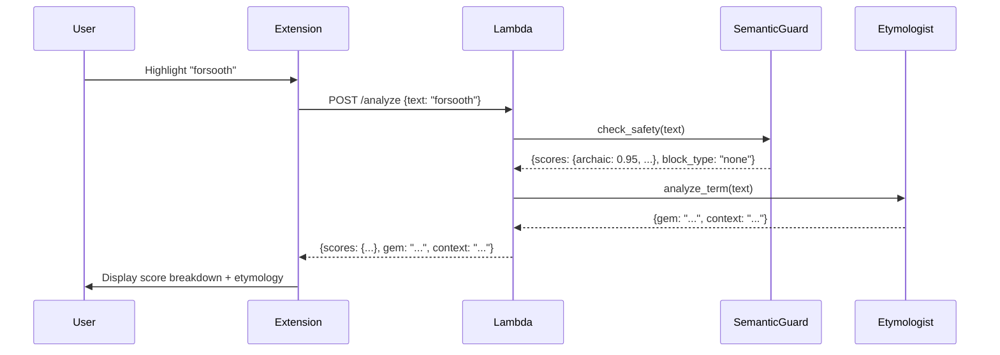

# 10295 - Feature: Display Confidence Scores Instead of Single Classification Label

## 1. Context & Goal
* **Issue:** #295
* **Objective:** Display confidence scores across all categories (≥15% threshold) instead of a single classification label
* **Status:** In Progress (Gemini reviewed, feedback addressed)
* **Related Issues:** #294 (Nova Micro - blocked by this)

### Open Questions
*None - requirements are clear from issue specification.*

## 2. Requirements

1. Lambda returns full `scores` object with all 4 categories (General Usage, Archaic, Provocative, Neologism)
2. **[G1.1]** Lambda ALSO returns `signal` field (derived from top score) for backward compatibility with deployed extensions
3. Extension displays all categories with confidence ≥ 15%
4. Scores shown in descending order, rounded to nearest 5% (rounding done in Lambda for cross-client consistency)
5. "None" category renamed to "General Usage" in taxonomy JSON key only (prompt wording unchanged - see §6.1)
6. Etymologist continues to return "signal" field during transition period
7. Hate speech continues to return 403 (scores never exposed)
8. **[G1.3]** Warning flag (`warning: true`) set when: `scores.provocative >= 0.50` (dominant Provocative category)

## 3. Alternatives Considered

| Option | Pros | Cons | Decision |
|--------|------|------|----------|
| Show top-1 category only (current) | Simple, less UI change | Loses nuance, false precision | **Rejected** |
| Show all categories ≥ 15% | Transparent, shows nuance | More UI space needed | **Selected** |
| Show top-3 categories always | Consistent display size | May show irrelevant low scores | Rejected |

**Rationale:** Users benefit from seeing the full confidence distribution. A word like "serendipity" that's 70% General Usage, 15% Archaic, 15% Neologism tells a richer story than just "General Usage".

## 4. Data & Fixtures

### 4.1 Data Sources

| Attribute | Value |
|-----------|-------|
| Source | Semantic Guardrail LLM classification |
| Format | JSON scores object `{category: float}` |
| Size | 4 categories, always present |
| Refresh | Per-request |
| Copyright/License | N/A |

### 4.2 Data Pipeline

```
User Input ──Lambda──► Semantic Guardrail ──LLM──► Scores Object ──Lambda──► Extension
```

### 4.3 Test Fixtures

| Fixture | Source | Notes |
|---------|--------|-------|
| Mock scores response | Generated | Test edge cases (all 100%, split 50/50, etc.) |
| Existing taxonomy.json examples | Hardcoded | Already has score distributions |

### 4.4 Deployment Pipeline

Standard Lambda deployment via SAM. No data migration needed.

## 5. Diagram



## 6. Technical Approach

* **Modules:**
  - `src/lambda_function.py` - Include scores AND signal in response, do rounding
  - `src/etymologist.py` - Keep signal output (backward compat)
  - `src/guardrails/resources/taxonomy.json` - Rename None→General Usage (key only)
  - `extensions/chrome/overlay.js` - Render score list (new extensions use scores)
  - `extensions/firefox/overlay.js` - Mirror Chrome changes

* **Dependencies:** None new
* **Pattern:** Pass-through of existing scores from semantic guardrail

### 6.1 Taxonomy Rename Strategy (Addresses G1.2)

**Key change only, not prompt wording:**
- `taxonomy.json` key: `"None"` → `"General_Usage"` (snake_case for JSON consistency)
- LLM prompt wording: Keep existing "None" terminology to avoid classification drift
- Extension display: Map `General_Usage` key → "General Usage" display string

**Rationale:** The LLM was trained with "None" semantics. Changing prompt wording risks regression. The key rename is purely for API/display clarity.

### 6.2 Backward Compatibility Strategy (Addresses G1.1)

**Transition period (until v2.0):**
```python
# Lambda response includes BOTH for backward compat
{
    "signal": "Archaic Pejorative",  # Derived from top score (old clients)
    "scores": {...},                  # Full distribution (new clients)
    ...
}
```

New extensions ignore `signal` and render from `scores`. Old extensions continue working.

## 7. Interface Specification

### 7.1 Data Structures

```python
# Lambda response (new format with backward compat)
class LambdaResponse(TypedDict):
    thread_id: str
    status: Literal["success", "fallback", "error"]
    signal: str  # KEPT for backward compat (derived from top score)
    scores: dict[str, float]  # NEW: {general_usage: 0.7, archaic: 0.15, ...}
    scores_display: list[dict]  # NEW: Pre-rounded, filtered, sorted for display
    gem: str
    context: str
    warning: bool  # Optional: True when provocative >= 0.50
```

```javascript
// Extension display structure (JS)
const ScoreDisplay = {
    category: string,    // "General Usage", "Archaic", etc.
    percentage: number,  // Rounded to nearest 5%
    isWarning: boolean   // True for "Provocative"
};
```

### 7.2 Function Signatures

```python
# Lambda - include scores in response (lambda_function.py)
def build_response_body(
    result: AnalysisResult,
    metadata: dict,
    block_type: str
) -> dict:
    """Build response body with scores instead of signal."""
    ...

# Extension - filter and format scores (overlay.js)
def filterScores(scores: dict, threshold: float = 0.15) -> list:
    """Return categories >= threshold, sorted descending."""
    ...

def formatPercentage(score: float) -> int:
    """Round to nearest 5%."""
    ...
```

### 7.3 Logic Flow (Pseudocode)

```
Lambda Response Build:
1. Get scores from semantic guardrail metadata
2. Get gem/context from etymologist (no signal)
3. Build response:
   - Include full scores object
   - Set warning=true if Provocative > 50%
   - Omit signal field
4. Return 200 with scores

Extension Render:
1. Receive response with scores object
2. Filter: keep categories where score >= 0.15
3. Sort: descending by score
4. For each category:
   - Round score to nearest 5%
   - Format as "{Category}: {percent}%"
   - Add warning icon if category is "Provocative"
5. Render list in header section
```

## 8. Security Considerations

| Concern | Mitigation | Status |
|---------|------------|--------|
| Hate scores exposed | 403 blocks before score calculation | Addressed |
| Score manipulation | Scores from LLM, not user input | Addressed |
| XSS via category names | Category names are hardcoded constants | Addressed |

**Fail Mode:** Fail Closed - If score parsing fails, show "Analysis Failed" (existing fallback behavior).

## 9. Performance Considerations

| Metric | Budget | Approach |
|--------|--------|----------|
| Latency | No change | Scores already calculated by semantic guardrail |
| Response size | +~50 bytes | scores object adds minimal size |
| Extension render | < 5ms | Simple list rendering |

**Bottlenecks:** None - this is a data format change, not a new computation.

## 10. Risks & Mitigations

| Risk | Impact | Likelihood | Mitigation |
|------|--------|------------|------------|
| Category name mismatch between Lambda/Extension | Med | Low | Use shared constants, add validation |
| Scores don't sum to 1.0 | Low | Low | LLM prompt enforces normalization |
| UI overflow with 4 categories | Low | Low | Max 4 lines, fits in existing card |

## 11. Verification & Testing

### 11.1 Test Scenarios

| ID | Scenario | Type | Input | Expected Output | Pass Criteria |
|----|----------|------|-------|-----------------|---------------|
| 010 | Clear category (archaic word) | Auto | "forsooth" | Archaic: 95%, General Usage: 5% | Archaic >= 90% |
| 020 | Mixed signals | Auto | "serendipity" | Multiple categories shown | ≥2 categories >= 15% |
| 030 | General usage word | Auto | "hello" | General Usage: ~100% | Only General Usage shown |
| 040 | Provocative with warning | Auto | "tupping" | Provocative: ~85%, warning icon | warning=true in response |
| 050 | Hate speech blocked | Auto | slur | 403 Forbidden | No scores in response |
| 060 | Score filtering threshold | Auto | Mock {a: 0.80, b: 0.14, c: 0.06} | Only "a" shown | b, c filtered out |
| 061 | Boundary: exactly 15% | Auto | Mock {a: 0.85, b: 0.15} | Both shown | 15% included |
| 062 | Boundary: just below 15% | Auto | Mock {a: 0.851, b: 0.149} | Only "a" shown | 14.9% excluded |
| 063 | Boundary: just above 15% | Auto | Mock {a: 0.849, b: 0.151} | Both shown | 15.1% included |
| 070 | Score rounding | Auto | 0.73 | 75% | Round to nearest 5 |
| 080 | Score sorting | Auto | {a: 0.30, b: 0.70} | b first, then a | Descending order |
| 090 | Taxonomy rename | Auto | Check taxonomy.json | "General Usage" not "None" | Key exists |
| 100 | Extension renders scores | E2E | Any word | Score list visible | UI shows percentages |

### 11.2 Test Commands

```bash
# Run unit tests
poetry run pytest tests/test_lambda_function.py tests/test_etymologist.py -v

# Run extension E2E tests
npm --prefix extensions/chrome run test:e2e
```

### 11.3 Manual Tests

N/A - All scenarios automated.

## 12. Definition of Done

### Code
- [ ] Lambda returns `scores` AND `signal` in response (backward compat)
- [ ] Lambda returns pre-processed `scores_display` list
- [ ] Etymologist continues returning `signal` (keep for transition)
- [ ] Taxonomy.json key renamed to "General_Usage" (prompt wording unchanged)
- [ ] Chrome extension renders score list from `scores_display`
- [ ] Firefox extension renders score list from `scores_display`

### Tests
- [ ] Unit tests for score filtering/formatting
- [ ] E2E test for score display

### Documentation
- [ ] LLD updated with any deviations
- [ ] Implementation Report created
- [ ] Test Report created

### Review
- [ ] Gemini review completed
- [ ] User approval before closing issue

---

## Appendix: Review Log

### Gemini Review #1 (FEEDBACK)

**Timestamp:** 2026-01-10 21:50 CT
**Reviewer:** Gemini 3 Pro Preview
**Verdict:** FEEDBACK (3 issues to address)

#### Comments

| ID | Comment | Implemented? |
|----|---------|--------------|
| G1.1 | "[BLOCKING] API Backward Compatibility: Removing signal field will break existing extensions" | ✅ YES - §2 Req 2, §6.2, §7.1 |
| G1.2 | "[HIGH] Prompt/Taxonomy Alignment: None→General Usage semantic change risks regression" | ✅ YES - §2 Req 5, §6.1 |
| G1.3 | "[HIGH] Undefined Warning Flag Logic: Need exact arithmetic condition" | ✅ YES - §2 Req 8 |
| G1.4 | "[SUGGESTION] Rounding in Lambda for consistency" | ✅ YES - §2 Req 4, §7.1 scores_display |
| G1.5 | "[SUGGESTION] Boundary test cases for 15% threshold" | ✅ YES - §11.1 tests 061-063 |

### Gemini Implementation Review (APPROVE)

**Timestamp:** 2026-01-10 22:45 CT
**Reviewer:** Gemini 3 Pro Preview
**Verdict:** APPROVE

> The implementation successfully satisfies strict requirements G1.1 through G1.5 defined in the LLD. The logic correctly filters scores below the 0.15 threshold before rounding. The rounding algorithm accurately quantizes values to the nearest 5% interval. Backward compatibility is maintained by preserving the legacy signal field while introducing the new scores_display structure.

### Review Summary

| Review | Date | Verdict | Key Issue |
|--------|------|---------|-----------|
| Gemini LLD #1 | 2026-01-10 | FEEDBACK | Backward compat for signal field |
| Gemini Impl #1 | 2026-01-10 | APPROVE | All G1.x requirements satisfied |

**Final Status:** APPROVED - Ready for merge pending user approval
