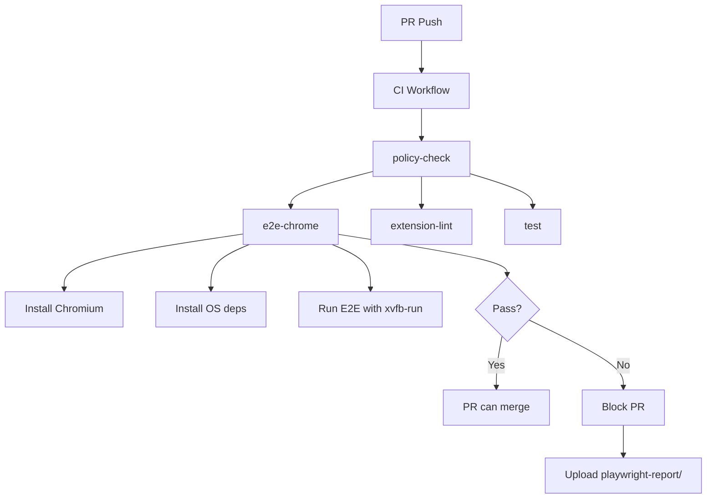

# 10306 - Test: Add Chrome E2E Tests to CI as Blocking Gate

## 1. Context & Goal
* **Issue:** #306
* **Objective:** Add Chrome E2E tests to CI as a blocking gate for all PRs, ensuring extension functionality regressions are caught before merge.
* **Status:** Approved
* **Related Issues:** #263 (Edge E2E test matrix - same pattern), #272 (Shadow DOM patch)

### Open Questions
*Questions that need clarification before or during implementation. Remove when resolved.*

- [x] Add to existing `ci.yml` or create separate workflow? **Add to existing `ci.yml`**
- [x] Block PRs immediately or warn-only first? **Block immediately (Chrome is primary target)**
- [x] Which Playwright project to run? **`chromium` project**

## 2. Requirements

Per Issue #306:

| ID | Requirement | Acceptance Criteria |
|----|-------------|---------------------|
| R1 | Chrome E2E tests run on every PR | GitHub Actions job triggers on PR |
| R2 | E2E failures block PR merge | Job does NOT use `continue-on-error` |
| R3 | Test artifacts uploaded on failure | `playwright-report/` uploaded as artifact |
| R4 | All existing E2E specs pass in CI | 0 failures in chromium project |
| R5 | xvfb-run for headed mode | Required for extension testing on Linux |

## 3. Alternatives Considered

| Option | Pros | Cons | Decision |
|--------|------|------|----------|
| Add job to existing `ci.yml` | Single workflow, clear dependency chain | Longer workflow file | **Selected** |
| Separate `e2e-chrome.yml` workflow | Isolation, parallel execution | Duplicate triggers, harder to coordinate | Rejected |
| Matrix strategy with Edge | DRY, single job definition | Edge is warn-only, Chrome should block | Rejected |

**Rationale:** Adding to `ci.yml` keeps E2E tests with other test jobs and allows proper `needs:` dependency chain. Chrome tests should block PRs immediately since Chrome is the primary extension target.

## 4. Data & Fixtures

### 4.1 Data Sources

| Attribute | Value |
|-----------|-------|
| Source | Existing E2E test specs |
| Format | Playwright test files |
| Size | ~10 spec files |
| Refresh | Per CI run |
| Copyright/License | MIT (project code) |

### 4.2 Data Pipeline

```
PR Push ──trigger──► CI Workflow ──job──► e2e-chrome ──run──► Playwright ──report──► Artifact
```

### 4.3 Test Fixtures

| Fixture | Source | Notes |
|---------|--------|-------|
| Extension source | `extensions/chrome/` | Unpacked extension (no build step) |
| Test HTML pages | `tests/e2e/fixtures/` | Existing fixtures |
| Mock responses | Playwright route handlers | Existing mocks |

### 4.4 Deployment Pipeline

CI only - no production deployment changes.

## 5. Diagram



## 6. Technical Approach

* **Module:** `.github/workflows/ci.yml`
* **Dependencies:** Playwright, Chromium (installed via Playwright)
* **Pattern:** CI job with artifact upload on failure

### 6.1 CI Job Configuration

Add to `.github/workflows/ci.yml` after `extension-lint` job:

```yaml
  # Chrome E2E tests - BLOCKING gate for extension functionality
  # Issue #306: Ensures extension works in Chrome before merge
  e2e-chrome:
    needs: policy-check
    runs-on: ubuntu-latest
    timeout-minutes: 15
    steps:
      - uses: actions/checkout@v4

      - name: Setup Node.js
        uses: actions/setup-node@v4
        with:
          node-version: '20'
          cache: 'npm'

      - name: Install dependencies
        run: npm ci

      - name: Cache Playwright binaries
        uses: actions/cache@v4
        with:
          path: ~/.cache/ms-playwright
          key: playwright-${{ runner.os }}-${{ hashFiles('**/package-lock.json') }}
          restore-keys: |
            playwright-${{ runner.os }}-

      - name: Install Chromium
        run: npx playwright install chromium

      - name: Install Chromium OS dependencies
        run: npx playwright install-deps chromium

      - name: Run Chrome E2E tests
        # xvfb-run required for headed mode (extensions require headless: false)
        # --headed flag ensures headed mode regardless of config file state
        # --reporter=html ensures playwright-report/ is generated for artifact upload
        run: xvfb-run --auto-servernum --server-args="-screen 0 1280x960x24" npx playwright test --project=chromium --headed --reporter=html

      - name: Upload test report on failure
        if: failure()
        uses: actions/upload-artifact@v4
        with:
          name: playwright-report-chrome
          path: playwright-report/
          retention-days: 7
```

### 6.2 Key Design Decisions

| Decision | Rationale |
|----------|-----------|
| `needs: policy-check` | Ensures policy compliance before spending CI time on E2E (verified: job exists in ci.yml:28) |
| No `continue-on-error` | Chrome is primary target - failures MUST block PRs |
| `timeout-minutes: 15` | Prevent stalled browser from consuming CI minutes |
| `if: failure()` for artifact | Only upload report when debugging is needed |
| `retention-days: 7` | Balance debugging needs with storage costs |
| `--reporter=html` | Guarantees `playwright-report/` output regardless of config file settings |
| `--headed` | Ensures headed mode for extension testing regardless of config |

### 6.3 Playwright Configuration

The existing `playwright.config.js` should already have a `chromium` project. Verify it includes:

```javascript
projects: [
  {
    name: 'chromium',
    use: {
      ...devices['Desktop Chrome'],
      headless: false,  // Required for extension testing
    },
  },
  // ... other projects
],
```

## 7. Interface Specification

### 7.1 Data Structures

N/A - CI workflow configuration only.

### 7.2 Function Signatures

N/A - No custom functions needed.

### 7.3 Logic Flow (Pseudocode)

```
1. PR push triggers CI workflow
2. policy-check job runs first
3. e2e-chrome job starts (needs: policy-check)
4. Install Node.js dependencies (npm ci)
5. Install Chromium browser via Playwright
6. Install OS-level dependencies for Chromium
7. Run Playwright tests with xvfb-run (headed mode)
8. IF tests pass: Job succeeds, PR can merge
9. IF tests fail: Job fails, upload playwright-report/, PR blocked
```

## 8. Security Considerations

| Concern | Mitigation | Status |
|---------|------------|--------|
| CI secrets exposure | No secrets needed for E2E tests | N/A |
| Runner isolation | Standard GitHub Actions isolation | Addressed |
| Extension permissions | Same as local testing | N/A |
| Malicious PR code | Runs in isolated container | Addressed |

**Fail Mode:** Fail Closed - Any test failure blocks the PR.

## 9. Performance Considerations

| Metric | Budget | Approach |
|--------|--------|----------|
| CI time (e2e-chrome job) | < 5 min | Parallel with other jobs |
| Total CI time impact | +0 min | Runs parallel to existing jobs |
| Runner cost | ~$0.008/min | Ubuntu runner |
| Artifact storage | ~10MB per failure | 7-day retention |

**Bottlenecks:** Chromium installation (~30s), test execution depends on spec count.

## 10. Risks & Mitigations

| Risk | Impact | Likelihood | Mitigation |
|------|--------|------------|------------|
| Flaky tests block PRs | High | Med | Playwright auto-retry, investigate flakes immediately |
| xvfb-run fails | High | Low | Well-established pattern, fallback to `--headed=false` investigation |
| Chromium not available | High | Very Low | Playwright manages installation |
| Long test times | Med | Low | `timeout-minutes: 15` cap |

## 11. Verification & Testing

*Ref: [AgentOS:standards/0007-testing-strategy](AgentOS:standards/0007-testing-strategy)*

**Testing Philosophy:** The CI job itself is the test. Verification is that the job runs and blocks appropriately.

### 11.1 Test Scenarios

| ID | Scenario | Type | Input | Expected Output | Pass Criteria |
|----|----------|------|-------|-----------------|---------------|
| 010 | Job runs on PR | Auto | PR push | Job starts | Job appears in Actions |
| 020 | All specs pass | Auto | Clean code | Job green | Exit code 0 |
| 030 | Failure blocks PR | Auto | Failing test | Job red, PR blocked | Merge blocked |
| 040 | Artifact uploaded on failure | Auto | Failing test | playwright-report/ artifact | Artifact downloadable |
| 050 | Job respects timeout | Auto | Stalled test | Job killed at 15min | No infinite hang |

### 11.2 Test Commands

```bash
# Local verification (before PR)
npx playwright test --project=chromium

# Verify xvfb-run works locally (Linux)
xvfb-run --auto-servernum npx playwright test --project=chromium

# Check Playwright config has chromium project
grep -A 5 "name: 'chromium'" playwright.config.js
```

### 11.3 Manual Tests

N/A - All verification is automated via CI.

## 12. Definition of Done

### Code
- [ ] `e2e-chrome` job added to `.github/workflows/ci.yml`
- [ ] Job uses `needs: policy-check`
- [ ] Job uses `xvfb-run` for headed mode
- [ ] Job does NOT use `continue-on-error`
- [ ] Artifact upload on `failure()` condition
- [ ] `timeout-minutes: 15` set

### Tests
- [ ] All E2E specs pass in CI
- [ ] Verify artifact is uploaded on intentional failure
- [ ] Verify PR is blocked on failure

### Documentation
- [ ] N/A (CI workflow is self-documenting)

### Reports
- [ ] `docs/reports/done/1306-implementation-report.md` created
- [ ] `docs/reports/done/1306-test-report.md` created

### Review
- [ ] LLD reviewed by Gemini
- [ ] Code review completed
- [ ] Implementation review by Gemini

---

## Appendix: Review Log

*Track all review feedback with timestamps and implementation status.*

### Review Summary

| Review | Date | Verdict | Key Issue |
|--------|------|---------|-----------|
| Gemini #1 | 2026-01-11 | HIGH | Missing Playwright cache, need explicit --headed flag |
| Gemini #2 | 2026-01-11 | APPROVED | Reporter config, policy-check validation |

### Gemini Review #1 (2026-01-11)

**Verdict:** No BLOCKING issues

**HIGH Issues (Addressed):**
1. Missing Playwright cache strategy - Added `actions/cache@v4` for `~/.cache/ms-playwright`
2. Need explicit `--headed` flag - Added `--headed` to test command to ensure headed mode regardless of config

**SUGGESTION Issues:**
- Consider adding retry strategy for flaky tests (deferred - Playwright has built-in retries)

### Gemini Review #2 (2026-01-11)

**Verdict:** No BLOCKING issues - Proceed to implementation

**HIGH Issues (Addressed):**
1. Reporter Configuration Alignment - Added `--reporter=html` to guarantee `playwright-report/` output
2. Workflow Dependency Validation - Verified `policy-check` job exists in ci.yml:28

**SUGGESTION Issues (Deferred):**
- Cache invalidation efficiency - Future improvement to use Playwright version in cache key
- Job timeout headroom - Consider test-level timeout to reserve time for artifact upload

**Final Status:** APPROVED
