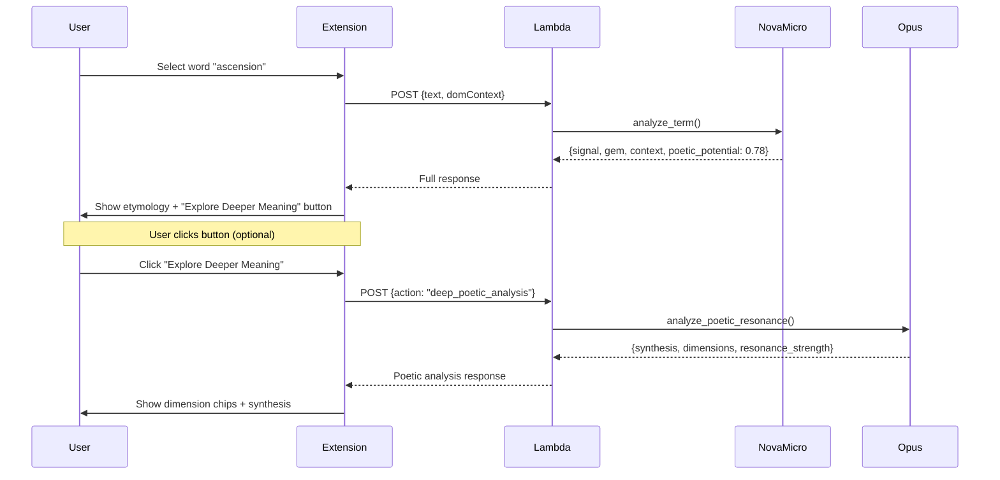

# 10310 - Feature: Poetic Resonance Detection

## 1. Context & Goal
* **Issue:** #310
* **Objective:** Enable the Digital Etymologist to detect and explain layered/poetic meanings where a term's deeper connotations resonate with surrounding context.
* **Status:** In Progress
* **Related Issues:** #106 (Full article context - synergy), #81 (Landing page - feature highlight)

### Open Questions
*None - Issue was Gemini-reviewed and approved.*

## 2. Requirements

**Nova Micro Enhancement:**
1. Output `poetic_potential` score (0.0-1.0) for every analysis
2. Output `potential_dimensions` array (from core list + novel)
3. Maintain backward compatibility with existing response fields
4. Stay within 550ms latency budget (P95)

**Opus Deep Analyzer:**
1. New module `src/poetic_analyzer.py`
2. Accept word, page context, and initial dimensions
3. Return multi-dimensional analysis with synthesis
4. Return `resonance_strength` score (0.0-1.0) in response
5. Target latency: <3500ms (Lambda processing only)

**Lambda Routing:**
1. `POETIC_THRESHOLD = 0.6` triggers button visibility
2. New action type: `deep_poetic_analysis`
3. Include `poetic_analysis` in response when available
4. Return error response with `status: "error"` on Opus failure

**Extension UI:**
1. "Explore Deeper Meaning" button appears when `poetic_potential >= 0.6`
2. Dimension chips with text labels AND color (accessible)
3. Synthesis paragraph display
4. Resonance strength indicator (from Opus `resonance_strength`)
5. Error state: "Analysis unavailable" with retry button
6. Loading state: Button disabled with spinner during Opus call

## 3. Alternatives Considered

| Option | Pros | Cons | Decision |
|--------|------|------|----------|
| Always call Opus | Richer analysis for all words | Expensive ($0.015/word), slow | **Rejected** |
| Nova-only scoring | Fast, cheap | Can't explain deeper meaning | **Rejected** |
| Threshold + on-demand Opus | Cost-controlled, user-initiated | Two-step UX | **Selected** |

**Rationale:** The threshold approach (Nova scores, user clicks for Opus) balances cost control with rich analysis. Only ~10-15% of words will show the button, and only user-initiated clicks trigger Opus costs.

## 4. Data & Fixtures

### 4.1 Data Sources

| Attribute | Value |
|-----------|-------|
| Source | User text selection + page context (domContext) |
| Format | JSON API request/response |
| Size | ~1-5KB per request |
| Refresh | Real-time (per user interaction) |
| Copyright/License | N/A (user's selected text) |

### 4.2 Data Pipeline

```
User Selection ──POST──► Nova Micro (poetic_potential) ──► Extension
                                                              │
                                                              ▼ (if >= 0.6 AND user clicks)
                                                     ──POST──► Opus (deep analysis) ──► Display
```

### 4.3 Test Fixtures

| Fixture | Source | Notes |
|---------|--------|-------|
| Mock Nova responses with poetic_potential | Generated | Various thresholds (0.59, 0.60, 0.78) |
| Mock Opus responses | Generated | Multi-dimensional synthesis |
| Test words | Hardcoded | "ascension", "hello", "foundation", "revolution" |

### 4.4 Deployment Pipeline

Standard Lambda deployment via SAM/CloudFormation. No new infrastructure required.

## 5. Diagram

### 5.1 Mermaid Quality Gate

- [x] **Simplicity:** Components collapsed appropriately
- [x] **No touching:** All elements have visual separation
- [x] **No hidden lines:** All arrows fully visible
- [x] **Readable:** Labels not truncated, flow direction clear
- [ ] **Auto-inspected:** Will inspect before commit

### 5.2 Diagram



## 6. Technical Approach

### 6.1 Nova Micro Prompt Enhancement

**Module:** `src/etymologist.py`
**Change:** Extend `SYSTEM_PROMPT_NOVA` to include poetic detection instructions.

```python
# Add to SYSTEM_PROMPT_NOVA after existing JSON schema:
POETIC_DETECTION_ADDON = """

ADDITIONAL OUTPUT FIELDS (REQUIRED):
- "poetic_potential": A score from 0.0 to 1.0 indicating how likely this word has layered/metaphorical meaning in context
  - 0.0-0.3: Common word with literal meaning (e.g., "hello", "table")
  - 0.4-0.5: Word has some figurative potential but not strongly activated
  - 0.6-0.8: Word has clear poetic resonance with context (e.g., "ascension" in elderly care)
  - 0.9-1.0: Word is deeply metaphorical with multiple activated dimensions

- "potential_dimensions": An array of dimension labels where meaning resonates. Use from this list:
  ["religious", "literary", "architectural", "artistic", "political", "scientific"]
  If a novel dimension emerges, use format "novel:{description}" (e.g., "novel:internet_culture")
  Return empty array [] if poetic_potential < 0.4

SCORING RULES:
- Consider surrounding context when scoring poetic_potential
- A word in isolation has LOW poetic potential
- A word whose etymology/connotations echo the context topic has HIGH poetic potential
- Example: "ascension" in text about nursing homes → HIGH (religious + life cycle resonance)
- Example: "hello" in any context → LOW (no layered meaning)
"""
```

**Response Schema Update:**

```python
class EtymologistResponse(TypedDict):
    signal: str
    gem: str
    context: str
    poetic_potential: float  # NEW: 0.0-1.0
    potential_dimensions: list[str]  # NEW: dimension labels
```

### 6.2 Opus Deep Analyzer Module

**Module:** `src/poetic_analyzer.py` (NEW)
**Dependencies:** boto3, existing observability module

```python
"""Poetic Resonance Analyzer - Opus-powered deep meaning extraction."""

import json
import logging
import time
from typing import TypedDict

logger = logging.getLogger(__name__)

OPUS_MODEL_ID = "anthropic.claude-3-opus-20240229-v1:0"
POETIC_TIMEOUT_MS = 3500

class PoeticAnalysisResult(TypedDict):
    status: str  # "success" | "error"
    synthesis: str  # Multi-paragraph explanation
    dimensions: list[dict]  # [{dimension: str, explanation: str}]
    resonance_strength: float  # 0.0-1.0
    latency_ms: int

POETIC_SYSTEM_PROMPT = """You are a literary analyst specializing in detecting layered meanings and poetic resonance in language.

Given a word, its etymology, and the surrounding context, analyze how the word's deeper connotations interact with the context to create meaning beyond the literal.

You MUST respond with a JSON object containing:
- "synthesis": A 2-3 paragraph explanation of the layered meaning (200 words max)
- "dimensions": Array of objects, each with "dimension" (string) and "explanation" (string)
- "resonance_strength": A score 0.0-1.0 indicating how strongly the word resonates with context

CRITICAL RULES:
1. Focus on how etymology and connotations CREATE meaning in this specific context
2. Do NOT include personal names from the context in your synthesis
3. Be specific - cite the actual context elements that create resonance
4. If no resonance exists, say so and give resonance_strength < 0.3
"""

def build_poetic_prompt(
    word: str,
    etymology: dict,
    page_context: str,
    dimensions: list[str]
) -> dict:
    """Build Opus prompt for poetic analysis."""
    user_message = f"""Analyze the poetic resonance of this word:

<word>{word}</word>

<etymology>
Signal: {etymology.get('signal', 'Unknown')}
Summary: {etymology.get('gem', '')}
History: {etymology.get('context', '')}
</etymology>

<page_context>
{page_context[:5000]}
</page_context>

<detected_dimensions>
{', '.join(dimensions) if dimensions else 'None detected'}
</detected_dimensions>

Explain how this word's deeper meanings interact with the surrounding context."""

    return {
        "anthropic_version": "bedrock-2023-05-31",
        "max_tokens": 1000,
        "system": POETIC_SYSTEM_PROMPT,
        "messages": [
            {"role": "user", "content": [{"type": "text", "text": user_message}]}
        ],
    }


def analyze_poetic_resonance(
    word: str,
    etymology: dict,
    page_context: str,
    dimensions: list[str],
    bedrock_client=None,
) -> PoeticAnalysisResult:
    """Analyze poetic resonance using Opus."""
    start_time = time.time()

    if bedrock_client is None:
        return PoeticAnalysisResult(
            status="error",
            synthesis="",
            dimensions=[],
            resonance_strength=0.0,
            latency_ms=0,
        )

    try:
        prompt = build_poetic_prompt(word, etymology, page_context, dimensions)

        response = bedrock_client.invoke_model(
            modelId=OPUS_MODEL_ID,
            body=json.dumps(prompt),
        )

        response_body = json.loads(response["body"].read())
        raw_text = response_body.get("content", [{}])[0].get("text", "")

        # Parse JSON from response
        parsed = json.loads(raw_text)

        latency_ms = int((time.time() - start_time) * 1000)

        return PoeticAnalysisResult(
            status="success",
            synthesis=parsed.get("synthesis", ""),
            dimensions=parsed.get("dimensions", []),
            resonance_strength=parsed.get("resonance_strength", 0.0),
            latency_ms=latency_ms,
        )

    except Exception as e:
        latency_ms = int((time.time() - start_time) * 1000)
        logger.error(f"Poetic analysis failed: {e}")
        return PoeticAnalysisResult(
            status="error",
            synthesis="",
            dimensions=[],
            resonance_strength=0.0,
            latency_ms=latency_ms,
        )
```

### 6.3 Lambda Routing Update

**Module:** `src/lambda_function.py`
**Changes:**

1. Add `POETIC_THRESHOLD` constant
2. Add action routing for `deep_poetic_analysis`
3. Include poetic fields in standard response

```python
# New constants
POETIC_THRESHOLD = 0.6

# In lambda_handler, after generate_etymology():
poetic_potential = result["response"].get("poetic_potential", 0.0)
potential_dimensions = result["response"].get("potential_dimensions", [])

# Add to response_body
response_body["poetic_potential"] = poetic_potential
response_body["potential_dimensions"] = potential_dimensions

# New handler for deep analysis action
if body.get("action") == "deep_poetic_analysis":
    from .poetic_analyzer import analyze_poetic_resonance

    poetic_result = analyze_poetic_resonance(
        word=body["text"],
        etymology=body.get("etymology", {}),
        page_context=body.get("domContext", ""),
        dimensions=body.get("dimensions", []),
        bedrock_client=get_bedrock_client(),
    )

    return {
        "statusCode": 200 if poetic_result["status"] == "success" else 500,
        "headers": {"Content-Type": "application/json"},
        "body": json.dumps(poetic_result),
    }
```

### 6.4 Extension UI Changes

**Files:** `extensions/chrome/overlay.js`, `extensions/firefox/overlay.js`

1. Store `poetic_potential` and `potential_dimensions` from response
2. Conditionally render "Explore Deeper Meaning" button
3. Handle button click → API call → display results

```javascript
// In showResultOverlay(), after existing header rendering:
const poeticPotential = response?.poetic_potential || 0;
const potentialDimensions = response?.potential_dimensions || [];

// Store for later use
overlayData.poetic_potential = poeticPotential;
overlayData.potential_dimensions = potentialDimensions;

// Conditionally show button
if (poeticPotential >= 0.6) {
    const deepButton = createElement('button', {
        className: 'aletheia-deep-button',
        'aria-label': 'Explore deeper meaning'
    }, 'Explore Deeper Meaning');
    deepButton.addEventListener('click', handleDeepAnalysis);
    card.appendChild(deepButton);
}
```

## 7. Interface Specification

### 7.1 Data Structures

```python
# Enhanced EtymologistResponse
class EtymologistResponse(TypedDict):
    signal: str
    gem: str
    context: str
    poetic_potential: float  # 0.0-1.0
    potential_dimensions: list[str]  # ["religious", "architectural", ...]

# New PoeticAnalysisResult
class PoeticAnalysisResult(TypedDict):
    status: str  # "success" | "error"
    synthesis: str
    dimensions: list[dict]  # [{dimension, explanation}]
    resonance_strength: float  # 0.0-1.0
    latency_ms: int
```

### 7.2 Function Signatures

```python
# etymologist.py - existing function, enhanced output
def analyze_term(
    word: str,
    context: str,
    bedrock_client=None,
    model_id: str | None = None,
) -> AnalysisResult:
    """Now includes poetic_potential and potential_dimensions in response."""
    ...

# poetic_analyzer.py - NEW
def analyze_poetic_resonance(
    word: str,
    etymology: dict,
    page_context: str,
    dimensions: list[str],
    bedrock_client=None,
) -> PoeticAnalysisResult:
    """Analyze poetic resonance using Opus model."""
    ...
```

### 7.3 Logic Flow (Pseudocode)

```
1. Extension sends text selection to Lambda
2. Lambda calls Nova Micro via analyze_term()
3. Nova returns {signal, gem, context, poetic_potential, potential_dimensions}
4. Lambda returns full response to extension
5. Extension displays etymology
6. IF poetic_potential >= 0.6 THEN
   - Show "Explore Deeper Meaning" button
7. IF user clicks button THEN
   - Extension sends deep_poetic_analysis action to Lambda
   - Lambda calls Opus via analyze_poetic_resonance()
   - Lambda returns poetic analysis
   - Extension displays synthesis + dimension chips
8. IF Opus fails/timeout THEN
   - Show error state with retry button
```

## 8. Security Considerations

| Concern | Mitigation | Status |
|---------|------------|--------|
| Prompt injection via page context | Existing XML tag wrapping in etymologist.py | Addressed |
| PII in synthesis | Opus prompt instructs not to include personal names | Addressed |
| Cost abuse (Opus spam) | Deep analysis requires user click (not automatic) | Addressed |
| Data persistence | Poetic analysis NOT stored in DynamoDB (in-memory only) | Addressed |

**Fail Mode:** Fail Closed - If Opus fails, show error, don't proceed with stale/empty data.

## 9. Performance Considerations

| Metric | Budget | Approach |
|--------|--------|----------|
| Nova Micro P95 | < 550ms | Prompt addition is ~100 tokens, minimal impact |
| Opus P95 | < 3500ms | Dedicated timeout, async user-initiated |
| Memory | < 128MB | No new data structures in Lambda memory |
| API Calls | +1 per deep analysis | User-initiated only, not automatic |

**Bottlenecks:** Opus cold start could exceed budget. Mitigation: Accept 3500ms as Lambda-only budget, client network RTT is additional.

## 10. Risks & Mitigations

| Risk | Impact | Likelihood | Mitigation |
|------|--------|------------|------------|
| Nova prompt too long, exceeds latency | Med | Low | Test P95, revert if needed |
| Opus returns poor synthesis | Low | Med | Users can retry or dismiss |
| Button appears too often (false positives) | Low | Med | Tune threshold post-launch |
| Button never appears (false negatives) | Low | Med | Tune threshold post-launch |

## 11. Verification & Testing

### 11.1 Test Scenarios

| ID | Scenario | Type | Input | Expected Output | Pass Criteria |
|----|----------|------|-------|-----------------|---------------|
| 010 | Low poetic word | Auto | "hello" | poetic_potential < 0.4, no button | No button rendered |
| 020 | High poetic word | Auto | "ascension" in elderly care context | poetic_potential >= 0.6, button visible | Button rendered |
| 030 | Boundary test low | Auto | poetic_potential = 0.59 | No button | Button NOT rendered |
| 040 | Boundary test high | Auto | poetic_potential = 0.60 | Button visible | Button rendered |
| 050 | Opus success | Auto | Click button | Synthesis displayed | synthesis non-empty |
| 060 | Opus timeout | Auto | Mock 4000ms delay | Error state | "Analysis unavailable" shown |
| 070 | Opus retry | Auto | Error → click retry | New Opus call | Request made |
| 080 | No Opus call without click | Auto | High potential, no click | No Opus API call | CloudWatch shows 0 Opus calls |
| 090 | Backward compat | Auto | Old extension version | No crash | Works without poetic fields |

### 11.2 Test Commands

```bash
# Run all automated tests
poetry run pytest tests/test_poetic_analyzer.py -v

# Run only fast/mocked tests (exclude live)
poetry run pytest tests/test_poetic_analyzer.py -v -m "not live"

# Run live integration tests
poetry run pytest tests/test_poetic_analyzer.py -v -m live
```

### 11.3 Manual Tests (Only If Unavoidable)

**N/A - All scenarios automated.**

## 12. Definition of Done

### Code
- [ ] Nova Micro prompt updated with poetic detection
- [ ] `poetic_analyzer.py` module created
- [ ] Lambda routing logic implemented
- [ ] Extension UI changes (Chrome)
- [ ] Extension UI changes (Firefox)

### Tests
- [ ] Unit tests for poetic analyzer pass
- [ ] E2E tests for button flow pass
- [ ] Boundary tests (0.59/0.60) pass
- [ ] Opus timeout handling test passes

### Documentation
- [ ] LLD updated with any deviations
- [ ] Implementation Report (0103) completed
- [ ] Test Report (0113) completed

### Review
- [ ] Gemini LLD review passed
- [ ] Gemini implementation review passed
- [ ] User approval before closing issue

---

## Appendix: Review Log

### Gemini Review #1 (APPROVED)

**Timestamp:** 2026-01-12 02:00 CT
**Reviewer:** Gemini
**Verdict:** APPROVED

#### Comments

| ID | Comment | Implemented? |
|----|---------|--------------|
| G1.1 | "File Missing" - Gemini couldn't see worktree file | N/A - file exists in worktree |
| G1.2 | POETIC_THRESHOLD hardcoded vs dynamic config? | Hardcoded for now, can be env var later |
| G1.3 | Formalize PoeticAnalysisResult TypedDict | Already in LLD Section 7.1 |

### Review Summary

| Review | Date | Verdict | Key Issue |
|--------|------|---------|-----------|
| Gemini #1 | 2026-01-12 | APPROVED | No blocking issues |

**Final Status:** APPROVED

---

## Appendix: Core Dimensions Reference

| Dimension | Icon | Color | Trigger Examples |
|-----------|------|-------|------------------|
| religious | Cross | Purple | ascension, calling, grace, trinity |
| literary | Book | Orange | odyssey, quixotic, kafkaesque |
| architectural | Building | Green | foundation, pillar, threshold |
| artistic | Palette | Blue | composition, canvas, frame |
| political | Scales | Red | revolution, mandate, regime |
| scientific | Microscope | Cyan | catalyst, critical mass, quantum |
| novel:{desc} | Lightbulb | Gray | LLM discovers new dimension |
