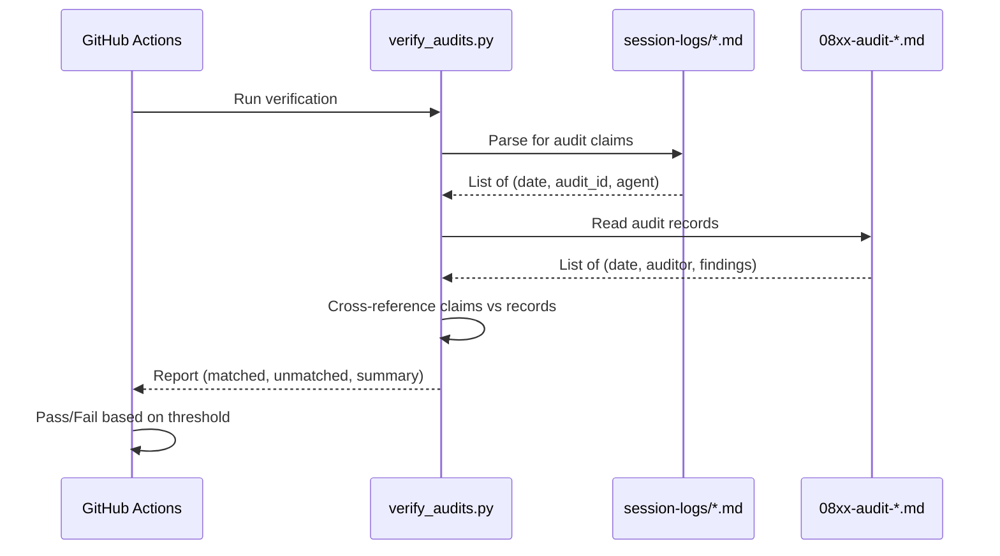

# 1248 - Feature: CI Job to Verify Audit Execution Claims

## 1. Context & Goal
* **Issue:** #248
* **Objective:** Build CI-based verification that agents actually execute claimed audits
* **Status:** Draft
* **Related Issues:** #246 (adversarial test logging)

### Open Questions
*Questions that need clarification before or during implementation. Remove when resolved.*

- [x] Should verification run on every push or only on schedule? → **Scheduled (weekly) + manual trigger** per Gemini G1 feedback
- [ ] Should failures block PRs or only report warnings?

## 2. Requirements
When this is done:
1. CI job scans **recent** session logs (default: last 4 weeks) for audit claims
2. Parses **individual session headers** within weekly log files to extract accurate dates
3. Cross-references claims against audit record updates in 08xx files
4. Verifies **both existence AND PASS/FAIL status** match between claim and record
5. Produces weekly report comparing claims vs evidence
6. Optionally blocks if audit claimed but no record updated (enforcement mode)
7. Supports `--since DATE` and `--files LIST` arguments for scoped runs

## 3. Alternatives Considered

| Option | Pros | Cons | Decision |
|--------|------|------|----------|
| **A: Regex-based log parsing** | Simple, fast, no dependencies | Brittle to format changes, false positives | **Selected** |
| B: Structured claim markers | Explicit, machine-readable | Requires agents to use special markers | Rejected |
| C: Git commit message parsing | Uses existing artifacts | Too implicit, misses session-only claims | Rejected |

**Rationale:** Option A balances simplicity with effectiveness. We can evolve to Option B if false positive rate is unacceptable.

## 4. Data & Fixtures

### 4.1 Data Sources

| Attribute | Value |
|-----------|-------|
| Source | `docs/session-logs/*.md`, `docs/08*-audit*.md` |
| Format | Markdown (session logs + audit records) |
| Size | ~10-50KB per session log, ~30KB per audit file |
| Refresh | Real-time (git commits) |
| Copyright/License | N/A (internal) |

### 4.2 Data Pipeline

```
Session Logs ──regex──► Audit Claims ──cross-ref──► Audit Records ──compare──► Verification Report
```

### 4.3 Test Fixtures

| Fixture | Source | Notes |
|---------|--------|-------|
| Mock weekly session log (multi-session) | Generated | Multiple session headers in one file (per Gemini G1.BLOCKING) |
| Mock session log with valid claim | Generated | Claim + matching record |
| Mock session log with invalid claim | Generated | Claim + no matching record |
| Mock session log with PASS/FAIL mismatch | Generated | Claim says PASS, record says FAIL |
| Mock audit file with records | Generated | Various date formats |

### 4.4 Deployment Pipeline

- CI job runs via GitHub Actions
- Report output to `tmp/audit-verification-report.md` (gitignored)
- Optional: Post to PR comment on failure

## 5. Diagram



## 6. Technical Approach

* **Module:** `tools/verify_audits.py`
* **Dependencies:** Python stdlib only (re, pathlib, datetime, json)
* **Pattern:** Single-pass log scanner + audit record parser

## 7. Interface Specification

### 7.1 Data Structures
```python
# Pseudocode - NOT implementation
class AuditClaim(TypedDict):
    session_date: str   # From session header (YYYY-MM-DD HH:MM)
    audit_id: str       # e.g., "0809", "0825"
    agent: str          # e.g., "Claude Opus 4.5"
    session_file: str   # Source file path
    raw_text: str       # Original claim text
    claimed_status: str | None  # "PASS", "FAIL", or None if not specified

class AuditRecord(TypedDict):
    date: str           # ISO 8601 date
    auditor: str        # e.g., "Claude Opus 4.5"
    findings: str       # PASS/FAIL summary
    status: str         # Extracted "PASS" or "FAIL"
    audit_file: str     # Source audit file

class VerificationResult(TypedDict):
    claim: AuditClaim
    record: AuditRecord | None
    status: str         # "VERIFIED", "UNVERIFIED", "MISMATCH"
    reason: str         # Human-readable explanation
```

### 7.2 Function Signatures
```python
def parse_session_logs(
    log_dir: Path,
    since: datetime | None = None,  # Filter to logs after this date
    files: list[Path] | None = None  # Explicit file list (overrides since)
) -> list[AuditClaim]:
    """Extract audit claims from session logs within date range."""
    ...

def parse_audit_records(audit_dir: Path) -> dict[str, list[AuditRecord]]:
    """Extract audit records keyed by audit ID."""
    ...

def verify_claims(
    claims: list[AuditClaim],
    records: dict[str, list[AuditRecord]],
    date_tolerance_days: int = 3
) -> list[VerificationResult]:
    """Cross-reference claims against records, checking date and status."""
    ...

def main() -> int:
    """CLI entry point. Returns 0=pass, 1=fail.

    Args via argparse:
      --since DATE: Only scan logs after DATE (default: 4 weeks ago)
      --files FILE...: Explicit list of log files to scan
      --dry-run: Print report without exit code check
    """
    ...
```

### 7.3 Logic Flow (Pseudocode)
```
1. Parse session logs with date filter:
   - Default: last 4 weeks (--since flag overrides)
   - Support --files for explicit list
2. FOR each session log file:
   - Parse individual session headers: "## YYYY-MM-DD HH:MM CT | Model Name"
   - Extract claims ONLY from ### Summary sections (context check)
   - Pattern: "08(\d{2})" (restricted to audit ID range)
   - Capture: session_date (from header), audit_id, agent, PASS/FAIL status
3. Parse all audit files in docs/08*-audit*.md
4. Extract audit records from "## N. Audit Record" tables
5. FOR each claim:
   - Find matching audit_id in records
   - Check if record exists within ±3 days of claim's SESSION date
   - If claim includes PASS/FAIL, verify status matches record
   - Mark as VERIFIED, UNVERIFIED, or MISMATCH
6. Generate report:
   - Print summary to stdout (for CI console visibility)
   - Write detailed report to tmp/audit-verification-report.md
   - Total claims, verified, unverified, mismatches
   - List of unverified/mismatched claims with details
7. Return exit code based on threshold
```

## 8. Security Considerations

| Concern | Mitigation | Status |
|---------|------------|--------|
| Regex DoS | Use simple patterns, limit file size | TODO |
| Path traversal | Use pathlib, validate paths | TODO |

**Fail Mode:** Fail Open (warning only) initially, Fail Closed (block) after tuning

## 9. Performance Considerations

| Metric | Budget | Approach |
|--------|--------|----------|
| Latency | < 30s | Single-pass regex, no external calls |
| Memory | < 128MB | Stream files, don't load all at once |
| CI Minutes | < 1 min | Run only on schedule or manual trigger |

**Bottlenecks:** Large session log files. Mitigate with date filtering.

## 10. Risks & Mitigations

| Risk | Impact | Likelihood | Mitigation |
|------|--------|------------|------------|
| False positives (claim detected but not an audit) | Low | Medium | Tune regex, add allowlist |
| False negatives (audit missed) | Medium | Medium | Document expected claim format |
| Regex pattern drift | Medium | Low | Test fixtures validate patterns |

## 11. Verification & Testing

### 11.1 Test Scenarios

| ID | Scenario | Type | Input | Expected Output | Pass Criteria |
|----|----------|------|-------|-----------------|---------------|
| 010 | Valid claim with matching record | Auto | Mock log + mock audit | VERIFIED | Claim matched |
| 020 | Claim with no matching record | Auto | Mock log only | UNVERIFIED | Report shows gap |
| 030 | Claim outside date window | Auto | Claim date != record date by >3 days | UNVERIFIED | Date tolerance works |
| 040 | Multiple claims same audit | Auto | 2 claims, 1 record | 1 VERIFIED, 1 UNVERIFIED | Deduplication works |
| 050 | Malformed session log | Auto | Bad markdown | Graceful skip | No crash |
| 060 | Empty audit record section | Auto | Audit file with no records | Zero records parsed | Handles empty |
| 070 | Weekly log with multiple sessions | Auto | 3 sessions in one file | All 3 dates extracted correctly | Per Gemini G1.BLOCKING |
| 080 | PASS/FAIL status mismatch | Auto | Claim=PASS, Record=FAIL | MISMATCH | Per Gemini G1.HIGH |
| 090 | Audit mention outside Summary | Auto | Audit ID in prose, not Summary | NOT extracted | Context filter works |

### 11.2 Test Commands

```bash
# Run all automated tests
poetry run pytest tests/unit/test_verify_audits.py -v

# Run verification script manually
poetry run python tools/verify_audits.py --dry-run
```

### 11.3 Manual Tests (Only If Unavoidable)

N/A - All scenarios automated.

## 12. Definition of Done

### Code
- [ ] `tools/verify_audits.py` implemented and linted
- [ ] Code comments reference this LLD

### Tests
- [ ] All test scenarios pass
- [ ] Test coverage meets threshold (>80%)

### Documentation
- [ ] LLD updated with any deviations
- [ ] Implementation Report (0103) completed
- [ ] CI workflow documented in README or 0012-devops-architecture.md

### Review
- [ ] Code review completed
- [ ] User approval before closing issue

---

## Appendix: Audit Claim Detection Patterns

### Expected Session Log Format

From existing logs, audit claims appear as:
```markdown
### Summary
Ran 0809 Security audit - PASS. All OWASP checks passed.
```

Or in more implicit form:
```markdown
### Summary
Completed security review per 0809.
```

### Regex Patterns (Updated per Gemini Review G1)

```python
# Session header pattern (to extract date and agent)
SESSION_HEADER = r"^## (\d{4}-\d{2}-\d{2} \d{2}:\d{2}) CT \| (.+)$"

# Audit ID pattern - RESTRICTED to 08xx range (per Gemini G1.HIGH)
AUDIT_ID = r"08(\d{2})"

# Primary pattern - explicit audit reference with status
r"(?:ran|executed|completed)\s+08(\d{2}).*?(PASS|FAIL)?"

# Secondary pattern - audit result
r"08(\d{2})\s+(?:Security|Privacy|Performance|Accessibility|Code Quality).*?(PASS|FAIL)"

# Context check - claims must appear in Summary section
# Parser state machine: only extract claims when inside "### Summary" block
```

**Context Filtering (per Gemini G1.HIGH):**
Claims are only extracted when the parser is inside a `### Summary` section. This prevents false positives from general discussion text mentioning audit IDs.

### Audit Record Format (from AgentOS:audits/0800-audit-index)

```markdown
| Date | Auditor | Findings Summary | Issues Created |
|------|---------|------------------|----------------|
| 2026-01-04 | Claude Opus 4.5 | **PASS** - All sections passed | None |
```

---

## Appendix: Review Log

*Track all review feedback with timestamps and implementation status.*

### Gemini Review #1 (FEEDBACK)

**Timestamp:** 2026-01-10 12:30 CT
**Reviewer:** Gemini 3 Pro (gemini-3-pro-preview)
**Verdict:** FEEDBACK (revisions required)

#### Model Verification

**Invocation:** `tools/gemini-model-check.sh` with `--model gemini-3-pro-preview`
**Exit Code:** 0 (success - model validated)
**Stats.models key:** `"gemini-3-pro-preview"`

```json
"stats": {
  "models": {
    "gemini-3-pro-preview": {
      "api": { "totalRequests": 1, "totalErrors": 0 },
      "tokens": { "input": ~9000, "total": ~11000 }
    }
  }
}
```

*Note: If model had been downgraded (e.g., to gemini-2.5-flash), script would have returned exit code 3 and aborted.*

#### [BLOCKING] Issues

| ID | Comment | Implemented? |
|----|---------|--------------|
| G1.1 | "Date Precision vs. Weekly Logs" - Must parse individual session headers, not filename date | ✅ YES - Updated §2 Requirements, §7.3 Logic Flow |
| G1.2 | "Scalability" - Need --since and --files args to scope parsing | ✅ YES - Updated §2 Requirements, §7.2 Signatures |

#### [HIGH] Priority Issues

| ID | Comment | Implemented? |
|----|---------|--------------|
| G1.3 | "Regex False Positives" - Tighten to 08xx range, add context check | ✅ YES - Updated Appendix regex patterns |
| G1.4 | "Missing Findings Verification" - Cross-check PASS/FAIL status | ✅ YES - Updated §2, §7.1 Data Structures, §7.3 Logic |

#### [SUGGESTION] Items

| ID | Comment | Implemented? |
|----|---------|--------------|
| G1.5 | "CI Output Visibility" - Print summary to stdout | ✅ YES - Added to §7.3 step 6 |
| G1.6 | "Test Data Realism" - Weekly log structure in fixtures | ✅ YES - Added to §4.3 and §11.1 |

### Review Summary

| Review | Date | Verdict | Key Issue |
|--------|------|---------|-----------|
| Gemini #1 | 2026-01-10 | FEEDBACK | Date parsing + scalability |

**Final Status:** REVISED (ready for user approval)
