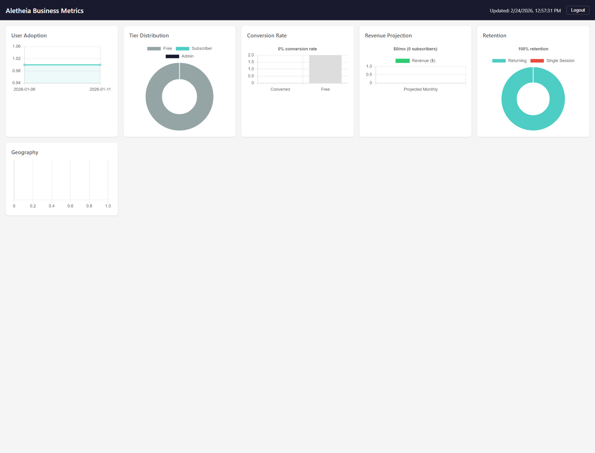

# 10904 - Admin Dashboard Runbook

**URL:** `https://api.aletheia.study/admin/metrics.html`
**Issue:** #368 (dashboard), #433 (GitHub OAuth login)
**Access:** GitHub collaborators on `martymcenroe/Aletheia` with push access

## What You're Looking At

The Hermes dashboard shows 6 business metrics charts, auto-refreshing every 5 minutes. All data comes from the `/metrics` API endpoint, which queries DynamoDB.



### Charts

| Chart | Type | What It Shows |
|-------|------|---------------|
| **User Adoption** | Line | New user signups over time (by `created_at` date) |
| **Tier Distribution** | Doughnut | Breakdown of users by tier: Free, Subscriber, Admin |
| **Conversion Rate** | Bar | How many free users converted to paid subscribers |
| **Revenue Projection** | Bar | Projected monthly revenue based on current subscriber count |
| **Retention** | Doughnut | Returning users vs. single-session users |
| **Geography** | Horizontal bar | Top 10 countries by request count (from CloudWatch metrics) |

### Header

- **Updated timestamp** — when the data was last fetched from the API
- **MOCK MODE** badge (orange) — appears when using `?mock=true` for offline testing
- **CACHED** badge (teal) — appears when the API returned cached data (5-min server-side cache)
- **Logout** button — clears JWT and returns to login screen

## How to Access

1. Navigate to `https://api.aletheia.study/admin/metrics.html`
2. Click **"Sign in with GitHub"**
3. Authorize the Aletheia Admin Dashboard OAuth app on GitHub
4. You'll be redirected back to the dashboard with data loaded

**Who can access:** Any GitHub user who is a collaborator on `martymcenroe/Aletheia` with push permissions. Non-collaborators see "Access Denied".

**Session duration:** The JWT lasts 24 hours. After that, you'll need to sign in again.

## How Authentication Works

```
Browser → /auth/github/authorize → 302 to GitHub
GitHub login → callback to /auth/github/callback
Lambda verifies:
  1. CSRF state token (HMAC-signed, 5-min TTL)
  2. Exchanges code for GitHub access token
  3. Fetches GitHub user profile
  4. Checks collaborator status on martymcenroe/Aletheia (needs push access)
  5. Issues admin JWT (tier=admin, user_id=gh:{github_id}, 24h expiry)
  6. 302 redirect to dashboard with ?jwt=... in URL
Dashboard JS:
  - Extracts JWT from URL, stores in localStorage
  - Strips JWT from URL (so it doesn't leak in bookmarks/referer)
  - Fetches /metrics with Authorization: Bearer {jwt}
```

## Architecture

```
static/admin/metrics.html  ─┐
static/admin/metrics.js     ├─ Packaged in Auth Lambda deployment zip
static/admin/metrics.css    ─┘
                               Served via /admin/* route in lambda_auth_function.py

CloudFlare Worker (aletheia-api):
  /admin/*          → Auth Lambda
  /auth/*           → Auth Lambda
  /metrics          → Auth Lambda
  POST /            → Agent Lambda (analysis requests)
```

## Troubleshooting

| Symptom | Cause | Fix |
|---------|-------|-----|
| "Session Expired" on GitHub callback | State token TTL (5 min) exceeded between clicking login and completing GitHub auth | Click "Sign in with GitHub" again |
| "Access Denied" | GitHub user is not a collaborator with push access | Add user as collaborator on GitHub repo settings |
| Dashboard shows login screen after refresh | JWT expired (24h) or was cleared | Sign in again |
| Charts show zeros | No user data in DynamoDB yet (pre-launch) | Expected for a new deployment |
| 403 on dashboard URL | CloudFlare Worker not routing `/admin/*` to Auth Lambda | Redeploy Worker from `workers/aletheia-api/` |

## Mock Mode (Offline Testing)

Add `?mock=true` to the URL to load sample data from `mock-metrics.json` without authentication:

```
https://api.aletheia.study/admin/metrics.html?mock=true
```

Or serve locally:

```bash
cd static/admin && python -m http.server 8080
# Open http://localhost:8080/metrics.html?mock=true
```

## Related Files

| File | Purpose |
|------|---------|
| `static/admin/metrics.html` | Dashboard HTML |
| `static/admin/metrics.js` | Chart rendering, OAuth handling, auto-refresh |
| `static/admin/metrics.css` | Styles |
| `static/admin/mock-metrics.json` | Sample data for offline testing |
| `src/auth/github_oauth.py` | GitHub OAuth handler (authorize, callback, collaborator check) |
| `src/auth/metrics_handler.py` | `/metrics` API endpoint (DynamoDB queries, caching) |
| `src/lambda_auth_function.py` | Route wiring + static file serving |
| `workers/aletheia-api/worker.js` | CloudFlare Worker routing |

## Secrets & Credentials

| Secret | Location | Purpose |
|--------|----------|---------|
| `aletheia/github-oauth` | AWS Secrets Manager | GitHub OAuth client_id + client_secret |
| `aletheia/jwt-signing-key` | AWS Secrets Manager | Signs admin JWTs (shared with all JWT issuance) |
| GitHub OAuth App | github.com/settings/developers | "Aletheia Admin Dashboard" app |
